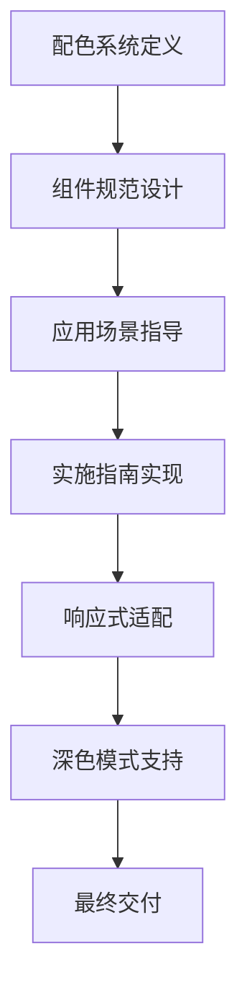

# 钉钉商业化风格ERP配色方案设计文档

## 1. 产品概述

本文档定义了一套基于钉钉商业化风格的企业级ERP系统配色方案，专为中国企业级应用设计。该配色方案去除了年轻化和过于活泼的设计元素，体现企业级应用的严肃性和专业性，适用于财务管理、库存管理、客户关系管理等核心业务系统。

## 2. 核心功能

### 2.1 用户角色

| 角色 | 使用场景 | 核心权限 |
|------|----------|----------|
| 系统管理员 | 系统配置和用户管理 | 完整的系统配置权限，包括配色方案定制 |
| 业务用户 | 日常业务操作 | 使用标准配色方案进行业务操作 |
| 财务人员 | 财务数据处理 | 专用的数据状态色彩识别权限 |

### 2.2 功能模块

我们的钉钉商业化ERP配色方案包含以下主要模块：

1. **配色系统定义**：主色调、辅助色、背景色、文本色、状态色的完整定义
2. **组件规范**：按钮、表格、卡片、表单、导航栏的设计规范
3. **应用场景**：不同业务模块的配色应用指导
4. **实施指南**：CSS变量定义和组件使用示例

### 2.3 页面详情

| 页面名称 | 模块名称 | 功能描述 |
|----------|----------|----------|
| 配色系统 | 主色调定义 | 定义钉钉蓝(#0089FF)为主色调，确保品牌一致性 |
| 配色系统 | 辅助色定义 | 深灰色系(#2F3349, #6B7280, #F3F4F6)提供层次感 |
| 配色系统 | 背景色定义 | 钉钉风格浅灰(#F8F9FA)作为主背景，纯白作为卡片背景 |
| 配色系统 | 状态色定义 | 商业化调整的深绿、深橙、深红等状态指示色 |
| 组件规范 | 按钮设计 | 扁平化设计，4px圆角，三种状态(默认、悬停、激活) |
| 组件规范 | 表格设计 | 数据导向的表格样式，清晰的行列分隔和状态指示 |
| 组件规范 | 卡片设计 | 微妙阴影效果，不过度立体化，突出内容层次 |
| 组件规范 | 表单设计 | 清晰的输入框样式，明确的验证状态指示 |
| 组件规范 | 导航设计 | 企业级布局结构，侧边栏和顶部导航的配色规范 |

## 3. 核心流程

### 设计师工作流程
设计师首先查阅配色系统定义，然后根据组件规范设计界面，最后参考应用场景进行具体实施。

### 开发者工作流程
开发者根据实施指南中的CSS变量定义实现界面，使用组件使用示例进行开发，并考虑响应式设计和深色模式适配。

### 产品经理审核流程
产品经理根据设计原则检查界面的商业化程度，确保符合企业级应用的严肃性和专业性要求。

## 4. 用户界面设计

### 4.1 设计风格

**主色调系统**
- 主色：钉钉蓝 (#0089FF) - 体现品牌一致性
- 主色悬停：深钉钉蓝 (#0070CC) - 交互反馈
- 主色激活：更深蓝 (#005AA3) - 激活状态

**辅助色系统**
- 深灰主色：#2F3349 - 重要文本和边框
- 中灰色：#6B7280 - 次要文本和图标
- 浅灰色：#F3F4F6 - 分隔线和禁用状态

**背景色系统**
- 主背景：#F8F9FA - 钉钉风格浅灰
- 卡片背景：#FFFFFF - 纯白突出内容
- 悬停背景：#F1F5F9 - 微妙的交互反馈

**状态色系统**
- 成功色：#059669 - 深绿色，商业化调整
- 警告色：#D97706 - 深橙色，更加稳重
- 错误色：#DC2626 - 深红色，清晰警示
- 信息色：#2563EB - 深蓝色，信息提示

**设计特征**
- 圆角：4px小圆角，方正商务风格
- 阴影：微妙的box-shadow，不过度立体化
- 字体：系统默认字体栈，确保跨平台一致性
- 间距：8px基础间距单位，保持规整布局

### 4.2 页面设计概览

| 页面名称 | 模块名称 | UI元素 |
|----------|----------|--------|
| 主界面 | 顶部导航栏 | 钉钉蓝背景(#0089FF)，白色文字，4px圆角按钮 |
| 主界面 | 侧边栏菜单 | 深灰背景(#2F3349)，白色图标，悬停时浅蓝背景 |
| 主界面 | 主内容区 | 浅灰背景(#F8F9FA)，白色卡片，微妙阴影 |
| 数据表格 | 表头 | 深灰背景(#F3F4F6)，深色文字(#2F3349) |
| 数据表格 | 表格行 | 白色背景，悬停时浅蓝(#F1F5F9)，选中时钉钉蓝 |
| 表单页面 | 输入框 | 白色背景，灰色边框，聚焦时钉钉蓝边框 |
| 表单页面 | 按钮组 | 主按钮钉钉蓝，次要按钮白色背景灰色边框 |
| 状态指示 | 成功状态 | 深绿色(#059669)，白色文字，4px圆角 |
| 状态指示 | 警告状态 | 深橙色(#D97706)，白色文字，清晰对比 |
| 状态指示 | 错误状态 | 深红色(#DC2626)，白色文字，强烈警示 |

### 4.3 响应式设计

**桌面优先设计**
- 主要针对1920x1080及以上分辨率优化
- 侧边栏固定宽度240px，主内容区自适应
- 表格支持横向滚动，保持数据完整性

**移动端适配**
- 768px以下断点，侧边栏收缩为汉堡菜单
- 表格转换为卡片式布局，保持数据可读性
- 触摸友好的按钮尺寸(最小44px)

**深色模式支持**
- 主背景：#1F2937 - 深灰色
- 卡片背景：#374151 - 中等深灰
- 文字颜色：#F9FAFB - 浅色文字
- 主色调保持钉钉蓝，确保品牌一致性