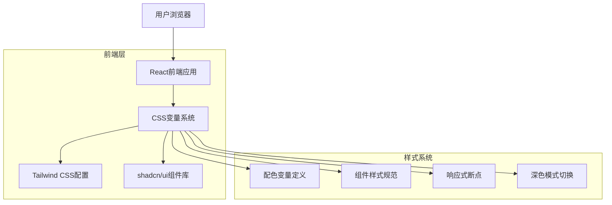
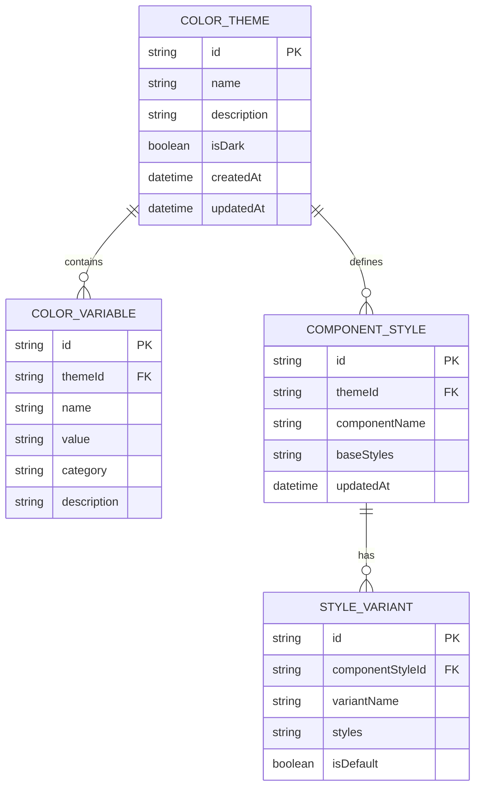

# 钉钉商业化ERP配色方案技术架构文档

## 1. 架构设计



## 2. 技术描述

- 前端：React@18 + Next.js@15.4 + TypeScript@5.2
- 样式系统：Tailwind CSS@4.1.12 + CSS变量
- 组件库：shadcn/ui@2025.1.2
- 构建工具：Vite + PostCSS
- 代码质量：ESLint@9 + Prettier

## 3. 路由定义

| 路由 | 用途 |
|------|------|
| /color-demo | 配色方案演示页面，展示所有组件样式 |
| /color-demo/components | 组件库展示，按类别展示各种UI组件 |
| /color-demo/themes | 主题切换演示，包含浅色和深色模式 |
| /color-demo/guidelines | 设计指南页面，展示配色使用规范 |

## 4. API定义

### 4.1 核心配色API

主题配置接口
```typescript
interface ColorTheme {
  name: string;
  colors: {
    primary: string;
    primaryHover: string;
    primaryActive: string;
    secondary: string;
    background: string;
    card: string;
    text: {
      primary: string;
      secondary: string;
      muted: string;
    };
    status: {
      success: string;
      warning: string;
      error: string;
      info: string;
    };
  };
  darkMode?: ColorTheme;
}
```

组件样式配置
```typescript
interface ComponentStyles {
  button: {
    primary: string;
    secondary: string;
    outline: string;
    ghost: string;
  };
  table: {
    header: string;
    row: string;
    rowHover: string;
    rowSelected: string;
  };
  card: {
    background: string;
    border: string;
    shadow: string;
  };
}
```

## 5. 数据模型

### 5.1 数据模型定义



### 5.2 CSS变量定义

钉钉商业化主题CSS变量
```css
:root {
  /* 主色调系统 */
  --color-primary: #0089FF;
  --color-primary-hover: #0070CC;
  --color-primary-active: #005AA3;
  --color-primary-foreground: #FFFFFF;
  
  /* 辅助色系统 */
  --color-secondary: #2F3349;
  --color-secondary-hover: #374151;
  --color-secondary-foreground: #FFFFFF;
  
  /* 背景色系统 */
  --color-background: #F8F9FA;
  --color-card: #FFFFFF;
  --color-card-hover: #F1F5F9;
  
  /* 文本色系统 */
  --color-text-primary: #2F3349;
  --color-text-secondary: #6B7280;
  --color-text-muted: #9CA3AF;
  
  /* 状态色系统 */
  --color-success: #059669;
  --color-success-foreground: #FFFFFF;
  --color-warning: #D97706;
  --color-warning-foreground: #FFFFFF;
  --color-error: #DC2626;
  --color-error-foreground: #FFFFFF;
  --color-info: #2563EB;
  --color-info-foreground: #FFFFFF;
  
  /* 边框和分隔线 */
  --color-border: #E5E7EB;
  --color-border-hover: #D1D5DB;
  --color-divider: #F3F4F6;
  
  /* 阴影系统 */
  --shadow-sm: 0 1px 2px 0 rgb(0 0 0 / 0.05);
  --shadow-md: 0 4px 6px -1px rgb(0 0 0 / 0.1);
  --shadow-lg: 0 10px 15px -3px rgb(0 0 0 / 0.1);
  
  /* 圆角系统 */
  --radius-sm: 4px;
  --radius-md: 6px;
  --radius-lg: 8px;
  
  /* 间距系统 */
  --spacing-xs: 4px;
  --spacing-sm: 8px;
  --spacing-md: 16px;
  --spacing-lg: 24px;
  --spacing-xl: 32px;
}

/* 深色模式变量 */
[data-theme="dark"] {
  --color-background: #1F2937;
  --color-card: #374151;
  --color-card-hover: #4B5563;
  --color-text-primary: #F9FAFB;
  --color-text-secondary: #D1D5DB;
  --color-text-muted: #9CA3AF;
  --color-border: #4B5563;
  --color-border-hover: #6B7280;
  --color-divider: #374151;
}
```

Tailwind CSS配置扩展
```javascript
// tailwind.config.js
module.exports = {
  theme: {
    extend: {
      colors: {
        primary: {
          DEFAULT: 'var(--color-primary)',
          hover: 'var(--color-primary-hover)',
          active: 'var(--color-primary-active)',
          foreground: 'var(--color-primary-foreground)',
        },
        secondary: {
          DEFAULT: 'var(--color-secondary)',
          hover: 'var(--color-secondary-hover)',
          foreground: 'var(--color-secondary-foreground)',
        },
        background: 'var(--color-background)',
        card: {
          DEFAULT: 'var(--color-card)',
          hover: 'var(--color-card-hover)',
        },
        text: {
          primary: 'var(--color-text-primary)',
          secondary: 'var(--color-text-secondary)',
          muted: 'var(--color-text-muted)',
        },
        status: {
          success: 'var(--color-success)',
          warning: 'var(--color-warning)',
          error: 'var(--color-error)',
          info: 'var(--color-info)',
        },
        border: {
          DEFAULT: 'var(--color-border)',
          hover: 'var(--color-border-hover)',
        },
        divider: 'var(--color-divider)',
      },
      boxShadow: {
        'sm': 'var(--shadow-sm)',
        'md': 'var(--shadow-md)',
        'lg': 'var(--shadow-lg)',
      },
      borderRadius: {
        'sm': 'var(--radius-sm)',
        'md': 'var(--radius-md)',
        'lg': 'var(--radius-lg)',
      },
      spacing: {
        'xs': 'var(--spacing-xs)',
        'sm': 'var(--spacing-sm)',
        'md': 'var(--spacing-md)',
        'lg': 'var(--spacing-lg)',
        'xl': 'var(--spacing-xl)',
      },
    },
  },
}
```

组件样式示例
```typescript
// Button组件样式定义
const buttonVariants = {
  primary: 'bg-primary text-primary-foreground hover:bg-primary-hover active:bg-primary-active',
  secondary: 'bg-secondary text-secondary-foreground hover:bg-secondary-hover',
  outline: 'border border-border text-text-primary hover:bg-card-hover',
  ghost: 'text-text-primary hover:bg-card-hover',
}

// Table组件样式定义
const tableStyles = {
  container: 'bg-card rounded-md shadow-sm border border-border',
  header: 'bg-divider text-text-primary font-medium',
  row: 'bg-card hover:bg-card-hover border-b border-divider',
  cell: 'px-md py-sm text-text-primary',
}

// Card组件样式定义
const cardStyles = {
  base: 'bg-card rounded-md shadow-sm border border-border',
  header: 'px-lg py-md border-b border-divider',
  content: 'px-lg py-md',
  footer: 'px-lg py-md border-t border-divider',
}
```