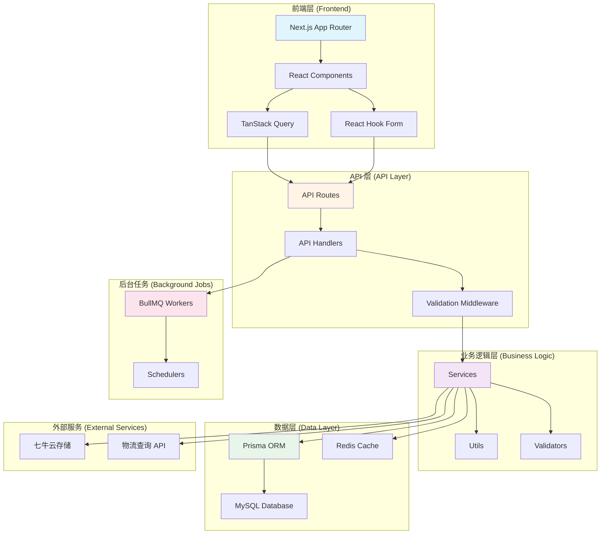

# 库存管理系统 (Kucun) - AI 上下文文档

> **生成时间**: 2026-01-09
> **版本**: 1.0.42
> **文档类型**: 根级项目概览

---

## 📚 项目内 AI 指令文件优先级

项目存在多份 `AGENTS.md`，**优先级从高到低**：

1. `.Codex/AGENTS.md` — 工作流硬性约束（中文回复 / 强制检查清单 / UI 规范引用）。**冲突时以此为准**。
2. `AGENTS.md`（本文件）— 项目概览、模块索引、规范文档导航。
3. `lib/services/AGENTS.md` — 业务服务层局部说明。
4. `deployment-output/release-src*/AGENTS.md` — 构建副本，**仅供线上排查参考，不维护**。

UI/前端改动须额外遵循：

- `docs/development/v3-pro-ui-standard.md` 第 8.6 / 8.7 节：本土化文案与术语词典。
- `docs/development/zh-cn-ux-checklist.md`：日常作业页（销售/库存/财务录单等）的 ERP 高频场景规范。

---

## 📋 项目概述

**库存管理系统 (Kucun)** 是一个专为瓷砖行业设计的全功能库存管理工具，提供从采购、入库、销售、退货到财务管理的完整业务流程支持。

### 核心特性

- 🏭 **库存管理**: 入库、出库、调整、盘点、批次追踪
- 📦 **订单管理**: 销售订单、退货订单、采购订单、工厂发货
- 👥 **客户关系**: 客户管理、供应商管理、价格历史
- 💰 **财务管理**: 应收应付、支付退款、财务报表、对账单
- 📊 **数据分析**: 仪表板、销售趋势、产品排名、库存预警
- 🔐 **权限管理**: 基于角色的访问控制、操作日志

### 技术栈

| 类别         | 技术                                          |
| ------------ | --------------------------------------------- |
| **前端框架** | Next.js 15.4.7 (App Router), React 18.3.1     |
| **UI 组件**  | Radix UI, Tailwind CSS 4.1.14, shadcn/ui      |
| **状态管理** | TanStack Query 5.79.0, React Hook Form 7.63.0 |
| **数据库**   | MySQL + Prisma ORM 5.22.0                     |
| **认证**     | NextAuth 4.24.11                              |
| **队列**     | BullMQ 5.61.0 + Redis (IORedis 5.8.0)         |
| **文件存储** | 七牛云 (qiniu 7.14.0)                         |
| **数据验证** | Zod 4.1.11                                    |
| **测试**     | Jest 30.2.0, Playwright 1.56.0                |
| **部署**     | PM2 (Cluster Mode)                            |

---

## 🏗️ 项目架构



---

## 📁 目录结构

```
E:\kucun/
├── app/                          # Next.js App Router
│   ├── (dashboard)/              # 仪表板路由组
│   │   ├── dashboard/            # 仪表板页面
│   │   ├── inventory/            # 库存管理
│   │   ├── sales-orders/         # 销售订单
│   │   ├── return-orders/        # 退货订单
│   │   ├── products/             # 产品管理
│   │   ├── customers/            # 客户管理
│   │   ├── suppliers/            # 供应商管理
│   │   ├── finance/              # 财务管理
│   │   ├── factory-shipments/    # 工厂发货
│   │   ├── purchase-orders/      # 采购订单
│   │   ├── categories/           # 分类管理
│   │   ├── settings/             # 系统设置
│   │   └── profile/              # 个人资料
│   ├── api/                      # API 路由
│   │   ├── auth/                 # 认证 API
│   │   ├── inventory/            # 库存 API
│   │   ├── sales-orders/         # 销售订单 API
│   │   ├── finance/              # 财务 API
│   │   └── ...                   # 其他 API
│   └── auth/                     # 认证页面
├── components/                   # React 组件
│   ├── ui/                       # 基础 UI 组件
│   ├── common/                   # 通用组件
│   ├── inventory/                # 库存组件
│   ├── sales-orders/             # 销售订单组件
│   ├── return-orders/            # 退货订单组件
│   ├── products/                 # 产品组件
│   ├── customers/                # 客户组件
│   ├── suppliers/                # 供应商组件
│   ├── finance/                  # 财务组件
│   └── ...                       # 其他业务组件
├── lib/                          # 核心业务逻辑
│   ├── api/                      # API 处理器
│   │   └── handlers/             # 业务处理器
│   ├── services/                 # 业务服务
│   ├── utils/                    # 工具函数
│   ├── validations/              # 数据验证
│   ├── types/                    # TypeScript 类型
│   ├── cache/                    # 缓存管理
│   ├── queue/                    # 队列管理
│   ├── auth/                     # 认证逻辑
│   └── db/                       # 数据库工具
├── prisma/                       # Prisma ORM
│   ├── schema.prisma             # 数据库 Schema
│   └── seed.ts                   # 数据库种子
├── hooks/                        # React Hooks
├── scripts/                      # 脚本工具
├── __tests__/                    # 测试文件
├── public/                       # 静态资源
├── docs/                         # 项目文档
├── .Codex/                      # Codex 配置
├── next.config.ts                # Next.js 配置
├── tsconfig.json                 # TypeScript 配置
├── tailwind.config.ts            # Tailwind 配置
├── package.json                  # 项目依赖
└── README.md                     # 项目说明
```

---

## 🗂️ 核心模块索引

### 1. 库存管理模块 (`app/(dashboard)/inventory/`, `lib/services/inventory-*`)

**职责**: 管理库存的入库、出库、调整、盘点等操作

**关键文件**:

- `app/api/inventory/inbound/route.ts` - 入库 API
- `app/api/inventory/outbound/route.ts` - 出库 API
- `app/api/inventory/adjust/route.ts` - 库存调整 API
- `app/api/inventory/counts/route.ts` - 盘点 API
- `lib/services/fifo-cost-service.ts` - FIFO 成本计算
- `lib/services/inventory-count-service.ts` - 盘点服务

**数据模型**: `InboundRecord`, `OutboundRecord`, `InventoryAdjustment`, `InventoryCount`

---

### 2. 销售订单模块 (`app/(dashboard)/sales-orders/`, `lib/api/handlers/sales-orders/`)

**职责**: 管理销售订单的创建、编辑、审批、发货等流程

**关键文件**:

- `app/api/sales-orders/route.ts` - 销售订单 API
- `app/api/sales-orders/[id]/route.ts` - 单个订单 API
- `lib/api/handlers/sales-orders/create.ts` - 创建订单处理器
- `lib/api/handlers/sales-orders/update-draft.ts` - 更新草稿处理器
- `lib/services/sales-order-management/InventoryManagementService.ts` - 库存管理服务

**数据模型**: `SalesOrder`, `SalesOrderItem`

---

### 3. 退货订单模块 (`app/(dashboard)/return-orders/`, `lib/api/handlers/return-orders/`)

**职责**: 管理退货订单的创建、审批、入库等流程

**关键文件**:

- `app/api/return-orders/route.ts` - 退货订单 API
- `app/api/return-orders/[id]/route.ts` - 单个退货订单 API
- `app/api/return-orders/[id]/approve/route.ts` - 审批 API

**数据模型**: `ReturnOrder`, `ReturnOrderItem`

---

### 4. 财务管理模块 (`app/(dashboard)/finance/`, `lib/services/receivables-*`)

**职责**: 管理应收应付、支付退款、财务报表等

**关键文件**:

- `app/api/finance/receivables/route.ts` - 应收账款 API
- `app/api/finance/payables/route.ts` - 应付账款 API
- `app/api/finance/payments/route.ts` - 支付记录 API
- `app/api/finance/refunds/route.ts` - 退款记录 API
- `app/api/finance/reports/profit-loss/route.ts` - 利润表 API
- `lib/services/receivables-service.ts` - 应收服务

**数据模型**: `PaymentRecord`, `RefundRecord`, `PayableRecord`, `PaymentOutRecord`, `ExpenseRecord`

---

### 5. 产品管理模块 (`app/(dashboard)/products/`, `lib/api/handlers/products.ts`)

**职责**: 管理产品信息、规格、价格、库存等

**关键文件**:

- `app/api/products/route.ts` - 产品 API
- `app/api/products/[id]/route.ts` - 单个产品 API
- `app/api/product-variants/route.ts` - 产品规格 API
- `lib/cache/product-cache.ts` - 产品缓存

**数据模型**: `Product`, `ProductVariant`, `Category`, `BatchSpecification`

---

### 6. 客户/供应商模块 (`app/(dashboard)/customers/`, `app/(dashboard)/suppliers/`)

**职责**: 管理客户和供应商信息、价格历史等

**关键文件**:

- `app/api/customers/route.ts` - 客户 API
- `app/api/suppliers/route.ts` - 供应商 API
- `app/api/price-history/customer/route.ts` - 客户价格历史
- `app/api/price-history/supplier/route.ts` - 供应商价格历史

**数据模型**: `Customer`, `Supplier`, `CustomerProductPrice`, `SupplierProductPrice`

---

### 7. 工厂发货模块 (`app/(dashboard)/factory-shipments/`)

**职责**: 管理工厂发货订单、物流追踪等

**关键文件**:

- `app/api/factory-shipments/route.ts` - 工厂发货 API
- `app/api/factory-shipments/[id]/route.ts` - 单个发货订单 API
- `app/api/factory-shipments/[id]/shipping-query/route.ts` - 物流查询 API

**数据模型**: `FactoryShipmentOrder`, `FactoryShipmentItem`

---

### 8. 采购订单模块 (`app/(dashboard)/purchase-orders/`)

**职责**: 管理采购订单的创建、审批、入库等流程

**关键文件**:

- `app/api/purchase-orders/route.ts` - 采购订单 API
- `app/api/purchase-orders/[id]/route.ts` - 单个采购订单 API

**数据模型**: `PurchaseOrder`, `PurchaseOrderItem`

---

## 🔧 全局规范

### 代码风格

遵循项目根目录 `AGENTS.md` 中定义的编程原则：

- **KISS (Keep It Simple, Stupid)**: 保持代码简洁直观
- **YAGNI (You Aren't Gonna Need It)**: 只实现当前需要的功能
- **SOLID 原则**: 单一职责、开闭原则、里氏替换、接口隔离、依赖倒置
- **DRY (Don't Repeat Yourself)**: 避免代码重复

### TypeScript 规范

- ✅ 明确类型定义，避免使用 `any`
- ✅ 安全的空值检查，避免使用非空断言 (`!`)
- ✅ 导入顺序：React → 第三方库 → 本地模块
- ✅ 文件长度不超过 300 行，函数不超过 50 行

### API 设计规范

- **RESTful 风格**: 使用标准 HTTP 方法 (GET, POST, PUT, DELETE, PATCH)
- **统一响应格式**: `{ success: boolean, data?: any, error?: string }`
- **错误处理**: 使用 try-catch 包裹，返回友好错误信息
- **验证**: 使用 Zod 进行请求参数验证
- **幂等性**: 关键操作使用幂等性键防止重复提交

### 数据库规范

- **命名约定**: 表名使用复数形式，字段使用 snake_case
- **索引**: 为常用查询字段添加索引
- **关系**: 使用外键约束保证数据完整性
- **软删除**: 重要数据使用软删除（status 字段）

### 缓存策略

- **Redis 缓存**: 用于频繁查询的数据（产品、库存、客户等）
- **Next.js 缓存**: 使用 `revalidateTag` 进行精确缓存失效
- **缓存键规范**: `{module}:{entity}:{id}` (例如: `product:detail:123`)

### 队列任务

- **BullMQ**: 用于异步任务（库存成本计算、物流查询、报表生成等）
- **任务重试**: 配置合理的重试策略
- **任务监控**: 使用 PM2 监控队列 Worker 状态

---

## 🚀 快速开始

### 开发环境

```bash
# 安装依赖
npm install

# 启动开发服务器
npm run dev

# 启动开发服务器 + 队列调度器
npm run dev:with-scheduler

# 数据库迁移
npm run db:migrate

# 数据库种子
npm run db:seed
```

### 生产部署

```bash
# 构建
npm run build

# 启动生产服务器
npm run start

# 使用 PM2 启动（集群模式）
npm run pm2:start:cluster
```

### 测试

```bash
# 单元测试
npm run test

# E2E 测试
npm run test:e2e

# 测试覆盖率
npm run test:coverage
```

---

## 📚 相关文档

- [ESLint 规范遵循指南](./AGENTS.md#eslint规范遵循指南)
- [缓存使用指南](./lib/cache/CACHING_GUIDELINES.md)
- [幂等性修复文档](./lib/utils/IDEMPOTENCY_FIX.md)
- [统一搜索栏指南](./components/common/UNIFIED_SEARCH_BAR_GUIDE.md)
- [质量评估报告](./docs/quality/)
- [发布就绪报告](./docs/release-readiness-2025-12-25.md)

---

## 🔗 模块导航

- [库存管理模块](<./app/(dashboard)/inventory/AGENTS.md>) _(待生成)_
- [销售订单模块](<./app/(dashboard)/sales-orders/AGENTS.md>) _(待生成)_
- [财务管理模块](<./app/(dashboard)/finance/AGENTS.md>) _(待生成)_
- [产品管理模块](<./app/(dashboard)/products/AGENTS.md>) _(待生成)_
- [API 处理器模块](./lib/api/handlers/AGENTS.md) _(待生成)_
- [业务服务模块](./lib/services/AGENTS.md) _(待生成)_

---

## 📝 维护说明

- **文档更新**: 当项目结构或核心逻辑发生重大变化时，请更新此文档
- **模块文档**: 每个核心模块应有独立的 `AGENTS.md` 文档
- **代码注释**: 复杂逻辑需要添加注释说明
- **变更日志**: 重要变更记录在 Git commit 中

---

**最后更新**: 2026-01-09
**维护者**: Codex AI Assistant
