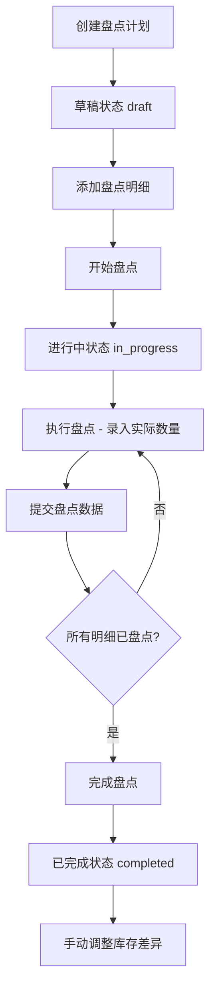

# 库存盘点功能完整指南

## 📋 目录

1. [盘点对象](#1-盘点对象)
2. [盘点位置](#2-盘点位置)
3. [盘点流程](#3-盘点流程)
4. [盘点与调整的区别](#4-盘点与调整的区别)
5. [数据模型](#5-数据模型)
6. [API 接口](#6-api-接口)
7. [业务逻辑](#7-业务逻辑)

---

## 1. 盘点对象

### 盘点什么？

库存盘点功能盘点的是 **库存记录（Inventory）**，而不是产品（Product）本身。

### 盘点粒度

盘点的数据粒度是：**产品 + 变体 + 批次号** 的组合

```typescript
// 盘点明细的唯一标识
{
  productId: string;      // 产品ID（必填）
  variantId?: string;     // 产品变体ID（可选，如颜色规格）
  batchNumber?: string;   // 批次号（可选）
}
```

### 盘点范围

支持三种盘点类型：

| 盘点类型 | 代码      | 说明         |
| -------- | --------- | ------------ |
| 全盘     | `full`    | 盘点所有库存 |
| 抽盘     | `partial` | 盘点部分库存 |
| 循环盘点 | `cycle`   | 定期循环盘点 |

### 盘点数据

每个盘点明细记录以下数据：

```typescript
{
  systemQuantity: number;    // 系统库存数量（盘点前）
  actualQuantity: number;    // 实际盘点数量（盘点时录入）
  difference: number;        // 差异数量 = 实际 - 系统
  unitCost?: number;         // 单位成本
  totalCost?: number;        // 总成本 = 差异 * 单位成本
  location?: string;         // 盘点位置
  remarks?: string;          // 备注
}
```

---

## 2. 盘点位置

### 路由结构

```
/inventory/counts                    # 盘点列表页面
/inventory/counts/new                # 创建盘点计划
/inventory/counts/[id]               # 盘点详情页面
/inventory/counts/[id]/edit          # 编辑盘点计划
/inventory/counts/[id]/execute       # 执行盘点（录入实际数量）
/inventory/counts/statistics         # 盘点统计页面
```

### 页面组件文件

```
app/(dashboard)/inventory/counts/
├── page.tsx                         # 列表页面（Server Component）
├── page-client.tsx                  # 列表页面客户端组件
├── new/
│   ├── page.tsx                     # 创建页面（Server Component）
│   └── page-client.tsx              # 创建页面客户端组件
├── [id]/
│   ├── page.tsx                     # 详情页面（Server Component）
│   ├── page-client.tsx              # 详情页面客户端组件
│   ├── edit/                        # 编辑页面
│   └── execute/                     # 执行盘点页面
│       ├── page.tsx
│       └── page-client.tsx
└── statistics/                      # 统计页面
    ├── page.tsx
    └── page-client.tsx
```

### API 接口路由

```
app/api/inventory/counts/
├── route.ts                         # GET: 查询列表, POST: 创建盘点
├── [id]/
│   ├── route.ts                     # GET: 获取详情, PUT: 更新, DELETE: 删除
│   ├── start/route.ts               # POST: 开始盘点
│   ├── submit/route.ts              # POST: 提交盘点数据
│   ├── complete/route.ts            # POST: 完成盘点
│   └── items/route.ts               # POST: 添加盘点明细
└── statistics/route.ts              # GET: 获取统计数据
```

### 数据模型（Prisma Schema）

```prisma
// 盘点计划表
model InventoryCount {
  id          String   @id @default(uuid())
  countNumber String   @unique              // 盘点编号：COUNT-YYYYMMDD-序号
  countName   String                        // 盘点名称
  countType   String                        // 盘点类型：full/partial/cycle
  status      String   @default("draft")    // 状态：draft/in_progress/completed/cancelled

  // 盘点范围
  location    String?                       // 盘点位置
  categoryId  String?                       // 盘点分类

  // 盘点时间
  planDate    DateTime                      // 计划盘点日期
  startDate   DateTime?                     // 实际开始日期
  endDate     DateTime?                     // 实际结束日期

  // 盘点结果统计
  totalItems      Int                       // 总盘点项目数
  completedItems  Int                       // 已完成项目数
  differenceItems Int                       // 有差异项目数
  totalDifference Int                       // 总差异数量（绝对值）

  // 关系
  items       InventoryCountItem[]          // 盘点明细
  creator     User                          // 创建人
  operator    User?                         // 盘点人
  category    Category?                     // 盘点分类
}

// 盘点明细表
model InventoryCountItem {
  id             String   @id @default(uuid())
  countId        String                     // 盘点计划ID
  productId      String                     // 产品ID
  variantId      String?                    // 变体ID
  batchNumber    String?                    // 批次号

  // 盘点数据
  systemQuantity Int                        // 系统库存数量
  actualQuantity Int?                       // 实际盘点数量
  difference     Int      @default(0)       // 差异数量

  // 盘点状态
  status         String   @default("pending") // pending/counted/adjusted

  // 成本信息
  unitCost       Float?                     // 单位成本
  totalCost      Float?                     // 总成本

  // 盘点位置和备注
  location       String?                    // 盘点位置
  remarks        String?                    // 备注

  // 盘点人和时间
  countedBy      String?                    // 盘点人ID
  countedAt      DateTime?                  // 盘点时间

  // 关系
  count          InventoryCount             // 盘点计划
  product        Product                    // 产品
  variant        ProductVariant?            // 变体
  counter        User?                      // 盘点人
}
```

### 服务层文件

```
lib/services/inventory-count-service.ts   # 盘点业务逻辑
lib/validations/inventory-count.ts        # 盘点数据验证规则
lib/types/inventory-count.ts              # 盘点类型定义
```

---

## 3. 盘点流程

### 完整业务流程



### 详细步骤说明

#### 步骤 1: 创建盘点计划

**操作**: 填写盘点计划信息

**必填字段**:

- `countName`: 盘点名称
- `countType`: 盘点类型（full/partial/cycle）
- `planDate`: 计划盘点日期

**可选字段**:

- `location`: 盘点位置
- `categoryId`: 盘点分类
- `remarks`: 备注
- `items`: 盘点明细（可在创建时添加，也可后续添加）

**API**: `POST /api/inventory/counts`

**代码示例**:

```typescript
const createData = {
  countName: '2025年1月全盘',
  countType: 'full',
  planDate: '2025-01-15',
  location: '仓库A',
  items: [
    {
      productId: 'xxx',
      variantId: 'yyy',
      batchNumber: 'BATCH001',
    },
  ],
};
```

#### 步骤 2: 添加盘点明细（可选）

**操作**: 如果创建时未添加明细，可后续添加

**API**: `POST /api/inventory/counts/[id]/items`

**自动获取系统数量**:

- 系统会自动从 `Inventory` 表查询当前库存数量
- 自动填充 `systemQuantity`、`unitCost`、`location` 等字段

**代码逻辑**:

```typescript
// 从库存表获取系统数量
const inventoryRecords = await tx.inventory.findMany({
  where: {
    OR: items.map(item => ({
      productId: item.productId,
      variantId: item.variantId || null,
      batchNumber: item.batchNumber || null,
    })),
  },
  select: {
    productId: true,
    variantId: true,
    batchNumber: true,
    quantity: true, // 系统库存数量
    unitCost: true, // 单位成本
    location: true, // 库存位置
  },
});
```

#### 步骤 3: 开始盘点

**操作**: 将盘点计划状态从 `draft` 改为 `in_progress`

**API**: `POST /api/inventory/counts/[id]/start`

**状态变更**:

- `status`: `draft` → `in_progress`
- `startDate`: 设置为当前时间
- `operatorId`: 设置为当前用户

**权限**: 需要 `inventory:manage` 权限

#### 步骤 4: 执行盘点 - 录入实际数量

**操作**: 在执行盘点页面录入实际盘点数量

**页面**: `/inventory/counts/[id]/execute`

**录入数据**:

```typescript
{
  itemId: string;          // 盘点明细ID
  actualQuantity: number;  // 实际盘点数量
  remarks?: string;        // 备注
}
```

#### 步骤 5: 提交盘点数据

**操作**: 批量提交已录入的实际数量

**API**: `POST /api/inventory/counts/[id]/submit`

**自动计算差异**:

```typescript
const difference = actualQuantity - systemQuantity;
const totalCost = unitCost ? difference * unitCost : null;
```

**更新明细状态**:

- `status`: `pending` → `counted`
- `actualQuantity`: 录入的实际数量
- `difference`: 计算的差异
- `totalCost`: 计算的成本差异
- `countedBy`: 当前用户ID
- `countedAt`: 当前时间

**更新计划统计**:

```typescript
{
  completedItems: 已盘点明细数量,
  differenceItems: 有差异明细数量,
  totalDifference: 总差异数量（绝对值）
}
```

#### 步骤 6: 完成盘点

**操作**: 确认所有明细已盘点，完成盘点计划

**API**: `POST /api/inventory/counts/[id]/complete`

**前置条件**:

- 盘点计划状态必须是 `in_progress`
- 所有盘点明细状态必须是 `counted`

**状态变更**:

- `status`: `in_progress` → `completed`
- `endDate`: 设置为当前时间

**重要**: 完成盘点 **不会自动调整库存**！

#### 步骤 7: 手动调整库存差异

**操作**: 根据盘点差异，手动创建库存调整记录

**方式**: 使用库存调整功能（`/inventory/adjust`）

**原因**: 盘点和调整是两个独立的业务流程，需要人工审核后再调整

---

## 4. 盘点与调整的区别

### 核心区别

| 对比项       | 库存盘点 (Inventory Count)   | 库存调整 (Inventory Adjustment) |
| ------------ | ---------------------------- | ------------------------------- |
| **目的**     | 核对实际库存与系统库存的差异 | 直接修改系统库存数量            |
| **影响库存** | ❌ 不直接影响                | ✅ 直接影响                     |
| **业务流程** | 计划 → 执行 → 完成           | 直接调整                        |
| **数据记录** | 记录差异，不修改库存         | 修改库存并记录调整历史          |
| **审批流程** | 盘点完成后需人工审核         | 可直接审批通过                  |
| **使用场景** | 定期盘点、年度盘点           | 损耗、报废、补货                |

### 数据表对比

**盘点表** (`InventoryCount` + `InventoryCountItem`):

- 记录盘点计划和盘点明细
- 记录系统数量、实际数量、差异
- **不修改** `Inventory` 表

**调整表** (`InventoryAdjustment`):

- 记录库存调整历史
- 记录调整前、调整量、调整后数量
- **直接修改** `Inventory` 表的 `quantity` 字段

### 业务关系

```
盘点流程:
1. 创建盘点计划
2. 执行盘点，录入实际数量
3. 完成盘点，生成差异报告
4. 【人工审核】差异是否合理
5. 【手动操作】使用库存调整功能调整差异

调整流程:
1. 直接创建库存调整记录
2. 系统自动更新库存数量
3. 记录调整历史
```

### 为什么分开？

1. **审计合规**: 盘点和调整分离，便于审计追溯
2. **风险控制**: 盘点差异需要人工审核，避免误操作
3. **职责分离**: 盘点人员和调整人员可以是不同角色
4. **灵活性**: 可以选择性调整部分差异，不是全部调整

---

## 5. 数据模型

### 盘点状态流转

```
draft (草稿)
  ↓ 开始盘点
in_progress (进行中)
  ↓ 完成盘点
completed (已完成)

cancelled (已取消) ← 可从 draft 或 in_progress 取消
```

### 盘点明细状态流转

```
pending (待盘点)
  ↓ 提交盘点数据
counted (已盘点)
  ↓ 手动调整库存
adjusted (已调整)
```

### 关键字段说明

**InventoryCount (盘点计划)**:

- `countNumber`: 自动生成，格式 `COUNT-YYYYMMDD-001`
- `totalItems`: 总盘点项目数
- `completedItems`: 已完成项目数（status='counted'）
- `differenceItems`: 有差异项目数（difference≠0）
- `totalDifference`: 总差异数量（绝对值之和）

**InventoryCountItem (盘点明细)**:

- `systemQuantity`: 盘点时的系统库存数量（快照）
- `actualQuantity`: 实际盘点数量（录入）
- `difference`: 差异 = actualQuantity - systemQuantity
- `unitCost`: 单位成本（从库存表获取）
- `totalCost`: 成本差异 = difference \* unitCost

---

## 6. API 接口

### 盘点计划接口

| 方法   | 路径                         | 说明         | 权限               |
| ------ | ---------------------------- | ------------ | ------------------ |
| GET    | `/api/inventory/counts`      | 查询盘点列表 | `inventory:view`   |
| POST   | `/api/inventory/counts`      | 创建盘点计划 | `inventory:manage` |
| GET    | `/api/inventory/counts/[id]` | 获取盘点详情 | `inventory:view`   |
| PUT    | `/api/inventory/counts/[id]` | 更新盘点计划 | `inventory:manage` |
| DELETE | `/api/inventory/counts/[id]` | 删除盘点计划 | `inventory:manage` |

### 盘点操作接口

| 方法 | 路径                                  | 说明         | 权限               |
| ---- | ------------------------------------- | ------------ | ------------------ |
| POST | `/api/inventory/counts/[id]/start`    | 开始盘点     | `inventory:manage` |
| POST | `/api/inventory/counts/[id]/submit`   | 提交盘点数据 | `inventory:manage` |
| POST | `/api/inventory/counts/[id]/complete` | 完成盘点     | `inventory:manage` |
| POST | `/api/inventory/counts/[id]/items`    | 添加盘点明细 | `inventory:manage` |

### 统计接口

| 方法 | 路径                               | 说明         | 权限             |
| ---- | ---------------------------------- | ------------ | ---------------- |
| GET  | `/api/inventory/counts/statistics` | 获取盘点统计 | `inventory:view` |

---

## 7. 业务逻辑

### 盘点编号生成规则

```typescript
// 格式：COUNT-YYYYMMDD-序号
// 示例：COUNT-20251104-001

async function generateCountNumber(): Promise<string> {
  const dateStr = format(new Date(), 'yyyyMMdd');
  const prefix = `COUNT-${dateStr}-`;

  // 查询今天已有的最大序号
  const lastRecord = await prisma.inventoryCount.findFirst({
    where: { countNumber: { startsWith: prefix } },
    orderBy: { countNumber: 'desc' },
  });

  let sequence = 1;
  if (lastRecord) {
    sequence = parseInt(lastRecord.countNumber.substring(prefix.length)) + 1;
  }

  return `${prefix}${String(sequence).padStart(3, '0')}`;
}
```

### 系统数量快照机制

创建盘点明细时，系统会从 `Inventory` 表获取当前库存数量作为快照：

```typescript
const inventoryRecords = await tx.inventory.findMany({
  where: {
    OR: items.map(item => ({
      productId: item.productId,
      variantId: item.variantId || null,
      batchNumber: item.batchNumber || null,
    })),
  },
});

const itemsData = items.map(item => {
  const inventory = inventoryMap.get(key);
  return {
    systemQuantity: inventory?.quantity || 0, // 快照
    unitCost: inventory?.unitCost || null,
    location: inventory?.location || null,
  };
});
```

**重要**: `systemQuantity` 是盘点时的快照，即使后续库存变化，也不会更新。

### 差异计算逻辑

```typescript
// 提交盘点数据时自动计算
const difference = actualQuantity - systemQuantity;
const totalCost = unitCost ? difference * unitCost : null;

// 更新盘点计划统计
const completedItems = items.filter(i => i.status === 'counted').length;
const differenceItems = items.filter(i => i.difference !== 0).length;
const totalDifference = items.reduce(
  (sum, i) => sum + Math.abs(i.difference),
  0
);
```

### 盘点完成条件

```typescript
// 只有进行中状态可以完成
if (count.status !== 'in_progress') {
  throw new Error('只有进行中状态的盘点计划可以完成');
}

// 所有明细必须已盘点
const allCounted = count.items.every(item => item.status === 'counted');
if (!allCounted) {
  throw new Error('还有未盘点的明细，无法完成盘点');
}
```

### 盘点后的库存调整

**重要**: 盘点完成后，系统 **不会自动调整库存**！

需要手动操作：

1. 查看盘点差异报告
2. 审核差异原因
3. 使用库存调整功能（`/inventory/adjust`）手动调整
4. 调整时填写原因：`盘点差异调整 - 盘点单号: COUNT-20251104-001`

---

## 📚 相关文件索引

### 前端页面

- `app/(dashboard)/inventory/counts/page-client.tsx` - 盘点列表
- `app/(dashboard)/inventory/counts/new/page-client.tsx` - 创建盘点
- `app/(dashboard)/inventory/counts/[id]/page-client.tsx` - 盘点详情
- `app/(dashboard)/inventory/counts/[id]/execute/page-client.tsx` - 执行盘点

### API 接口

- `app/api/inventory/counts/route.ts` - 列表和创建
- `app/api/inventory/counts/[id]/route.ts` - 详情、更新、删除
- `app/api/inventory/counts/[id]/start/route.ts` - 开始盘点
- `app/api/inventory/counts/[id]/submit/route.ts` - 提交数据
- `app/api/inventory/counts/[id]/complete/route.ts` - 完成盘点

### 业务逻辑

- `lib/services/inventory-count-service.ts` - 盘点服务
- `lib/validations/inventory-count.ts` - 数据验证
- `lib/types/inventory-count.ts` - 类型定义

### 数据库

- `prisma/schema.prisma` - 数据模型（InventoryCount, InventoryCountItem）

---

**最后更新**: 2025-11-04
