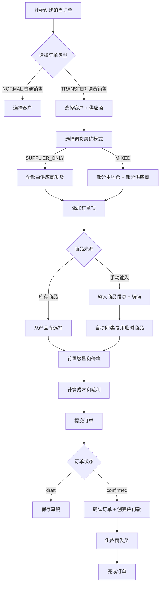
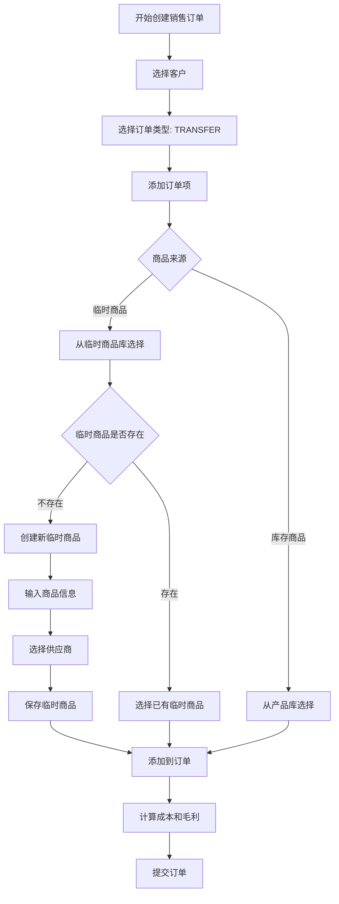

# 调货销售业务模式重构可行性评估报告

**评估日期**: 2025-10-25  
**评估范围**: 调货销售（TRANSFER）业务模式  
**提议变更**: 取消销售订单中选择供应商，改为在临时商品创建时关联供应商

---

## 📋 执行摘要

### 评估结论: ❌ **不建议进行此重构**

**核心原因**:

1. **业务逻辑冲突**: 供应商是订单级别的概念，不是商品级别的概念
2. **数据一致性风险**: 一个订单可能包含多个供应商的商品，违背调货销售的业务本质
3. **重构成本过高**: 需要修改 50+ 个文件，影响 6 个核心业务模块
4. **用户体验下降**: 增加操作步骤，违背 KISS 原则

**推荐方案**: 优化现有流程，而非大规模重构（详见第 6 节）

---

## 1️⃣ 当前调货销售业务流程分析

### 1.1 业务流程图



### 1.2 供应商选择的作用

**核心作用**:

1. **确定调货来源**: 明确本次调货销售从哪个供应商调货
2. **成本核算**: 根据供应商价格计算成本和毛利
3. **应付款生成**: 订单确认后自动生成对该供应商的应付款记录
4. **临时商品关联**: 手动输入商品时，自动关联到该供应商的临时商品库

**数据库体现**:

```typescript
// SalesOrder 表
model SalesOrder {
  supplierId: String?  // 调货销售时的供应商ID（订单级别）
  costAmount: Float?   // 调货销售的成本金额
  profitAmount: Float? // 调货销售的毛利金额

  supplier: Supplier? @relation(fields: [supplierId], references: [id])
}
```

### 1.3 临时商品创建逻辑

**当前实现** (`lib/api/handlers/sales-orders/temporary-products.ts`):

```typescript
// 触发条件
if (orderType === 'TRANSFER' && supplierId) {
  for (const item of items) {
    if (item.isManualProduct && item.productCode) {
      // 自动创建/复用临时商品
      const tempProduct = await findOrCreateTemporaryProduct(tx, {
        supplierId: supplierId, // 从订单获取
        code: item.productCode,
        name: item.manualProductName,
        // ...
      });
    }
  }
}
```

**复用逻辑**:

- **唯一约束**: `@@unique([supplierId, code])`
- **同一供应商 + 同一编码** → 复用现有记录并更新 `usageCount`
- **不同供应商可以有相同编码**

**使用场景**:

1. ✅ 销售订单创建时（TRANSFER 模式）
2. ✅ 厂家发货订单创建时（手动输入商品）

---

## 2️⃣ 提议重构方案分析

### 2.1 提议方案流程



### 2.2 方案对比

| 维度           | 当前方案                             | 提议方案                                                         | 对比结果                |
| -------------- | ------------------------------------ | ---------------------------------------------------------------- | ----------------------- |
| **操作步骤**   | 3 步（选供应商 → 添加商品 → 提交）   | 4-5 步（添加商品 → 选供应商 → 保存临时商品 → 添加到订单 → 提交） | ❌ 提议方案更复杂       |
| **数据一致性** | 订单级别供应商，保证一致性           | 商品级别供应商，可能不一致                                       | ❌ 提议方案风险高       |
| **业务语义**   | 符合"调货销售"定义（从某供应商调货） | 不符合（一个订单多个供应商）                                     | ❌ 提议方案违背业务逻辑 |
| **成本核算**   | 订单级别统一核算                     | 需要按商品分别核算                                               | ❌ 提议方案增加复杂度   |
| **应付款生成** | 一个订单 → 一个应付款记录            | 一个订单 → 多个应付款记录？                                      | ❌ 提议方案逻辑混乱     |
| **代码复杂度** | 简单清晰                             | 需要大量重构                                                     | ❌ 提议方案成本高       |

### 2.3 KISS & YAGNI 原则评估

#### KISS (Keep It Simple, Stupid)

- ❌ **提议方案违背 KISS**: 增加了不必要的复杂性
- ✅ **当前方案符合 KISS**: 订单级别供应商，逻辑清晰

#### YAGNI (You Aren't Gonna Need It)

- ❌ **提议方案违背 YAGNI**: 引入了"一个订单多个供应商"的复杂场景，但业务上不需要
- ✅ **当前方案符合 YAGNI**: 只实现当前需要的功能

---

## 3️⃣ 全局影响分析

### 3.1 数据库层面影响

#### 需要修改的表

| 表名               | 当前结构                      | 需要修改的内容             | 影响程度 |
| ------------------ | ----------------------------- | -------------------------- | -------- |
| `SalesOrder`       | `supplierId: String?`         | 移除 `supplierId` 字段     | 🔴 高    |
| `SalesOrderItem`   | `temporaryProductId: String?` | 添加 `supplierId: String?` | 🔴 高    |
| `TemporaryProduct` | `supplierId: String`          | 保持不变                   | 🟢 无    |
| `PayableRecord`    | `sourceId: String?`           | 修改关联逻辑               | 🔴 高    |

#### 外键约束变更

```sql
-- 当前约束
ALTER TABLE sales_orders
  ADD CONSTRAINT fk_sales_orders_supplier
  FOREIGN KEY (supplier_id) REFERENCES suppliers(id);

-- 提议方案需要移除此约束，并在 sales_order_items 表添加
ALTER TABLE sales_order_items
  ADD CONSTRAINT fk_sales_order_items_supplier
  FOREIGN KEY (supplier_id) REFERENCES suppliers(id);
```

#### 数据迁移复杂度

```typescript
// 需要迁移现有数据
// 1. 将 SalesOrder.supplierId 迁移到每个 SalesOrderItem
// 2. 重新计算每个订单项的成本和毛利
// 3. 拆分应付款记录（一个订单可能产生多个应付款）

// 预估影响数据量
const affectedOrders = await prisma.salesOrder.count({
  where: { orderType: 'TRANSFER', supplierId: { not: null } },
});
// 预计影响: 数百到数千条订单记录
```

### 3.2 API 层面影响

#### 需要修改的 API 接口

| API 路径                     | 当前签名                   | 需要修改的内容                         | 影响程度 |
| ---------------------------- | -------------------------- | -------------------------------------- | -------- |
| `POST /api/sales-orders`     | `{ supplierId, items[] }`  | 移除 `supplierId`，在 `items[]` 中添加 | 🔴 高    |
| `PUT /api/sales-orders/[id]` | 同上                       | 同上                                   | 🔴 高    |
| `POST /api/payables`         | `{ supplierId, sourceId }` | 修改应付款生成逻辑                     | 🔴 高    |
| `GET /api/sales-orders/[id]` | 返回订单级别供应商         | 返回商品级别供应商列表                 | 🟡 中    |

#### Zod 验证 Schema 修改

```typescript
// 当前 Schema (lib/validations/sales-order/index.ts)
export const salesOrderCreateSchema = baseSalesOrderSchema.refine(
  data => {
    if (data.orderType === 'TRANSFER') {
      return data.supplierId && data.supplierId.trim() !== '';
    }
    return true;
  },
  {
    message: '调货销售必须选择供应商',
    path: ['supplierId'],
  }
);

// 提议方案需要修改为
export const salesOrderCreateSchema = baseSalesOrderSchema.refine(
  data => {
    if (data.orderType === 'TRANSFER') {
      return data.items.every(
        item => item.supplierId && item.supplierId.trim() !== ''
      );
    }
    return true;
  },
  {
    message: '调货销售的每个商品必须选择供应商',
    path: ['items'],
  }
);
```

### 3.3 UI 组件影响

#### 需要修改的组件列表

| 组件路径                                                | 当前功能             | 需要修改的内容                       | 预估工作量 |
| ------------------------------------------------------- | -------------------- | ------------------------------------ | ---------- |
| `components/sales-orders/erp-sales-order-form.tsx`      | 订单级别供应商选择器 | 移除订单级别选择器，在每个订单项添加 | 2-3 天     |
| `components/sales-orders/order-items-card.tsx`          | 订单项表格           | 添加供应商列                         | 1 天       |
| `components/sales-orders/add-temporary-product-dialog/` | 临时商品对话框       | 添加供应商选择器                     | 1 天       |
| `app/(dashboard)/sales-orders/[id]/page.tsx`            | 订单详情页           | 修改供应商显示逻辑                   | 1 天       |
| `app/(dashboard)/finance/payables/`                     | 应付款列表           | 修改应付款关联逻辑                   | 2 天       |

**总计**: 7-9 天开发工作量

---

## 4️⃣ 风险评估

### 4.1 数据一致性风险 🔴 高

**问题**: 一个调货销售订单可能包含多个供应商的商品

**场景示例**:

```typescript
// 订单 SO-20251025-001
{
  orderType: 'TRANSFER',
  items: [
    { productCode: 'A001', supplierId: 'supplier-1' },  // 供应商 A
    { productCode: 'B001', supplierId: 'supplier-2' },  // 供应商 B
    { productCode: 'C001', supplierId: 'supplier-1' },  // 供应商 A
  ]
}
```

**问题**:

1. 这个订单的成本如何核算？（需要分别计算每个供应商的成本）
2. 应付款如何生成？（需要生成 2 条应付款记录？）
3. 供应商发货如何处理？（需要协调多个供应商？）
4. 订单状态如何管理？（部分供应商已发货，部分未发货？）

**结论**: ❌ 违背"调货销售"的业务本质（从单一供应商调货）

### 4.2 业务逻辑风险 🔴 高

**当前业务逻辑**:

- 调货销售 = 从某个供应商调货给客户
- 一个订单 = 一个供应商 = 一笔应付款

**提议方案逻辑**:

- 调货销售 = 从多个供应商调货给客户？
- 一个订单 = 多个供应商 = 多笔应付款？

**冲突点**:

1. **应付款生成逻辑混乱**: 当前代码假设一个订单只有一个供应商
2. **成本核算复杂化**: 需要按商品分别核算成本
3. **订单状态管理困难**: 多个供应商的发货状态如何统一？

### 4.3 性能影响 🟡 中

**查询性能**:

- 当前: 订单详情查询只需 JOIN 一次 `suppliers` 表
- 提议: 订单详情查询需要 JOIN `suppliers` 表 N 次（N = 订单项数量）

**数据库索引**:

- 需要在 `sales_order_items` 表添加 `supplier_id` 索引
- 可能影响写入性能

### 4.4 用户体验影响 🔴 高

**操作步骤对比**:

| 场景                     | 当前方案        | 提议方案                                          | 对比                |
| ------------------------ | --------------- | ------------------------------------------------- | ------------------- |
| 创建调货订单（5 个商品） | 选择 1 次供应商 | 选择 5 次供应商（或创建 5 个临时商品时各选 1 次） | ❌ 提议方案操作繁琐 |
| 修改供应商               | 修改 1 次       | 修改 5 次                                         | ❌ 提议方案操作繁琐 |
| 查看订单供应商           | 直接显示        | 需要查看每个商品的供应商                          | ❌ 提议方案信息分散 |

### 4.5 向后兼容性问题 🔴 高

**现有数据**:

- 已有数百/数千条调货销售订单
- 已有应付款记录关联到订单级别供应商
- 已有临时商品记录关联到供应商

**迁移难点**:

1. 如何迁移现有订单的供应商信息？
2. 如何处理已生成的应付款记录？
3. 如何保证历史数据的查询兼容性？

---

## 5️⃣ 影响范围清单

### 5.1 需要修改的文件（按模块分类）

#### 数据库层 (2 个文件)

- [ ] `prisma/schema.prisma` - 修改 SalesOrder 和 SalesOrderItem 模型
- [ ] `prisma/migrations/` - 创建数据迁移脚本

#### API 层 (15+ 个文件)

- [ ] `lib/api/handlers/sales-orders/create.ts` - 修改创建逻辑
- [ ] `lib/api/handlers/sales-orders/update.ts` - 修改更新逻辑
- [ ] `lib/api/handlers/sales-orders/financials.ts` - 修改成本核算
- [ ] `lib/api/handlers/sales-orders/payable.ts` - 修改应付款生成
- [ ] `lib/api/handlers/sales-orders/temporary-products.ts` - 修改临时商品逻辑
- [ ] `lib/api/handlers/sales-orders/validation.ts` - 修改验证逻辑
- [ ] `app/api/sales-orders/route.ts` - 修改 API 接口
- [ ] `app/api/sales-orders/[id]/route.ts` - 修改详情接口
- [ ] `app/api/payables/route.ts` - 修改应付款接口
- [ ] `lib/services/sales-order-service.ts` - 修改服务层
- [ ] `lib/utils/sales-order-transforms.ts` - 修改数据转换
- [ ] ... (其他相关 API 文件)

#### 验证层 (3 个文件)

- [ ] `lib/validations/sales-order/index.ts` - 修改验证规则
- [ ] `lib/validations/sales-order/item.ts` - 添加商品级别供应商验证
- [ ] `lib/validations/payable.ts` - 修改应付款验证

#### UI 组件层 (20+ 个文件)

- [ ] `components/sales-orders/erp-sales-order-form.tsx` - 修改表单
- [ ] `components/sales-orders/order-items-card.tsx` - 修改订单项表格
- [ ] `components/sales-orders/add-temporary-product-dialog/` - 修改临时商品对话框
- [ ] `components/sales-orders/supplier-selector/` - 移动到订单项级别
- [ ] `app/(dashboard)/sales-orders/[id]/page.tsx` - 修改详情页
- [ ] `app/(dashboard)/sales-orders/create/page.tsx` - 修改创建页
- [ ] `app/(dashboard)/finance/payables/` - 修改应付款页面
- [ ] ... (其他相关 UI 文件)

#### 类型定义层 (5 个文件)

- [ ] `lib/types/sales-order.ts` - 修改类型定义
- [ ] `lib/types/payable.ts` - 修改应付款类型
- [ ] `lib/types/temporary-product.ts` - 修改临时商品类型
- [ ] ... (其他相关类型文件)

**总计**: 50+ 个文件需要修改

### 5.2 预估工作量

| 阶段         | 任务                         | 预估时间 |
| ------------ | ---------------------------- | -------- |
| **设计阶段** | 详细设计方案、数据迁移方案   | 2-3 天   |
| **数据库层** | Schema 修改、迁移脚本、测试  | 2-3 天   |
| **API 层**   | 修改所有相关 API 和服务层    | 5-7 天   |
| **验证层**   | 修改 Zod Schema 和验证逻辑   | 1-2 天   |
| **UI 层**    | 修改所有相关组件和页面       | 7-10 天  |
| **测试阶段** | 单元测试、集成测试、E2E 测试 | 5-7 天   |
| **数据迁移** | 迁移现有数据、验证数据一致性 | 2-3 天   |
| **回归测试** | 全面回归测试、修复 Bug       | 3-5 天   |

**总计**: **27-40 个工作日**（约 1.5-2 个月）

---

## 6️⃣ 推荐方案: 优化现有流程

### 6.1 问题诊断

如果您觉得当前流程有问题，可能的痛点是:

1. ❓ 临时商品创建不够方便？
2. ❓ 供应商选择时机不合适？
3. ❓ 手动输入商品信息繁琐？

### 6.2 优化方案（无需大规模重构）

#### 方案 A: 优化临时商品选择体验

**目标**: 简化临时商品的选择和创建流程

**实现**:

```typescript
// 在订单项添加时，提供"从临时商品库选择"功能
<OrderItemsCard>
  <Button onClick={() => setShowTempProductSelector(true)}>
    从临时商品库选择
  </Button>

  <TemporaryProductSelector
    supplierId={form.watch('supplierId')}  // 使用订单级别供应商
    onSelect={(tempProduct) => {
      // 自动填充商品信息
      addOrderItem({
        isManualProduct: true,
        productCode: tempProduct.code,
        manualProductName: tempProduct.name,
        // ...
      });
    }}
  />
</OrderItemsCard>
```

**优点**:

- ✅ 无需修改数据库结构
- ✅ 无需修改 API 接口
- ✅ 开发工作量小（2-3 天）
- ✅ 符合 KISS 原则

#### 方案 B: 支持临时商品预创建

**目标**: 允许用户提前创建临时商品，然后在订单中快速选择

**实现**:

1. 新增"临时商品管理"页面 (`app/(dashboard)/temporary-products/`)
2. 支持批量创建临时商品（按供应商分类）
3. 在订单创建时，从临时商品库快速选择

**优点**:

- ✅ 提升用户体验
- ✅ 无需修改核心业务逻辑
- ✅ 开发工作量中等（5-7 天）
- ✅ 符合 YAGNI 原则

#### 方案 C: 优化供应商选择时机

**目标**: 在选择订单类型时就提示选择供应商

**实现**:

```typescript
// 当用户选择 TRANSFER 类型时，立即显示供应商选择器
<FormField name="orderType">
  {orderType === 'TRANSFER' && (
    <Alert>
      <AlertDescription>
        调货销售需要选择供应商，请先选择供应商后再添加商品
      </AlertDescription>
    </Alert>
  )}
</FormField>
```

**优点**:

- ✅ 引导用户正确操作
- ✅ 无需修改业务逻辑
- ✅ 开发工作量极小（1 天）

### 6.3 推荐实施顺序

1. **第 1 周**: 实施方案 C（优化供应商选择时机）
2. **第 2-3 周**: 实施方案 A（优化临时商品选择体验）
3. **第 4-5 周**: 实施方案 B（支持临时商品预创建）

**总工作量**: 8-11 天（约 2 周）

---

## 7️⃣ 最终建议

### ❌ 不建议进行提议的重构

**理由**:

1. **违背业务逻辑**: 调货销售的本质是从单一供应商调货，不应支持多供应商
2. **违背 KISS 原则**: 增加不必要的复杂性
3. **违背 YAGNI 原则**: 引入了不需要的功能
4. **重构成本过高**: 需要 1.5-2 个月，修改 50+ 个文件
5. **风险过高**: 数据一致性、业务逻辑、向后兼容性都存在高风险
6. **用户体验下降**: 操作步骤增加，信息分散

### ✅ 推荐采用优化方案

**推荐方案**: 方案 A + 方案 C

- **工作量**: 3-4 天
- **风险**: 低
- **收益**: 提升用户体验，保持业务逻辑清晰

### 📊 方案对比总结

| 维度           | 提议重构方案 | 推荐优化方案 |
| -------------- | ------------ | ------------ |
| **开发工作量** | 27-40 天     | 3-4 天       |
| **风险等级**   | 🔴 高        | 🟢 低        |
| **业务逻辑**   | ❌ 违背      | ✅ 符合      |
| **KISS 原则**  | ❌ 违背      | ✅ 符合      |
| **YAGNI 原则** | ❌ 违背      | ✅ 符合      |
| **用户体验**   | ❌ 下降      | ✅ 提升      |
| **数据一致性** | ❌ 风险高    | ✅ 无风险    |
| **向后兼容**   | ❌ 需要迁移  | ✅ 完全兼容  |

---

## 附录 A: 当前实现技术细节

### A.1 供应商在系统中的使用场景

| 模块           | 使用场景             | 关联表                                | 业务逻辑          |
| -------------- | -------------------- | ------------------------------------- | ----------------- |
| **销售订单**   | 调货销售时选择供应商 | `SalesOrder.supplierId`               | 订单级别，一对一  |
| **厂家发货**   | 每个商品选择供应商   | `FactoryShipmentOrderItem.supplierId` | 商品级别，一对多  |
| **应付款**     | 记录对供应商的应付款 | `PayableRecord.supplierId`            | 关联到供应商      |
| **付款记录**   | 记录对供应商的付款   | `PaymentOutRecord.supplierId`         | 关联到供应商      |
| **临时商品**   | 按供应商维度管理     | `TemporaryProduct.supplierId`         | 供应商 + 编码唯一 |
| **供应商价格** | 记录供应商产品价格   | `SupplierProductPrice.supplierId`     | 价格历史          |

**关键发现**:

- ✅ **厂家发货订单**已经支持商品级别供应商（因为业务需要）
- ✅ **销售订单**使用订单级别供应商（符合调货销售业务逻辑）
- ⚠️ 两种模式并存，各有其业务合理性

### A.2 临时商品的完整生命周期

```typescript
// 1. 创建阶段（销售订单创建时）
// lib/api/handlers/sales-orders/create.ts:94-117
if (orderType === 'TRANSFER' && supplierId) {
  for (let i = 0; i < items.length; i++) {
    const item = items[i];
    if (item.isManualProduct && item.productCode) {
      // 自动创建/复用临时商品
      const tempProduct = await findOrCreateTemporaryProduct(tx, {
        supplierId: supplierId, // 从订单获取
        code: item.productCode,
        name: item.manualProductName || item.productCode,
        specification: item.manualSpecification,
        weight: item.manualWeight,
        unit: item.manualUnit || '片',
        piecesPerUnit: item.piecesPerUnit || 1,
        createdBy: userId,
      });
      temporaryProductIds.set(i, tempProduct.id);
    }
  }
}

// 2. 复用逻辑（查找或创建）
// lib/api/handlers/sales-orders/temporary-products.ts:48-96
export async function findOrCreateTemporaryProduct(tx, data) {
  // 尝试查找现有记录（同一供应商 + 同一编码）
  let tempProduct = await tx.temporaryProduct.findUnique({
    where: {
      supplierId_code: {
        supplierId: data.supplierId,
        code: data.code,
      },
    },
  });

  if (tempProduct) {
    // 找到记录 - 更新使用统计
    tempProduct = await tx.temporaryProduct.update({
      where: { id: tempProduct.id },
      data: {
        usageCount: { increment: 1 },
        lastUsedAt: new Date(),
      },
    });
  } else {
    // 未找到记录 - 创建新临时商品
    tempProduct = await tx.temporaryProduct.create({
      data: {
        ...data,
        usageCount: 1,
        lastUsedAt: new Date(),
      },
    });
  }

  return tempProduct;
}

// 3. 关联到订单项
// lib/api/handlers/sales-orders/financials.ts:66-114
export const buildOrderItemsInput = (data, transferMode, temporaryProductIds) =>
  data.items.map((item, index) => ({
    // ... 其他字段
    temporaryProductId: temporaryProductIds?.get(index) || null,
    isManualProduct: item.isManualProduct || false,
    manualProductName: item.manualProductName || null,
    manualSpecification: item.manualSpecification || null,
    // ...
  }));
```

### A.3 应付款生成逻辑

```typescript
// lib/api/handlers/sales-orders/payable.ts
export async function maybeCreatePayable(
  tx: PrismaTransaction,
  data: CreateInput,
  costAmount: number,
  userId: string,
  orderInfo: { id: string; orderNumber: string }
) {
  // 只有调货销售且有供应商时才创建应付款
  if (data.orderType !== 'TRANSFER' || !data.supplierId || costAmount <= 0) {
    return null;
  }

  const payableNumber = await generatePayableNumber();

  return await tx.payableRecord.create({
    data: {
      payableNumber,
      supplierId: data.supplierId, // 订单级别供应商
      userId,
      sourceType: 'sales_order',
      sourceId: orderInfo.id,
      sourceNumber: orderInfo.orderNumber,
      payableAmount: costAmount,
      paidAmount: 0,
      remainingAmount: costAmount,
      status: 'pending',
      // ...
    },
  });
}
```

**关键逻辑**:

- 一个调货销售订单 → 一个应付款记录
- 应付款金额 = 订单成本金额（`costAmount`）
- 应付款关联到订单级别供应商

**如果改为商品级别供应商**:

- 一个订单可能有多个供应商 → 需要生成多个应付款记录
- 需要按供应商分组计算成本
- 应付款关联逻辑变复杂

---

## 附录 B: 替代方案详细设计

### B.1 方案 A: 临时商品选择器（推荐）

#### 功能设计

```typescript
// components/sales-orders/temporary-product-selector/TemporaryProductSelector.tsx
interface TemporaryProductSelectorProps {
  supplierId: string;  // 从订单获取
  onSelect: (tempProduct: TemporaryProduct) => void;
}

export function TemporaryProductSelector({ supplierId, onSelect }: Props) {
  // 查询该供应商的临时商品
  const { data: tempProducts } = useQuery({
    queryKey: ['temporary-products', 'list', { supplierId }],
    queryFn: async () => {
      const res = await fetch(`/api/temporary-products?supplierId=${supplierId}`);
      return res.json();
    },
    enabled: !!supplierId,
  });

  return (
    <Dialog>
      <DialogContent>
        <DialogHeader>
          <DialogTitle>选择临时商品</DialogTitle>
          <DialogDescription>
            从该供应商的临时商品库中选择，或创建新的临时商品
          </DialogDescription>
        </DialogHeader>

        <div className="space-y-4">
          {/* 搜索框 */}
          <Input
            placeholder="搜索商品编码或名称..."
            value={searchValue}
            onChange={(e) => setSearchValue(e.target.value)}
          />

          {/* 临时商品列表 */}
          <ScrollArea className="h-[400px]">
            {filteredProducts.map((product) => (
              <Card
                key={product.id}
                className="cursor-pointer hover:bg-accent"
                onClick={() => onSelect(product)}
              >
                <CardContent className="p-4">
                  <div className="flex justify-between">
                    <div>
                      <p className="font-medium">{product.code}</p>
                      <p className="text-sm text-muted-foreground">
                        {product.name}
                      </p>
                    </div>
                    <Badge variant="secondary">
                      使用 {product.usageCount} 次
                    </Badge>
                  </div>
                  <p className="text-xs text-muted-foreground mt-2">
                    规格: {product.specification || '无'}
                  </p>
                </CardContent>
              </Card>
            ))}
          </ScrollArea>

          {/* 创建新临时商品按钮 */}
          <Button
            variant="outline"
            className="w-full"
            onClick={() => setShowCreateDialog(true)}
          >
            <Plus className="mr-2 h-4 w-4" />
            创建新临时商品
          </Button>
        </div>
      </DialogContent>
    </Dialog>
  );
}
```

#### API 接口设计

```typescript
// app/api/temporary-products/route.ts
export async function GET(request: NextRequest) {
  const { searchParams } = new URL(request.url);
  const supplierId = searchParams.get('supplierId');

  if (!supplierId) {
    return NextResponse.json({ error: '缺少供应商ID' }, { status: 400 });
  }

  const tempProducts = await prisma.temporaryProduct.findMany({
    where: { supplierId },
    orderBy: [
      { usageCount: 'desc' }, // 按使用次数排序
      { lastUsedAt: 'desc' }, // 最近使用的排前面
    ],
    include: {
      supplier: {
        select: { id: true, name: true },
      },
    },
  });

  return NextResponse.json({
    success: true,
    data: tempProducts,
  });
}
```

#### 集成到订单表单

```typescript
// components/sales-orders/order-items-card.tsx
export function OrderItemsCard() {
  const supplierId = form.watch('supplierId');
  const [showTempProductSelector, setShowTempProductSelector] = useState(false);

  const handleSelectTempProduct = (tempProduct: TemporaryProduct) => {
    // 自动填充订单项
    addOrderItem({
      isManualProduct: true,
      productCode: tempProduct.code,
      manualProductName: tempProduct.name,
      manualSpecification: tempProduct.specification,
      manualWeight: tempProduct.weight,
      manualUnit: tempProduct.unit,
      piecesPerUnit: tempProduct.piecesPerUnit,
      quantity: 0,  // 用户需要输入数量
      unitPrice: 0, // 用户需要输入价格
      unitCost: 0,  // 用户需要输入成本
    });
    setShowTempProductSelector(false);
  };

  return (
    <Card>
      <CardHeader>
        <div className="flex justify-between items-center">
          <CardTitle>订单明细</CardTitle>
          <div className="flex gap-2">
            {/* 从产品库选择 */}
            <Button
              variant="outline"
              onClick={() => setShowProductSelector(true)}
              disabled={!supplierId && orderType === 'TRANSFER'}
            >
              <Package className="mr-2 h-4 w-4" />
              从产品库选择
            </Button>

            {/* 从临时商品库选择（新增） */}
            {orderType === 'TRANSFER' && supplierId && (
              <Button
                variant="outline"
                onClick={() => setShowTempProductSelector(true)}
              >
                <History className="mr-2 h-4 w-4" />
                从临时商品库选择
              </Button>
            )}

            {/* 手动输入 */}
            <Button
              variant="outline"
              onClick={() => setShowManualInput(true)}
            >
              <Plus className="mr-2 h-4 w-4" />
              手动输入
            </Button>
          </div>
        </div>
      </CardHeader>

      <CardContent>
        {/* 订单项表格 */}
        <OrderItemsTable items={items} />
      </CardContent>

      {/* 临时商品选择器对话框 */}
      <TemporaryProductSelector
        open={showTempProductSelector}
        onOpenChange={setShowTempProductSelector}
        supplierId={supplierId}
        onSelect={handleSelectTempProduct}
      />
    </Card>
  );
}
```

#### 实施步骤

1. **第 1 天**: 创建临时商品 API 接口
   - `GET /api/temporary-products?supplierId={id}`
   - 返回该供应商的所有临时商品

2. **第 2 天**: 创建临时商品选择器组件
   - `TemporaryProductSelector.tsx`
   - 支持搜索、排序、选择

3. **第 3 天**: 集成到订单表单
   - 在 `OrderItemsCard` 中添加"从临时商品库选择"按钮
   - 处理选择后的自动填充逻辑

4. **第 4 天**: 测试和优化
   - 单元测试
   - 集成测试
   - UI/UX 优化

**总工作量**: 3-4 天

### B.2 方案 B: 临时商品管理页面

#### 页面设计

```typescript
// app/(dashboard)/temporary-products/page.tsx
export default function TemporaryProductsPage() {
  return (
    <div className="space-y-6">
      <PageHeader
        title="临时商品管理"
        description="管理调货销售中使用的临时商品记录"
      />

      {/* 筛选器 */}
      <Card>
        <CardContent className="p-4">
          <div className="grid grid-cols-3 gap-4">
            <SupplierSelector
              value={supplierId}
              onValueChange={setSupplierId}
              placeholder="筛选供应商"
            />
            <Input
              placeholder="搜索商品编码或名称..."
              value={searchValue}
              onChange={(e) => setSearchValue(e.target.value)}
            />
            <Button onClick={handleSearch}>
              <Search className="mr-2 h-4 w-4" />
              搜索
            </Button>
          </div>
        </CardContent>
      </Card>

      {/* 临时商品列表 */}
      <Card>
        <CardHeader>
          <div className="flex justify-between items-center">
            <CardTitle>临时商品列表</CardTitle>
            <Button onClick={() => setShowCreateDialog(true)}>
              <Plus className="mr-2 h-4 w-4" />
              创建临时商品
            </Button>
          </div>
        </CardHeader>
        <CardContent>
          <DataTable
            columns={columns}
            data={tempProducts}
            pagination={pagination}
          />
        </CardContent>
      </Card>

      {/* 创建/编辑对话框 */}
      <CreateTemporaryProductDialog
        open={showCreateDialog}
        onOpenChange={setShowCreateDialog}
        onSuccess={handleRefresh}
      />
    </div>
  );
}
```

#### 批量创建功能

```typescript
// components/temporary-products/batch-create-dialog.tsx
export function BatchCreateDialog() {
  return (
    <Dialog>
      <DialogContent className="max-w-2xl">
        <DialogHeader>
          <DialogTitle>批量创建临时商品</DialogTitle>
          <DialogDescription>
            从 Excel 文件导入或手动输入多个临时商品
          </DialogDescription>
        </DialogHeader>

        <Tabs defaultValue="manual">
          <TabsList>
            <TabsTrigger value="manual">手动输入</TabsTrigger>
            <TabsTrigger value="import">Excel 导入</TabsTrigger>
          </TabsList>

          <TabsContent value="manual">
            {/* 手动输入表格 */}
            <Table>
              <TableHeader>
                <TableRow>
                  <TableHead>商品编码</TableHead>
                  <TableHead>商品名称</TableHead>
                  <TableHead>规格</TableHead>
                  <TableHead>重量</TableHead>
                  <TableHead>单位</TableHead>
                  <TableHead>操作</TableHead>
                </TableRow>
              </TableHeader>
              <TableBody>
                {rows.map((row, index) => (
                  <TableRow key={index}>
                    <TableCell>
                      <Input
                        value={row.code}
                        onChange={(e) => updateRow(index, 'code', e.target.value)}
                      />
                    </TableCell>
                    {/* 其他字段... */}
                  </TableRow>
                ))}
              </TableBody>
            </Table>
            <Button onClick={addRow}>
              <Plus className="mr-2 h-4 w-4" />
              添加行
            </Button>
          </TabsContent>

          <TabsContent value="import">
            {/* Excel 导入 */}
            <FileUpload
              accept=".xlsx,.xls"
              onUpload={handleExcelUpload}
            />
          </TabsContent>
        </Tabs>

        <DialogFooter>
          <Button onClick={handleBatchCreate}>
            批量创建 ({rows.length} 个商品)
          </Button>
        </DialogFooter>
      </DialogContent>
    </Dialog>
  );
}
```

**实施步骤**: 5-7 天

---

## 附录 C: 决策矩阵

### C.1 方案评分表（满分 10 分）

| 评估维度       | 提议重构方案         | 方案 A（临时商品选择器） | 方案 B（临时商品管理） | 方案 C（优化提示） |
| -------------- | -------------------- | ------------------------ | ---------------------- | ------------------ |
| **开发成本**   | 2 分（27-40 天）     | 9 分（3-4 天）           | 7 分（5-7 天）         | 10 分（1 天）      |
| **风险等级**   | 2 分（高风险）       | 9 分（低风险）           | 9 分（低风险）         | 10 分（无风险）    |
| **业务逻辑**   | 3 分（违背）         | 10 分（符合）            | 10 分（符合）          | 10 分（符合）      |
| **用户体验**   | 4 分（下降）         | 9 分（提升）             | 8 分（提升）           | 7 分（略有提升）   |
| **可维护性**   | 3 分（复杂化）       | 9 分（简单）             | 8 分（中等）           | 10 分（简单）      |
| **扩展性**     | 5 分（支持多供应商） | 7 分（符合当前需求）     | 8 分（支持未来扩展）   | 6 分（有限）       |
| **数据一致性** | 2 分（风险高）       | 10 分（无风险）          | 10 分（无风险）        | 10 分（无风险）    |
| **向后兼容**   | 1 分（需迁移）       | 10 分（完全兼容）        | 10 分（完全兼容）      | 10 分（完全兼容）  |
| **总分**       | **22 / 80**          | **73 / 80**              | **70 / 80**            | **73 / 80**        |

### C.2 推荐组合方案

**最佳组合**: 方案 A + 方案 C

- **总工作量**: 4-5 天
- **总分**: 73 + 73 = 146 / 160
- **投资回报率**: 最高

**进阶组合**: 方案 A + 方案 B + 方案 C

- **总工作量**: 9-12 天
- **总分**: 73 + 70 + 73 = 216 / 240
- **适用场景**: 如果临时商品使用频繁，值得投资

---

**报告生成时间**: 2025-10-25
**评估人**: AI Assistant
**下一步行动**: 等待决策，如需实施优化方案，可立即开始
