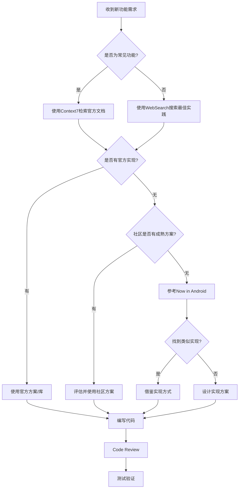

# Android开发规范 - 严禁重复造轮子

> 使用MCP工具检索最佳实践，站在巨人的肩膀上开发

## 🚫 核心原则：不要重复造轮子

### 黄金法则

```
实现任何功能前，必须先：
1️⃣ 使用MCP工具检索官方文档和最佳实践
2️⃣ 查找是否有官方或成熟的库可以直接使用
3️⃣ 参考Google官方示例项目的实现方式
4️⃣ 确认没有现成方案后，才考虑自己实现
```

---

## 🔍 开发工作流程

### 标准开发流程



---

## 🛠️ 必须使用的MCP工具

### 1. Context7 - 官方文档检索（最优先）

**何时使用**：

- ✅ 需要实现Android官方组件功能
- ✅ 需要了解Jetpack库的正确用法
- ✅ 需要查找Material Design组件实现
- ✅ 需要了解架构模式的官方推荐

**使用示例**：

#### 场景1：实现导航功能

```kotlin
// ❌ 错误做法：直接开始写代码
class NavigationManager {
    fun navigate(route: String) {
        // 自己实现导航逻辑...
    }
}

// ✅ 正确做法：先使用Context7检索
// 1. 调用 mcp__context7__resolve-library-id("Android Navigation Compose")
// 2. 调用 mcp__context7__get-library-docs 获取官方文档
// 3. 学习官方推荐的Navigation Compose实现方式
// 4. 使用官方API实现

@Composable
fun NavGraph(navController: NavHostController) {
    NavHost(navController, startDestination = "home") {
        composable("home") { HomeScreen() }
        composable("detail/{id}") { backStackEntry ->
            DetailScreen(backStackEntry.arguments?.getString("id"))
        }
    }
}
```

#### 场景2：实现ViewModel

```kotlin
// ❌ 错误做法：自己设计状态管理
class MyViewModel {
    var uiState: MyState? = null
    // 手动管理状态...
}

// ✅ 正确做法：使用Context7查询官方架构指南
// 查询 "Android ViewModel StateFlow"
// 学习官方推荐的状态管理方式

@HiltViewModel
class MyViewModel @Inject constructor(
    private val repository: MyRepository
) : ViewModel() {

    private val _uiState = MutableStateFlow<UiState>(UiState.Loading)
    val uiState: StateFlow<UiState> = _uiState.asStateFlow()

    init {
        loadData()
    }

    private fun loadData() {
        viewModelScope.launch {
            repository.getData()
                .catch { _uiState.value = UiState.Error(it) }
                .collect { _uiState.value = UiState.Success(it) }
        }
    }
}
```

#### 场景3：实现分页加载

```kotlin
// ❌ 错误做法：自己实现分页逻辑
class PagingManager {
    private var currentPage = 1
    private val items = mutableListOf<Item>()

    fun loadMore() {
        // 手动管理分页...
    }
}

// ✅ 正确做法：使用Context7查询 "Android Paging 3"
// 学习官方Paging库的使用方式

class ItemPagingSource(
    private val api: ItemApi
) : PagingSource<Int, Item>() {
    override suspend fun load(params: LoadParams<Int>): LoadResult<Int, Item> {
        val page = params.key ?: 1
        return try {
            val response = api.getItems(page, params.loadSize)
            LoadResult.Page(
                data = response.items,
                prevKey = if (page == 1) null else page - 1,
                nextKey = if (response.items.isEmpty()) null else page + 1
            )
        } catch (e: Exception) {
            LoadResult.Error(e)
        }
    }

    override fun getRefreshKey(state: PagingState<Int, Item>): Int? {
        return state.anchorPosition?.let { position ->
            state.closestPageToPosition(position)?.prevKey?.plus(1)
                ?: state.closestPageToPosition(position)?.nextKey?.minus(1)
        }
    }
}

@HiltViewModel
class ItemViewModel @Inject constructor(
    private val repository: ItemRepository
) : ViewModel() {
    val items: Flow<PagingData<Item>> = repository.getItemsPaged()
        .cachedIn(viewModelScope)
}
```

---

### 2. WebSearch - 搜索最佳实践

**何时使用**：

- ✅ 需要了解2025年最新的技术趋势
- ✅ 需要解决特定的技术问题
- ✅ 需要对比不同方案的优缺点
- ✅ 需要查找性能优化技巧

**使用示例**：

```bash
# 查询最新的Compose性能优化技巧
WebSearch: "Jetpack Compose performance optimization 2025"

# 查询特定问题的解决方案
WebSearch: "Android Room database migration best practices"

# 查询架构决策
WebSearch: "MVVM vs MVI Android 2025 comparison"
```

---

### 3. Sequential Thinking - 复杂问题分析

**何时使用**：

- ✅ 需要设计复杂的架构方案
- ✅ 需要分析多个技术选型
- ✅ 需要解决技术难题
- ✅ 需要优化性能瓶颈

**使用场景**：

```
问题：如何设计离线优先的数据同步策略？

使用Sequential Thinking分析：
1. 定义单一数据源（Room数据库）
2. 设计API响应的缓存策略
3. 处理网络状态变化
4. 实现冲突解决机制
5. 考虑数据一致性保证
```

---

## 📚 必须参考的资源

### 1. Now in Android 项目（最重要）

**为什么重要**：

- ✅ Google官方示例项目
- ✅ 展示最新最佳实践
- ✅ 完整的Clean Architecture实现
- ✅ 生产级代码质量

**如何使用**：

```bash
# 1. 克隆项目到本地
git clone https://github.com/android/nowinandroid.git

# 2. 需要实现某个功能时，先在Now in Android中查找
# 例如：需要实现离线功能
# 查看：core/data/src/main/kotlin/com/google/samples/apps/nowinandroid/core/data/repository/

# 3. 学习其实现方式，然后应用到自己的项目
```

**常用参考点**：

| 功能需求           | Now in Android参考                |
| ------------------ | --------------------------------- |
| **Repository模式** | `core/data/repository/`           |
| **ViewModel实现**  | `feature/*/ViewModel.kt`          |
| **网络层配置**     | `core/network/`                   |
| **数据库设计**     | `core/database/`                  |
| **依赖注入**       | `core/*/di/`                      |
| **导航实现**       | `app/src/main/kotlin/navigation/` |
| **UI组件**         | `core/designsystem/`              |
| **测试代码**       | `**/test/` 和 `**/androidTest/`   |

---

### 2. Android Architecture Samples

**查找内容**：

- ✅ Clean Architecture实现
- ✅ 测试策略和示例
- ✅ Repository Pattern
- ✅ UseCase实现

**GitHub**：https://github.com/android/architecture-samples

---

### 3. Compose Samples

**查找内容**：

- ✅ Compose UI组件实现
- ✅ 动画效果
- ✅ 手势处理
- ✅ 主题和样式

**GitHub**：https://github.com/android/compose-samples

---

## 🎯 具体开发场景指南

### 场景1：实现列表功能

#### 步骤1：使用Context7检索

```kotlin
// 查询："Android LazyColumn Paging 3"
// 学习官方分页组件的使用
```

#### 步骤2：参考Now in Android

```kotlin
// 查看文件：
// feature/foryou/src/main/kotlin/ForYouScreen.kt
// 学习如何使用LazyColumn + Paging
```

#### 步骤3：实现代码

```kotlin
@Composable
fun InventoryListScreen(
    viewModel: InventoryViewModel = hiltViewModel()
) {
    val items = viewModel.items.collectAsLazyPagingItems()

    LazyColumn {
        items(
            count = items.itemCount,
            key = { items[it]?.id ?: it }
        ) { index ->
            items[index]?.let { item ->
                InventoryItemCard(item)
            }
        }

        // 加载状态处理（参考官方示例）
        when (val state = items.loadState.refresh) {
            is LoadState.Loading -> item { LoadingIndicator() }
            is LoadState.Error -> item { ErrorMessage(state.error) }
            else -> {}
        }
    }
}
```

---

### 场景2：实现图片上传

#### 步骤1：WebSearch查询

```
搜索："Android image upload Coil Retrofit multipart 2025"
```

#### 步骤2：使用Context7查询Coil文档

```kotlin
// 查询："Coil image loading"
// 学习Coil的正确使用方式
```

#### 步骤3：参考最佳实践实现

```kotlin
// 使用Coil加载图片
@Composable
fun ProductImage(url: String?) {
    AsyncImage(
        model = ImageRequest.Builder(LocalContext.current)
            .data(url)
            .crossfade(true)
            .build(),
        contentDescription = null,
        modifier = Modifier.fillMaxWidth()
    )
}

// 使用Retrofit上传图片
interface UploadApi {
    @Multipart
    @POST("upload")
    suspend fun uploadImage(
        @Part image: MultipartBody.Part
    ): Response<UploadResponse>
}

// 上传逻辑
suspend fun uploadImage(uri: Uri): Result<String> {
    return withContext(Dispatchers.IO) {
        try {
            val file = uriToFile(uri)
            val requestBody = file.asRequestBody("image/*".toMediaType())
            val part = MultipartBody.Part.createFormData(
                "file",
                file.name,
                requestBody
            )
            val response = api.uploadImage(part)
            if (response.isSuccessful) {
                Result.success(response.body()!!.url)
            } else {
                Result.failure(Exception(response.message()))
            }
        } catch (e: Exception) {
            Result.failure(e)
        }
    }
}
```

---

### 场景3：实现下拉刷新

#### 步骤1：使用Context7查询

```
查询："Android SwipeRefresh Compose"
```

#### 步骤2：使用官方组件

```kotlin
// ✅ 使用官方SwipeRefresh组件，不要自己实现
dependencies {
    implementation("com.google.accompanist:accompanist-swiperefresh:0.32.0")
}

@Composable
fun RefreshableList(
    viewModel: ViewModel = hiltViewModel()
) {
    val items by viewModel.items.collectAsState()
    val isRefreshing by viewModel.isRefreshing.collectAsState()

    SwipeRefresh(
        state = rememberSwipeRefreshState(isRefreshing),
        onRefresh = { viewModel.refresh() }
    ) {
        LazyColumn {
            items(items) { item ->
                ItemCard(item)
            }
        }
    }
}
```

---

### 场景4：实现权限请求

#### 步骤1：使用Context7查询

```
查询："Android Accompanist Permissions"
```

#### 步骤2：使用官方推荐的Accompanist库

```kotlin
// ✅ 使用Accompanist Permissions，不要自己实现权限逻辑
@Composable
fun CameraPermissionRequest(
    onPermissionGranted: () -> Unit
) {
    val cameraPermissionState = rememberPermissionState(
        android.Manifest.permission.CAMERA
    )

    when (cameraPermissionState.status) {
        is PermissionStatus.Granted -> {
            onPermissionGranted()
        }
        is PermissionStatus.Denied -> {
            Column {
                Text("需要相机权限才能拍照")
                Button(onClick = { cameraPermissionState.launchPermissionRequest() }) {
                    Text("授予权限")
                }
            }
        }
    }
}
```

---

## 🔧 常用功能的推荐库

### UI组件

| 功能         | 推荐库                   | 不要自己实现 |
| ------------ | ------------------------ | ------------ |
| **图片加载** | Coil                     | ✅           |
| **下拉刷新** | Accompanist SwipeRefresh | ✅           |
| **权限请求** | Accompanist Permissions  | ✅           |
| **分页加载** | Paging 3                 | ✅           |
| **导航**     | Navigation Compose       | ✅           |
| **底部导航** | Material 3 NavigationBar | ✅           |

### 数据处理

| 功能         | 推荐库               | 不要自己实现 |
| ------------ | -------------------- | ------------ |
| **数据库**   | Room                 | ✅           |
| **数据存储** | DataStore            | ✅           |
| **网络请求** | Retrofit             | ✅           |
| **JSON解析** | Kotlin Serialization | ✅           |
| **依赖注入** | Hilt                 | ✅           |

### 异步处理

| 功能         | 推荐方案               | 不要自己实现 |
| ------------ | ---------------------- | ------------ |
| **协程**     | Kotlin Coroutines      | ✅           |
| **响应式流** | Flow                   | ✅           |
| **状态管理** | StateFlow / SharedFlow | ✅           |
| **后台任务** | WorkManager            | ✅           |

---

## ⚠️ 禁止行为清单

### ❌ 绝对不要做的事情

1. **❌ 自己实现网络请求框架**

   ```kotlin
   // ❌ 错误
   class MyHttpClient {
       fun request(url: String): String {
           // 自己实现HTTP请求...
       }
   }

   // ✅ 正确：使用Retrofit
   interface ApiService {
       @GET("endpoint")
       suspend fun getData(): Response<Data>
   }
   ```

2. **❌ 自己实现图片缓存**

   ```kotlin
   // ❌ 错误
   class ImageCache {
       private val cache = mutableMapOf<String, Bitmap>()
       // 自己管理图片缓存...
   }

   // ✅ 正确：使用Coil
   AsyncImage(
       model = imageUrl,
       contentDescription = null
   )
   ```

3. **❌ 自己实现依赖注入**

   ```kotlin
   // ❌ 错误
   object DependencyContainer {
       val repository by lazy { RepositoryImpl() }
       // 手动管理依赖...
   }

   // ✅ 正确：使用Hilt
   @HiltViewModel
   class MyViewModel @Inject constructor(
       private val repository: Repository
   ) : ViewModel()
   ```

4. **❌ 自己实现分页逻辑**

   ```kotlin
   // ❌ 错误
   class MyPagingHelper {
       var currentPage = 1
       fun loadNextPage() { /* ... */ }
   }

   // ✅ 正确：使用Paging 3
   val items = Pager(PagingConfig(pageSize = 20)) {
       ItemPagingSource(api)
   }.flow.cachedIn(viewModelScope)
   ```

5. **❌ 复制粘贴代码不理解其原理**

   ```kotlin
   // ❌ 错误：从Stack Overflow复制代码，不理解就用

   // ✅ 正确流程：
   // 1. 使用Context7查询官方文档
   // 2. 理解API的设计原理
   // 3. 根据官方示例实现
   // 4. 添加注释说明为什么这样实现
   ```

---

## ✅ 开发前检查清单

### 每次开始新功能前必须检查：

- [ ] **已使用Context7检索相关官方文档**
- [ ] **已查看Now in Android是否有类似实现**
- [ ] **已搜索是否有官方或成熟的库可用**
- [ ] **已理解官方推荐的实现方式**
- [ ] **已评估自己实现 vs 使用现成方案的成本**
- [ ] **确认方案符合Android最佳实践**
- [ ] **已在团队中讨论技术选型**

---

## 📝 Code Review关注点

### 代码审查时必须检查：

1. **是否使用了官方推荐的库和API？**
   - ✅ 使用Jetpack组件
   - ❌ 自己实现已有的功能

2. **是否参考了官方示例？**
   - ✅ 代码风格与Now in Android一致
   - ❌ 完全自创的实现方式

3. **是否有重复造轮子的行为？**
   - ✅ 复用官方和社区的成熟方案
   - ❌ 实现了已有的功能

4. **是否有充分的理由自己实现？**
   - ✅ 有文档说明为什么不用现成方案
   - ❌ 没有说明就自己实现

---

## 🎓 学习路径

### 新手上手流程

#### Week 1: 熟悉工具

1. 学习如何使用Context7查询文档
2. 克隆并研究Now in Android项目
3. 学习如何在项目中查找参考实现

#### Week 2: 实践应用

1. 选择一个简单功能（如列表展示）
2. 使用Context7查询Paging 3文档
3. 参考Now in Android的实现
4. 在项目中应用

#### Week 3: 深入理解

1. 研究官方推荐的架构模式
2. 理解为什么要用这些库
3. 学习如何评估第三方库

#### Week 4+: 持续改进

1. 定期查看Android官方博客
2. 关注新版本的API变化
3. 重构旧代码使用新的最佳实践

---

## 🔗 快速链接

### MCP工具使用

- Context7检索：优先用于官方文档查询
- WebSearch：用于搜索最新技术和解决方案
- Sequential Thinking：用于复杂问题分析

### 必看资源

- [Now in Android](https://github.com/android/nowinandroid) - 每周至少看一次
- [Android Developers](https://developer.android.com) - 官方文档
- [Android Weekly](https://androidweekly.net) - 每周技术文章

### 常用查询

```bash
# Jetpack Compose组件
context7: "Jetpack Compose [组件名]"

# 架构模式
context7: "Android Architecture Components"

# 网络和数据
context7: "Retrofit", "Room", "Paging 3"

# 最新技术
websearch: "[技术名] Android 2025 best practices"
```

---

## 💡 最佳实践总结

1. **先查后做**：不要急着写代码，先查找现成方案
2. **学习官方**：官方文档和示例是最可靠的参考
3. **理解原理**：不要盲目复制，要理解为什么这样做
4. **持续学习**：技术在进步，要不断更新知识
5. **团队协作**：分享发现的好方案和最佳实践

---

## 🎯 记住

> **"好的开发者不是什么都会写，而是知道去哪里找最好的解决方案"**

- 🔍 使用MCP工具检索最佳实践
- 📚 参考官方示例项目
- 🚫 避免重复造轮子
- ✅ 站在巨人的肩膀上开发
- 🎓 持续学习和改进

---

**开始开发前，永远记得问自己：**

1. 官方有没有现成的方案？
2. 社区有没有成熟的库？
3. Now in Android是怎么实现的？
4. 我真的需要自己实现吗？

**如果前三个问题的答案是"有"，那第四个问题的答案应该是"不需要"！**
