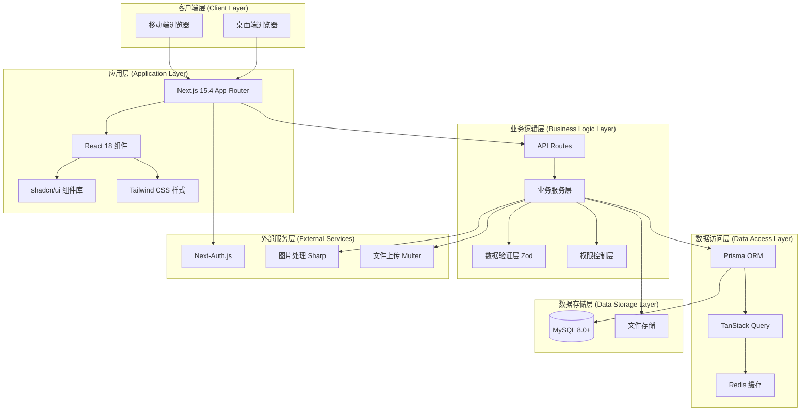
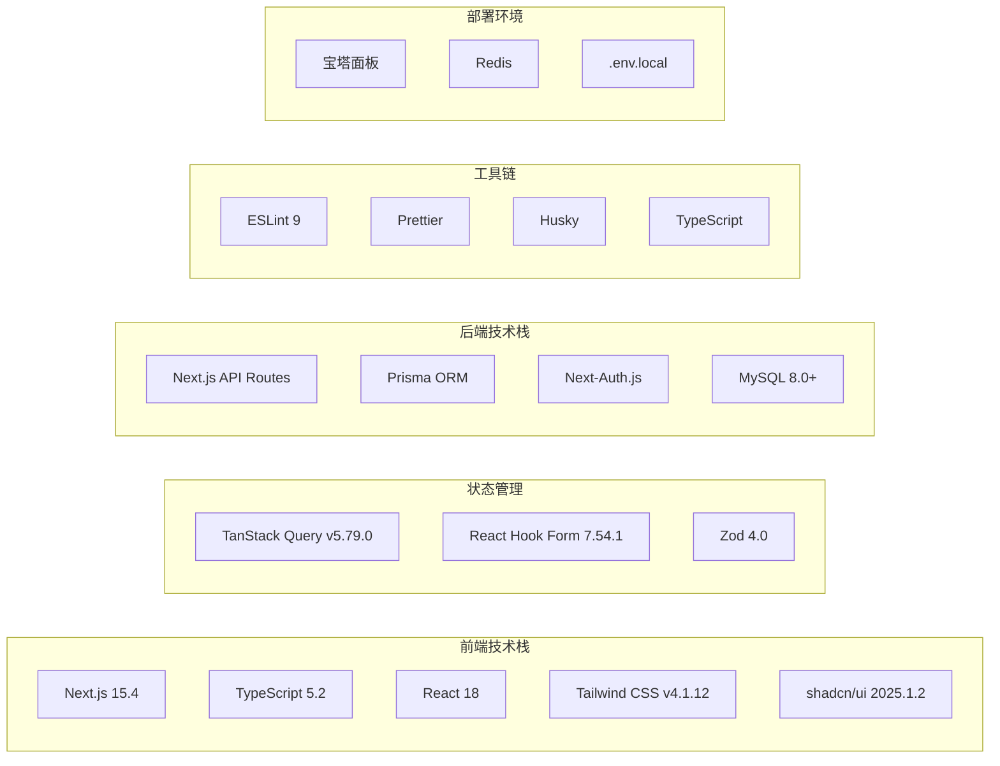
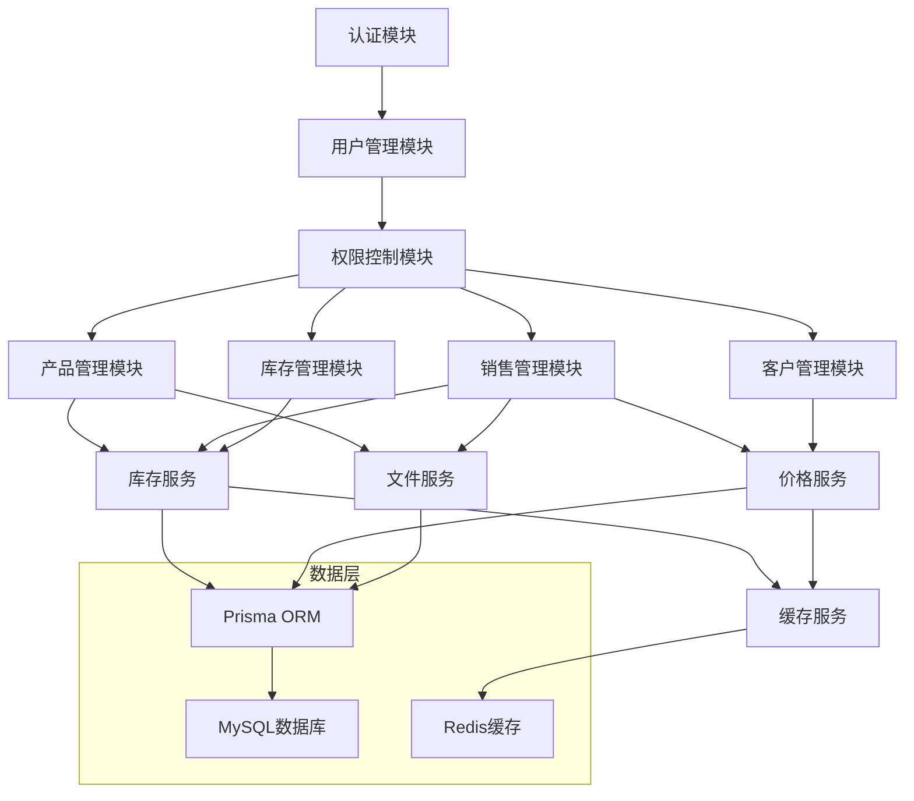
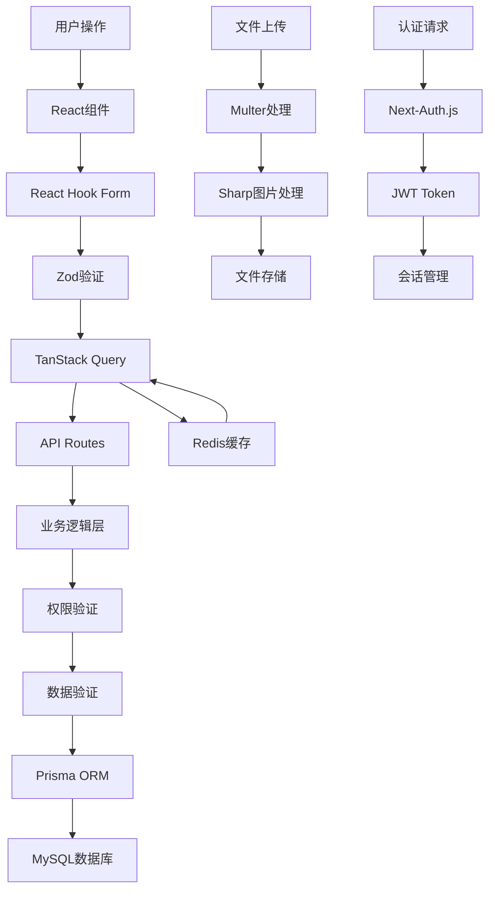
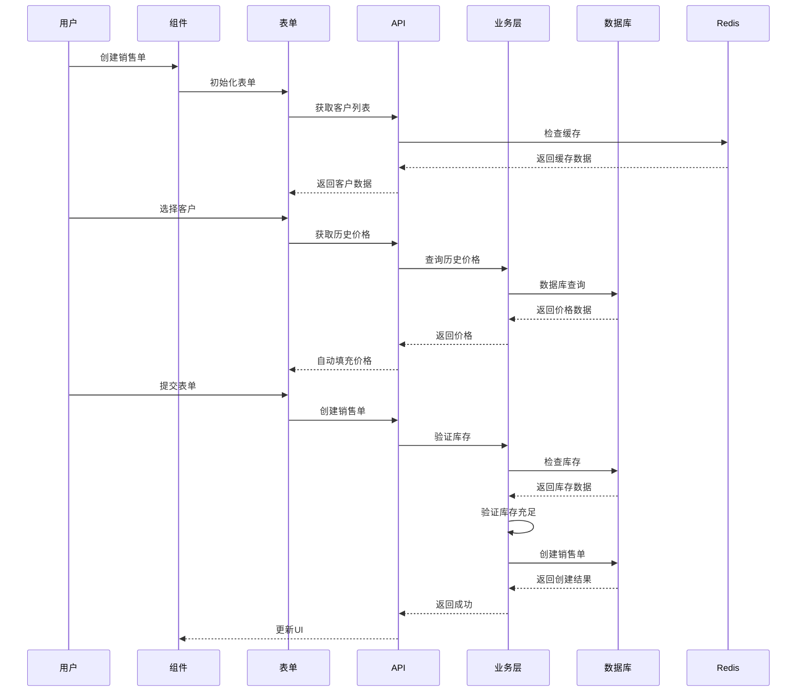
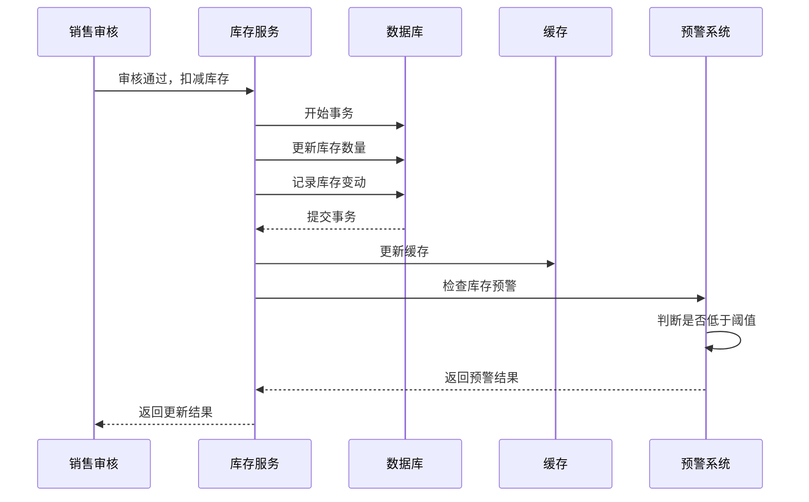

# 库存管理工具 - 系统架构设计文档 (DESIGN)

## 1. 整体架构设计

### 1.1 系统架构图



### 1.2 技术栈架构



## 2. 系统分层设计

### 2.1 表现层 (Presentation Layer)

#### 2.1.1 组件架构

```
├── app/                    # Next.js 15.4 App Router
│   ├── (auth)/            # 认证相关页面
│   ├── dashboard/         # 仪表盘
│   ├── sales/             # 销售管理
│   ├── inventory/         # 库存管理
│   ├── customers/         # 客户管理
│   └── api/               # API Routes
├── components/            # 共享组件
│   ├── ui/                # shadcn/ui 基础组件
│   ├── forms/             # 表单组件
│   ├── layout/            # 布局组件
│   └── business/          # 业务组件
└── lib/                   # 工具库
    ├── auth.ts            # 认证配置
    ├── db.ts              # 数据库配置
    ├── utils.ts           # 工具函数
    └── validations.ts     # 数据验证
```

#### 2.1.2 响应式设计策略

- **移动优先**: 基于Tailwind CSS的响应式断点
- **触屏优化**: 最小触摸目标44px，手势支持
- **自适应布局**: 支持sm(640px)、md(768px)、lg(1024px)、xl(1280px)

### 2.2 业务逻辑层 (Business Logic Layer)

#### 2.2.1 核心业务模块

```typescript
// 业务服务架构
interface BusinessServices {
  userService: UserService; // 用户管理
  productService: ProductService; // 产品管理
  salesService: SalesService; // 销售管理
  inventoryService: InventoryService; // 库存管理
  customerService: CustomerService; // 客户管理
  authService: AuthService; // 认证服务
}

// 权限控制
interface PermissionService {
  checkRole(userId: string, role: Role): boolean;
  checkPermission(userId: string, resource: string, action: string): boolean;
  validateAccess(req: Request): Promise<User | null>;
}
```

#### 2.2.2 业务规则引擎

```typescript
// 库存业务规则
class InventoryRules {
  // 严格库存控制：不允许负库存销售
  validateStockAvailability(productId: string, quantity: number): boolean;

  // 库存预警检查
  checkLowStockAlert(productId: string): boolean;

  // 自动出库规则
  processAutoOutbound(salesOrderId: string): Promise<void>;
}

// 价格业务规则
class PricingRules {
  // 历史价格自动填充
  getLastPrice(customerId: string, productId: string): Promise<number | null>;

  // 价格验证
  validatePrice(price: number, productId: string): boolean;
}
```

### 2.3 数据访问层 (Data Access Layer)

#### 2.3.1 Prisma ORM 架构

```typescript
// Prisma Client 配置
interface PrismaService {
  user: UserRepository;
  product: ProductRepository;
  customer: CustomerRepository;
  salesOrder: SalesOrderRepository;
  inventory: InventoryRepository;
}

// 仓储模式实现
interface Repository<T> {
  findById(id: string): Promise<T | null>;
  findMany(where?: any): Promise<T[]>;
  create(data: any): Promise<T>;
  update(id: string, data: any): Promise<T>;
  delete(id: string): Promise<void>;
}
```

#### 2.3.2 缓存策略

```typescript
// Redis 缓存配置
interface CacheService {
  // 产品信息缓存（30分钟）
  getProduct(id: string): Promise<Product | null>;
  setProduct(id: string, product: Product): Promise<void>;

  // 客户历史价格缓存（1小时）
  getCustomerPrice(
    customerId: string,
    productId: string
  ): Promise<number | null>;

  // 库存数量缓存（5分钟）
  getStock(productId: string): Promise<number | null>;

  // 用户会话缓存
  getUserSession(sessionId: string): Promise<User | null>;
}
```

### 2.4 数据存储层 (Data Storage Layer)

#### 2.4.1 MySQL 数据库设计

- **连接池配置**: 最大连接数50，超时30秒
- **事务管理**: 使用Prisma事务确保数据一致性
- **索引策略**: 基于查询频率和性能要求设计索引
- **备份策略**: 每日自动备份，保留30天

#### 2.4.2 文件存储设计

```typescript
// 文件存储服务
interface FileStorageService {
  // 产品图片存储
  uploadProductImage(file: File): Promise<string>;

  // 单据图片生成和存储
  generateOrderImage(orderId: string): Promise<string>;

  // 文件压缩和优化
  optimizeImage(filePath: string): Promise<string>;
}
```

## 3. 核心组件设计

### 3.1 认证组件

#### 3.1.1 Next-Auth.js 配置

```typescript
// auth.config.ts
export const authConfig = {
  providers: [
    CredentialsProvider({
      async authorize(credentials) {
        // 用户验证逻辑
        const user = await validateUser(credentials);
        return user ? { id: user.id, role: user.role } : null;
      },
    }),
  ],
  callbacks: {
    jwt: ({ token, user }) => {
      if (user) token.role = user.role;
      return token;
    },
    session: ({ session, token }) => {
      session.user.role = token.role;
      return session;
    },
  },
  pages: {
    signIn: '/auth/signin',
    error: '/auth/error',
  },
};
```

#### 3.1.2 权限控制中间件

```typescript
// middleware.ts
export function middleware(request: NextRequest) {
  const token = request.nextauth.token;

  // 路由权限检查
  if (request.nextUrl.pathname.startsWith('/admin')) {
    if (token?.role !== 'ADMIN') {
      return NextResponse.redirect(new URL('/unauthorized', request.url));
    }
  }

  return NextResponse.next();
}
```

### 3.2 状态管理组件

#### 3.2.1 TanStack Query 配置

```typescript
// query-client.ts
export const queryClient = new QueryClient({
  defaultOptions: {
    queries: {
      staleTime: 5 * 60 * 1000, // 5分钟
      cacheTime: 10 * 60 * 1000, // 10分钟
      retry: 3,
      refetchOnWindowFocus: false,
    },
    mutations: {
      retry: 1,
    },
  },
});

// 查询钩子示例
export const useProducts = () => {
  return useQuery({
    queryKey: ['products'],
    queryFn: () => fetch('/api/products').then(res => res.json()),
    staleTime: 5 * 60 * 1000,
  });
};
```

#### 3.2.2 表单状态管理

```typescript
// 使用React Hook Form + Zod
const salesOrderSchema = z.object({
  customerId: z.string().min(1, '请选择客户'),
  items: z
    .array(
      z.object({
        productId: z.string().min(1, '请选择产品'),
        quantity: z.number().min(1, '数量必须大于0'),
        price: z.number().min(0, '价格不能为负数'),
      })
    )
    .min(1, '至少添加一个产品'),
});

type SalesOrderForm = z.infer<typeof salesOrderSchema>;

export const useSalesOrderForm = () => {
  return useForm<SalesOrderForm>({
    resolver: zodResolver(salesOrderSchema),
    defaultValues: {
      customerId: '',
      items: [],
    },
  });
};
```

### 3.3 UI组件体系

#### 3.3.1 基础组件 (shadcn/ui)

```typescript
// 严格使用shadcn/ui组件，禁止自定义重复组件
import { Button } from '@/components/ui/button';
import { Input } from '@/components/ui/input';
import { Select } from '@/components/ui/select';
import { Table } from '@/components/ui/table';
import { Card } from '@/components/ui/card';
import { Badge } from '@/components/ui/badge';
import { Alert } from '@/components/ui/alert';
```

#### 3.3.2 业务组件

```typescript
// 瓷砖行业特色组件
interface TileColorDisplayProps {
  colorCode: string;
  colorName: string;
  size?: 'sm' | 'md' | 'lg';
}

interface StockStatusProps {
  current: number;
  threshold: number;
  unit: string;
}

interface ProductSpecProps {
  length: number;
  width: number;
  thickness: number;
  piecesPerBox: number;
  weightPerBox: number;
}
```

## 4. 模块依赖关系

### 4.1 模块依赖图



### 4.2 模块接口定义

#### 4.2.1 产品管理模块

```typescript
interface ProductModule {
  // 产品CRUD操作
  createProduct(data: CreateProductDto): Promise<Product>;
  updateProduct(id: string, data: UpdateProductDto): Promise<Product>;
  deleteProduct(id: string): Promise<void>;
  getProduct(id: string): Promise<Product | null>;
  getProducts(filter: ProductFilter): Promise<Product[]>;

  // 瓷砖特色功能
  getProductsByColor(colorCode: string): Promise<Product[]>;
  getProductsBySpec(spec: TileSpec): Promise<Product[]>;
  updateStock(id: string, quantity: number): Promise<void>;
}
```

#### 4.2.2 销售管理模块

```typescript
interface SalesModule {
  // 销售单管理
  createSalesOrder(data: CreateSalesOrderDto): Promise<SalesOrder>;
  updateSalesOrder(id: string, data: UpdateSalesOrderDto): Promise<SalesOrder>;
  approveSalesOrder(id: string): Promise<SalesOrder>;
  cancelSalesOrder(id: string): Promise<SalesOrder>;

  // 库存检查
  validateStock(items: SalesOrderItem[]): Promise<StockValidationResult>;

  // 价格管理
  getHistoricalPrice(
    customerId: string,
    productId: string
  ): Promise<number | null>;
  updateCustomerPrice(
    customerId: string,
    productId: string,
    price: number
  ): Promise<void>;
}
```

#### 4.2.3 库存管理模块

```typescript
interface InventoryModule {
  // 库存操作
  addStock(productId: string, quantity: number, reason: string): Promise<void>;
  reduceStock(
    productId: string,
    quantity: number,
    reason: string
  ): Promise<void>;
  adjustStock(
    productId: string,
    quantity: number,
    reason: string
  ): Promise<void>;

  // 库存查询
  getCurrentStock(productId: string): Promise<number>;
  getLowStockProducts(threshold?: number): Promise<Product[]>;
  getStockHistory(productId: string): Promise<StockHistory[]>;

  // 库存预警
  checkLowStockAlert(): Promise<Product[]>;
  setStockThreshold(productId: string, threshold: number): Promise<void>;
}
```

## 5. 接口契约定义

### 5.1 API 接口规范

#### 5.1.1 RESTful API 设计原则

```typescript
// API 路由结构
/api/auth/*           # 认证相关
/api/users/*          # 用户管理
/api/products/*       # 产品管理
/api/customers/*      # 客户管理
/api/sales/*          # 销售管理
/api/inventory/*      # 库存管理
/api/upload/*         # 文件上传
```

#### 5.1.2 统一响应格式

```typescript
// 成功响应
interface ApiResponse<T> {
  success: true;
  data: T;
  message?: string;
  timestamp: string;
}

// 错误响应
interface ApiError {
  success: false;
  error: {
    code: string;
    message: string;
    details?: any;
  };
  timestamp: string;
}

// 分页响应
interface PaginatedResponse<T> {
  success: true;
  data: T[];
  pagination: {
    page: number;
    limit: number;
    total: number;
    totalPages: number;
  };
}
```

#### 5.1.3 核心API接口

**产品管理API**

```typescript
// GET /api/products
interface GetProductsQuery {
  page?: number;
  limit?: number;
  search?: string;
  colorCode?: string;
  category?: string;
}

// POST /api/products
interface CreateProductDto {
  name: string;
  code: string;
  category: string;
  colorCode: string;
  colorName: string;
  spec: {
    length: number;
    width: number;
    thickness: number;
  };
  packaging: {
    piecesPerBox: number;
    weightPerBox: number;
  };
  price: number;
  unit: string;
  threshold: number;
}
```

**销售管理API**

```typescript
// POST /api/sales/orders
interface CreateSalesOrderDto {
  customerId: string;
  items: {
    productId: string;
    quantity: number;
    price: number;
    unit: string;
  }[];
  notes?: string;
}

// PUT /api/sales/orders/:id/approve
interface ApproveSalesOrderDto {
  approvedBy: string;
  approvedAt: string;
  notes?: string;
}
```

**库存管理API**

```typescript
// POST /api/inventory/inbound
interface CreateInboundDto {
  items: {
    productId: string;
    quantity: number;
    productionDate?: string;
    batchNumber?: string;
  }[];
  supplier?: string;
  notes?: string;
}

// GET /api/inventory/alerts
interface StockAlert {
  productId: string;
  productName: string;
  currentStock: number;
  threshold: number;
  unit: string;
}
```

### 5.2 数据传输对象 (DTO)

#### 5.2.1 请求DTO

```typescript
// 用户相关
interface LoginDto {
  username: string;
  password: string;
}

interface CreateUserDto {
  username: string;
  password: string;
  role: 'ADMIN' | 'SALES';
  name: string;
  email?: string;
}

// 客户相关
interface CreateCustomerDto {
  name: string;
  phone: string;
  address?: string;
  contactPerson?: string;
  notes?: string;
}
```

#### 5.2.2 响应DTO

```typescript
// 产品响应
interface ProductResponseDto {
  id: string;
  name: string;
  code: string;
  category: string;
  colorCode: string;
  colorName: string;
  spec: TileSpec;
  packaging: PackagingInfo;
  price: number;
  unit: string;
  currentStock: number;
  threshold: number;
  createdAt: string;
  updatedAt: string;
}

// 销售单响应
interface SalesOrderResponseDto {
  id: string;
  orderNumber: string;
  customer: CustomerSummary;
  items: SalesOrderItemDto[];
  totalAmount: number;
  status: 'DRAFT' | 'APPROVED' | 'SHIPPED' | 'COMPLETED' | 'CANCELLED';
  createdBy: UserSummary;
  createdAt: string;
  approvedAt?: string;
  shippedAt?: string;
}
```

## 6. 数据流向设计

### 6.1 数据流向图



### 6.2 关键数据流

#### 6.2.1 销售单创建流程



#### 6.2.2 库存更新流程



## 7. 异常处理策略

### 7.1 错误分类和处理

#### 7.1.1 客户端错误处理

```typescript
// 全局错误边界
class GlobalErrorBoundary extends React.Component {
  componentDidCatch(error: Error, errorInfo: ErrorInfo) {
    // 记录错误日志
    console.error('Global error:', error, errorInfo);

    // 发送错误报告
    this.reportError(error, errorInfo);
  }

  render() {
    if (this.state.hasError) {
      return <ErrorFallback />;
    }
    return this.props.children;
  }
}

// TanStack Query 错误处理
const queryClient = new QueryClient({
  defaultOptions: {
    queries: {
      onError: (error) => {
        toast.error(`查询失败: ${error.message}`);
      }
    },
    mutations: {
      onError: (error) => {
        toast.error(`操作失败: ${error.message}`);
      }
    }
  }
});
```

#### 7.1.2 服务端错误处理

```typescript
// API 错误处理中间件
export function withErrorHandler(handler: NextApiHandler) {
  return async (req: NextApiRequest, res: NextApiResponse) => {
    try {
      await handler(req, res);
    } catch (error) {
      console.error('API Error:', error);

      if (error instanceof ValidationError) {
        return res.status(400).json({
          success: false,
          error: {
            code: 'VALIDATION_ERROR',
            message: error.message,
            details: error.details,
          },
        });
      }

      if (error instanceof AuthenticationError) {
        return res.status(401).json({
          success: false,
          error: {
            code: 'AUTHENTICATION_ERROR',
            message: '认证失败',
          },
        });
      }

      // 未知错误
      return res.status(500).json({
        success: false,
        error: {
          code: 'INTERNAL_ERROR',
          message: '服务器内部错误',
        },
      });
    }
  };
}
```

#### 7.1.3 业务异常处理

```typescript
// 自定义业务异常
class BusinessError extends Error {
  constructor(
    public code: string,
    message: string,
    public details?: any
  ) {
    super(message);
    this.name = 'BusinessError';
  }
}

// 库存不足异常
class InsufficientStockError extends BusinessError {
  constructor(productName: string, available: number, required: number) {
    super(
      'INSUFFICIENT_STOCK',
      `${productName} 库存不足，当前库存：${available}，需要：${required}`,
      { available, required }
    );
  }
}

// 权限不足异常
class PermissionDeniedError extends BusinessError {
  constructor(action: string) {
    super('PERMISSION_DENIED', `没有权限执行操作：${action}`);
  }
}
```

### 7.2 重试和恢复策略

#### 7.2.1 网络请求重试

```typescript
// TanStack Query 重试配置
const retryConfig = {
  retry: (failureCount: number, error: any) => {
    // 网络错误重试3次
    if (error.code === 'NETWORK_ERROR' && failureCount < 3) {
      return true;
    }

    // 服务器错误重试1次
    if (error.status >= 500 && failureCount < 1) {
      return true;
    }

    return false;
  },
  retryDelay: (attemptIndex: number) =>
    Math.min(1000 * 2 ** attemptIndex, 30000),
};
```

#### 7.2.2 数据库事务回滚

```typescript
// Prisma 事务处理
export async function createSalesOrderWithStock(data: CreateSalesOrderDto) {
  return await prisma.$transaction(async tx => {
    // 1. 创建销售单
    const salesOrder = await tx.salesOrder.create({
      data: {
        customerId: data.customerId,
        status: 'DRAFT',
      },
    });

    // 2. 创建销售明细并检查库存
    for (const item of data.items) {
      const product = await tx.product.findUnique({
        where: { id: item.productId },
      });

      if (!product || product.stock < item.quantity) {
        throw new InsufficientStockError(
          product?.name || '未知产品',
          product?.stock || 0,
          item.quantity
        );
      }

      // 创建明细
      await tx.salesOrderItem.create({
        data: {
          salesOrderId: salesOrder.id,
          productId: item.productId,
          quantity: item.quantity,
          price: item.price,
        },
      });

      // 预扣库存
      await tx.product.update({
        where: { id: item.productId },
        data: {
          stock: {
            decrement: item.quantity,
          },
        },
      });
    }

    return salesOrder;
  });
}
```

## 8. 安全架构设计

### 8.1 认证和授权

#### 8.1.1 JWT Token 管理

```typescript
// JWT 配置
const jwtConfig = {
  secret: process.env.NEXTAUTH_SECRET,
  maxAge: 24 * 60 * 60, // 24小时
  algorithm: 'HS256',
};

// Token 刷新策略
interface TokenRefreshService {
  refreshToken(token: string): Promise<string>;
  validateToken(token: string): Promise<boolean>;
  revokeToken(token: string): Promise<void>;
}
```

#### 8.1.2 权限控制矩阵

```typescript
// 权限定义
const PERMISSIONS = {
  PRODUCT: {
    CREATE: 'product:create',
    READ: 'product:read',
    UPDATE: 'product:update',
    DELETE: 'product:delete',
  },
  SALES: {
    CREATE: 'sales:create',
    READ: 'sales:read',
    UPDATE: 'sales:update',
    APPROVE: 'sales:approve',
  },
  CUSTOMER: {
    CREATE: 'customer:create',
    READ: 'customer:read',
    UPDATE: 'customer:update',
  },
} as const;

// 角色权限映射
const ROLE_PERMISSIONS = {
  ADMIN: Object.values(PERMISSIONS).flatMap(p => Object.values(p)),
  SALES: [
    PERMISSIONS.PRODUCT.READ,
    PERMISSIONS.SALES.CREATE,
    PERMISSIONS.SALES.READ,
    PERMISSIONS.CUSTOMER.CREATE,
    PERMISSIONS.CUSTOMER.READ,
    PERMISSIONS.CUSTOMER.UPDATE,
  ],
};
```

### 8.2 数据安全

#### 8.2.1 输入验证和清理

```typescript
// Zod 验证模式
const sanitizeString = z.string().transform(val => {
  // 移除HTML标签
  return val.replace(/<[^>]*>/g, '').trim();
});

const productSchema = z.object({
  name: sanitizeString.min(1).max(100),
  code: z.string().regex(/^[A-Z0-9-]+$/, '产品编码格式不正确'),
  price: z.number().min(0).max(999999.99),
  colorCode: z.string().regex(/^#[0-9A-Fa-f]{6}$/, '颜色代码格式不正确'),
});
```

#### 8.2.2 SQL注入防护

```typescript
// Prisma 自动防护SQL注入
// 所有查询都通过Prisma ORM，禁止直接SQL
const products = await prisma.product.findMany({
  where: {
    name: {
      contains: searchTerm, // 自动转义
      mode: 'insensitive',
    },
  },
});
```

### 8.3 API安全

#### 8.3.1 速率限制

```typescript
// API 速率限制
interface RateLimitConfig {
  windowMs: number; // 时间窗口
  maxRequests: number; // 最大请求数
  skipSuccessfulRequests: boolean;
}

const rateLimitConfig: Record<string, RateLimitConfig> = {
  '/api/auth/login': {
    windowMs: 15 * 60 * 1000, // 15分钟
    maxRequests: 5, // 最多5次登录尝试
    skipSuccessfulRequests: true,
  },
  '/api/products': {
    windowMs: 60 * 1000, // 1分钟
    maxRequests: 100, // 最多100次请求
    skipSuccessfulRequests: false,
  },
};
```

#### 8.3.2 CORS配置

```typescript
// Next.js CORS 配置
const corsConfig = {
  origin:
    process.env.NODE_ENV === 'production'
      ? ['https://yourdomain.com']
      : ['http://localhost:3000'],
  methods: ['GET', 'POST', 'PUT', 'DELETE'],
  allowedHeaders: ['Content-Type', 'Authorization'],
  credentials: true,
};
```

## 9. 性能优化策略

### 9.1 前端性能优化

#### 9.1.1 代码分割和懒加载

```typescript
// Next.js 动态导入
const ProductManagement = dynamic(() => import('@/components/ProductManagement'), {
  loading: () => <ProductManagementSkeleton />,
  ssr: false
});

// React 懒加载
const SalesOrderForm = lazy(() => import('@/components/SalesOrderForm'));
```

#### 9.1.2 图片优化

```typescript
// Next.js Image 组件
import Image from 'next/image';

<Image
  src={product.imageUrl}
  alt={product.name}
  width={300}
  height={200}
  placeholder="blur"
  blurDataURL="data:image/jpeg;base64,/9j/4AAQSkZJRgABAQAAAQ..."
  sizes="(max-width: 768px) 100vw, (max-width: 1200px) 50vw, 33vw"
/>
```

#### 9.1.3 缓存策略

```typescript
// TanStack Query 缓存配置
const cacheConfig = {
  // 产品列表缓存30分钟
  products: {
    staleTime: 30 * 60 * 1000,
    cacheTime: 60 * 60 * 1000,
  },
  // 客户信息缓存1小时
  customers: {
    staleTime: 60 * 60 * 1000,
    cacheTime: 2 * 60 * 60 * 1000,
  },
  // 库存信息缓存5分钟
  inventory: {
    staleTime: 5 * 60 * 1000,
    cacheTime: 10 * 60 * 1000,
  },
};
```

### 9.2 后端性能优化

#### 9.2.1 数据库查询优化

```typescript
// Prisma 查询优化
const optimizedProductQuery = await prisma.product.findMany({
  select: {
    id: true,
    name: true,
    code: true,
    price: true,
    stock: true,
    // 只选择需要的字段
  },
  where: {
    stock: {
      gt: 0, // 只查询有库存的产品
    },
  },
  orderBy: {
    updatedAt: 'desc',
  },
  take: 20, // 分页限制
  skip: (page - 1) * 20,
});
```

#### 9.2.2 Redis 缓存策略

```typescript
// 缓存服务实现
class CacheService {
  private redis: Redis;

  async getOrSet<T>(
    key: string,
    fetcher: () => Promise<T>,
    ttl: number = 300
  ): Promise<T> {
    const cached = await this.redis.get(key);
    if (cached) {
      return JSON.parse(cached);
    }

    const data = await fetcher();
    await this.redis.setex(key, ttl, JSON.stringify(data));
    return data;
  }

  async invalidatePattern(pattern: string): Promise<void> {
    const keys = await this.redis.keys(pattern);
    if (keys.length > 0) {
      await this.redis.del(...keys);
    }
  }
}
```

### 9.3 监控和分析

#### 9.3.1 性能监控

```typescript
// 性能监控中间件
export function performanceMonitor(
  req: NextApiRequest,
  res: NextApiResponse,
  next: NextFunction
) {
  const start = Date.now();

  res.on('finish', () => {
    const duration = Date.now() - start;

    // 记录慢查询
    if (duration > 1000) {
      console.warn(`Slow API: ${req.url} took ${duration}ms`);
    }

    // 发送监控数据
    sendMetrics({
      endpoint: req.url,
      method: req.method,
      duration,
      statusCode: res.statusCode,
    });
  });

  next();
}
```

#### 9.3.2 错误监控

```typescript
// 错误监控服务
interface ErrorMonitoringService {
  captureException(error: Error, context?: any): void;
  captureMessage(message: string, level: 'info' | 'warning' | 'error'): void;
  setUser(user: { id: string; email?: string }): void;
}
```

## 10. 部署架构

### 10.1 宝塔面板部署配置

#### 10.1.1 环境配置

```bash
# Node.js 环境
Node.js 版本: 18.x LTS
PM2 进程管理器
Nginx 反向代理
MySQL 8.0+
Redis 6.x
```

#### 10.1.2 Nginx 配置

```nginx
server {
    listen 80;
    server_name yourdomain.com;

    # 重定向到HTTPS
    return 301 https://$server_name$request_uri;
}

server {
    listen 443 ssl http2;
    server_name yourdomain.com;

    # SSL 配置
    ssl_certificate /path/to/cert.pem;
    ssl_certificate_key /path/to/key.pem;

    # 静态文件缓存
    location /_next/static/ {
        expires 1y;
        add_header Cache-Control "public, immutable";
    }

    # API 代理
    location /api/ {
        proxy_pass http://localhost:3000;
        proxy_http_version 1.1;
        proxy_set_header Upgrade $http_upgrade;
        proxy_set_header Connection 'upgrade';
        proxy_set_header Host $host;
        proxy_set_header X-Real-IP $remote_addr;
        proxy_set_header X-Forwarded-For $proxy_add_x_forwarded_for;
        proxy_set_header X-Forwarded-Proto $scheme;
        proxy_cache_bypass $http_upgrade;
    }

    # Next.js 应用
    location / {
        proxy_pass http://localhost:3000;
        proxy_http_version 1.1;
        proxy_set_header Upgrade $http_upgrade;
        proxy_set_header Connection 'upgrade';
        proxy_set_header Host $host;
        proxy_cache_bypass $http_upgrade;
    }
}
```

#### 10.1.3 PM2 配置

```javascript
// ecosystem.config.js
module.exports = {
  apps: [
    {
      name: 'inventory-management',
      script: 'npm',
      args: 'start',
      cwd: '/www/wwwroot/inventory-management',
      instances: 2,
      exec_mode: 'cluster',
      env: {
        NODE_ENV: 'production',
        PORT: 3000,
      },
      error_file: './logs/err.log',
      out_file: './logs/out.log',
      log_file: './logs/combined.log',
      time: true,
      max_memory_restart: '1G',
      node_args: '--max-old-space-size=1024',
    },
  ],
};
```

### 10.2 数据库配置

#### 10.2.1 MySQL 配置优化

```ini
# my.cnf
[mysqld]
innodb_buffer_pool_size = 1G
innodb_log_file_size = 256M
innodb_flush_log_at_trx_commit = 2
innodb_flush_method = O_DIRECT
max_connections = 200
query_cache_size = 64M
query_cache_type = 1
```

#### 10.2.2 Redis 配置

```conf
# redis.conf
maxmemory 512mb
maxmemory-policy allkeys-lru
save 900 1
save 300 10
save 60 10000
```

### 10.3 监控和日志

#### 10.3.1 日志配置

```typescript
// logger.ts
import winston from 'winston';

export const logger = winston.createLogger({
  level: 'info',
  format: winston.format.combine(
    winston.format.timestamp(),
    winston.format.errors({ stack: true }),
    winston.format.json()
  ),
  defaultMeta: { service: 'inventory-management' },
  transports: [
    new winston.transports.File({ filename: 'logs/error.log', level: 'error' }),
    new winston.transports.File({ filename: 'logs/combined.log' }),
    new winston.transports.Console({
      format: winston.format.simple(),
    }),
  ],
});
```

#### 10.3.2 健康检查

```typescript
// pages/api/health.ts
export default async function handler(
  req: NextApiRequest,
  res: NextApiResponse
) {
  try {
    // 检查数据库连接
    await prisma.$queryRaw`SELECT 1`;

    // 检查Redis连接
    await redis.ping();

    res.status(200).json({
      status: 'healthy',
      timestamp: new Date().toISOString(),
      services: {
        database: 'connected',
        cache: 'connected',
      },
    });
  } catch (error) {
    res.status(503).json({
      status: 'unhealthy',
      error: error.message,
    });
  }
}
```

## 11. 总结

### 11.1 架构特点

- **现代化技术栈**: Next.js 15.4 + TypeScript + MySQL + Prisma
- **类型安全**: 全栈TypeScript，Prisma类型生成
- **性能优化**: Redis缓存，TanStack Query状态管理
- **移动友好**: Tailwind CSS响应式设计
- **组件化**: shadcn/ui组件库，避免重复开发
- **安全可靠**: 完整的认证授权，输入验证，错误处理

### 11.2 关键决策

- **严格技术栈执行**: 禁止偏离既定技术选型
- **禁止重复造轮子**: 优先使用成熟库和组件
- **业务特色突出**: 瓷砖行业特有功能设计
- **移动端优先**: 响应式设计，触屏优化
- **性能导向**: 缓存策略，查询优化

### 11.3 下一步计划

1. **原子化阶段**: 基于本架构设计拆分具体开发任务
2. **数据库设计**: 详细的表结构和关系设计
3. **API设计**: 完整的接口文档和实现
4. **组件开发**: 基于shadcn/ui的业务组件
5. **测试策略**: 单元测试和集成测试

本架构设计为库存管理工具提供了完整的技术蓝图，确保系统的可扩展性、可维护性和高性能。
