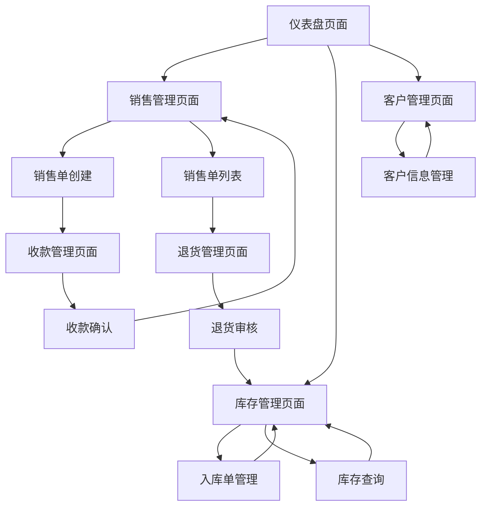

# 库存管理工具 - 产品需求文档 (PRD)

## 1. Product Overview

瓷砖行业库存管理工具，专注于销售、客户、库存等核心业务流程管理，支持移动端操作的单租户系统。
解决瓷砖行业库存管理复杂、销售流程繁琐的问题，为瓷砖经销商提供简化高效的管理工具。
目标是提升库存管理效率，简化销售流程，支持移动端随时随地操作，降低管理成本。

## 2. Core Features

### 2.1 User Roles

| Role   | Registration Method | Core Permissions                                         |
| ------ | ------------------- | -------------------------------------------------------- |
| 管理员 | 系统初始化创建      | 全部功能权限，包括用户管理、系统设置、数据查看等         |
| 销售员 | 管理员邀请创建      | 销售相关功能权限，可创建销售单、查看自己的数据、确认收款 |

### 2.2 Feature Module

我们的库存管理工具包含以下主要页面：

1. **仪表盘页面**：数据概览、库存预警、待办事项
2. **销售管理页面**：销售单创建、列表查看、状态管理
3. **库存管理页面**：入库单管理、库存查询、库存调整
4. **产品管理页面**：产品信息维护、色号管理、规格设置
5. **客户管理页面**：客户信息管理、价格历史、快速搜索
6. **收款管理页面**：收款记录、应收账款、收款确认
7. **退货管理页面**：退货单创建、审核流程、退款处理
8. **用户管理页面**：用户权限、角色分配、登录管理

### 2.3 Page Details

| Page Name    | Module Name  | Feature description                                            |
| ------------ | ------------ | -------------------------------------------------------------- |
| 仪表盘页面   | 数据概览     | 显示销售额、库存总量、待收款等关键指标，支持时间筛选           |
| 仪表盘页面   | 库存预警     | 显示低库存产品红色警告，支持设置预警阈值                       |
| 仪表盘页面   | 待办事项     | 显示待审核退货单、逾期收款等需要处理的事项                     |
| 销售管理页面 | 销售单创建   | 选择客户、添加产品、设置价格、提交确认，支持快速新增客户和产品 |
| 销售管理页面 | 销售单列表   | 查看销售单列表，支持状态筛选、日期筛选、客户搜索               |
| 销售管理页面 | 状态管理     | 销售单状态流转：草稿→已确认→已发货→已完成                      |
| 库存管理页面 | 入库单管理   | 创建入库单，支持正常入库、退货入库、调整入库三种类型           |
| 库存管理页面 | 库存查询     | 按产品、色号、生产日期查询库存，显示实时库存数量               |
| 库存管理页面 | 库存调整     | 直接调整库存数量，记录调整原因和操作人员                       |
| 产品管理页面 | 产品信息维护 | 添加、编辑产品基础信息，包括编号、名称、规格等                 |
| 产品管理页面 | 色号管理     | 为产品设置多个色号和生产日期，独立管理库存                     |
| 产品管理页面 | 规格设置     | 设置产品规格、单位、每件片数、重量等属性                       |
| 客户管理页面 | 客户信息管理 | 添加、编辑客户基础信息，包括姓名、手机号、地址                 |
| 客户管理页面 | 价格历史     | 查看客户历史购买价格，新建销售单时自动带出                     |
| 客户管理页面 | 快速搜索     | 支持姓名、手机号、地址模糊搜索，按匹配度排序                   |
| 收款管理页面 | 收款记录     | 记录收款明细，支持微信、银行转账、扫码等方式                   |
| 收款管理页面 | 应收账款     | 按客户统计应收金额，支持账龄分析                               |
| 收款管理页面 | 收款确认     | 确认收款操作，更新销售单收款状态                               |
| 退货管理页面 | 退货单创建   | 选择原销售单，创建退货申请，填写退货原因                       |
| 退货管理页面 | 审核流程     | 管理员审核退货申请，通过后自动恢复库存                         |
| 退货管理页面 | 退款处理     | 处理退款操作，支持现金退款和扫码退款                           |
| 用户管理页面 | 用户权限     | 管理用户角色和权限分配                                         |
| 用户管理页面 | 登录管理     | 用户登录、注册、密码重置功能                                   |

## 3. Core Process

### 管理员流程

管理员可以执行所有操作，包括用户管理、系统设置、数据查看等。主要流程包括：创建销售单→审核确认→发货确认→收款确认→完成订单。同时负责退货审核、库存管理、用户权限分配等管理工作。

### 销售员流程

销售员主要负责销售相关操作，包括：创建销售单→提交确认→跟进发货→确认收款。可以查看自己创建的销售数据，管理客户信息，处理日常销售业务。

## 4. User Interface Design

### 4.1 Design Style

- **主色调**：蓝色系 (#2563eb) 作为主色，白色 (#ffffff) 作为背景色
- **辅助色**：灰色系 (#64748b) 用于次要信息，红色 (#dc2626) 用于警告和错误
- **按钮样式**：圆角按钮，主按钮使用蓝色背景，次要按钮使用灰色边框
- **字体**：系统默认字体，标题使用16-20px，正文使用14px，小字使用12px
- **布局风格**：卡片式布局，顶部导航栏，左侧菜单栏（桌面端）
- **图标风格**：使用Lucide图标库，简洁线性风格，与shadcn/ui保持一致

### 4.2 Page Design Overview

| Page Name    | Module Name  | UI Elements                                              |
| ------------ | ------------ | -------------------------------------------------------- |
| 仪表盘页面   | 数据概览     | 卡片式数据展示，使用蓝色主题，数字突出显示，支持图表展示 |
| 仪表盘页面   | 库存预警     | 红色警告图标，列表式展示，支持点击查看详情               |
| 销售管理页面 | 销售单创建   | 表单式布局，分步骤填写，客户和产品支持搜索选择           |
| 销售管理页面 | 销售单列表   | 表格式展示，支持筛选和排序，状态用不同颜色标识           |
| 库存管理页面 | 入库单管理   | 表单+列表组合，入库类型用标签区分，支持批量操作          |
| 产品管理页面 | 产品信息维护 | 表单式编辑，图片上传支持拖拽，规格信息分组展示           |
| 客户管理页面 | 客户信息管理 | 卡片+表格混合布局，搜索框突出显示，支持快速操作          |
| 收款管理页面 | 收款记录     | 时间线式展示，收款方式用图标标识，金额突出显示           |
| 退货管理页面 | 退货单创建   | 向导式流程，原销售单信息只读展示，退货原因必填           |

### 4.3 Responsiveness

系统采用移动端优先的响应式设计，支持桌面端、平板端和手机端。移动端优化触屏操作，简化界面元素，保持核心功能完整性。桌面端提供更丰富的数据展示和批量操作功能。
