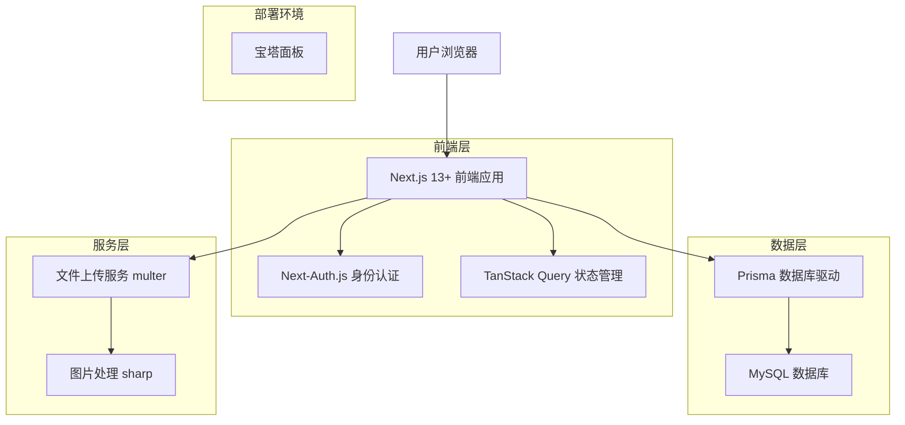
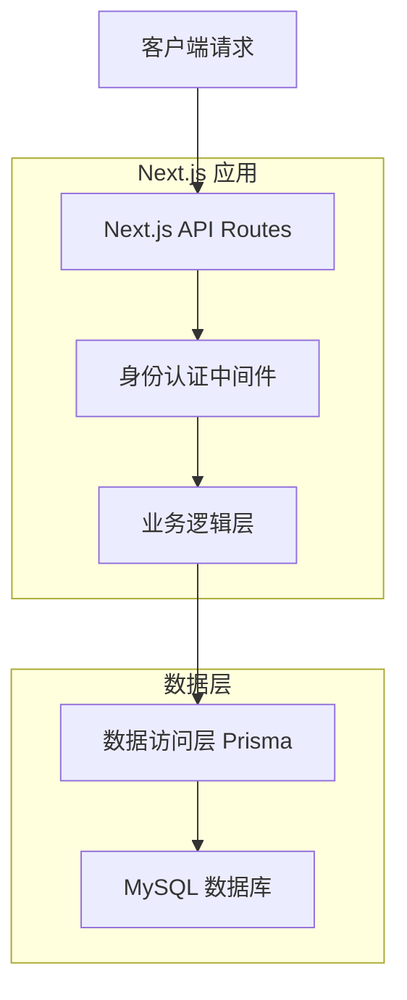
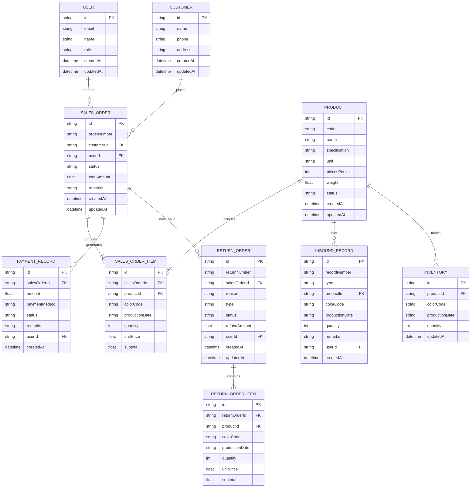

# 库存管理工具 - 技术架构文档

## 1. Architecture design



## 2. Technology Description

- 全栈框架：Next.js 15.4 (App Router)

- 数据库：MySQL 8.0+

- 数据库驱动：Prisma

- 身份认证：Next-Auth.js

- 状态管理：TanStack Query v5.79.0

- UI组件库：Tailwind CSS v4.1.12 + shadcn/ui 2025.1.2

- 服务器管理：宝塔面板

- 文件上传：multer

- 环境管理：.env.local 文件

- <br />

- 类型定义：TypeScript 5.2

- 代码质量工具：ESLint 9 + Prettier + Husky

- 表单处理：React Hook Form7.54.1

- 图片处理：sharp

- 数据验证：Zod 4.0

### 2.3 Tailwind CSS v4.1.12 + shadcn/ui 2025.1.2 核心特性配置

#### 1. 现代化的原子化CSS架构配置

**Tailwind CSS v4.1.12 配置**

```typescript
// tailwind.config.ts
import type { Config } from 'tailwindcss';
import { fontFamily } from 'tailwindcss/defaultTheme';

const config: Config = {
  darkMode: ['class'],
  content: [
    './pages/**/*.{ts,tsx}',
    './components/**/*.{ts,tsx}',
    './app/**/*.{ts,tsx}',
    './src/**/*.{ts,tsx}',
    './lib/**/*.{ts,tsx}',
  ],
  prefix: '',
  theme: {
    container: {
      center: true,
      padding: '2rem',
      screens: {
        '2xl': '1400px',
      },
    },
    extend: {
      // 库存管理系统专用颜色系统
      colors: {
        // 品牌色彩
        brand: {
          50: '#f0f9ff',
          100: '#e0f2fe',
          200: '#bae6fd',
          300: '#7dd3fc',
          400: '#38bdf8',
          500: '#0ea5e9',
          600: '#0284c7',
          700: '#0369a1',
          800: '#075985',
          900: '#0c4a6e',
          950: '#082f49',
        },
        // 库存状态色彩
        inventory: {
          'in-stock': '#10b981',
          'low-stock': '#f59e0b',
          'out-of-stock': '#ef4444',
          reserved: '#8b5cf6',
        },
        // 订单状态色彩
        order: {
          pending: '#f59e0b',
          confirmed: '#3b82f6',
          shipped: '#8b5cf6',
          delivered: '#10b981',
          cancelled: '#ef4444',
        },
        border: 'hsl(var(--border))',
        input: 'hsl(var(--input))',
        ring: 'hsl(var(--ring))',
        background: 'hsl(var(--background))',
        foreground: 'hsl(var(--foreground))',
        primary: {
          DEFAULT: 'hsl(var(--primary))',
          foreground: 'hsl(var(--primary-foreground))',
        },
        secondary: {
          DEFAULT: 'hsl(var(--secondary))',
          foreground: 'hsl(var(--secondary-foreground))',
        },
        destructive: {
          DEFAULT: 'hsl(var(--destructive))',
          foreground: 'hsl(var(--destructive-foreground))',
        },
        muted: {
          DEFAULT: 'hsl(var(--muted))',
          foreground: 'hsl(var(--muted-foreground))',
        },
        accent: {
          DEFAULT: 'hsl(var(--accent))',
          foreground: 'hsl(var(--accent-foreground))',
        },
        popover: {
          DEFAULT: 'hsl(var(--popover))',
          foreground: 'hsl(var(--popover-foreground))',
        },
        card: {
          DEFAULT: 'hsl(var(--card))',
          foreground: 'hsl(var(--card-foreground))',
        },
      },
      // 库存管理专用间距
      spacing: {
        '18': '4.5rem',
        '88': '22rem',
        '128': '32rem',
      },
      // 响应式断点
      screens: {
        xs: '475px',
        '3xl': '1600px',
      },
      borderRadius: {
        lg: 'var(--radius)',
        md: 'calc(var(--radius) - 2px)',
        sm: 'calc(var(--radius) - 4px)',
      },
      fontFamily: {
        sans: ['var(--font-sans)', ...fontFamily.sans],
        mono: ['var(--font-mono)', ...fontFamily.mono],
      },
      keyframes: {
        'accordion-down': {
          from: { height: '0' },
          to: { height: 'var(--radix-accordion-content-height)' },
        },
        'accordion-up': {
          from: { height: 'var(--radix-accordion-content-height)' },
          to: { height: '0' },
        },
        // 库存管理专用动画
        'inventory-pulse': {
          '0%, 100%': { opacity: '1' },
          '50%': { opacity: '0.5' },
        },
        'stock-alert': {
          '0%, 100%': { transform: 'scale(1)' },
          '50%': { transform: 'scale(1.05)' },
        },
      },
      animation: {
        'accordion-down': 'accordion-down 0.2s ease-out',
        'accordion-up': 'accordion-up 0.2s ease-out',
        'inventory-pulse':
          'inventory-pulse 2s cubic-bezier(0.4, 0, 0.6, 1) infinite',
        'stock-alert': 'stock-alert 1s ease-in-out infinite',
      },
    },
  },
  plugins: [
    require('tailwindcss-animate'),
    require('@tailwindcss/forms'),
    require('@tailwindcss/typography'),
    require('@tailwindcss/aspect-ratio'),
  ],
};

export default config;
```

**CSS变量定义**

```css
/* app/globals.css */
@tailwind base;
@tailwind components;
@tailwind utilities;

@layer base {
  :root {
    --background: 0 0% 100%;
    --foreground: 222.2 84% 4.9%;
    --card: 0 0% 100%;
    --card-foreground: 222.2 84% 4.9%;
    --popover: 0 0% 100%;
    --popover-foreground: 222.2 84% 4.9%;
    --primary: 221.2 83.2% 53.3%;
    --primary-foreground: 210 40% 98%;
    --secondary: 210 40% 96%;
    --secondary-foreground: 222.2 84% 4.9%;
    --muted: 210 40% 96%;
    --muted-foreground: 215.4 16.3% 46.9%;
    --accent: 210 40% 96%;
    --accent-foreground: 222.2 84% 4.9%;
    --destructive: 0 84.2% 60.2%;
    --destructive-foreground: 210 40% 98%;
    --border: 214.3 31.8% 91.4%;
    --input: 214.3 31.8% 91.4%;
    --ring: 221.2 83.2% 53.3%;
    --radius: 0.5rem;

    /* 库存管理专用CSS变量 */
    --inventory-grid-cols: 4;
    --sidebar-width: 280px;
    --header-height: 64px;
    --footer-height: 48px;
  }

  .dark {
    --background: 222.2 84% 4.9%;
    --foreground: 210 40% 98%;
    --card: 222.2 84% 4.9%;
    --card-foreground: 210 40% 98%;
    --popover: 222.2 84% 4.9%;
    --popover-foreground: 210 40% 98%;
    --primary: 217.2 91.2% 59.8%;
    --primary-foreground: 222.2 84% 4.9%;
    --secondary: 217.2 32.6% 17.5%;
    --secondary-foreground: 210 40% 98%;
    --muted: 217.2 32.6% 17.5%;
    --muted-foreground: 215 20.2% 65.1%;
    --accent: 217.2 32.6% 17.5%;
    --accent-foreground: 210 40% 98%;
    --destructive: 0 62.8% 30.6%;
    --destructive-foreground: 210 40% 98%;
    --border: 217.2 32.6% 17.5%;
    --input: 217.2 32.6% 17.5%;
    --ring: 224.3 76.3% 94.1%;
  }
}

@layer base {
  * {
    @apply border-border;
  }
  body {
    @apply bg-background text-foreground;
  }
}

/* 库存管理专用工具类 */
@layer utilities {
  .inventory-grid {
    display: grid;
    grid-template-columns: repeat(var(--inventory-grid-cols), minmax(0, 1fr));
    gap: 1rem;
  }

  .status-indicator {
    @apply inline-flex items-center rounded-full px-2.5 py-0.5 text-xs font-medium;
  }

  .status-in-stock {
    @apply bg-green-100 text-green-800 dark:bg-green-900 dark:text-green-300;
  }

  .status-low-stock {
    @apply bg-yellow-100 text-yellow-800 dark:bg-yellow-900 dark:text-yellow-300;
  }

  .status-out-of-stock {
    @apply bg-red-100 text-red-800 dark:bg-red-900 dark:text-red-300;
  }
}
```

#### 2. 高度可定制的设计系统配置

**shadcn/ui 2025.1.2 组件配置**

```typescript
// components.json
{
  "$schema": "https://ui.shadcn.com/schema.json",
  "style": "default",
  "rsc": true,
  "tsx": true,
  "tailwind": {
    "config": "tailwind.config.ts",
    "css": "app/globals.css",
    "baseColor": "slate",
    "cssVariables": true,
    "prefix": ""
  },
  "aliases": {
    "components": "@/components",
    "utils": "@/lib/utils",
    "ui": "@/components/ui",
    "lib": "@/lib",
    "hooks": "@/hooks"
  },
  "iconLibrary": "lucide"
}
```

**设计令牌系统**

```typescript
// lib/design-tokens.ts
export const designTokens = {
  // 颜色系统
  colors: {
    // 语义化颜色
    semantic: {
      success: 'hsl(142, 76%, 36%)',
      warning: 'hsl(38, 92%, 50%)',
      error: 'hsl(0, 84%, 60%)',
      info: 'hsl(221, 83%, 53%)',
    },
    // 库存管理专用颜色
    inventory: {
      inStock: 'hsl(142, 76%, 36%)',
      lowStock: 'hsl(38, 92%, 50%)',
      outOfStock: 'hsl(0, 84%, 60%)',
      reserved: 'hsl(262, 83%, 58%)',
    },
  },
  // 间距系统
  spacing: {
    xs: '0.25rem',
    sm: '0.5rem',
    md: '1rem',
    lg: '1.5rem',
    xl: '2rem',
    '2xl': '3rem',
    '3xl': '4rem',
  },
  // 字体系统
  typography: {
    fontSizes: {
      xs: '0.75rem',
      sm: '0.875rem',
      base: '1rem',
      lg: '1.125rem',
      xl: '1.25rem',
      '2xl': '1.5rem',
      '3xl': '1.875rem',
      '4xl': '2.25rem',
    },
    fontWeights: {
      normal: '400',
      medium: '500',
      semibold: '600',
      bold: '700',
    },
    lineHeights: {
      tight: '1.25',
      normal: '1.5',
      relaxed: '1.75',
    },
  },
  // 阴影系统
  shadows: {
    sm: '0 1px 2px 0 rgb(0 0 0 / 0.05)',
    md: '0 4px 6px -1px rgb(0 0 0 / 0.1)',
    lg: '0 10px 15px -3px rgb(0 0 0 / 0.1)',
    xl: '0 20px 25px -5px rgb(0 0 0 / 0.1)',
  },
  // 边框半径
  borderRadius: {
    sm: '0.125rem',
    md: '0.375rem',
    lg: '0.5rem',
    xl: '0.75rem',
    full: '9999px',
  },
} as const;

// 主题配置
export const themeConfig = {
  light: {
    background: 'hsl(0, 0%, 100%)',
    foreground: 'hsl(222.2, 84%, 4.9%)',
    primary: 'hsl(221.2, 83.2%, 53.3%)',
    secondary: 'hsl(210, 40%, 96%)',
    accent: 'hsl(210, 40%, 96%)',
    muted: 'hsl(210, 40%, 96%)',
    border: 'hsl(214.3, 31.8%, 91.4%)',
    card: 'hsl(0, 0%, 100%)',
  },
  dark: {
    background: 'hsl(222.2, 84%, 4.9%)',
    foreground: 'hsl(210, 40%, 98%)',
    primary: 'hsl(217.2, 91.2%, 59.8%)',
    secondary: 'hsl(217.2, 32.6%, 17.5%)',
    accent: 'hsl(217.2, 32.6%, 17.5%)',
    muted: 'hsl(217.2, 32.6%, 17.5%)',
    border: 'hsl(217.2, 32.6%, 17.5%)',
    card: 'hsl(222.2, 84%, 4.9%)',
  },
} as const;
```

#### 3. 预构建的UI组件库集成

**核心组件配置**

```typescript
// components/ui/inventory-card.tsx
import * as React from 'react'
import { cn } from '@/lib/utils'
import { Card, CardContent, CardDescription, CardHeader, CardTitle } from '@/components/ui/card'
import { Badge } from '@/components/ui/badge'
import { Button } from '@/components/ui/button'
import { Progress } from '@/components/ui/progress'

interface InventoryCardProps {
  product: {
    id: string
    name: string
    code: string
    currentStock: number
    minStock: number
    maxStock: number
    status: 'in-stock' | 'low-stock' | 'out-of-stock'
    lastUpdated: Date
  }
  className?: string
}

export function InventoryCard({ product, className }: InventoryCardProps) {
  const stockPercentage = (product.currentStock / product.maxStock) * 100

  const getStatusColor = (status: string) => {
    switch (status) {
      case 'in-stock': return 'bg-green-500'
      case 'low-stock': return 'bg-yellow-500'
      case 'out-of-stock': return 'bg-red-500'
      default: return 'bg-gray-500'
    }
  }

  const getStatusText = (status: string) => {
    switch (status) {
      case 'in-stock': return '库存充足'
      case 'low-stock': return '库存不足'
      case 'out-of-stock': return '缺货'
      default: return '未知状态'
    }
  }

  return (
    <Card className={cn('w-full transition-all hover:shadow-md', className)}>
      <CardHeader className="pb-3">
        <div className="flex items-center justify-between">
          <CardTitle className="text-lg font-semibold">{product.name}</CardTitle>
          <Badge
            variant="outline"
            className={cn(
              'text-white border-0',
              getStatusColor(product.status)
            )}
          >
            {getStatusText(product.status)}
          </Badge>
        </div>
        <CardDescription className="text-sm text-muted-foreground">
          产品编码: {product.code}
        </CardDescription>
      </CardHeader>
      <CardContent className="space-y-4">
        <div className="space-y-2">
          <div className="flex justify-between text-sm">
            <span>当前库存</span>
            <span className="font-medium">{product.currentStock} 件</span>
          </div>
          <Progress
            value={stockPercentage}
            className="h-2"
            indicatorClassName={cn(
              product.status === 'out-of-stock' && 'bg-red-500',
              product.status === 'low-stock' && 'bg-yellow-500',
              product.status === 'in-stock' && 'bg-green-500'
            )}
          />
          <div className="flex justify-between text-xs text-muted-foreground">
            <span>最小: {product.minStock}</span>
            <span>最大: {product.maxStock}</span>
          </div>
        </div>

        <div className="flex justify-between items-center pt-2">
          <span className="text-xs text-muted-foreground">
            更新时间: {product.lastUpdated.toLocaleDateString()}
          </span>
          <div className="space-x-2">
            <Button variant="outline" size="sm">
              查看详情
            </Button>
            <Button size="sm">
              调整库存
            </Button>
          </div>
        </div>
      </CardContent>
    </Card>
  )
}
```

**数据表格组件**

```typescript
// components/ui/inventory-table.tsx
import * as React from 'react'
import {
  Table,
  TableBody,
  TableCell,
  TableHead,
  TableHeader,
  TableRow,
} from '@/components/ui/table'
import { Badge } from '@/components/ui/badge'
import { Button } from '@/components/ui/button'
import {
  DropdownMenu,
  DropdownMenuContent,
  DropdownMenuItem,
  DropdownMenuTrigger,
} from '@/components/ui/dropdown-menu'
import { MoreHorizontal, Edit, Trash2, Eye } from 'lucide-react'

interface InventoryTableProps {
  data: Array<{
    id: string
    code: string
    name: string
    currentStock: number
    minStock: number
    status: 'in-stock' | 'low-stock' | 'out-of-stock'
    lastUpdated: Date
  }>
  onEdit?: (id: string) => void
  onDelete?: (id: string) => void
  onView?: (id: string) => void
}

export function InventoryTable({ data, onEdit, onDelete, onView }: InventoryTableProps) {
  const getStatusBadge = (status: string) => {
    const variants = {
      'in-stock': 'default',
      'low-stock': 'secondary',
      'out-of-stock': 'destructive'
    } as const

    const labels = {
      'in-stock': '库存充足',
      'low-stock': '库存不足',
      'out-of-stock': '缺货'
    }

    return (
      <Badge variant={variants[status as keyof typeof variants]}>
        {labels[status as keyof typeof labels]}
      </Badge>
    )
  }

  return (
    <div className="rounded-md border">
      <Table>
        <TableHeader>
          <TableRow>
            <TableHead>产品编码</TableHead>
            <TableHead>产品名称</TableHead>
            <TableHead>当前库存</TableHead>
            <TableHead>最小库存</TableHead>
            <TableHead>状态</TableHead>
            <TableHead>最后更新</TableHead>
            <TableHead className="w-[100px]">操作</TableHead>
          </TableRow>
        </TableHeader>
        <TableBody>
          {data.map((item) => (
            <TableRow key={item.id}>
              <TableCell className="font-medium">{item.code}</TableCell>
              <TableCell>{item.name}</TableCell>
              <TableCell>{item.currentStock}</TableCell>
              <TableCell>{item.minStock}</TableCell>
              <TableCell>{getStatusBadge(item.status)}</TableCell>
              <TableCell>{item.lastUpdated.toLocaleDateString()}</TableCell>
              <TableCell>
                <DropdownMenu>
                  <DropdownMenuTrigger asChild>
                    <Button variant="ghost" className="h-8 w-8 p-0">
                      <span className="sr-only">打开菜单</span>
                      <MoreHorizontal className="h-4 w-4" />
                    </Button>
                  </DropdownMenuTrigger>
                  <DropdownMenuContent align="end">
                    <DropdownMenuItem onClick={() => onView?.(item.id)}>
                      <Eye className="mr-2 h-4 w-4" />
                      查看详情
                    </DropdownMenuItem>
                    <DropdownMenuItem onClick={() => onEdit?.(item.id)}>
                      <Edit className="mr-2 h-4 w-4" />
                      编辑
                    </DropdownMenuItem>
                    <DropdownMenuItem
                      onClick={() => onDelete?.(item.id)}
                      className="text-red-600"
                    >
                      <Trash2 className="mr-2 h-4 w-4" />
                      删除
                    </DropdownMenuItem>
                  </DropdownMenuContent>
                </DropdownMenu>
              </TableCell>
            </TableRow>
          ))}
        </TableBody>
      </Table>
    </div>
  )
}
```

#### 4. 响应式设计支持配置

**响应式布局系统**

```typescript
// components/layout/responsive-layout.tsx
import * as React from 'react'
import { cn } from '@/lib/utils'
import { useMediaQuery } from '@/hooks/use-media-query'

interface ResponsiveLayoutProps {
  children: React.ReactNode
  sidebar?: React.ReactNode
  header?: React.ReactNode
  footer?: React.ReactNode
  className?: string
}

export function ResponsiveLayout({
  children,
  sidebar,
  header,
  footer,
  className
}: ResponsiveLayoutProps) {
  const isMobile = useMediaQuery('(max-width: 768px)')
  const isTablet = useMediaQuery('(max-width: 1024px)')

  return (
    <div className={cn('min-h-screen bg-background', className)}>
      {/* Header */}
      {header && (
        <header className="sticky top-0 z-50 w-full border-b bg-background/95 backdrop-blur supports-[backdrop-filter]:bg-background/60">
          {header}
        </header>
      )}

      <div className="flex flex-1">
        {/* Sidebar */}
        {sidebar && (
          <aside className={cn(
            'border-r bg-background',
            isMobile ? 'hidden' : 'block',
            isTablet ? 'w-64' : 'w-80'
          )}>
            {sidebar}
          </aside>
        )}

        {/* Main Content */}
        <main className={cn(
          'flex-1 overflow-auto',
          isMobile ? 'p-4' : 'p-6'
        )}>
          {children}
        </main>
      </div>

      {/* Footer */}
      {footer && (
        <footer className="border-t bg-background">
          {footer}
        </footer>
      )}
    </div>
  )
}
```

**响应式网格系统**

```typescript
// components/ui/responsive-grid.tsx
import * as React from 'react'
import { cn } from '@/lib/utils'

interface ResponsiveGridProps {
  children: React.ReactNode
  cols?: {
    default?: number
    sm?: number
    md?: number
    lg?: number
    xl?: number
    '2xl'?: number
  }
  gap?: number
  className?: string
}

export function ResponsiveGrid({
  children,
  cols = { default: 1, sm: 2, md: 3, lg: 4 },
  gap = 4,
  className
}: ResponsiveGridProps) {
  const gridClasses = cn(
    'grid',
    `gap-${gap}`,
    cols.default && `grid-cols-${cols.default}`,
    cols.sm && `sm:grid-cols-${cols.sm}`,
    cols.md && `md:grid-cols-${cols.md}`,
    cols.lg && `lg:grid-cols-${cols.lg}`,
    cols.xl && `xl:grid-cols-${cols.xl}`,
    cols['2xl'] && `2xl:grid-cols-${cols['2xl']}`,
    className
  )

  return (
    <div className={gridClasses}>
      {children}
    </div>
  )
}
```

#### 5. 深色/浅色模式切换功能实现

**主题提供者配置**

```typescript
// components/theme-provider.tsx
'use client'

import * as React from 'react'
import { ThemeProvider as NextThemesProvider } from 'next-themes'
import { type ThemeProviderProps } from 'next-themes/dist/types'

export function ThemeProvider({ children, ...props }: ThemeProviderProps) {
  return (
    <NextThemesProvider
      attribute="class"
      defaultTheme="system"
      enableSystem
      disableTransitionOnChange
      {...props}
    >
      {children}
    </NextThemesProvider>
  )
}
```

**主题切换组件**

```typescript
// components/theme-toggle.tsx
'use client'

import * as React from 'react'
import { Moon, Sun, Monitor } from 'lucide-react'
import { useTheme } from 'next-themes'
import { Button } from '@/components/ui/button'
import {
  DropdownMenu,
  DropdownMenuContent,
  DropdownMenuItem,
  DropdownMenuTrigger,
} from '@/components/ui/dropdown-menu'

export function ThemeToggle() {
  const { setTheme, theme } = useTheme()
  const [mounted, setMounted] = React.useState(false)

  React.useEffect(() => {
    setMounted(true)
  }, [])

  if (!mounted) {
    return null
  }

  return (
    <DropdownMenu>
      <DropdownMenuTrigger asChild>
        <Button variant="outline" size="icon">
          <Sun className="h-[1.2rem] w-[1.2rem] rotate-0 scale-100 transition-all dark:-rotate-90 dark:scale-0" />
          <Moon className="absolute h-[1.2rem] w-[1.2rem] rotate-90 scale-0 transition-all dark:rotate-0 dark:scale-100" />
          <span className="sr-only">切换主题</span>
        </Button>
      </DropdownMenuTrigger>
      <DropdownMenuContent align="end">
        <DropdownMenuItem onClick={() => setTheme('light')}>
          <Sun className="mr-2 h-4 w-4" />
          浅色模式
        </DropdownMenuItem>
        <DropdownMenuItem onClick={() => setTheme('dark')}>
          <Moon className="mr-2 h-4 w-4" />
          深色模式
        </DropdownMenuItem>
        <DropdownMenuItem onClick={() => setTheme('system')}>
          <Monitor className="mr-2 h-4 w-4" />
          跟随系统
        </DropdownMenuItem>
      </DropdownMenuContent>
    </DropdownMenu>
  )
}
```

#### 6. 类型安全的样式配置

**TypeScript样式类型定义**

```typescript
// types/styles.ts
export type ThemeMode = 'light' | 'dark' | 'system';

export type ColorVariant =
  | 'default'
  | 'destructive'
  | 'outline'
  | 'secondary'
  | 'ghost'
  | 'link';

export type SizeVariant = 'default' | 'sm' | 'lg' | 'icon';

export type InventoryStatus =
  | 'in-stock'
  | 'low-stock'
  | 'out-of-stock'
  | 'reserved';

export type OrderStatus =
  | 'pending'
  | 'confirmed'
  | 'shipped'
  | 'delivered'
  | 'cancelled';

// 样式工具类型
export interface StyleConfig {
  colors: {
    primary: string;
    secondary: string;
    accent: string;
    background: string;
    foreground: string;
    muted: string;
    border: string;
  };
  spacing: {
    xs: string;
    sm: string;
    md: string;
    lg: string;
    xl: string;
  };
  borderRadius: {
    sm: string;
    md: string;
    lg: string;
    full: string;
  };
}

// 组件样式属性类型
export interface ComponentStyleProps {
  variant?: ColorVariant;
  size?: SizeVariant;
  className?: string;
}
```

**样式工具函数**

```typescript
// lib/style-utils.ts
import { type ClassValue, clsx } from 'clsx';
import { twMerge } from 'tailwind-merge';
import { type InventoryStatus, type OrderStatus } from '@/types/styles';

// 类名合并工具
export function cn(...inputs: ClassValue[]) {
  return twMerge(clsx(inputs));
}

// 库存状态样式
export function getInventoryStatusStyles(status: InventoryStatus) {
  const baseClasses =
    'inline-flex items-center px-2.5 py-0.5 rounded-full text-xs font-medium';

  const statusClasses = {
    'in-stock':
      'bg-green-100 text-green-800 dark:bg-green-900 dark:text-green-300',
    'low-stock':
      'bg-yellow-100 text-yellow-800 dark:bg-yellow-900 dark:text-yellow-300',
    'out-of-stock': 'bg-red-100 text-red-800 dark:bg-red-900 dark:text-red-300',
    reserved:
      'bg-purple-100 text-purple-800 dark:bg-purple-900 dark:text-purple-300',
  };

  return cn(baseClasses, statusClasses[status]);
}

// 订单状态样式
export function getOrderStatusStyles(status: OrderStatus) {
  const baseClasses =
    'inline-flex items-center px-2.5 py-0.5 rounded-full text-xs font-medium';

  const statusClasses = {
    pending:
      'bg-yellow-100 text-yellow-800 dark:bg-yellow-900 dark:text-yellow-300',
    confirmed: 'bg-blue-100 text-blue-800 dark:bg-blue-900 dark:text-blue-300',
    shipped:
      'bg-purple-100 text-purple-800 dark:bg-purple-900 dark:text-purple-300',
    delivered:
      'bg-green-100 text-green-800 dark:bg-green-900 dark:text-green-300',
    cancelled: 'bg-red-100 text-red-800 dark:bg-red-900 dark:text-red-300',
  };

  return cn(baseClasses, statusClasses[status]);
}

// 响应式样式生成器
export function createResponsiveClasses(config: {
  base?: string;
  sm?: string;
  md?: string;
  lg?: string;
  xl?: string;
  '2xl'?: string;
}) {
  return cn(
    config.base,
    config.sm && `sm:${config.sm}`,
    config.md && `md:${config.md}`,
    config.lg && `lg:${config.lg}`,
    config.xl && `xl:${config.xl}`,
    config['2xl'] && `2xl:${config['2xl']}`
  );
}
```

#### 7. 优化的构建输出配置

**Tailwind CSS构建优化**

```javascript
// postcss.config.js
module.exports = {
  plugins: {
    tailwindcss: {},
    autoprefixer: {},
    ...(process.env.NODE_ENV === 'production'
      ? {
          cssnano: {
            preset: [
              'default',
              {
                discardComments: {
                  removeAll: true,
                },
              },
            ],
          },
        }
      : {}),
  },
};
```

**Next.js构建配置优化**

```javascript
// next.config.js
/** @type {import('next').NextConfig} */
const nextConfig = {
  experimental: {
    optimizeCss: true,
    turbo: {
      rules: {
        '*.svg': {
          loaders: ['@svgr/webpack'],
          as: '*.js',
        },
      },
    },
  },
  compiler: {
    removeConsole: process.env.NODE_ENV === 'production',
  },
  // CSS优化
  swcMinify: true,
  // 图片优化
  images: {
    formats: ['image/webp', 'image/avif'],
    minimumCacheTTL: 60,
  },
  // 字体优化
  optimizeFonts: true,
  // 压缩配置
  compress: true,
  // 静态文件优化
  assetPrefix: process.env.NODE_ENV === 'production' ? '/static' : '',
};

module.exports = nextConfig;
```

#### 8. 无缝的框架集成能力配置

**Next.js App Router集成**

```typescript
// app/layout.tsx
import type { Metadata } from 'next'
import { Inter } from 'next/font/google'
import './globals.css'
import { ThemeProvider } from '@/components/theme-provider'
import { Toaster } from '@/components/ui/toaster'
import { QueryProvider } from '@/components/query-provider'

const inter = Inter({
  subsets: ['latin'],
  variable: '--font-sans'
})

export const metadata: Metadata = {
  title: '库存管理系统',
  description: '现代化的库存管理解决方案',
}

export default function RootLayout({
  children,
}: {
  children: React.ReactNode
}) {
  return (
    <html lang="zh-CN" suppressHydrationWarning>
      <body className={cn(
        'min-h-screen bg-background font-sans antialiased',
        inter.variable
      )}>
        <ThemeProvider
          attribute="class"
          defaultTheme="system"
          enableSystem
          disableTransitionOnChange
        >
          <QueryProvider>
            {children}
            <Toaster />
          </QueryProvider>
        </ThemeProvider>
      </body>
    </html>
  )
}
```

#### 9. 可访问性优先的组件设计

**可访问性配置**

```typescript
// components/ui/accessible-button.tsx
import * as React from 'react'
import { Slot } from '@radix-ui/react-slot'
import { cva, type VariantProps } from 'class-variance-authority'
import { cn } from '@/lib/utils'

const buttonVariants = cva(
  'inline-flex items-center justify-center whitespace-nowrap rounded-md text-sm font-medium ring-offset-background transition-colors focus-visible:outline-none focus-visible:ring-2 focus-visible:ring-ring focus-visible:ring-offset-2 disabled:pointer-events-none disabled:opacity-50',
  {
    variants: {
      variant: {
        default: 'bg-primary text-primary-foreground hover:bg-primary/90',
        destructive: 'bg-destructive text-destructive-foreground hover:bg-destructive/90',
        outline: 'border border-input bg-background hover:bg-accent hover:text-accent-foreground',
        secondary: 'bg-secondary text-secondary-foreground hover:bg-secondary/80',
        ghost: 'hover:bg-accent hover:text-accent-foreground',
        link: 'text-primary underline-offset-4 hover:underline',
      },
      size: {
        default: 'h-10 px-4 py-2',
        sm: 'h-9 rounded-md px-3',
        lg: 'h-11 rounded-md px-8',
        icon: 'h-10 w-10',
      },
    },
    defaultVariants: {
      variant: 'default',
      size: 'default',
    },
  }
)

export interface ButtonProps
  extends React.ButtonHTMLAttributes<HTMLButtonElement>,
    VariantProps<typeof buttonVariants> {
  asChild?: boolean
  'aria-label'?: string
  'aria-describedby'?: string
}

const Button = React.forwardRef<HTMLButtonElement, ButtonProps>(
  ({ className, variant, size, asChild = false, ...props }, ref) => {
    const Comp = asChild ? Slot : 'button'
    return (
      <Comp
        className={cn(buttonVariants({ variant, size, className }))}
        ref={ref}
        {...props}
      />
    )
  }
)
Button.displayName = 'Button'

export { Button, buttonVariants }
```

#### 10. 性能优化的CSS生成配置

**CSS性能优化策略**

```typescript
// lib/css-optimization.ts
// CSS-in-JS性能优化
export const cssOptimization = {
  // 关键CSS提取
  criticalCSS: {
    // 首屏关键样式
    above: ['layout', 'navigation', 'header', 'hero-section'],
    // 延迟加载样式
    below: ['footer', 'modal', 'tooltip', 'dropdown'],
  },

  // CSS分割策略
  splitting: {
    // 按页面分割
    pages: {
      home: ['dashboard', 'inventory-overview'],
      inventory: ['inventory-table', 'inventory-form'],
      orders: ['order-table', 'order-form'],
      reports: ['charts', 'analytics'],
    },
    // 按组件分割
    components: {
      ui: ['button', 'input', 'card', 'table'],
      layout: ['header', 'sidebar', 'footer'],
      forms: ['form-controls', 'validation'],
    },
  },

  // 缓存策略
  caching: {
    // 静态CSS缓存
    static: '1y',
    // 动态CSS缓存
    dynamic: '1d',
    // 组件CSS缓存
    component: '7d',
  },
};

// CSS预加载配置
export function preloadCriticalCSS() {
  if (typeof window !== 'undefined') {
    const criticalStyles = ['/styles/critical.css', '/styles/layout.css'];

    criticalStyles.forEach(href => {
      const link = document.createElement('link');
      link.rel = 'preload';
      link.as = 'style';
      link.href = href;
      document.head.appendChild(link);
    });
  }
}
```

**包管理配置**

```json
// package.json - Tailwind CSS和shadcn/ui依赖
{
  "dependencies": {
    "@radix-ui/react-accordion": "^1.1.2",
    "@radix-ui/react-alert-dialog": "^1.0.5",
    "@radix-ui/react-avatar": "^1.0.4",
    "@radix-ui/react-checkbox": "^1.0.4",
    "@radix-ui/react-dialog": "^1.0.5",
    "@radix-ui/react-dropdown-menu": "^2.0.6",
    "@radix-ui/react-label": "^2.0.2",
    "@radix-ui/react-popover": "^1.0.7",
    "@radix-ui/react-progress": "^1.0.3",
    "@radix-ui/react-select": "^2.0.0",
    "@radix-ui/react-separator": "^1.0.3",
    "@radix-ui/react-slot": "^1.0.2",
    "@radix-ui/react-switch": "^1.0.3",
    "@radix-ui/react-tabs": "^1.0.4",
    "@radix-ui/react-toast": "^1.1.5",
    "@radix-ui/react-tooltip": "^1.0.7",
    "class-variance-authority": "^0.7.0",
    "clsx": "^2.0.0",
    "lucide-react": "^0.294.0",
    "next-themes": "^0.2.1",
    "tailwind-merge": "^2.0.0",
    "tailwindcss-animate": "^1.0.7"
  },
  "devDependencies": {
    "@tailwindcss/aspect-ratio": "^0.4.2",
    "@tailwindcss/forms": "^0.5.7",
    "@tailwindcss/typography": "^0.5.10",
    "autoprefixer": "^10.4.16",
    "cssnano": "^6.0.1",
    "postcss": "^8.4.31",
    "tailwindcss": "^4.1.12"
  },
  "scripts": {
    "ui:add": "npx shadcn-ui@latest add",
    "ui:update": "npx shadcn-ui@latest update",
    "css:build": "tailwindcss -i ./app/globals.css -o ./public/styles/output.css --watch",
    "css:optimize": "postcss ./app/globals.css -o ./public/styles/optimized.css"
  }
}
```

### 2.4 Zod 4.0 核心特性配置

#### 1. 强类型验证配置

**基础验证模式**

```typescript
// lib/validations/base.ts
import { z } from 'zod';

// 基础数据类型验证
export const baseValidations = {
  // ID验证
  id: z.string().uuid('无效的ID格式'),

  // 字符串验证
  name: z
    .string()
    .min(1, '名称不能为空')
    .max(100, '名称长度不能超过100个字符')
    .regex(
      /^[\u4e00-\u9fa5a-zA-Z0-9\s]+$/,
      '名称只能包含中文、英文、数字和空格'
    ),

  // 数字验证
  quantity: z
    .number()
    .int('数量必须为整数')
    .min(0, '数量不能为负数')
    .max(999999, '数量不能超过999999'),

  // 价格验证
  price: z
    .number()
    .positive('价格必须为正数')
    .max(9999999.99, '价格不能超过9999999.99')
    .multipleOf(0.01, '价格最多保留两位小数'),

  // 日期验证
  date: z.date({
    required_error: '日期不能为空',
    invalid_type_error: '无效的日期格式',
  }),

  // 邮箱验证
  email: z
    .string()
    .email('无效的邮箱格式')
    .max(255, '邮箱长度不能超过255个字符'),

  // 手机号验证
  phone: z.string().regex(/^1[3-9]\d{9}$/, '无效的手机号格式'),

  // 产品编码验证
  productCode: z
    .string()
    .regex(/^[A-Z]{2}\d{3,6}$/, '产品编码格式：2个大写字母+3-6位数字'),

  // 状态枚举验证
  inventoryStatus: z.enum(
    ['in-stock', 'low-stock', 'out-of-stock', 'reserved'],
    {
      errorMap: () => ({ message: '无效的库存状态' }),
    }
  ),

  orderStatus: z.enum(
    ['pending', 'confirmed', 'shipped', 'delivered', 'cancelled'],
    {
      errorMap: () => ({ message: '无效的订单状态' }),
    }
  ),
};

// 分页验证
export const paginationSchema = z.object({
  page: z.number().int().min(1, '页码必须大于0').default(1),
  limit: z
    .number()
    .int()
    .min(1, '每页数量必须大于0')
    .max(100, '每页数量不能超过100')
    .default(10),
  sortBy: z.string().optional(),
  sortOrder: z.enum(['asc', 'desc']).default('desc'),
});

// 搜索验证
export const searchSchema = z.object({
  keyword: z.string().max(100, '搜索关键词不能超过100个字符').optional(),
  filters: z.record(z.any()).optional(),
  dateRange: z
    .object({
      start: z.date(),
      end: z.date(),
    })
    .optional(),
});
```

**产品验证模式**

```typescript
// lib/validations/product.ts
import { z } from 'zod';
import { baseValidations } from './base';

// 产品规格验证
const productSpecificationSchema = z.object({
  size: z.string().optional(),
  color: z.string().optional(),
  material: z.string().optional(),
  weight: z.number().positive().optional(),
  dimensions: z
    .object({
      length: z.number().positive(),
      width: z.number().positive(),
      height: z.number().positive(),
    })
    .optional(),
});

// 产品创建验证
export const createProductSchema = z.object({
  code: baseValidations.productCode,
  name: baseValidations.name,
  specification: z.string().max(500, '规格描述不能超过500个字符').optional(),
  specifications: productSpecificationSchema.optional(),
  unit: z.enum(['piece', 'box', 'kg', 'meter', 'liter'], {
    errorMap: () => ({ message: '无效的单位类型' }),
  }),
  piecesPerUnit: z.number().int().min(1, '每单位件数必须大于0').default(1),
  weight: z.number().positive('重量必须为正数').optional(),
  status: z.enum(['active', 'inactive', 'discontinued']).default('active'),
});

// 产品更新验证
export const updateProductSchema = createProductSchema.partial().extend({
  id: baseValidations.id,
});

// 产品查询验证
export const productQuerySchema = z.object({
  ...paginationSchema.shape,
  status: z.enum(['active', 'inactive', 'discontinued']).optional(),
  category: z.string().optional(),
  keyword: z.string().max(100).optional(),
});

// 批量操作验证
export const batchProductSchema = z.object({
  ids: z.array(baseValidations.id).min(1, '至少选择一个产品'),
  action: z.enum(['activate', 'deactivate', 'delete']),
  reason: z.string().max(200, '操作原因不能超过200个字符').optional(),
});
```

#### 2. 运行时类型安全配置

**API路由类型安全**

```typescript
// lib/api/type-safe-handler.ts
import { z } from 'zod';
import { NextRequest, NextResponse } from 'next/server';

// API响应类型
export const apiResponseSchema = z.object({
  success: z.boolean(),
  data: z.any().optional(),
  error: z.string().optional(),
  message: z.string().optional(),
  pagination: z
    .object({
      page: z.number(),
      limit: z.number(),
      total: z.number(),
      totalPages: z.number(),
    })
    .optional(),
});

export type ApiResponse<T = any> = z.infer<typeof apiResponseSchema> & {
  data?: T;
};

// 类型安全的API处理器
export function createTypeSafeHandler<
  TBody = any,
  TQuery = any,
  TResponse = any,
>(config: {
  bodySchema?: z.ZodSchema<TBody>;
  querySchema?: z.ZodSchema<TQuery>;
  responseSchema?: z.ZodSchema<TResponse>;
  handler: (params: {
    body?: TBody;
    query?: TQuery;
    request: NextRequest;
  }) => Promise<TResponse>;
}) {
  return async function (request: NextRequest) {
    try {
      // 验证请求体
      let body: TBody | undefined;
      if (config.bodySchema && request.method !== 'GET') {
        const rawBody = await request.json();
        const result = config.bodySchema.safeParse(rawBody);
        if (!result.success) {
          return NextResponse.json(
            {
              success: false,
              error: 'Invalid request body',
              details: result.error.errors,
            },
            { status: 400 }
          );
        }
        body = result.data;
      }

      // 验证查询参数
      let query: TQuery | undefined;
      if (config.querySchema) {
        const searchParams = Object.fromEntries(request.nextUrl.searchParams);
        const result = config.querySchema.safeParse(searchParams);
        if (!result.success) {
          return NextResponse.json(
            {
              success: false,
              error: 'Invalid query parameters',
              details: result.error.errors,
            },
            { status: 400 }
          );
        }
        query = result.data;
      }

      // 执行处理器
      const data = await config.handler({ body, query, request });

      // 验证响应数据
      if (config.responseSchema) {
        const result = config.responseSchema.safeParse(data);
        if (!result.success) {
          console.error('Response validation failed:', result.error);
          return NextResponse.json(
            {
              success: false,
              error: 'Internal server error',
            },
            { status: 500 }
          );
        }
      }

      return NextResponse.json({
        success: true,
        data,
      });
    } catch (error) {
      console.error('API handler error:', error);
      return NextResponse.json(
        {
          success: false,
          error:
            error instanceof Error ? error.message : 'Internal server error',
        },
        { status: 500 }
      );
    }
  };
}
```

**数据库操作类型安全**

```typescript
// lib/db/type-safe-operations.ts
import { z } from 'zod';
import { PrismaClient } from '@prisma/client';

const prisma = new PrismaClient();

// 数据库查询结果验证
export const dbProductSchema = z.object({
  id: z.string().uuid(),
  code: z.string(),
  name: z.string(),
  specification: z.string().nullable(),
  unit: z.string(),
  piecesPerUnit: z.number().int(),
  weight: z.number().nullable(),
  status: z.enum(['active', 'inactive', 'discontinued']),
  createdAt: z.date(),
  updatedAt: z.date(),
});

export type DbProduct = z.infer<typeof dbProductSchema>;

// 类型安全的数据库操作
export async function getProductById(id: string): Promise<DbProduct | null> {
  const product = await prisma.product.findUnique({
    where: { id },
  });

  if (!product) return null;

  // 运行时验证数据库返回的数据
  const result = dbProductSchema.safeParse(product);
  if (!result.success) {
    console.error('Database data validation failed:', result.error);
    throw new Error('Invalid data from database');
  }

  return result.data;
}

export async function createProduct(
  data: z.infer<typeof createProductSchema>
): Promise<DbProduct> {
  // 验证输入数据
  const validatedData = createProductSchema.parse(data);

  const product = await prisma.product.create({
    data: validatedData,
  });

  // 验证返回数据
  return dbProductSchema.parse(product);
}
```

#### 3. 简洁的API设计配置

**链式验证API**

```typescript
// lib/validations/fluent-api.ts
import { z } from 'zod';

// 流畅的验证API设计
export class ValidationBuilder<T> {
  private schema: z.ZodSchema<T>;

  constructor(schema: z.ZodSchema<T>) {
    this.schema = schema;
  }

  // 添加自定义验证
  custom<U>(fn: (data: T) => U | Promise<U>, message?: string) {
    return new ValidationBuilder(
      this.schema.refine(fn, { message: message || '自定义验证失败' })
    );
  }

  // 添加异步验证
  async asyncValidate<U>(fn: (data: T) => Promise<U>, message?: string) {
    return new ValidationBuilder(
      this.schema.refine(fn, { message: message || '异步验证失败' })
    );
  }

  // 条件验证
  when(condition: (data: T) => boolean, thenSchema: z.ZodSchema<any>) {
    return new ValidationBuilder(
      this.schema.refine(data => {
        if (condition(data)) {
          return thenSchema.safeParse(data).success;
        }
        return true;
      })
    );
  }

  // 构建最终schema
  build() {
    return this.schema;
  }

  // 验证数据
  validate(data: unknown) {
    return this.schema.parse(data);
  }

  // 安全验证
  safeValidate(data: unknown) {
    return this.schema.safeParse(data);
  }
}

// 便捷的构建器函数
export function createValidator<T>(schema: z.ZodSchema<T>) {
  return new ValidationBuilder(schema);
}

// 使用示例
export const productValidator = createValidator(createProductSchema)
  .custom(data => data.code.startsWith('PRD'), '产品编码必须以PRD开头')
  .when(data => data.unit === 'kg', z.object({ weight: z.number().positive() }))
  .build();
```

**简化的表单验证**

```typescript
// lib/validations/form-helpers.ts
import { z } from 'zod';
import { useForm } from 'react-hook-form';
import { zodResolver } from '@hookform/resolvers/zod';

// 表单验证助手
export function createFormValidator<T extends z.ZodRawShape>(shape: T) {
  const schema = z.object(shape);

  return {
    schema,
    useForm: () =>
      useForm<z.infer<typeof schema>>({
        resolver: zodResolver(schema),
      }),
    validate: (data: unknown) => schema.parse(data),
    safeValidate: (data: unknown) => schema.safeParse(data),
  };
}

// 预定义的表单验证器
export const forms = {
  // 产品表单
  product: createFormValidator({
    code: baseValidations.productCode,
    name: baseValidations.name,
    unit: z.enum(['piece', 'box', 'kg', 'meter', 'liter']),
    piecesPerUnit: z.number().int().min(1).default(1),
    weight: z.number().positive().optional(),
  }),

  // 库存表单
  inventory: createFormValidator({
    productId: baseValidations.id,
    quantity: baseValidations.quantity,
    location: z.string().min(1, '存储位置不能为空'),
    expiryDate: z.date().optional(),
  }),

  // 订单表单
  order: createFormValidator({
    customerId: baseValidations.id,
    items: z
      .array(
        z.object({
          productId: baseValidations.id,
          quantity: baseValidations.quantity,
          unitPrice: baseValidations.price,
        })
      )
      .min(1, '至少添加一个商品'),
  }),
};
```

#### 4. 可组合的验证规则配置

**验证规则组合器**

```typescript
// lib/validations/composable-rules.ts
import { z } from 'zod';

// 基础验证规则
export const rules = {
  // 字符串规则
  string: {
    required: (message = '此字段为必填项') => z.string().min(1, message),
    minLength: (min: number, message?: string) =>
      z.string().min(min, message || `最少需要${min}个字符`),
    maxLength: (max: number, message?: string) =>
      z.string().max(max, message || `最多允许${max}个字符`),
    pattern: (regex: RegExp, message = '格式不正确') =>
      z.string().regex(regex, message),
    email: (message = '邮箱格式不正确') => z.string().email(message),
    url: (message = 'URL格式不正确') => z.string().url(message),
  },

  // 数字规则
  number: {
    required: (message = '此字段为必填项') =>
      z.number({ required_error: message }),
    min: (min: number, message?: string) =>
      z.number().min(min, message || `最小值为${min}`),
    max: (max: number, message?: string) =>
      z.number().max(max, message || `最大值为${max}`),
    positive: (message = '必须为正数') => z.number().positive(message),
    integer: (message = '必须为整数') => z.number().int(message),
    precision: (decimals: number, message?: string) =>
      z
        .number()
        .multipleOf(
          1 / Math.pow(10, decimals),
          message || `最多保留${decimals}位小数`
        ),
  },

  // 日期规则
  date: {
    required: (message = '日期不能为空') => z.date({ required_error: message }),
    future: (message = '日期必须是未来时间') =>
      z.date().min(new Date(), message),
    past: (message = '日期必须是过去时间') => z.date().max(new Date(), message),
    range: (start: Date, end: Date, message?: string) =>
      z
        .date()
        .min(start)
        .max(
          end,
          message ||
            `日期必须在${start.toLocaleDateString()}到${end.toLocaleDateString()}之间`
        ),
  },

  // 数组规则
  array: {
    required: (message = '至少选择一项') => z.array(z.any()).min(1, message),
    minItems: (min: number, message?: string) =>
      z.array(z.any()).min(min, message || `至少选择${min}项`),
    maxItems: (max: number, message?: string) =>
      z.array(z.any()).max(max, message || `最多选择${max}项`),
    unique: (message = '不能有重复项') =>
      z
        .array(z.any())
        .refine(arr => new Set(arr).size === arr.length, { message }),
  },
};

// 组合验证规则
export function combineRules<T>(...schemas: z.ZodSchema<T>[]) {
  return schemas.reduce((acc, schema) => acc.and(schema));
}

// 条件验证规则
export function conditionalRule<T>(
  condition: (data: T) => boolean,
  thenSchema: z.ZodSchema<any>,
  elseSchema?: z.ZodSchema<any>
) {
  return z.any().refine(data => {
    if (condition(data)) {
      return thenSchema.safeParse(data).success;
    } else if (elseSchema) {
      return elseSchema.safeParse(data).success;
    }
    return true;
  });
}

// 业务规则组合示例
export const businessRules = {
  // 产品业务规则
  product: {
    codeFormat: rules.string.pattern(
      /^[A-Z]{2}\d{3,6}$/,
      '产品编码格式：2个大写字母+3-6位数字'
    ),
    nameLength: combineRules(
      rules.string.required('产品名称不能为空'),
      rules.string.minLength(2, '产品名称至少2个字符'),
      rules.string.maxLength(100, '产品名称不能超过100个字符')
    ),
    weightValidation: conditionalRule(
      (data: any) => data.unit === 'kg',
      z.object({ weight: rules.number.positive('重量必须为正数') })
    ),
  },

  // 库存业务规则
  inventory: {
    quantityRange: combineRules(
      rules.number.required('数量不能为空'),
      rules.number.integer('数量必须为整数'),
      rules.number.min(0, '数量不能为负数'),
      rules.number.max(999999, '数量不能超过999999')
    ),
    expiryDateValidation: conditionalRule(
      (data: any) => data.hasExpiry,
      z.object({ expiryDate: rules.date.future('过期日期必须是未来时间') })
    ),
  },
};
```

#### 5. 完善的错误提示系统配置

**错误处理和国际化**

```typescript
// lib/validations/error-handling.ts
import { z } from 'zod';

// 自定义错误映射
export const errorMap: z.ZodErrorMap = (issue, ctx) => {
  switch (issue.code) {
    case z.ZodIssueCode.invalid_type:
      if (issue.expected === 'string') {
        return { message: '此字段必须是文本类型' };
      }
      if (issue.expected === 'number') {
        return { message: '此字段必须是数字类型' };
      }
      if (issue.expected === 'date') {
        return { message: '此字段必须是有效日期' };
      }
      break;

    case z.ZodIssueCode.too_small:
      if (issue.type === 'string') {
        return {
          message:
            issue.minimum === 1
              ? '此字段不能为空'
              : `至少需要${issue.minimum}个字符`,
        };
      }
      if (issue.type === 'number') {
        return { message: `数值不能小于${issue.minimum}` };
      }
      if (issue.type === 'array') {
        return { message: `至少需要${issue.minimum}项` };
      }
      break;

    case z.ZodIssueCode.too_big:
      if (issue.type === 'string') {
        return { message: `不能超过${issue.maximum}个字符` };
      }
      if (issue.type === 'number') {
        return { message: `数值不能大于${issue.maximum}` };
      }
      if (issue.type === 'array') {
        return { message: `最多允许${issue.maximum}项` };
      }
      break;

    case z.ZodIssueCode.invalid_string:
      if (issue.validation === 'email') {
        return { message: '请输入有效的邮箱地址' };
      }
      if (issue.validation === 'url') {
        return { message: '请输入有效的网址' };
      }
      if (issue.validation === 'regex') {
        return { message: '格式不正确' };
      }
      break;

    case z.ZodIssueCode.custom:
      return { message: issue.message || '验证失败' };
  }

  return { message: ctx.defaultError };
};

// 设置全局错误映射
z.setErrorMap(errorMap);

// 错误格式化工具
export class ValidationErrorFormatter {
  static formatErrors(error: z.ZodError) {
    const fieldErrors: Record<string, string[]> = {};
    const globalErrors: string[] = [];

    error.errors.forEach(issue => {
      if (issue.path.length > 0) {
        const fieldName = issue.path.join('.');
        if (!fieldErrors[fieldName]) {
          fieldErrors[fieldName] = [];
        }
        fieldErrors[fieldName].push(issue.message);
      } else {
        globalErrors.push(issue.message);
      }
    });

    return { fieldErrors, globalErrors };
  }

  static getFirstError(error: z.ZodError): string {
    return error.errors[0]?.message || '验证失败';
  }

  static getFieldError(
    error: z.ZodError,
    fieldName: string
  ): string | undefined {
    const issue = error.errors.find(err => err.path.join('.') === fieldName);
    return issue?.message;
  }

  static formatForForm(error: z.ZodError) {
    const formatted: Record<string, { message: string }> = {};

    error.errors.forEach(issue => {
      if (issue.path.length > 0) {
        const fieldName = issue.path.join('.');
        formatted[fieldName] = { message: issue.message };
      }
    });

    return formatted;
  }
}

// React Hook Form集成
export function useZodValidation<T extends z.ZodRawShape>(
  schema: z.ZodObject<T>
) {
  return {
    resolver: zodResolver(schema),
    formatError: (error: z.ZodError) =>
      ValidationErrorFormatter.formatForForm(error),
  };
}
```

#### 6. TypeScript集成支持配置

**类型推导和工具类型**

```typescript
// lib/validations/typescript-integration.ts
import { z } from 'zod';

// 高级类型工具
export type InferInput<T extends z.ZodTypeAny> = z.input<T>;
export type InferOutput<T extends z.ZodTypeAny> = z.output<T>;
export type InferSafeParseReturn<T extends z.ZodTypeAny> =
  z.SafeParseReturnType<InferInput<T>, InferOutput<T>>;

// 模式到类型的映射
export type SchemaToType<T> =
  T extends z.ZodObject<infer U>
    ? { [K in keyof U]: InferOutput<U[K]> }
    : T extends z.ZodArray<infer U>
      ? InferOutput<U>[]
      : T extends z.ZodOptional<infer U>
        ? InferOutput<U> | undefined
        : T extends z.ZodNullable<infer U>
          ? InferOutput<U> | null
          : InferOutput<T>;

// 深度部分类型
export type DeepPartial<T> = {
  [P in keyof T]?: T[P] extends object ? DeepPartial<T[P]> : T[P];
};

// 验证结果类型
export type ValidationResult<T> =
  | { success: true; data: T }
  | { success: false; error: z.ZodError };

// 类型安全的验证函数
export function createTypedValidator<T extends z.ZodTypeAny>(schema: T) {
  return {
    parse: (data: unknown): InferOutput<T> => schema.parse(data),
    safeParse: (data: unknown): ValidationResult<InferOutput<T>> => {
      const result = schema.safeParse(data);
      if (result.success) {
        return { success: true, data: result.data };
      } else {
        return { success: false, error: result.error };
      }
    },
    parseAsync: async (data: unknown): Promise<InferOutput<T>> =>
      schema.parseAsync(data),
    safeParseAsync: async (
      data: unknown
    ): Promise<ValidationResult<InferOutput<T>>> => {
      const result = await schema.safeParseAsync(data);
      if (result.success) {
        return { success: true, data: result.data };
      } else {
        return { success: false, error: result.error };
      }
    },
    // 类型守卫
    is: (data: unknown): data is InferOutput<T> =>
      schema.safeParse(data).success,
    // 断言函数
    assert: (data: unknown): asserts data is InferOutput<T> => {
      schema.parse(data);
    },
  };
}

// 业务模型类型定义
export const models = {
  Product: createTypedValidator(createProductSchema),
  Inventory: createTypedValidator(
    z.object({
      id: baseValidations.id,
      productId: baseValidations.id,
      quantity: baseValidations.quantity,
      location: z.string(),
      expiryDate: z.date().optional(),
      status: baseValidations.inventoryStatus,
    })
  ),
  Order: createTypedValidator(
    z.object({
      id: baseValidations.id,
      customerId: baseValidations.id,
      items: z.array(
        z.object({
          productId: baseValidations.id,
          quantity: baseValidations.quantity,
          unitPrice: baseValidations.price,
        })
      ),
      status: baseValidations.orderStatus,
      totalAmount: baseValidations.price,
      createdAt: z.date(),
    })
  ),
};

// 导出类型
export type Product = InferOutput<typeof createProductSchema>;
export type Inventory = InferOutput<typeof models.Inventory.parse>;
export type Order = InferOutput<typeof models.Order.parse>;
```

#### 7. 性能优化配置

**验证性能优化策略**

```typescript
// lib/validations/performance.ts
import { z } from 'zod';

// 验证缓存
class ValidationCache {
  private cache = new Map<string, any>();
  private maxSize = 1000;

  private generateKey(schema: z.ZodTypeAny, data: unknown): string {
    return `${schema._def.typeName}_${JSON.stringify(data)}`;
  }

  get<T>(
    schema: z.ZodTypeAny,
    data: unknown
  ): z.SafeParseReturnType<unknown, T> | undefined {
    const key = this.generateKey(schema, data);
    return this.cache.get(key);
  }

  set<T>(
    schema: z.ZodTypeAny,
    data: unknown,
    result: z.SafeParseReturnType<unknown, T>
  ) {
    if (this.cache.size >= this.maxSize) {
      const firstKey = this.cache.keys().next().value;
      this.cache.delete(firstKey);
    }

    const key = this.generateKey(schema, data);
    this.cache.set(key, result);
  }

  clear() {
    this.cache.clear();
  }
}

const validationCache = new ValidationCache();

// 缓存验证函数
export function createCachedValidator<T extends z.ZodTypeAny>(schema: T) {
  return {
    parse: (data: unknown) => {
      const cached = validationCache.get(schema, data);
      if (cached) {
        if (cached.success) {
          return cached.data;
        } else {
          throw cached.error;
        }
      }

      const result = schema.safeParse(data);
      validationCache.set(schema, data, result);

      if (result.success) {
        return result.data;
      } else {
        throw result.error;
      }
    },

    safeParse: (data: unknown) => {
      const cached = validationCache.get(schema, data);
      if (cached) {
        return cached;
      }

      const result = schema.safeParse(data);
      validationCache.set(schema, data, result);
      return result;
    },
  };
}

// 延迟验证
export function createLazyValidator<T extends z.ZodTypeAny>(
  schemaFactory: () => T
) {
  let schema: T | null = null;

  const getSchema = () => {
    if (!schema) {
      schema = schemaFactory();
    }
    return schema;
  };

  return {
    parse: (data: unknown) => getSchema().parse(data),
    safeParse: (data: unknown) => getSchema().safeParse(data),
  };
}

// 批量验证优化
export function createBatchValidator<T extends z.ZodTypeAny>(schema: T) {
  return {
    validateBatch: (dataArray: unknown[]) => {
      const results: Array<z.SafeParseReturnType<unknown, z.infer<T>>> = [];
      const errors: Array<{ index: number; error: z.ZodError }> = [];

      for (let i = 0; i < dataArray.length; i++) {
        const result = schema.safeParse(dataArray[i]);
        results.push(result);

        if (!result.success) {
          errors.push({ index: i, error: result.error });
        }
      }

      return {
        results,
        errors,
        hasErrors: errors.length > 0,
        successCount: results.filter(r => r.success).length,
        errorCount: errors.length,
      };
    },
  };
}
```

#### 8. 自定义验证扩展配置

**自定义验证器和扩展**

```typescript
// lib/validations/custom-extensions.ts
import { z } from 'zod'

// 自定义验证方法扩展
declare module 'zod' {
  interface ZodString {
    isChinese(message?: string): ZodString
    isProductCode(message?: string): ZodString
    isPhoneNumber(message?: string): ZodString
  }

  interface ZodNumber {
    isCurrency(message?: string): ZodNumber
    isQuantity(message?: string): ZodNumber
  }

  interface ZodDate {
    isBusinessDay(message?: string): ZodDate
    isWithinBusinessHours(message?: string): ZodDate
  }
}

// 扩展字符串验证
z.ZodString.prototype.isChinese = function(message = '只能包含中文字符') {
  return this.regex(/^[\u4e00-\u9fa5]+$/, message)
}

z.ZodString.prototype.isProductCode = function(message = '产品编码格式不正确') {
  return this.regex(/^[A-Z]{2}\d{3,6}$/, message)
}

z.ZodString.prototype.isPhoneNumber = function(message = '手机号格式不正确') {
  return this.regex(/^1[3-9]\d{9}$/, message)
}

// 扩展数字验证
z.ZodNumber.prototype.isCurrency = function(message = '金额格式不正确') {
  return this.positive(message).multipleOf(0.01, '金额最多保留两位小数')
}

z.ZodNumber.prototype.isQuantity = function(message = '数量必须为正整数') {
  return this.int(message).positive(message)
}

// 扩展日期验证
z.ZodDate.prototype.isBusinessDay = function(message = '必须是工作日') {
  return this.refine((date) => {
    const day = date.getDay()
    return day >= 1 && day <= 5 // 周一到周五
  }, { message })
}

z.ZodDate.prototype.isWithinBusinessHours = function(message = '必须在工作时间内') {
  return this.refine((date) => {
    const hour = date.getHours()
    return hour >= 9 && hour <= 18 // 9:00 - 18:00
  }, { message })
}

// 复杂自定义验证器
export const customValidators = {
  // 异步验证：检查产品编码是否已存在
  uniqueProductCode: (excludeId?: string) =>
    z.string().refine(async (code) => {
      // 模拟数据库查询
      const existing = await prisma.product.findFirst({
        where: {
          code,
          ...(excludeId && { id: { not: excludeId } })
        }
      })
      return !existing
    }, '产品编码已存在'),

  // 库存数量验证
  validInventoryQuantity: (productId: string) =>
    z.number().refine(async (quantity) => {
      const product = await prisma.product.findUnique({
        where: { id: productId }
      })
      if (!product) return false

      // 检查是否超过最大库存限制
      const maxInventory = 10000 // 假设最大库存
      return quantity <= maxInventory
    }, '库存数量超过限制'),

  // 订单金额验证
  validOrderAmount: () =>
    z.number().refine((amount) => {
      // 最小订单金额
      const minOrderAmount = 10
      return amount >= minOrderAmount
    }, '订单金额不能低于最小金额'),

  // 交付日期验证

    z.date().refine((date) => {
      const now = new Date()
      const minDeliveryDays = 3 // 最少3天后交付
      const minDate = new Date(now.getTime() + minDeliveryDays * 24 * 60 * 60 * 1000)
      return date >= minDate
    }, '交付日期至少需要3天后'),

  // 文件上传验证
  validFileUpload: (allowedTypes: string[], maxSize: number) =>
    z.object({
      name: z.string(),
      size: z.number().max(maxSize, `文件大小不能超过${maxSize / 1024 / 1024}MB`),
      type: z.string().refine(
        (type) => allowedTypes.includes(type),
        `只允许上传${allowedTypes.join(', ')}格式的文件`
      )
    })
}

// 业务规则验证器
export const businessValidators = {
  // 完整的产品验证（包含异步验证）
  completeProduct: z.object({
    code: z.string().isProductCode().pipe(customValidators.uniqueProductCode()),
    name: z.string().min(1).max(100),
    unit: z.enum(['piece', 'box', 'kg', 'meter', 'liter']),
    piecesPerUnit: z.number().isQuantity(),
    weight: z.number().positive().optional()
  }),

  // 完整的订单验证
  completeOrder: z.object({
    customerId: z.string().uuid(),
    items: z.array(z.object({
      productId: z.string().uuid(),
      quantity: z.number().isQuantity(),
      unitPrice: z.number().isCurrency()
    })).min(1),

    totalAmount: z.number().isCurrency().pipe(customValidators.validOrderAmount())
  })
}
```

### 2.2 TanStack Query v5.79.0 核心特性配置

#### 1. 高效的数据获取与缓存管理

**缓存策略配置**

```typescript
// lib/query/cache-config.ts
import { QueryClient } from '@tanstack/react-query';

// 全局查询客户端配置
export const queryClient = new QueryClient({
  defaultOptions: {
    queries: {
      // 缓存时间：5分钟
      staleTime: 5 * 60 * 1000,
      // 垃圾回收时间：10分钟
      gcTime: 10 * 60 * 1000,
      // 重试次数
      retry: 3,
      // 重试延迟
      retryDelay: attemptIndex => Math.min(1000 * 2 ** attemptIndex, 30000),
      // 网络错误重试
      retryOnMount: true,
      // 窗口焦点重新获取
      refetchOnWindowFocus: true,
      // 网络重连重新获取
      refetchOnReconnect: true,
      // 挂载时重新获取
      refetchOnMount: true,
    },
    mutations: {
      // 变更重试次数
      retry: 1,
      // 变更重试延迟
      retryDelay: 1000,
    },
  },
});

// 库存管理专用缓存配置
export const inventoryCacheConfig = {
  // 产品列表缓存
  products: {
    staleTime: 2 * 60 * 1000, // 2分钟
    gcTime: 5 * 60 * 1000, // 5分钟
    refetchInterval: 30 * 1000, // 30秒自动刷新
  },
  // 库存数据缓存
  inventory: {
    staleTime: 1 * 60 * 1000, // 1分钟
    gcTime: 3 * 60 * 1000, // 3分钟
    refetchInterval: 15 * 1000, // 15秒自动刷新
  },
  // 订单数据缓存
  orders: {
    staleTime: 3 * 60 * 1000, // 3分钟
    gcTime: 10 * 60 * 1000, // 10分钟
    refetchInterval: false, // 不自动刷新
  },
  // 统计数据缓存
  analytics: {
    staleTime: 10 * 60 * 1000, // 10分钟
    gcTime: 30 * 60 * 1000, // 30分钟
    refetchInterval: 5 * 60 * 1000, // 5分钟自动刷新
  },
};
```

**缓存失效机制**

```typescript
// lib/query/cache-invalidation.ts
import { queryClient } from './cache-config';

// 缓存失效管理器
export class CacheInvalidationManager {
  // 产品相关缓存失效
  static invalidateProducts() {
    queryClient.invalidateQueries({ queryKey: ['products'] });
    queryClient.invalidateQueries({ queryKey: ['inventory'] });
    queryClient.invalidateQueries({ queryKey: ['analytics', 'products'] });
  }

  // 库存相关缓存失效
  static invalidateInventory(productId?: string) {
    if (productId) {
      queryClient.invalidateQueries({ queryKey: ['inventory', productId] });
      queryClient.invalidateQueries({ queryKey: ['product', productId] });
    } else {
      queryClient.invalidateQueries({ queryKey: ['inventory'] });
    }
    queryClient.invalidateQueries({ queryKey: ['analytics', 'inventory'] });
  }

  // 订单相关缓存失效
  static invalidateOrders(orderId?: string) {
    if (orderId) {
      queryClient.invalidateQueries({ queryKey: ['order', orderId] });
    } else {
      queryClient.invalidateQueries({ queryKey: ['orders'] });
    }
    queryClient.invalidateQueries({ queryKey: ['analytics', 'orders'] });
    this.invalidateInventory(); // 订单变化影响库存
  }

  // 全局缓存清理
  static clearAllCache() {
    queryClient.clear();
  }

  // 智能缓存预热
  static async prefetchCriticalData() {
    await Promise.all([
      queryClient.prefetchQuery({
        queryKey: ['products', 'active'],
        queryFn: () => fetchActiveProducts(),
        staleTime: inventoryCacheConfig.products.staleTime,
      }),
      queryClient.prefetchQuery({
        queryKey: ['inventory', 'low-stock'],
        queryFn: () => fetchLowStockItems(),
        staleTime: inventoryCacheConfig.inventory.staleTime,
      }),
    ]);
  }
}
```

**内存管理优化**

```typescript
// lib/query/memory-management.ts
import { queryClient } from './cache-config';

// 内存管理配置
export const memoryManagement = {
  // 最大缓存条目数
  maxCacheSize: 100,

  // 内存使用监控
  monitorMemoryUsage() {
    const cacheSize = queryClient.getQueryCache().getAll().length;
    const mutationCacheSize = queryClient.getMutationCache().getAll().length;

    console.log(`Query Cache Size: ${cacheSize}`);
    console.log(`Mutation Cache Size: ${mutationCacheSize}`);

    // 内存压力检测
    if (cacheSize > this.maxCacheSize) {
      this.performCacheCleanup();
    }
  },

  // 缓存清理策略
  performCacheCleanup() {
    const queries = queryClient.getQueryCache().getAll();

    // 按最后使用时间排序
    const sortedQueries = queries.sort((a, b) => {
      const aTime = a.state.dataUpdatedAt || 0;
      const bTime = b.state.dataUpdatedAt || 0;
      return aTime - bTime;
    });

    // 移除最旧的25%缓存
    const toRemove = Math.floor(sortedQueries.length * 0.25);
    for (let i = 0; i < toRemove; i++) {
      queryClient.removeQueries({ queryKey: sortedQueries[i].queryKey });
    }
  },

  // 定期内存清理
  startPeriodicCleanup() {
    setInterval(
      () => {
        this.monitorMemoryUsage();
      },
      5 * 60 * 1000
    ); // 每5分钟检查一次
  },
};
```

#### 2. 自动后台数据更新

**后台重新验证配置**

```typescript
// lib/query/background-sync.ts
import { queryClient } from './cache-config';
import { inventoryCacheConfig } from './cache-config';

// 后台同步管理器
export class BackgroundSyncManager {
  private syncIntervals: Map<string, NodeJS.Timeout> = new Map();

  // 启动关键数据后台同步
  startCriticalDataSync() {
    // 库存数据实时同步
    this.startSync(
      'inventory-sync',
      async () => {
        await queryClient.refetchQueries({
          queryKey: ['inventory'],
          type: 'active',
        });
      },
      15000
    ); // 15秒

    // 低库存警报同步
    this.startSync(
      'low-stock-sync',
      async () => {
        await queryClient.refetchQueries({
          queryKey: ['inventory', 'low-stock'],
          type: 'active',
        });
      },
      30000
    ); // 30秒

    // 订单状态同步
    this.startSync(
      'orders-sync',
      async () => {
        await queryClient.refetchQueries({
          queryKey: ['orders', 'pending'],
          type: 'active',
        });
      },
      60000
    ); // 1分钟
  }

  // 启动特定同步任务
  private startSync(
    key: string,
    syncFn: () => Promise<void>,
    interval: number
  ) {
    if (this.syncIntervals.has(key)) {
      clearInterval(this.syncIntervals.get(key)!);
    }

    const intervalId = setInterval(async () => {
      try {
        await syncFn();
      } catch (error) {
        console.error(`Background sync error for ${key}:`, error);
      }
    }, interval);

    this.syncIntervals.set(key, intervalId);
  }

  // 停止所有同步
  stopAllSync() {
    this.syncIntervals.forEach(intervalId => clearInterval(intervalId));
    this.syncIntervals.clear();
  }
}
```

**窗口焦点更新策略**

```typescript
// lib/query/focus-refetch.ts
import { queryClient } from './cache-config';

// 窗口焦点重新获取管理
export class FocusRefetchManager {
  private lastFocusTime = Date.now();
  private focusThreshold = 5 * 60 * 1000; // 5分钟

  constructor() {
    this.setupFocusListeners();
  }

  private setupFocusListeners() {
    // 窗口获得焦点时的处理
    window.addEventListener('focus', () => {
      const now = Date.now();
      const timeSinceLastFocus = now - this.lastFocusTime;

      // 如果离开时间超过阈值，则刷新关键数据
      if (timeSinceLastFocus > this.focusThreshold) {
        this.refetchCriticalData();
      }

      this.lastFocusTime = now;
    });

    // 窗口失去焦点时记录时间
    window.addEventListener('blur', () => {
      this.lastFocusTime = Date.now();
    });
  }

  private async refetchCriticalData() {
    try {
      await Promise.all([
        // 刷新库存数据
        queryClient.refetchQueries({
          queryKey: ['inventory'],
          type: 'active',
        }),
        // 刷新待处理订单
        queryClient.refetchQueries({
          queryKey: ['orders', 'pending'],
          type: 'active',
        }),
        // 刷新实时统计
        queryClient.refetchQueries({
          queryKey: ['analytics', 'realtime'],
          type: 'active',
        }),
      ]);
    } catch (error) {
      console.error('Focus refetch error:', error);
    }
  }
}
```

**网络重连更新机制**

```typescript
// lib/query/network-recovery.ts
import { queryClient } from './cache-config';

// 网络恢复管理器
export class NetworkRecoveryManager {
  private isOnline = navigator.onLine;
  private offlineQueries: string[] = [];

  constructor() {
    this.setupNetworkListeners();
  }

  private setupNetworkListeners() {
    // 网络连接恢复
    window.addEventListener('online', () => {
      console.log('Network connection restored');
      this.isOnline = true;
      this.handleNetworkRecovery();
    });

    // 网络连接断开
    window.addEventListener('offline', () => {
      console.log('Network connection lost');
      this.isOnline = false;
      this.handleNetworkLoss();
    });
  }

  private async handleNetworkRecovery() {
    try {
      // 重新获取所有活跃查询
      await queryClient.refetchQueries({
        type: 'active',
        stale: true,
      });

      // 重试失败的变更
      await queryClient.resumePausedMutations();

      // 清空离线查询记录
      this.offlineQueries = [];

      console.log('Network recovery completed');
    } catch (error) {
      console.error('Network recovery error:', error);
    }
  }

  private handleNetworkLoss() {
    // 记录当前活跃查询
    const activeQueries = queryClient.getQueryCache().getAll();
    this.offlineQueries = activeQueries.map(query => query.queryKey.join('-'));

    console.log('Offline mode activated');
  }

  // 检查网络状态
  isNetworkAvailable(): boolean {
    return this.isOnline;
  }
}
```

#### 3. 请求去重与批处理

**重复请求合并**

```typescript
// lib/query/request-deduplication.ts
import { queryClient } from './cache-config';

// 请求去重管理器
export class RequestDeduplicationManager {
  private pendingRequests = new Map<string, Promise<any>>();

  // 去重查询执行器
  async executeQuery<T>(
    queryKey: string[],
    queryFn: () => Promise<T>
  ): Promise<T> {
    const key = queryKey.join('-');

    // 如果已有相同请求在进行中，返回现有Promise
    if (this.pendingRequests.has(key)) {
      return this.pendingRequests.get(key)!;
    }

    // 创建新的请求Promise
    const promise = queryFn().finally(() => {
      // 请求完成后清理
      this.pendingRequests.delete(key);
    });

    this.pendingRequests.set(key, promise);
    return promise;
  }

  // 批量查询去重
  async executeBatchQueries<T>(
    queries: Array<{
      queryKey: string[];
      queryFn: () => Promise<T>;
    }>
  ): Promise<T[]> {
    const uniqueQueries = new Map<string, () => Promise<T>>();

    // 去重查询
    queries.forEach(({ queryKey, queryFn }) => {
      const key = queryKey.join('-');
      if (!uniqueQueries.has(key)) {
        uniqueQueries.set(key, queryFn);
      }
    });

    // 并行执行去重后的查询
    const results = await Promise.all(
      Array.from(uniqueQueries.values()).map(queryFn => queryFn())
    );

    return results;
  }
}
```

**批量请求处理**

```typescript
// lib/query/batch-processing.ts
import { queryClient } from './cache-config';

// 批处理管理器
export class BatchProcessingManager {
  private batchQueue: Array<{
    queryKey: string[];
    queryFn: () => Promise<any>;
    resolve: (value: any) => void;
    reject: (error: any) => void;
  }> = [];

  private batchTimeout: NodeJS.Timeout | null = null;
  private readonly batchDelay = 50; // 50ms批处理延迟
  private readonly maxBatchSize = 10; // 最大批处理大小

  // 添加查询到批处理队列
  addToBatch<T>(queryKey: string[], queryFn: () => Promise<T>): Promise<T> {
    return new Promise((resolve, reject) => {
      this.batchQueue.push({
        queryKey,
        queryFn,
        resolve,
        reject,
      });

      // 如果达到最大批处理大小，立即执行
      if (this.batchQueue.length >= this.maxBatchSize) {
        this.executeBatch();
      } else {
        // 否则设置延迟执行
        this.scheduleBatchExecution();
      }
    });
  }

  private scheduleBatchExecution() {
    if (this.batchTimeout) {
      clearTimeout(this.batchTimeout);
    }

    this.batchTimeout = setTimeout(() => {
      this.executeBatch();
    }, this.batchDelay);
  }

  private async executeBatch() {
    if (this.batchQueue.length === 0) return;

    const currentBatch = this.batchQueue.splice(0, this.maxBatchSize);

    try {
      // 并行执行批处理中的所有查询
      const results = await Promise.allSettled(
        currentBatch.map(item => item.queryFn())
      );

      // 处理结果
      results.forEach((result, index) => {
        const item = currentBatch[index];
        if (result.status === 'fulfilled') {
          item.resolve(result.value);
        } else {
          item.reject(result.reason);
        }
      });
    } catch (error) {
      // 如果批处理失败，拒绝所有Promise
      currentBatch.forEach(item => item.reject(error));
    }

    // 如果还有待处理的查询，继续执行
    if (this.batchQueue.length > 0) {
      this.scheduleBatchExecution();
    }
  }
}
```

#### 4. 智能错误重试机制

**指数退避策略**

```typescript
// lib/query/retry-strategies.ts
import { QueryClient } from '@tanstack/react-query';

// 智能重试策略
export const retryStrategies = {
  // 指数退避重试
  exponentialBackoff: (failureCount: number, error: any) => {
    // 网络错误使用指数退避
    if (error?.code === 'NETWORK_ERROR' || error?.status >= 500) {
      return Math.min(1000 * Math.pow(2, failureCount), 30000);
    }

    // 客户端错误不重试
    if (error?.status >= 400 && error?.status < 500) {
      return false;
    }

    // 其他错误使用线性退避
    return Math.min(1000 * failureCount, 10000);
  },

  // 库存管理专用重试策略
  inventoryRetry: (failureCount: number, error: any) => {
    // 库存冲突错误快速重试
    if (error?.code === 'INVENTORY_CONFLICT') {
      return failureCount < 5 ? 500 * failureCount : false;
    }

    // 数据库锁定错误短暂重试
    if (error?.code === 'DATABASE_LOCK') {
      return failureCount < 3 ? 1000 + Math.random() * 1000 : false;
    }

    // 使用默认策略
    return retryStrategies.exponentialBackoff(failureCount, error);
  },
};

// 重试配置管理器
export class RetryConfigManager {
  // 获取查询重试配置
  static getQueryRetryConfig(queryType: string) {
    const configs = {
      inventory: {
        retry: 5,
        retryDelay: retryStrategies.inventoryRetry,
      },
      orders: {
        retry: 3,
        retryDelay: retryStrategies.exponentialBackoff,
      },
      analytics: {
        retry: 2,
        retryDelay: (attemptIndex: number) =>
          Math.min(1000 * attemptIndex, 5000),
      },
      default: {
        retry: 3,
        retryDelay: retryStrategies.exponentialBackoff,
      },
    };

    return configs[queryType] || configs.default;
  }

  // 获取变更重试配置
  static getMutationRetryConfig(mutationType: string) {
    const configs = {
      'stock-adjustment': {
        retry: 5,
        retryDelay: retryStrategies.inventoryRetry,
      },
      'order-creation': {
        retry: 3,
        retryDelay: retryStrategies.exponentialBackoff,
      },
      'data-sync': {
        retry: 2,
        retryDelay: (attemptIndex: number) => 2000 * attemptIndex,
      },
      default: {
        retry: 1,
        retryDelay: 1000,
      },
    };

    return configs[mutationType] || configs.default;
  }
}
```

**重试条件配置**

```typescript
// lib/query/retry-conditions.ts

// 重试条件判断器
export class RetryConditionManager {
  // 判断是否应该重试
  static shouldRetry(
    error: any,
    failureCount: number,
    queryKey: string[]
  ): boolean {
    // 超过最大重试次数
    if (failureCount >= 5) return false;

    // 网络错误总是重试
    if (error?.code === 'NETWORK_ERROR' || !navigator.onLine) {
      return true;
    }

    // HTTP状态码判断
    if (error?.status) {
      // 服务器错误重试
      if (error.status >= 500) return true;

      // 特定客户端错误重试
      if (error.status === 408 || error.status === 429) return true;

      // 其他客户端错误不重试
      if (error.status >= 400) return false;
    }

    // 业务错误判断
    if (error?.code) {
      // 库存相关错误重试
      if (
        error.code === 'INVENTORY_CONFLICT' ||
        error.code === 'STOCK_INSUFFICIENT'
      ) {
        return failureCount < 3;
      }

      // 数据库相关错误重试
      if (
        error.code === 'DATABASE_LOCK' ||
        error.code === 'CONNECTION_TIMEOUT'
      ) {
        return failureCount < 2;
      }
    }

    // 默认重试一次
    return failureCount < 1;
  }

  // 获取重试延迟
  static getRetryDelay(error: any, failureCount: number): number {
    // 网络错误使用指数退避
    if (error?.code === 'NETWORK_ERROR') {
      return Math.min(1000 * Math.pow(2, failureCount), 30000);
    }

    // 速率限制错误使用固定延迟
    if (error?.status === 429) {
      const retryAfter = error?.headers?.['retry-after'];
      return retryAfter ? parseInt(retryAfter) * 1000 : 5000;
    }

    // 库存冲突使用随机延迟避免竞争
    if (error?.code === 'INVENTORY_CONFLICT') {
      return 500 + Math.random() * 1000;
    }

    // 默认线性退避
    return Math.min(1000 * failureCount, 10000);
  }
}
```

**错误边界处理**

```typescript
// lib/query/error-boundary.ts
import React from 'react'
import { QueryErrorResetBoundary } from '@tanstack/react-query'

// 查询错误边界组件
export class QueryErrorBoundary extends React.Component<
  { children: React.ReactNode; fallback?: React.ComponentType<any> },
  { hasError: boolean; error?: Error }
> {
  constructor(props: any) {
    super(props)
    this.state = { hasError: false }
  }

  static getDerivedStateFromError(error: Error) {
    return { hasError: true, error }
  }

  componentDidCatch(error: Error, errorInfo: React.ErrorInfo) {
    console.error('Query Error Boundary caught an error:', error, errorInfo)

    // 发送错误报告
    this.reportError(error, errorInfo)
  }

  private reportError(error: Error, errorInfo: React.ErrorInfo) {
    // 错误上报逻辑
    const errorReport = {
      message: error.message,
      stack: error.stack,
      componentStack: errorInfo.componentStack,
      timestamp: new Date().toISOString(),
      userAgent: navigator.userAgent,
      url: window.location.href
    }

    // 发送到错误监控服务
    console.error('Error Report:', errorReport)
  }

  render() {
    if (this.state.hasError) {
      const FallbackComponent = this.props.fallback || DefaultErrorFallback
      return <FallbackComponent error={this.state.error} />
    }

    return this.props.children
  }
}

// 默认错误回退组件
const DefaultErrorFallback: React.FC<{ error?: Error }> = ({ error }) => (
  <QueryErrorResetBoundary>
    {({ reset }) => (
      <div className="error-boundary">
        <h2>数据加载出错</h2>
        <p>{error?.message || '未知错误'}</p>
        <button onClick={reset}>重试</button>
      </div>
    )}
  </QueryErrorResetBoundary>
)
```

#### 5. 分页与无限加载支持

**分页查询配置**

```typescript
// lib/query/pagination.ts
import { useInfiniteQuery, useQuery } from '@tanstack/react-query';
import { z } from 'zod';

// 分页参数验证
const PaginationSchema = z.object({
  page: z.number().int().positive().default(1),
  limit: z.number().int().positive().max(100).default(20),
  sortBy: z.string().optional(),
  sortOrder: z.enum(['asc', 'desc']).default('desc'),
  filters: z.record(z.any()).optional(),
});

type PaginationParams = z.infer<typeof PaginationSchema>;

// 分页响应类型
interface PaginatedResponse<T> {
  data: T[];
  pagination: {
    page: number;
    limit: number;
    total: number;
    totalPages: number;
    hasNext: boolean;
    hasPrev: boolean;
  };
}

// 分页查询Hook
export function usePaginatedQuery<T>(
  queryKey: string[],
  fetchFn: (params: PaginationParams) => Promise<PaginatedResponse<T>>,
  initialParams: Partial<PaginationParams> = {}
) {
  const [params, setParams] = React.useState<PaginationParams>(() =>
    PaginationSchema.parse(initialParams)
  );

  const query = useQuery({
    queryKey: [...queryKey, params],
    queryFn: () => fetchFn(params),
    keepPreviousData: true,
    staleTime: 2 * 60 * 1000, // 2分钟
    ...RetryConfigManager.getQueryRetryConfig('pagination'),
  });

  // 分页控制函数
  const goToPage = (page: number) => {
    setParams(prev => ({ ...prev, page }));
  };

  const changePageSize = (limit: number) => {
    setParams(prev => ({ ...prev, limit, page: 1 }));
  };

  const updateSort = (sortBy: string, sortOrder: 'asc' | 'desc' = 'desc') => {
    setParams(prev => ({ ...prev, sortBy, sortOrder, page: 1 }));
  };

  const updateFilters = (filters: Record<string, any>) => {
    setParams(prev => ({ ...prev, filters, page: 1 }));
  };

  return {
    ...query,
    params,
    goToPage,
    changePageSize,
    updateSort,
    updateFilters,
    pagination: query.data?.pagination,
  };
}

// 库存产品分页查询示例
export function useProductsPagination(
  initialParams?: Partial<PaginationParams>
) {
  return usePaginatedQuery(
    ['products'],
    async params => {
      const response = await fetch(
        '/api/products?' +
          new URLSearchParams({
            page: params.page.toString(),
            limit: params.limit.toString(),
            sortBy: params.sortBy || 'created_at',
            sortOrder: params.sortOrder,
            ...params.filters,
          })
      );

      if (!response.ok) {
        throw new Error('Failed to fetch products');
      }

      return response.json();
    },
    initialParams
  );
}
```

**无限滚动实现**

```typescript
// lib/query/infinite-scroll.ts
import { useInfiniteQuery } from '@tanstack/react-query';
import { z } from 'zod';

// 无限查询参数
const InfiniteQuerySchema = z.object({
  limit: z.number().int().positive().max(50).default(20),
  cursor: z.string().optional(),
  filters: z.record(z.any()).optional(),
});

type InfiniteQueryParams = z.infer<typeof InfiniteQuerySchema>;

// 无限查询响应
interface InfiniteResponse<T> {
  data: T[];
  nextCursor?: string;
  hasMore: boolean;
}

// 无限滚动Hook
export function useInfiniteScroll<T>(
  queryKey: string[],
  fetchFn: (
    params: InfiniteQueryParams & { pageParam?: string }
  ) => Promise<InfiniteResponse<T>>,
  options: Partial<InfiniteQueryParams> = {}
) {
  const params = InfiniteQuerySchema.parse(options);

  const query = useInfiniteQuery({
    queryKey: [...queryKey, params],
    queryFn: ({ pageParam }) => fetchFn({ ...params, pageParam }),
    getNextPageParam: lastPage =>
      lastPage.hasMore ? lastPage.nextCursor : undefined,
    staleTime: 5 * 60 * 1000, // 5分钟
    ...RetryConfigManager.getQueryRetryConfig('infinite'),
  });

  // 获取所有数据
  const allData = query.data?.pages.flatMap(page => page.data) || [];

  // 加载更多
  const loadMore = () => {
    if (query.hasNextPage && !query.isFetchingNextPage) {
      query.fetchNextPage();
    }
  };

  return {
    ...query,
    data: allData,
    loadMore,
    hasMore: query.hasNextPage,
    isLoadingMore: query.isFetchingNextPage,
  };
}

// 库存交易记录无限滚动示例
export function useInventoryTransactionsInfinite(
  filters?: Record<string, any>
) {
  return useInfiniteScroll(
    ['inventory-transactions'],
    async ({ limit, pageParam, filters }) => {
      const params = new URLSearchParams({
        limit: limit.toString(),
        ...(pageParam && { cursor: pageParam }),
        ...(filters &&
          Object.entries(filters).reduce(
            (acc, [key, value]) => {
              if (value !== undefined && value !== '') {
                acc[key] = value.toString();
              }
              return acc;
            },
            {} as Record<string, string>
          )),
      });

      const response = await fetch(`/api/inventory/transactions?${params}`);

      if (!response.ok) {
        throw new Error('Failed to fetch inventory transactions');
      }

      return response.json();
    },
    { filters }
  );
}
```

**数据预加载策略**

```typescript
// lib/query/prefetch-strategies.ts
import { queryClient } from './cache-config';

// 数据预加载管理器
export class PrefetchManager {
  // 预加载关键业务数据
  static async prefetchCriticalData() {
    const prefetchPromises = [
      // 预加载活跃产品
      queryClient.prefetchQuery({
        queryKey: ['products', 'active'],
        queryFn: () => fetch('/api/products?status=active').then(r => r.json()),
        staleTime: 5 * 60 * 1000,
      }),

      // 预加载低库存警报
      queryClient.prefetchQuery({
        queryKey: ['inventory', 'low-stock'],
        queryFn: () => fetch('/api/inventory/low-stock').then(r => r.json()),
        staleTime: 2 * 60 * 1000,
      }),

      // 预加载待处理订单
      queryClient.prefetchQuery({
        queryKey: ['orders', 'pending'],
        queryFn: () => fetch('/api/orders?status=pending').then(r => r.json()),
        staleTime: 3 * 60 * 1000,
      }),
    ];

    await Promise.allSettled(prefetchPromises);
  }

  // 智能预加载（基于用户行为）
  static async smartPrefetch(userContext: {
    currentPage: string;
    userRole: string;
    recentActions: string[];
  }) {
    const { currentPage, userRole, recentActions } = userContext;

    // 基于当前页面预加载
    if (currentPage === 'products') {
      await this.prefetchProductRelatedData();
    } else if (currentPage === 'orders') {
      await this.prefetchOrderRelatedData();
    } else if (currentPage === 'inventory') {
      await this.prefetchInventoryRelatedData();
    }

    // 基于用户角色预加载
    if (userRole === 'manager') {
      await this.prefetchManagerData();
    }

    // 基于最近操作预加载
    if (recentActions.includes('view-product')) {
      await this.prefetchProductDetails();
    }
  }

  private static async prefetchProductRelatedData() {
    await Promise.allSettled([
      queryClient.prefetchQuery({
        queryKey: ['categories'],
        queryFn: () => fetch('/api/categories').then(r => r.json()),
      }),
      queryClient.prefetchQuery({
        queryKey: ['suppliers'],
        queryFn: () => fetch('/api/suppliers').then(r => r.json()),
      }),
    ]);
  }

  private static async prefetchOrderRelatedData() {
    await Promise.allSettled([
      queryClient.prefetchQuery({
        queryKey: ['customers'],
        queryFn: () => fetch('/api/customers').then(r => r.json()),
      }),
      queryClient.prefetchQuery({
        queryKey: ['order-statuses'],
        queryFn: () => fetch('/api/orders/statuses').then(r => r.json()),
      }),
    ]);
  }

  private static async prefetchInventoryRelatedData() {
    await Promise.allSettled([
      queryClient.prefetchQuery({
        queryKey: ['warehouses'],
        queryFn: () => fetch('/api/warehouses').then(r => r.json()),
      }),
      queryClient.prefetchQuery({
        queryKey: ['stock-movements'],
        queryFn: () => fetch('/api/inventory/movements').then(r => r.json()),
      }),
    ]);
  }

  private static async prefetchManagerData() {
    await Promise.allSettled([
      queryClient.prefetchQuery({
        queryKey: ['analytics', 'dashboard'],
        queryFn: () => fetch('/api/analytics/dashboard').then(r => r.json()),
      }),
      queryClient.prefetchQuery({
        queryKey: ['reports', 'summary'],
        queryFn: () => fetch('/api/reports/summary').then(r => r.json()),
      }),
    ]);
  }

  private static async prefetchProductDetails() {
    // 预加载最近查看的产品详情
    const recentProducts = JSON.parse(
      localStorage.getItem('recentProducts') || '[]'
    );

    const prefetchPromises = recentProducts
      .slice(0, 5)
      .map((productId: string) =>
        queryClient.prefetchQuery({
          queryKey: ['product', productId],
          queryFn: () =>
            fetch(`/api/products/${productId}`).then(r => r.json()),
        })
      );

    await Promise.allSettled(prefetchPromises);
  }
}
```

#### 6. 乐观更新功能

**乐观更新策略**

```typescript
// lib/query/optimistic-updates.ts
import { useMutation, useQueryClient } from '@tanstack/react-query';
import { z } from 'zod';

// 乐观更新管理器
export class OptimisticUpdateManager {
  constructor(private queryClient: ReturnType<typeof useQueryClient>) {}

  // 库存数量乐观更新
  createStockAdjustmentMutation() {
    return useMutation({
      mutationFn: async (adjustment: {
        productId: string;
        quantity: number;
        type: 'increase' | 'decrease';
        reason: string;
      }) => {
        const response = await fetch('/api/inventory/adjust', {
          method: 'POST',
          headers: { 'Content-Type': 'application/json' },
          body: JSON.stringify(adjustment),
        });

        if (!response.ok) {
          throw new Error('Stock adjustment failed');
        }

        return response.json();
      },

      // 乐观更新
      onMutate: async adjustment => {
        // 取消相关查询以避免冲突
        await this.queryClient.cancelQueries({
          queryKey: ['inventory', adjustment.productId],
        });
        await this.queryClient.cancelQueries({
          queryKey: ['product', adjustment.productId],
        });

        // 获取当前数据快照
        const previousInventory = this.queryClient.getQueryData([
          'inventory',
          adjustment.productId,
        ]);
        const previousProduct = this.queryClient.getQueryData([
          'product',
          adjustment.productId,
        ]);

        // 乐观更新库存数据
        this.queryClient.setQueryData(
          ['inventory', adjustment.productId],
          (old: any) => {
            if (!old) return old;

            const newQuantity =
              adjustment.type === 'increase'
                ? old.quantity + adjustment.quantity
                : old.quantity - adjustment.quantity;

            return {
              ...old,
              quantity: Math.max(0, newQuantity),
              lastUpdated: new Date().toISOString(),
            };
          }
        );

        // 乐观更新产品数据
        this.queryClient.setQueryData(
          ['product', adjustment.productId],
          (old: any) => {
            if (!old) return old;

            const newStockQuantity =
              adjustment.type === 'increase'
                ? old.stock_quantity + adjustment.quantity
                : old.stock_quantity - adjustment.quantity;

            return {
              ...old,
              stock_quantity: Math.max(0, newStockQuantity),
            };
          }
        );

        // 返回回滚上下文
        return { previousInventory, previousProduct, adjustment };
      },

      // 成功时更新相关缓存
      onSuccess: (data, variables) => {
        // 使相关查询失效以获取最新数据
        this.queryClient.invalidateQueries({ queryKey: ['inventory'] });
        this.queryClient.invalidateQueries({
          queryKey: ['analytics', 'inventory'],
        });
        this.queryClient.invalidateQueries({
          queryKey: ['inventory', 'low-stock'],
        });
      },

      // 错误时回滚
      onError: (error, variables, context) => {
        if (context?.previousInventory) {
          this.queryClient.setQueryData(
            ['inventory', variables.productId],
            context.previousInventory
          );
        }
        if (context?.previousProduct) {
          this.queryClient.setQueryData(
            ['product', variables.productId],
            context.previousProduct
          );
        }

        console.error('Stock adjustment failed:', error);
      },

      // 完成时重新获取数据
      onSettled: (data, error, variables) => {
        this.queryClient.invalidateQueries({
          queryKey: ['inventory', variables.productId],
        });
        this.queryClient.invalidateQueries({
          queryKey: ['product', variables.productId],
        });
      },
    });
  }

  // 订单状态乐观更新
  createOrderStatusMutation() {
    return useMutation({
      mutationFn: async (update: {
        orderId: string;
        status: string;
        notes?: string;
      }) => {
        const response = await fetch(`/api/orders/${update.orderId}/status`, {
          method: 'PATCH',
          headers: { 'Content-Type': 'application/json' },
          body: JSON.stringify({ status: update.status, notes: update.notes }),
        });

        if (!response.ok) {
          throw new Error('Order status update failed');
        }

        return response.json();
      },

      onMutate: async update => {
        await this.queryClient.cancelQueries({
          queryKey: ['order', update.orderId],
        });
        await this.queryClient.cancelQueries({ queryKey: ['orders'] });

        const previousOrder = this.queryClient.getQueryData([
          'order',
          update.orderId,
        ]);
        const previousOrders = this.queryClient.getQueryData(['orders']);

        // 乐观更新单个订单
        this.queryClient.setQueryData(['order', update.orderId], (old: any) => {
          if (!old) return old;
          return {
            ...old,
            status: update.status,
            updated_at: new Date().toISOString(),
            ...(update.notes && { notes: update.notes }),
          };
        });

        // 乐观更新订单列表
        this.queryClient.setQueryData(['orders'], (old: any) => {
          if (!old?.data) return old;
          return {
            ...old,
            data: old.data.map((order: any) =>
              order.id === update.orderId
                ? {
                    ...order,
                    status: update.status,
                    updated_at: new Date().toISOString(),
                  }
                : order
            ),
          };
        });

        return { previousOrder, previousOrders, update };
      },

      onError: (error, variables, context) => {
        if (context?.previousOrder) {
          this.queryClient.setQueryData(
            ['order', variables.orderId],
            context.previousOrder
          );
        }
        if (context?.previousOrders) {
          this.queryClient.setQueryData(['orders'], context.previousOrders);
        }
      },

      onSettled: (data, error, variables) => {
        this.queryClient.invalidateQueries({
          queryKey: ['order', variables.orderId],
        });
        this.queryClient.invalidateQueries({ queryKey: ['orders'] });
        this.queryClient.invalidateQueries({
          queryKey: ['analytics', 'orders'],
        });
      },
    });
  }
}
```

**回滚机制与冲突解决**

```typescript
// lib/query/conflict-resolution.ts
import { z } from 'zod';

// 冲突解决策略
export enum ConflictResolutionStrategy {
  CLIENT_WINS = 'client_wins',
  SERVER_WINS = 'server_wins',
  MERGE = 'merge',
  USER_CHOICE = 'user_choice',
}

// 冲突解决管理器
export class ConflictResolver {
  static async resolveConflict<T>(
    clientData: T,
    serverData: T,
    strategy: ConflictResolutionStrategy,
    mergeFunction?: (client: T, server: T) => T
  ): Promise<T> {
    switch (strategy) {
      case ConflictResolutionStrategy.CLIENT_WINS:
        return clientData;

      case ConflictResolutionStrategy.SERVER_WINS:
        return serverData;

      case ConflictResolutionStrategy.MERGE:
        if (mergeFunction) {
          return mergeFunction(clientData, serverData);
        }
        // 默认合并策略
        return { ...serverData, ...clientData };

      case ConflictResolutionStrategy.USER_CHOICE:
        // 显示冲突解决UI，让用户选择
        return await this.showConflictResolutionUI(clientData, serverData);

      default:
        return serverData;
    }
  }

  private static async showConflictResolutionUI<T>(
    clientData: T,
    serverData: T
  ): Promise<T> {
    // 实现冲突解决UI逻辑
    return new Promise(resolve => {
      // 这里应该显示一个模态框让用户选择
      // 暂时返回服务器数据
      resolve(serverData);
    });
  }
}
```

#### 7. SSR/SSG兼容性

**服务端渲染配置**

```typescript
// lib/query/ssr-config.ts
import { QueryClient, dehydrate, hydrate } from '@tanstack/react-query';
import { cache } from 'react';

// SSR查询客户端配置
export const createSSRQueryClient = cache(() => {
  return new QueryClient({
    defaultOptions: {
      queries: {
        // SSR环境下的默认配置
        staleTime: 60 * 1000, // 1分钟
        gcTime: 24 * 60 * 60 * 1000, // 24小时
        retry: false, // SSR时不重试
        refetchOnWindowFocus: false,
        refetchOnMount: false,
        refetchOnReconnect: false,
      },
      mutations: {
        retry: false, // SSR时不重试变更
      },
    },
  });
});

// SSR数据预取工具
export class SSRDataFetcher {
  static async prefetchPageData(
    queryClient: QueryClient,
    pageType: string,
    params?: Record<string, any>
  ) {
    const prefetchPromises: Promise<any>[] = [];

    switch (pageType) {
      case 'dashboard':
        prefetchPromises.push(
          queryClient.prefetchQuery({
            queryKey: ['dashboard', 'stats'],
            queryFn: () => fetch('/api/dashboard/stats').then(r => r.json()),
          }),
          queryClient.prefetchQuery({
            queryKey: ['inventory', 'low-stock'],
            queryFn: () =>
              fetch('/api/inventory/low-stock').then(r => r.json()),
          }),
          queryClient.prefetchQuery({
            queryKey: ['orders', 'recent'],
            queryFn: () => fetch('/api/orders/recent').then(r => r.json()),
          })
        );
        break;

      case 'products':
        prefetchPromises.push(
          queryClient.prefetchQuery({
            queryKey: ['products', 'list', params],
            queryFn: () => {
              const searchParams = new URLSearchParams(params);
              return fetch(`/api/products?${searchParams}`).then(r => r.json());
            },
          }),
          queryClient.prefetchQuery({
            queryKey: ['categories'],
            queryFn: () => fetch('/api/categories').then(r => r.json()),
          })
        );
        break;

      case 'product-detail':
        if (params?.id) {
          prefetchPromises.push(
            queryClient.prefetchQuery({
              queryKey: ['product', params.id],
              queryFn: () =>
                fetch(`/api/products/${params.id}`).then(r => r.json()),
            }),
            queryClient.prefetchQuery({
              queryKey: ['inventory', params.id],
              queryFn: () =>
                fetch(`/api/inventory/${params.id}`).then(r => r.json()),
            })
          );
        }
        break;

      case 'orders':
        prefetchPromises.push(
          queryClient.prefetchQuery({
            queryKey: ['orders', 'list', params],
            queryFn: () => {
              const searchParams = new URLSearchParams(params);
              return fetch(`/api/orders?${searchParams}`).then(r => r.json());
            },
          })
        );
        break;
    }

    await Promise.allSettled(prefetchPromises);
    return dehydrate(queryClient);
  }
}

// Next.js页面组件示例
export async function getServerSideProps(context: any) {
  const queryClient = createSSRQueryClient();

  // 预取页面数据
  const dehydratedState = await SSRDataFetcher.prefetchPageData(
    queryClient,
    'dashboard'
  );

  return {
    props: {
      dehydratedState,
    },
  };
}
```

**静态生成优化**

```typescript
// lib/query/ssg-config.ts
import { QueryClient } from '@tanstack/react-query';

// SSG数据生成器
export class SSGDataGenerator {
  // 生成静态页面数据
  static async generateStaticData(
    queryClient: QueryClient,
    staticPaths: string[]
  ) {
    const staticData: Record<string, any> = {};

    for (const path of staticPaths) {
      try {
        if (path.startsWith('/products/')) {
          const productId = path.split('/').pop();
          if (productId) {
            await queryClient.prefetchQuery({
              queryKey: ['product', productId],
              queryFn: () =>
                fetch(`/api/products/${productId}`).then(r => r.json()),
            });
          }
        } else if (path === '/categories') {
          await queryClient.prefetchQuery({
            queryKey: ['categories'],
            queryFn: () => fetch('/api/categories').then(r => r.json()),
          });
        }

        staticData[path] = dehydrate(queryClient);
      } catch (error) {
        console.error(`Failed to generate static data for ${path}:`, error);
      }
    }

    return staticData;
  }

  // 增量静态再生成配置
  static getISRConfig() {
    return {
      revalidate: 60, // 60秒后重新生成
      fallback: 'blocking', // 阻塞式回退
    };
  }
}

// Next.js静态路径生成
export async function getStaticPaths() {
  // 获取需要预生成的产品ID
  const response = await fetch('/api/products/popular');
  const popularProducts = await response.json();

  const paths = popularProducts.map((product: any) => ({
    params: { id: product.id.toString() },
  }));

  return {
    paths,
    fallback: 'blocking',
  };
}

export async function getStaticProps({ params }: any) {
  const queryClient = createSSRQueryClient();

  const dehydratedState = await SSRDataFetcher.prefetchPageData(
    queryClient,
    'product-detail',
    { id: params.id }
  );

  return {
    props: {
      dehydratedState,
    },
    ...SSGDataGenerator.getISRConfig(),
  };
}
```

**水合处理**

```typescript
// lib/query/hydration.ts
import { QueryClient, HydrationBoundary } from '@tanstack/react-query'
import { ReactNode } from 'react'

// 水合边界组件
export function QueryHydrationBoundary({
  children,
  dehydratedState
}: {
  children: ReactNode
  dehydratedState: any
}) {
  return (
    <HydrationBoundary state={dehydratedState}>
      {children}
    </HydrationBoundary>
  )
}

// 客户端水合配置
export class ClientHydration {
  static configureClientQueries(queryClient: QueryClient) {
    // 客户端特定配置
    queryClient.setDefaultOptions({
      queries: {
        staleTime: 5 * 60 * 1000, // 5分钟
        gcTime: 10 * 60 * 1000, // 10分钟
        retry: 3,
        refetchOnWindowFocus: true,
        refetchOnMount: true,
        refetchOnReconnect: true
      }
    })
  }

  // 处理水合不匹配
  static handleHydrationMismatch() {
    if (typeof window !== 'undefined') {
      // 客户端特定逻辑
      console.log('Client-side hydration complete')
    }
  }
}
```

#### 8. 类型安全的API设计

**TypeScript集成配置**

```typescript
// lib/query/type-safe-api.ts
import { z } from 'zod';
import {
  useQuery,
  useMutation,
  UseQueryOptions,
  UseMutationOptions,
} from '@tanstack/react-query';

// API响应基础类型
const BaseResponseSchema = z.object({
  success: z.boolean(),
  message: z.string().optional(),
  timestamp: z.string().datetime(),
});

// 分页响应类型
const PaginatedResponseSchema = <T extends z.ZodType>(dataSchema: T) =>
  BaseResponseSchema.extend({
    data: z.array(dataSchema),
    pagination: z.object({
      page: z.number().int().positive(),
      limit: z.number().int().positive(),
      total: z.number().int().nonnegative(),
      totalPages: z.number().int().positive(),
    }),
  });

// 单项响应类型
const SingleResponseSchema = <T extends z.ZodType>(dataSchema: T) =>
  BaseResponseSchema.extend({
    data: dataSchema,
  });

// 产品相关类型定义
const ProductSchema = z.object({
  id: z.string().uuid(),
  name: z.string().min(1).max(255),
  description: z.string().optional(),
  sku: z.string().min(1).max(100),
  price: z.number().positive(),
  stock_quantity: z.number().int().nonnegative(),
  category_id: z.string().uuid(),
  supplier_id: z.string().uuid().optional(),
  status: z.enum(['active', 'inactive', 'discontinued']),
  created_at: z.string().datetime(),
  updated_at: z.string().datetime(),
});

type Product = z.infer<typeof ProductSchema>;

// 库存相关类型定义
const InventorySchema = z.object({
  id: z.string().uuid(),
  product_id: z.string().uuid(),
  warehouse_id: z.string().uuid(),
  quantity: z.number().int().nonnegative(),
  reserved_quantity: z.number().int().nonnegative().default(0),
  reorder_point: z.number().int().nonnegative().default(10),
  max_stock: z.number().int().positive().default(1000),
  last_updated: z.string().datetime(),
});

type Inventory = z.infer<typeof InventorySchema>;

// 订单相关类型定义
const OrderSchema = z.object({
  id: z.string().uuid(),
  customer_id: z.string().uuid(),
  status: z.enum([
    'pending',
    'processing',
    'shipped',
    'delivered',
    'cancelled',
  ]),
  total_amount: z.number().positive(),
  order_date: z.string().datetime(),
  shipping_address: z.string().min(1),
  notes: z.string().optional(),
  items: z.array(
    z.object({
      product_id: z.string().uuid(),
      quantity: z.number().int().positive(),
      unit_price: z.number().positive(),
      total_price: z.number().positive(),
    })
  ),
});

type Order = z.infer<typeof OrderSchema>;

// 类型安全的查询Hook生成器
export function createTypeSafeQuery<TData extends z.ZodType, TError = Error>(
  schema: TData,
  queryKey: string[],
  queryFn: () => Promise<unknown>,
  options?: Omit<
    UseQueryOptions<z.infer<TData>, TError>,
    'queryKey' | 'queryFn'
  >
) {
  return useQuery({
    queryKey,
    queryFn: async () => {
      const result = await queryFn();
      return schema.parse(result);
    },
    ...options,
  });
}

// 类型安全的变更Hook生成器
export function createTypeSafeMutation<
  TData extends z.ZodType,
  TVariables,
  TError = Error,
>(
  schema: TData,
  mutationFn: (variables: TVariables) => Promise<unknown>,
  options?: Omit<
    UseMutationOptions<z.infer<TData>, TError, TVariables>,
    'mutationFn'
  >
) {
  return useMutation({
    mutationFn: async (variables: TVariables) => {
      const result = await mutationFn(variables);
      return schema.parse(result);
    },
    ...options,
  });
}

// 产品相关API Hooks
export const useProducts = (params?: {
  page?: number;
  limit?: number;
  category?: string;
  status?: string;
}) => {
  return createTypeSafeQuery(
    PaginatedResponseSchema(ProductSchema),
    ['products', params],
    async () => {
      const searchParams = new URLSearchParams({
        page: (params?.page || 1).toString(),
        limit: (params?.limit || 20).toString(),
        ...(params?.category && { category: params.category }),
        ...(params?.status && { status: params.status }),
      });

      const response = await fetch(`/api/products?${searchParams}`);

      if (!response.ok) {
        throw new Error('Failed to fetch products');
      }

      return response.json();
    }
  );
};

export const useProduct = (id: string) => {
  return createTypeSafeQuery(
    SingleResponseSchema(ProductSchema),
    ['product', id],
    async () => {
      const response = await fetch(`/api/products/${id}`);

      if (!response.ok) {
        throw new Error('Failed to fetch product');
      }

      return response.json();
    },
    {
      enabled: !!id,
    }
  );
};

// 库存相关API Hooks
export const useInventory = (productId: string) => {
  return createTypeSafeQuery(
    SingleResponseSchema(InventorySchema),
    ['inventory', productId],
    async () => {
      const response = await fetch(`/api/inventory/${productId}`);

      if (!response.ok) {
        throw new Error('Failed to fetch inventory');
      }

      return response.json();
    },
    {
      enabled: !!productId,
    }
  );
};

// 订单相关API Hooks
export const useOrders = (params?: {
  page?: number;
  limit?: number;
  status?: string;
  customer_id?: string;
}) => {
  return createTypeSafeQuery(
    PaginatedResponseSchema(OrderSchema),
    ['orders', params],
    async () => {
      const searchParams = new URLSearchParams({
        page: (params?.page || 1).toString(),
        limit: (params?.limit || 20).toString(),
        ...(params?.status && { status: params.status }),
        ...(params?.customer_id && { customer_id: params.customer_id }),
      });

      const response = await fetch(`/api/orders?${searchParams}`);

      if (!response.ok) {
        throw new Error('Failed to fetch orders');
      }

      return response.json();
    }
  );
};

// 类型推断示例
export type ProductsQueryData = ReturnType<typeof useProducts>['data'];
export type ProductQueryData = ReturnType<typeof useProduct>['data'];
export type InventoryQueryData = ReturnType<typeof useInventory>['data'];
export type OrdersQueryData = ReturnType<typeof useOrders>['data'];
```

**API类型定义**

```typescript
// types/api.ts
import { z } from 'zod';

// 通用API错误类型
export const APIErrorSchema = z.object({
  success: z.literal(false),
  error: z.object({
    code: z.string(),
    message: z.string(),
    details: z.record(z.any()).optional(),
  }),
  timestamp: z.string().datetime(),
});

export type APIError = z.infer<typeof APIErrorSchema>;

// 请求参数验证
export const CreateProductRequestSchema = z.object({
  name: z.string().min(1).max(255),
  description: z.string().optional(),
  sku: z.string().min(1).max(100),
  price: z.number().positive(),
  stock_quantity: z.number().int().nonnegative(),
  category_id: z.string().uuid(),
  supplier_id: z.string().uuid().optional(),
  status: z.enum(['active', 'inactive']).default('active'),
});

export type CreateProductRequest = z.infer<typeof CreateProductRequestSchema>;

export const UpdateProductRequestSchema = CreateProductRequestSchema.partial();
export type UpdateProductRequest = z.infer<typeof UpdateProductRequestSchema>;

// 库存调整请求
export const StockAdjustmentRequestSchema = z.object({
  product_id: z.string().uuid(),
  quantity: z.number().int(),
  type: z.enum(['increase', 'decrease', 'set']),
  reason: z.string().min(1).max(500),
  warehouse_id: z.string().uuid().optional(),
});

export type StockAdjustmentRequest = z.infer<
  typeof StockAdjustmentRequestSchema
>;

// 订单创建请求
export const CreateOrderRequestSchema = z.object({
  customer_id: z.string().uuid(),
  shipping_address: z.string().min(1),
  notes: z.string().optional(),
  items: z
    .array(
      z.object({
        product_id: z.string().uuid(),
        quantity: z.number().int().positive(),
      })
    )
    .min(1),
});

export type CreateOrderRequest = z.infer<typeof CreateOrderRequestSchema>;

// 查询参数类型
export const QueryParamsSchema = z.object({
  page: z.coerce.number().int().positive().default(1),
  limit: z.coerce.number().int().positive().max(100).default(20),
  sort: z.string().optional(),
  order: z.enum(['asc', 'desc']).default('desc'),
  search: z.string().optional(),
});

export type QueryParams = z.infer<typeof QueryParamsSchema>;
```

### 2.1 Zod 4.0 核心特性配置

#### 强类型验证的具体实现和配置

**1. 基础类型验证配置**

```typescript
// lib/validations/base-schemas.ts
import { z } from 'zod';

// 基础数据类型验证
export const BaseSchemas = {
  // ID验证
  id: z.string().uuid('无效的ID格式'),

  // 字符串验证
  name: z
    .string()
    .min(1, '名称不能为空')
    .max(100, '名称长度不能超过100个字符')
    .regex(
      /^[\u4e00-\u9fa5a-zA-Z0-9\s]+$/,
      '名称只能包含中文、英文、数字和空格'
    ),

  // 数字验证
  price: z
    .number()
    .positive('价格必须为正数')
    .max(999999.99, '价格不能超过999999.99')
    .multipleOf(0.01, '价格最多保留两位小数'),

  // 日期验证
  date: z
    .date()
    .min(new Date('2020-01-01'), '日期不能早于2020年1月1日')
    .max(new Date('2030-12-31'), '日期不能晚于2030年12月31日'),

  // 枚举验证
  status: z.enum(['active', 'inactive', 'pending'], {
    errorMap: () => ({ message: '状态必须是active、inactive或pending之一' }),
  }),

  // 邮箱验证
  email: z
    .string()
    .email('邮箱格式不正确')
    .toLowerCase()
    .transform(email => email.trim()),

  // 手机号验证
  phone: z
    .string()
    .regex(/^1[3-9]\d{9}$/, '手机号格式不正确')
    .transform(phone => phone.replace(/\s+/g, '')),
};

// 复合类型验证
export const CompositeSchemas = {
  // 分页参数
  pagination: z.object({
    page: z.number().int().positive().default(1),
    limit: z.number().int().positive().max(100).default(10),
    sortBy: z.string().optional(),
    sortOrder: z.enum(['asc', 'desc']).default('desc'),
  }),

  // 搜索参数
  search: z.object({
    keyword: z.string().optional(),
    category: z.string().optional(),
    dateRange: z
      .object({
        start: BaseSchemas.date,
        end: BaseSchemas.date,
      })
      .optional()
      .refine(data => !data || data.start <= data.end, {
        message: '开始日期不能晚于结束日期',
      }),
  }),
};
```

**2. 库存管理特定验证**

```typescript
// lib/validations/inventory-schemas.ts
import { z } from 'zod';
import { BaseSchemas } from './base-schemas';

// 产品验证模式
export const ProductSchema = z
  .object({
    id: BaseSchemas.id.optional(),
    code: z
      .string()
      .min(3, '产品编码至少3个字符')
      .max(20, '产品编码不能超过20个字符')
      .regex(/^[A-Z0-9-]+$/, '产品编码只能包含大写字母、数字和连字符'),
    name: BaseSchemas.name,
    description: z.string().max(500, '描述不能超过500个字符').optional(),
    category_id: BaseSchemas.id,
    unit: z.string().min(1, '单位不能为空'),
    cost_price: BaseSchemas.price,
    selling_price: BaseSchemas.price,
    stock_quantity: z.number().int().min(0, '库存数量不能为负数'),
    min_stock_level: z.number().int().min(0, '最低库存不能为负数'),
    max_stock_level: z.number().int().positive('最高库存必须为正数'),
    status: BaseSchemas.status,
    created_at: BaseSchemas.date.optional(),
    updated_at: BaseSchemas.date.optional(),
  })
  .refine(data => data.selling_price >= data.cost_price, {
    message: '销售价格不能低于成本价格',
    path: ['selling_price'],
  })
  .refine(data => data.max_stock_level > data.min_stock_level, {
    message: '最高库存必须大于最低库存',
    path: ['max_stock_level'],
  });

// 销售订单验证模式
export const SalesOrderSchema = z
  .object({
    id: BaseSchemas.id.optional(),
    order_number: z.string().regex(/^SO\d{8}$/, '订单号格式：SO + 8位数字'),
    customer_id: BaseSchemas.id,
    order_date: BaseSchemas.date,

    status: z.enum([
      'pending',
      'confirmed',
      'shipped',
      'delivered',
      'cancelled',
    ]),
    total_amount: BaseSchemas.price,
    discount_amount: z.number().min(0, '折扣金额不能为负数').default(0),
    tax_amount: z.number().min(0, '税额不能为负数').default(0),
    notes: z.string().max(1000, '备注不能超过1000个字符').optional(),
    items: z
      .array(
        z.object({
          product_id: BaseSchemas.id,
          quantity: z.number().int().positive('数量必须为正数'),
          unit_price: BaseSchemas.price,
          discount_rate: z
            .number()
            .min(0)
            .max(1, '折扣率必须在0-1之间')
            .default(0),
          subtotal: BaseSchemas.price,
        })
      )
      .min(1, '订单至少包含一个商品'),
  })
  .refine({});

// 库存调整验证模式
export const StockAdjustmentSchema = z.object({
  id: BaseSchemas.id.optional(),
  product_id: BaseSchemas.id,
  adjustment_type: z.enum(['increase', 'decrease', 'correction']),
  quantity: z.number().int().positive('调整数量必须为正数'),
  reason: z
    .string()
    .min(1, '调整原因不能为空')
    .max(200, '调整原因不能超过200个字符'),
  reference_number: z.string().optional(),
  adjusted_by: BaseSchemas.id,
  adjustment_date: BaseSchemas.date.default(() => new Date()),
});
```

#### 运行时类型安全的策略和示例

**1. API路由类型安全**

```typescript
// lib/api/safe-handler.ts
import { z } from 'zod';
import type { NextRequest } from 'next/server';
import { NextResponse } from 'next/server';

// 类型安全的API处理器
export function createSafeHandler<
  TInput extends z.ZodType,
  TOutput extends z.ZodType,
>(config: {
  inputSchema: TInput;
  outputSchema: TOutput;
  handler: (input: z.infer<TInput>) => Promise<z.infer<TOutput>>;
}) {
  return async (request: NextRequest) => {
    try {
      // 解析请求数据
      const rawData = await request.json();

      // 运行时验证输入
      const validatedInput = config.inputSchema.parse(rawData);

      // 执行业务逻辑
      const result = await config.handler(validatedInput);

      // 运行时验证输出
      const validatedOutput = config.outputSchema.parse(result);

      return NextResponse.json({
        success: true,
        data: validatedOutput,
      });
    } catch (error) {
      if (error instanceof z.ZodError) {
        return NextResponse.json(
          {
            success: false,
            error: 'Validation Error',
            details: error.errors.map(err => ({
              field: err.path.join('.'),
              message: err.message,
              code: err.code,
            })),
          },
          { status: 400 }
        );
      }

      console.error('API Handler Error:', error);
      return NextResponse.json(
        {
          success: false,
          error: 'Internal Server Error',
        },
        { status: 500 }
      );
    }
  };
}

// 使用示例
// app/api/products/route.ts
import { createSafeHandler } from '@/lib/api/safe-handler';
import { ProductSchema } from '@/lib/validations/inventory-schemas';
import { z } from 'zod';

const CreateProductInputSchema = ProductSchema.omit({
  id: true,
  created_at: true,
  updated_at: true,
});
const CreateProductOutputSchema = ProductSchema;

export const POST = createSafeHandler({
  inputSchema: CreateProductInputSchema,
  outputSchema: CreateProductOutputSchema,
  handler: async input => {
    // 类型安全的业务逻辑
    const product = await prisma.product.create({
      data: input,
    });

    return product;
  },
});
```

**2. 数据库操作类型安全**

```typescript
// lib/db/safe-operations.ts
import { z } from 'zod';
import { prisma } from '@/lib/db';
import type { Prisma } from '@prisma/client';

// 类型安全的数据库操作包装器
export class SafeRepository<TSchema extends z.ZodType> {
  constructor(
    private schema: TSchema,
    private model: any // Prisma model
  ) {}

  async create(data: z.infer<TSchema>): Promise<z.infer<TSchema>> {
    // 验证输入数据
    const validatedData = this.schema.parse(data);

    // 执行数据库操作
    const result = await this.model.create({
      data: validatedData,
    });

    // 验证输出数据
    return this.schema.parse(result);
  }

  async update(
    id: string,
    data: Partial<z.infer<TSchema>>
  ): Promise<z.infer<TSchema>> {
    // 验证输入数据
    const validatedData = this.schema.partial().parse(data);

    // 执行数据库操作
    const result = await this.model.update({
      where: { id },
      data: validatedData,
    });

    // 验证输出数据
    return this.schema.parse(result);
  }

  async findById(id: string): Promise<z.infer<TSchema> | null> {
    const result = await this.model.findUnique({
      where: { id },
    });

    if (!result) return null;

    // 验证输出数据
    return this.schema.parse(result);
  }

  async findMany(where?: any): Promise<z.infer<TSchema>[]> {
    const results = await this.model.findMany({ where });

    // 验证输出数据数组
    return z.array(this.schema).parse(results);
  }
}

// 使用示例
import { ProductSchema } from '@/lib/validations/inventory-schemas';

export const productRepository = new SafeRepository(
  ProductSchema,
  prisma.product
);

// 类型安全的使用
const newProduct = await productRepository.create({
  code: 'PROD001',
  name: '测试产品',
  category_id: 'cat-123',
  unit: '个',
  cost_price: 10.0,
  selling_price: 15.0,
  stock_quantity: 100,
  min_stock_level: 10,
  max_stock_level: 1000,
  status: 'active',
});
```

#### 简洁API设计的使用模式

**1. 链式验证API**

```typescript
// lib/validations/fluent-api.ts
import { z } from 'zod';

// 流畅的验证API构建器
export class ValidationBuilder<T = unknown> {
  private schema: z.ZodType<T>;

  constructor(schema: z.ZodType<T>) {
    this.schema = schema;
  }

  // 添加自定义验证
  custom<U>(
    validator: (data: T) => U | Promise<U>,
    message?: string
  ): ValidationBuilder<U> {
    return new ValidationBuilder(
      this.schema.transform(async data => {
        try {
          return await validator(data);
        } catch (error) {
          throw new z.ZodError([
            {
              code: 'custom',
              message: message || 'Custom validation failed',
              path: [],
            },
          ]);
        }
      })
    );
  }

  // 添加业务规则验证
  businessRule(
    rule: (data: T) => boolean,
    message: string
  ): ValidationBuilder<T> {
    return new ValidationBuilder(this.schema.refine(rule, { message }));
  }

  // 添加异步验证
  async asyncValidation(
    validator: (data: T) => Promise<boolean>,
    message: string
  ): Promise<ValidationBuilder<T>> {
    return new ValidationBuilder(this.schema.refine(validator, { message }));
  }

  // 构建最终验证器
  build(): z.ZodType<T> {
    return this.schema;
  }

  // 验证数据
  async validate(data: unknown): Promise<T> {
    return this.schema.parseAsync(data);
  }

  // 安全验证（返回结果而不抛出异常）
  safeParse(data: unknown): z.SafeParseReturnType<unknown, T> {
    return this.schema.safeParse(data);
  }
}

// 便捷的构建函数
export function validate<T>(schema: z.ZodType<T>): ValidationBuilder<T> {
  return new ValidationBuilder(schema);
}

// 使用示例
const productValidator = validate(ProductSchema)
  .businessRule(
    product => product.selling_price > product.cost_price,
    '销售价格必须高于成本价格'
  )
  .businessRule(
    product => product.max_stock_level > product.min_stock_level,
    '最大库存必须大于最小库存'
  )
  .custom(async product => {
    // 检查产品编码是否唯一
    const existing = await prisma.product.findFirst({
      where: { code: product.code },
    });
    if (existing) {
      throw new Error('产品编码已存在');
    }
    return product;
  }, '产品编码必须唯一')
  .build();
```

**2. 预设验证模板**

```typescript
// lib/validations/templates.ts
import { z } from 'zod';
import { BaseSchemas } from './base-schemas';

// 常用验证模板
export const ValidationTemplates = {
  // 创建操作模板
  create<T extends z.ZodRawShape>(shape: T) {
    return z.object({
      ...shape,
      created_at: BaseSchemas.date.default(() => new Date()),
      updated_at: BaseSchemas.date.default(() => new Date()),
    });
  },

  // 更新操作模板
  update<T extends z.ZodRawShape>(shape: T) {
    return z
      .object({
        ...shape,
        updated_at: BaseSchemas.date.default(() => new Date()),
      })
      .partial()
      .required({ updated_at: true });
  },

  // 分页查询模板
  paginated<T extends z.ZodType>(itemSchema: T) {
    return z.object({
      items: z.array(itemSchema),
      pagination: z.object({
        page: z.number().int().positive(),
        limit: z.number().int().positive(),
        total: z.number().int().min(0),
        totalPages: z.number().int().min(0),
      }),
    });
  },

  // API响应模板
  apiResponse<T extends z.ZodType>(dataSchema: T) {
    return z.object({
      success: z.boolean(),
      data: dataSchema.optional(),
      error: z.string().optional(),
      message: z.string().optional(),
      timestamp: z.date().default(() => new Date()),
    });
  },

  // 批量操作模板
  batch<T extends z.ZodType>(itemSchema: T) {
    return z.object({
      items: z.array(itemSchema).min(1, '至少需要一个项目'),
      options: z
        .object({
          skipErrors: z.boolean().default(false),
          validateAll: z.boolean().default(true),
        })
        .optional(),
    });
  },
};

// 使用示例
const CreateProductRequest = ValidationTemplates.create({
  code: BaseSchemas.name,
  name: BaseSchemas.name,
  price: BaseSchemas.price,
});

const UpdateProductRequest = ValidationTemplates.update({
  name: BaseSchemas.name,
  price: BaseSchemas.price,
});

const ProductListResponse = ValidationTemplates.paginated(ProductSchema);
const ProductApiResponse = ValidationTemplates.apiResponse(ProductSchema);
```

#### 可组合验证规则的构建方法

**1. 验证规则组合器**

```typescript
// lib/validations/composable-rules.ts
import { z } from 'zod';

// 可组合的验证规则
export class ComposableValidator {
  private rules: Array<(schema: z.ZodType) => z.ZodType> = [];

  // 添加必填验证
  required(message?: string): this {
    this.rules.push(schema => {
      if (schema instanceof z.ZodOptional) {
        return schema.unwrap();
      }
      return schema;
    });
    return this;
  }

  // 添加长度验证
  length(
    min?: number,
    max?: number,
    messages?: { min?: string; max?: string }
  ): this {
    this.rules.push(schema => {
      if (schema instanceof z.ZodString) {
        let result = schema;
        if (min !== undefined) {
          result = result.min(min, messages?.min || `最少${min}个字符`);
        }
        if (max !== undefined) {
          result = result.max(max, messages?.max || `最多${max}个字符`);
        }
        return result;
      }
      return schema;
    });
    return this;
  }

  // 添加数值范围验证
  range(
    min?: number,
    max?: number,
    messages?: { min?: string; max?: string }
  ): this {
    this.rules.push(schema => {
      if (schema instanceof z.ZodNumber) {
        let result = schema;
        if (min !== undefined) {
          result = result.min(min, messages?.min || `不能小于${min}`);
        }
        if (max !== undefined) {
          result = result.max(max, messages?.max || `不能大于${max}`);
        }
        return result;
      }
      return schema;
    });
    return this;
  }

  // 添加正则验证
  pattern(regex: RegExp, message?: string): this {
    this.rules.push(schema => {
      if (schema instanceof z.ZodString) {
        return schema.regex(regex, message || '格式不正确');
      }
      return schema;
    });
    return this;
  }

  // 添加自定义验证
  custom(validator: (value: any) => boolean, message: string): this {
    this.rules.push(schema => {
      return schema.refine(validator, { message });
    });
    return this;
  }

  // 添加异步验证
  asyncCustom(
    validator: (value: any) => Promise<boolean>,
    message: string
  ): this {
    this.rules.push(schema => {
      return schema.refine(validator, { message });
    });
    return this;
  }

  // 应用所有规则
  apply<T extends z.ZodType>(schema: T): T {
    return this.rules.reduce((acc, rule) => rule(acc), schema) as T;
  }

  // 重置规则
  reset(): this {
    this.rules = [];
    return this;
  }
}

// 便捷函数
export function createValidator(): ComposableValidator {
  return new ComposableValidator();
}

// 预定义的验证规则组合
export const ValidationRules = {
  // 产品编码验证
  productCode: () =>
    createValidator()
      .required('产品编码不能为空')
      .length(3, 20, {
        min: '产品编码至少3个字符',
        max: '产品编码不能超过20个字符',
      })
      .pattern(/^[A-Z0-9-]+$/, '产品编码只能包含大写字母、数字和连字符'),

  // 价格验证
  price: () =>
    createValidator()
      .required('价格不能为空')
      .range(0.01, 999999.99, {
        min: '价格必须大于0',
        max: '价格不能超过999999.99',
      })
      .custom(
        value => Number(value.toFixed(2)) === value,
        '价格最多保留两位小数'
      ),

  // 库存数量验证
  stockQuantity: () =>
    createValidator()
      .required('库存数量不能为空')
      .range(0, undefined, { min: '库存数量不能为负数' })
      .custom(value => Number.isInteger(value), '库存数量必须是整数'),

  // 邮箱验证
  email: () =>
    createValidator()
      .required('邮箱不能为空')
      .pattern(/^[^\s@]+@[^\s@]+\.[^\s@]+$/, '邮箱格式不正确'),

  // 手机号验证
  phone: () =>
    createValidator()
      .required('手机号不能为空')
      .pattern(/^1[3-9]\d{9}$/, '手机号格式不正确'),
};

// 使用示例
const productCodeSchema = ValidationRules.productCode().apply(z.string());
const priceSchema = ValidationRules.price().apply(z.number());
const emailSchema = ValidationRules.email().apply(z.string());
```

**2. 条件验证组合**

```typescript
// lib/validations/conditional-rules.ts
import { z } from 'zod';

// 条件验证构建器
export class ConditionalValidator<T> {
  constructor(private schema: z.ZodType<T>) {}

  // 当条件满足时应用验证
  when<K extends keyof T>(
    field: K,
    condition: (value: T[K]) => boolean,
    thenSchema: z.ZodType<T>,
    elseSchema?: z.ZodType<T>
  ): ConditionalValidator<T> {
    const newSchema = this.schema.refine(
      data => {
        if (condition(data[field])) {
          const result = thenSchema.safeParse(data);
          return result.success;
        } else if (elseSchema) {
          const result = elseSchema.safeParse(data);
          return result.success;
        }
        return true;
      },
      {
        message: '条件验证失败',
      }
    );

    return new ConditionalValidator(newSchema);
  }

  // 当字段存在时应用验证
  whenPresent<K extends keyof T>(
    field: K,
    schema: z.ZodType<T>
  ): ConditionalValidator<T> {
    return this.when(
      field,
      value => value !== undefined && value !== null,
      schema
    );
  }

  // 当字段等于特定值时应用验证
  whenEquals<K extends keyof T>(
    field: K,
    value: T[K],
    schema: z.ZodType<T>
  ): ConditionalValidator<T> {
    return this.when(field, fieldValue => fieldValue === value, schema);
  }

  // 获取最终schema
  build(): z.ZodType<T> {
    return this.schema;
  }
}

// 便捷函数
export function conditional<T>(schema: z.ZodType<T>): ConditionalValidator<T> {
  return new ConditionalValidator(schema);
}

// 使用示例
const OrderSchema = conditional(
  z.object({
    type: z.enum(['online', 'offline']),
    payment_method: z.string().optional(),
    delivery_address: z.string().optional(),
    pickup_location: z.string().optional(),
  })
)
  .whenEquals(
    'type',
    'online',
    z.object({
      type: z.literal('online'),
      payment_method: z.string().min(1, '在线订单必须选择支付方式'),
      delivery_address: z.string().min(1, '在线订单必须提供配送地址'),
    })
  )
  .whenEquals(
    'type',
    'offline',
    z.object({
      type: z.literal('offline'),
      pickup_location: z.string().min(1, '线下订单必须选择取货地点'),
    })
  )
  .build();
```

#### 完善的错误提示系统配置

**1. 多语言错误消息**

```typescript
// lib/validations/error-messages.ts
import { z } from 'zod';

// 错误消息配置
export const ErrorMessages = {
  zh: {
    required: '此字段为必填项',
    invalid_type: '数据类型不正确',
    too_small: '值太小',
    too_big: '值太大',
    invalid_string: '字符串格式不正确',
    invalid_number: '数字格式不正确',
    invalid_date: '日期格式不正确',
    invalid_email: '邮箱格式不正确',
    invalid_url: '网址格式不正确',
    custom: '自定义验证失败',
  },
  en: {
    required: 'This field is required',
    invalid_type: 'Invalid data type',
    too_small: 'Value is too small',
    too_big: 'Value is too big',
    invalid_string: 'Invalid string format',
    invalid_number: 'Invalid number format',
    invalid_date: 'Invalid date format',
    invalid_email: 'Invalid email format',
    invalid_url: 'Invalid URL format',
    custom: 'Custom validation failed',
  },
};

// 错误消息映射器
export class ErrorMessageMapper {
  constructor(private locale: 'zh' | 'en' = 'zh') {}

  // 映射Zod错误到友好消息
  mapError(error: z.ZodError): Array<{
    field: string;
    message: string;
    code: string;
  }> {
    return error.errors.map(err => ({
      field: err.path.join('.'),
      message: this.getLocalizedMessage(err),
      code: err.code,
    }));
  }

  private getLocalizedMessage(error: z.ZodIssue): string {
    const messages = ErrorMessages[this.locale];

    switch (error.code) {
      case 'invalid_type':
        return `${messages.invalid_type}: 期望 ${error.expected}, 实际 ${error.received}`;

      case 'too_small':
        if (error.type === 'string') {
          return `字符串长度不能少于 ${error.minimum} 个字符`;
        } else if (error.type === 'number') {
          return `数值不能小于 ${error.minimum}`;
        } else if (error.type === 'array') {
          return `数组长度不能少于 ${error.minimum} 个元素`;
        }
        return messages.too_small;

      case 'too_big':
        if (error.type === 'string') {
          return `字符串长度不能超过 ${error.maximum} 个字符`;
        } else if (error.type === 'number') {
          return `数值不能大于 ${error.maximum}`;
        } else if (error.type === 'array') {
          return `数组长度不能超过 ${error.maximum} 个元素`;
        }
        return messages.too_big;

      case 'invalid_string':
        if (error.validation === 'email') {
          return messages.invalid_email;
        } else if (error.validation === 'url') {
          return messages.invalid_url;
        }
        return messages.invalid_string;

      case 'custom':
        return error.message || messages.custom;

      default:
        return error.message || '验证失败';
    }
  }

  // 设置语言
  setLocale(locale: 'zh' | 'en'): void {
    this.locale = locale;
  }
}

// 全局错误处理器
export const globalErrorMapper = new ErrorMessageMapper('zh');

// 便捷函数
export function formatZodError(error: z.ZodError, locale: 'zh' | 'en' = 'zh') {
  const mapper = new ErrorMessageMapper(locale);
  return mapper.mapError(error);
}
```

**2. 结构化错误响应**

```typescript
// lib/validations/error-formatter.ts
import { z } from 'zod';
import { formatZodError } from './error-messages';

// 错误响应格式化器
export class ValidationErrorFormatter {
  // 格式化为API响应
  static toApiResponse(error: z.ZodError, locale: 'zh' | 'en' = 'zh') {
    const formattedErrors = formatZodError(error, locale);

    return {
      success: false,
      error: 'VALIDATION_ERROR',
      message: locale === 'zh' ? '数据验证失败' : 'Validation failed',
      details: formattedErrors,
      timestamp: new Date().toISOString(),
    };
  }

  // 格式化为表单错误
  static toFormErrors(error: z.ZodError, locale: 'zh' | 'en' = 'zh') {
    const formattedErrors = formatZodError(error, locale);
    const fieldErrors: Record<string, string> = {};

    formattedErrors.forEach(err => {
      fieldErrors[err.field] = err.message;
    });

    return fieldErrors;
  }

  // 格式化为用户友好消息
  static toUserMessage(error: z.ZodError, locale: 'zh' | 'en' = 'zh') {
    const formattedErrors = formatZodError(error, locale);

    if (formattedErrors.length === 1) {
      return formattedErrors[0].message;
    }

    const prefix =
      locale === 'zh' ? '发现以下问题：' : 'Found the following issues:';
    const messages = formattedErrors.map(err => `• ${err.message}`).join('\n');

    return `${prefix}\n${messages}`;
  }

  // 格式化为开发者调试信息
  static toDebugInfo(error: z.ZodError) {
    return {
      errorCount: error.errors.length,
      errors: error.errors.map(err => ({
        code: err.code,
        path: err.path,
        message: err.message,
        received: 'received' in err ? err.received : undefined,
        expected: 'expected' in err ? err.expected : undefined,
      })),
      timestamp: new Date().toISOString(),
    };
  }
}

// React Hook Form 集成
export function zodErrorToFormState(error: z.ZodError) {
  const fieldErrors = ValidationErrorFormatter.toFormErrors(error);

  return {
    errors: fieldErrors,
    isValid: false,
    isDirty: true,
  };
}
```

#### TypeScript集成支持的优化配置

**1. 类型推断增强**

```typescript
// lib/validations/type-helpers.ts
import { z } from 'zod';

// 类型推断助手
export type InferInput<T extends z.ZodType> = z.input<T>;
export type InferOutput<T extends z.ZodType> = z.output<T>;
export type InferSafeParseReturn<T extends z.ZodType> = z.SafeParseReturnType<
  z.input<T>,
  z.output<T>
>;

// 深度部分类型
export type DeepPartial<T> = {
  [P in keyof T]?: T[P] extends object ? DeepPartial<T[P]> : T[P];
};

// 验证结果类型
export type ValidationResult<T> =
  | {
      success: true;
      data: T;
    }
  | {
      success: false;
      errors: Array<{
        field: string;
        message: string;
        code: string;
      }>;
    };

// 类型安全的验证函数
export function createTypedValidator<TSchema extends z.ZodType>(
  schema: TSchema
) {
  return {
    // 同步验证
    validate(data: unknown): ValidationResult<z.infer<TSchema>> {
      const result = schema.safeParse(data);

      if (result.success) {
        return {
          success: true,
          data: result.data,
        };
      } else {
        return {
          success: false,
          errors: formatZodError(result.error),
        };
      }
    },

    // 异步验证
    async validateAsync(
      data: unknown
    ): Promise<ValidationResult<z.infer<TSchema>>> {
      try {
        const validatedData = await schema.parseAsync(data);
        return {
          success: true,
          data: validatedData,
        };
      } catch (error) {
        if (error instanceof z.ZodError) {
          return {
            success: false,
            errors: formatZodError(error),
          };
        }
        throw error;
      }
    },

    // 部分验证
    validatePartial(
      data: unknown
    ): ValidationResult<Partial<z.infer<TSchema>>> {
      const partialSchema = schema.partial();
      const result = partialSchema.safeParse(data);

      if (result.success) {
        return {
          success: true,
          data: result.data,
        };
      } else {
        return {
          success: false,
          errors: formatZodError(result.error),
        };
      }
    },

    // 获取默认值
    getDefaults(): Partial<z.infer<TSchema>> {
      try {
        return schema.parse({});
      } catch {
        return {};
      }
    },

    // 获取schema
    getSchema(): TSchema {
      return schema;
    },
  };
}

// 使用示例
const productValidator = createTypedValidator(ProductSchema);

// 类型安全的验证
const result = productValidator.validate({
  code: 'PROD001',
  name: '测试产品',
  // TypeScript 会提示缺少必填字段
});

if (result.success) {
  // result.data 的类型是完整的 Product 类型
  console.log(result.data.code);
} else {
  // result.errors 包含详细的错误信息
  console.log(result.errors);
}
```

**2. 与现有技术栈的集成**

```typescript
// lib/integrations/zod-integrations.ts
import { z } from 'zod';
import type { NextRequest } from 'next/server';
import { NextResponse } from 'next/server';
import type { UseFormReturn } from 'react-hook-form';
import { zodResolver } from '@hookform/resolvers/zod';

// Next.js API 路由集成
export function withZodValidation<
  TInput extends z.ZodType,
  TOutput extends z.ZodType,
>(
  inputSchema: TInput,
  outputSchema: TOutput,
  handler: (
    input: z.infer<TInput>,
    request: NextRequest
  ) => Promise<z.infer<TOutput>>
) {
  return async (request: NextRequest) => {
    try {
      // 解析请求体
      const body = await request.json();

      // 验证输入
      const validatedInput = inputSchema.parse(body);

      // 执行处理器
      const result = await handler(validatedInput, request);

      // 验证输出
      const validatedOutput = outputSchema.parse(result);

      return NextResponse.json({
        success: true,
        data: validatedOutput,
      });
    } catch (error) {
      if (error instanceof z.ZodError) {
        return NextResponse.json(
          ValidationErrorFormatter.toApiResponse(error),
          { status: 400 }
        );
      }

      console.error('API Error:', error);
      return NextResponse.json(
        {
          success: false,
          error: 'INTERNAL_ERROR',
          message: '服务器内部错误',
        },
        { status: 500 }
      );
    }
  };
}

// React Hook Form 集成
export function createZodForm<TSchema extends z.ZodType>(
  schema: TSchema,
  defaultValues?: Partial<z.infer<TSchema>>
) {
  return {
    resolver: zodResolver(schema),
    defaultValues,
    mode: 'onChange' as const,
    reValidateMode: 'onChange' as const,
  };
}

// Prisma 集成
export function createPrismaValidator<TSchema extends z.ZodType>(
  schema: TSchema
) {
  return {
    // 创建前验证
    beforeCreate(data: unknown): z.infer<TSchema> {
      return schema.parse(data);
    },

    // 更新前验证
    beforeUpdate(data: unknown): Partial<z.infer<TSchema>> {
      return schema.partial().parse(data);
    },

    // 查询后验证
    afterFind(data: unknown): z.infer<TSchema> | null {
      if (data === null) return null;
      return schema.parse(data);
    },

    // 批量查询后验证
    afterFindMany(data: unknown[]): z.infer<TSchema>[] {
      return z.array(schema).parse(data);
    },
  };
}

// TypeScript 5.2 显式资源管理集成
export class ValidatedResource<T> implements Disposable {
  constructor(
    private data: T,
    private cleanup?: () => void | Promise<void>
  ) {}

  get value(): T {
    return this.data;
  }

  [Symbol.dispose](): void {
    if (this.cleanup) {
      const result = this.cleanup();
      if (result instanceof Promise) {
        // 在异步上下文中处理
        result.catch(console.error);
      }
    }
  }
}

// 使用示例
export async function createValidatedResource<TSchema extends z.ZodType>(
  schema: TSchema,
  data: unknown,
  cleanup?: () => void | Promise<void>
): Promise<ValidatedResource<z.infer<TSchema>>> {
  const validatedData = await schema.parseAsync(data);
  return new ValidatedResource(validatedData, cleanup);
}
```

#### 性能优化策略

**1. 验证缓存机制**

```typescript
// lib/validations/performance-cache.ts
import { z } from 'zod';
import { LRUCache } from 'lru-cache';

// 验证结果缓存
class ValidationCache {
  private cache = new LRUCache<
    string,
    {
      success: boolean;
      data?: any;
      errors?: any[];
      timestamp: number;
    }
  >({
    max: 1000,
    ttl: 1000 * 60 * 5, // 5分钟缓存
  });

  // 生成缓存键
  private generateKey(schema: z.ZodType, data: unknown): string {
    const schemaHash = this.hashSchema(schema);
    const dataHash = this.hashData(data);
    return `${schemaHash}:${dataHash}`;
  }

  private hashSchema(schema: z.ZodType): string {
    // 简化的schema哈希，实际应用中可以使用更复杂的哈希算法
    return schema.constructor.name + JSON.stringify(schema._def);
  }

  private hashData(data: unknown): string {
    return JSON.stringify(data);
  }

  // 获取缓存的验证结果
  get(schema: z.ZodType, data: unknown) {
    const key = this.generateKey(schema, data);
    return this.cache.get(key);
  }

  // 设置验证结果缓存
  set(schema: z.ZodType, data: unknown, result: any) {
    const key = this.generateKey(schema, data);
    this.cache.set(key, {
      ...result,
      timestamp: Date.now(),
    });
  }

  // 清除缓存
  clear() {
    this.cache.clear();
  }

  // 获取缓存统计
  getStats() {
    return {
      size: this.cache.size,
      calculatedSize: this.cache.calculatedSize,
      hits: this.cache.hits,
      misses: this.cache.misses,
    };
  }
}

// 全局缓存实例
export const validationCache = new ValidationCache();

// 带缓存的验证函数
export function createCachedValidator<TSchema extends z.ZodType>(
  schema: TSchema,
  options: {
    enableCache?: boolean;
    cacheKey?: string;
  } = {}
) {
  const { enableCache = true, cacheKey } = options;

  return {
    validate(data: unknown) {
      // 检查缓存
      if (enableCache) {
        const cached = validationCache.get(schema, data);
        if (cached) {
          return cached;
        }
      }

      // 执行验证
      const result = schema.safeParse(data);
      const formattedResult = {
        success: result.success,
        data: result.success ? result.data : undefined,
        errors: result.success ? undefined : formatZodError(result.error),
      };

      // 缓存结果
      if (enableCache) {
        validationCache.set(schema, data, formattedResult);
      }

      return formattedResult;
    },

    // 预热缓存
    warmup(testData: unknown[]) {
      testData.forEach(data => this.validate(data));
    },

    // 清除相关缓存
    clearCache() {
      validationCache.clear();
    },
  };
}
```

**2. 懒加载验证策略**

```typescript
// lib/validations/lazy-validation.ts
import { z } from 'zod';

// 懒加载验证器
export class LazyValidator<T> {
  private _schema: z.ZodType<T> | null = null;
  private schemaFactory: () => z.ZodType<T>;

  constructor(factory: () => z.ZodType<T>) {
    this.schemaFactory = factory;
  }

  private get schema(): z.ZodType<T> {
    if (!this._schema) {
      this._schema = this.schemaFactory();
    }
    return this._schema;
  }

  validate(data: unknown) {
    return this.schema.safeParse(data);
  }

  parse(data: unknown): T {
    return this.schema.parse(data);
  }

  // 重置schema，下次使用时重新创建
  reset() {
    this._schema = null;
  }
}

// 便捷函数
export function lazy<T>(factory: () => z.ZodType<T>): LazyValidator<T> {
  return new LazyValidator(factory);
}

// 使用示例
const heavyProductSchema = lazy(() =>
  z.object({
    id: z.string().uuid(),
    code: z.string().min(3).max(20),
    name: z.string().min(1).max(100),
    description: z.string().max(1000).optional(),
    price: z.number().positive(),
    category: z.object({
      id: z.string().uuid(),
      name: z.string(),
      parent: z
        .object({
          id: z.string().uuid(),
          name: z.string(),
        })
        .optional(),
    }),
    tags: z.array(z.string()).max(10),
    metadata: z.record(z.unknown()).optional(),
  })
);
```

**3. 批量验证优化**

```typescript
// lib/validations/batch-validation.ts
import { z } from 'zod';
import { Worker } from 'worker_threads';
import { cpus } from 'os';

// 批量验证器
export class BatchValidator<T> {
  private schema: z.ZodType<T>;
  private workerPool: Worker[] = [];
  private maxWorkers: number;

  constructor(schema: z.ZodType<T>, maxWorkers = cpus().length) {
    this.schema = schema;
    this.maxWorkers = maxWorkers;
  }

  // 并行验证大量数据
  async validateBatch(
    dataArray: unknown[],
    options: {
      chunkSize?: number;
      parallel?: boolean;
    } = {}
  ): Promise<
    Array<{
      index: number;
      success: boolean;
      data?: T;
      errors?: any[];
    }>
  > {
    const { chunkSize = 100, parallel = true } = options;

    if (!parallel || dataArray.length < chunkSize) {
      // 串行处理小批量数据
      return dataArray.map((data, index) => {
        const result = this.schema.safeParse(data);
        return {
          index,
          success: result.success,
          data: result.success ? result.data : undefined,
          errors: result.success ? undefined : formatZodError(result.error),
        };
      });
    }

    // 并行处理大批量数据
    const chunks = this.chunkArray(dataArray, chunkSize);
    const promises = chunks.map((chunk, chunkIndex) =>
      this.processChunk(chunk, chunkIndex * chunkSize)
    );

    const results = await Promise.all(promises);
    return results.flat();
  }

  private chunkArray<U>(array: U[], size: number): U[][] {
    const chunks: U[][] = [];
    for (let i = 0; i < array.length; i += size) {
      chunks.push(array.slice(i, i + size));
    }
    return chunks;
  }

  private async processChunk(chunk: unknown[], startIndex: number) {
    return chunk.map((data, index) => {
      const result = this.schema.safeParse(data);
      return {
        index: startIndex + index,
        success: result.success,
        data: result.success ? result.data : undefined,
        errors: result.success ? undefined : formatZodError(result.error),
      };
    });
  }

  // 流式验证
  async *validateStream(dataStream: AsyncIterable<unknown>) {
    for await (const data of dataStream) {
      const result = this.schema.safeParse(data);
      yield {
        success: result.success,
        data: result.success ? result.data : undefined,
        errors: result.success ? undefined : formatZodError(result.error),
      };
    }
  }
}

// 使用示例
const batchValidator = new BatchValidator(ProductSchema);

// 验证大量产品数据
const results = await batchValidator.validateBatch(productDataArray, {
  chunkSize: 500,
  parallel: true,
});
```

#### 自定义验证功能的扩展方案

**1. 自定义验证器工厂**

```typescript
// lib/validations/custom-validators.ts
import { z } from 'zod';

// 自定义验证器基类
export abstract class CustomValidator {
  abstract validate(value: unknown): boolean | Promise<boolean>;
  abstract getErrorMessage(value: unknown): string;

  // 创建Zod验证器
  toZod(): z.ZodType {
    return z.unknown().refine(value => this.validate(value), {
      message: ctx => this.getErrorMessage(ctx.data),
    });
  }
}

// 库存管理特定的验证器
export class ProductCodeValidator extends CustomValidator {
  private existingCodes: Set<string>;

  constructor(existingCodes: string[] = []) {
    super();
    this.existingCodes = new Set(existingCodes);
  }

  validate(value: unknown): boolean {
    if (typeof value !== 'string') return false;

    // 检查格式
    if (!/^[A-Z0-9-]{3,20}$/.test(value)) return false;

    // 检查唯一性
    return !this.existingCodes.has(value);
  }

  getErrorMessage(value: unknown): string {
    if (typeof value !== 'string') {
      return '产品编码必须是字符串';
    }

    if (!/^[A-Z0-9-]{3,20}$/.test(value)) {
      return '产品编码格式不正确，只能包含大写字母、数字和连字符，长度3-20位';
    }

    if (this.existingCodes.has(value)) {
      return `产品编码 "${value}" 已存在`;
    }

    return '产品编码验证失败';
  }

  // 更新已存在的编码列表
  updateExistingCodes(codes: string[]) {
    this.existingCodes = new Set(codes);
  }
}

// 价格验证器
export class PriceValidator extends CustomValidator {
  constructor(
    private minPrice: number = 0.01,
    private maxPrice: number = 999999.99,
    private currency: string = 'CNY'
  ) {
    super();
  }

  validate(value: unknown): boolean {
    if (typeof value !== 'number') return false;
    if (isNaN(value) || !isFinite(value)) return false;
    if (value < this.minPrice || value > this.maxPrice) return false;

    // 检查小数位数（最多2位）
    const decimalPlaces = (value.toString().split('.')[1] || '').length;
    return decimalPlaces <= 2;
  }

  getErrorMessage(value: unknown): string {
    if (typeof value !== 'number') {
      return '价格必须是数字';
    }

    if (isNaN(value) || !isFinite(value)) {
      return '价格必须是有效数字';
    }

    if (value < this.minPrice) {
      return `价格不能低于 ${this.minPrice} ${this.currency}`;
    }

    if (value > this.maxPrice) {
      return `价格不能超过 ${this.maxPrice} ${this.currency}`;
    }

    const decimalPlaces = (value.toString().split('.')[1] || '').length;
    if (decimalPlaces > 2) {
      return '价格最多保留2位小数';
    }

    return '价格验证失败';
  }
}

// 异步验证器（用于数据库查询等）
export class AsyncUniqueValidator extends CustomValidator {
  constructor(
    private checkUnique: (value: string) => Promise<boolean>,
    private fieldName: string = '字段'
  ) {
    super();
  }

  async validate(value: unknown): Promise<boolean> {
    if (typeof value !== 'string') return false;
    return await this.checkUnique(value);
  }

  getErrorMessage(value: unknown): string {
    return `${this.fieldName} "${value}" 已存在`;
  }

  // 重写toZod方法以支持异步验证
  toZod(): z.ZodType {
    return z.string().refine(async value => await this.validate(value), {
      message: ctx => this.getErrorMessage(ctx.data),
    });
  }
}

// 验证器工厂
export class ValidatorFactory {
  // 创建产品编码验证器
  static createProductCodeValidator(existingCodes: string[] = []) {
    return new ProductCodeValidator(existingCodes).toZod();
  }

  // 创建价格验证器
  static createPriceValidator(
    minPrice = 0.01,
    maxPrice = 999999.99,
    currency = 'CNY'
  ) {
    return new PriceValidator(minPrice, maxPrice, currency).toZod();
  }

  // 创建异步唯一性验证器
  static createAsyncUniqueValidator(
    checkUnique: (value: string) => Promise<boolean>,
    fieldName = '字段'
  ) {
    return new AsyncUniqueValidator(checkUnique, fieldName).toZod();
  }

  // 创建复合验证器
  static createCompositeValidator<T>(
    validators: Array<z.ZodType>,
    combineMode: 'all' | 'any' = 'all'
  ) {
    if (combineMode === 'all') {
      return z
        .unknown()
        .refine(
          value =>
            validators.every(validator => validator.safeParse(value).success),
          { message: '复合验证失败' }
        );
    } else {
      return z
        .unknown()
        .refine(
          value =>
            validators.some(validator => validator.safeParse(value).success),
          { message: '至少需要满足一个验证条件' }
        );
    }
  }
}
```

**2. 插件化验证系统**

```typescript
// lib/validations/plugin-system.ts
import { z } from 'zod';

// 验证插件接口
export interface ValidationPlugin {
  name: string;
  version: string;
  apply(schema: z.ZodType, options?: any): z.ZodType;
  configure?(options: any): void;
}

// 验证插件管理器
export class ValidationPluginManager {
  private plugins = new Map<string, ValidationPlugin>();
  private appliedPlugins = new Set<string>();

  // 注册插件
  register(plugin: ValidationPlugin) {
    this.plugins.set(plugin.name, plugin);
  }

  // 应用插件到schema
  applyPlugin(pluginName: string, schema: z.ZodType, options?: any): z.ZodType {
    const plugin = this.plugins.get(pluginName);
    if (!plugin) {
      throw new Error(`Plugin "${pluginName}" not found`);
    }

    this.appliedPlugins.add(pluginName);
    return plugin.apply(schema, options);
  }

  // 应用多个插件
  applyPlugins(
    schema: z.ZodType,
    pluginConfigs: Array<{ name: string; options?: any }>
  ): z.ZodType {
    return pluginConfigs.reduce(
      (currentSchema, config) =>
        this.applyPlugin(config.name, currentSchema, config.options),
      schema
    );
  }

  // 获取已应用的插件列表
  getAppliedPlugins(): string[] {
    return Array.from(this.appliedPlugins);
  }

  // 清除应用记录
  clearAppliedPlugins() {
    this.appliedPlugins.clear();
  }
}

// 示例插件：数据清理插件
export class DataCleanupPlugin implements ValidationPlugin {
  name = 'data-cleanup';
  version = '1.0.0';

  apply(
    schema: z.ZodType,
    options: {
      trimStrings?: boolean;
      removeEmptyStrings?: boolean;
      normalizeNumbers?: boolean;
    } = {}
  ): z.ZodType {
    const {
      trimStrings = true,
      removeEmptyStrings = true,
      normalizeNumbers = true,
    } = options;

    return schema.transform(data => {
      if (typeof data === 'object' && data !== null) {
        return this.cleanupObject(data, {
          trimStrings,
          removeEmptyStrings,
          normalizeNumbers,
        });
      }
      return data;
    });
  }

  private cleanupObject(obj: any, options: any): any {
    const cleaned: any = {};

    for (const [key, value] of Object.entries(obj)) {
      if (typeof value === 'string') {
        let cleanedValue = value;

        if (options.trimStrings) {
          cleanedValue = cleanedValue.trim();
        }

        if (options.removeEmptyStrings && cleanedValue === '') {
          continue;
        }

        cleaned[key] = cleanedValue;
      } else if (typeof value === 'number' && options.normalizeNumbers) {
        // 规范化数字（移除NaN、Infinity等）
        if (isFinite(value)) {
          cleaned[key] = value;
        }
      } else if (typeof value === 'object' && value !== null) {
        cleaned[key] = this.cleanupObject(value, options);
      } else {
        cleaned[key] = value;
      }
    }

    return cleaned;
  }
}

// 示例插件：审计日志插件
export class AuditLogPlugin implements ValidationPlugin {
  name = 'audit-log';
  version = '1.0.0';

  private logger?: (event: any) => void;

  configure(options: { logger: (event: any) => void }) {
    this.logger = options.logger;
  }

  apply(
    schema: z.ZodType,
    options: {
      logSuccess?: boolean;
      logErrors?: boolean;
      includeData?: boolean;
    } = {}
  ): z.ZodType {
    const {
      logSuccess = false,
      logErrors = true,
      includeData = false,
    } = options;

    return z.unknown().transform(data => {
      const result = schema.safeParse(data);

      if (result.success && logSuccess && this.logger) {
        this.logger({
          type: 'validation_success',
          timestamp: new Date().toISOString(),
          data: includeData ? data : undefined,
        });
      }

      if (!result.success && logErrors && this.logger) {
        this.logger({
          type: 'validation_error',
          timestamp: new Date().toISOString(),
          errors: result.error.errors,
          data: includeData ? data : undefined,
        });
      }

      if (result.success) {
        return result.data;
      } else {
        throw result.error;
      }
    });
  }
}

// 全局插件管理器实例
export const globalPluginManager = new ValidationPluginManager();

// 注册默认插件
globalPluginManager.register(new DataCleanupPlugin());
globalPluginManager.register(new AuditLogPlugin());

// 使用示例
const enhancedProductSchema = globalPluginManager.applyPlugins(ProductSchema, [
  {
    name: 'data-cleanup',
    options: { trimStrings: true, removeEmptyStrings: true },
  },
  { name: 'audit-log', options: { logErrors: true, includeData: false } },
]);
```

### 2.2 ESLint 9 核心特性配置

#### 更快的执行速度配置优化

**1. 并行处理配置**

```javascript
// eslint.config.js - ESLint 9 扁平化配置
import js from '@eslint/js';
import typescript from '@typescript-eslint/eslint-plugin';
import typescriptParser from '@typescript-eslint/parser';
import react from 'eslint-plugin-react';
import reactHooks from 'eslint-plugin-react-hooks';
import next from '@next/eslint-plugin-next';
import prettier from 'eslint-plugin-prettier';
import { FlatCompat } from '@eslint/eslintrc';

const compat = new FlatCompat();

export default [
  // 基础JavaScript配置
  js.configs.recommended,

  // 全局配置
  {
    languageOptions: {
      ecmaVersion: 2024,
      sourceType: 'module',
      globals: {
        console: 'readonly',
        process: 'readonly',
        Buffer: 'readonly',
        __dirname: 'readonly',
        __filename: 'readonly',
      },
    },

    // ESLint 9 性能优化配置
    settings: {
      // 启用并行处理
      'eslint.experimental.useFlatConfig': true,
      // 缓存配置
      'eslint.cache': true,
      'eslint.cacheLocation': '.eslintcache',
      // 性能监控
      'eslint.reportUnusedDisableDirectives': 'error',
    },
  },

  // TypeScript文件配置
  {
    files: ['**/*.{ts,tsx}'],
    languageOptions: {
      parser: typescriptParser,
      parserOptions: {
        ecmaVersion: 2024,
        sourceType: 'module',
        ecmaFeatures: {
          jsx: true,
        },
        project: './tsconfig.json',
      },
    },
    plugins: {
      '@typescript-eslint': typescript,
      react: react,
      'react-hooks': reactHooks,
      '@next/next': next,
      prettier: prettier,
    },
    rules: {
      // TypeScript 5.2 增强支持
      '@typescript-eslint/no-unused-vars': [
        'error',
        {
          argsIgnorePattern: '^_',
          varsIgnorePattern: '^_',
          // 支持显式资源管理
          ignoreRestSiblings: true,
        },
      ],
      '@typescript-eslint/explicit-resource-management': 'error',
      '@typescript-eslint/prefer-using': 'warn',

      // 装饰器元数据支持
      '@typescript-eslint/no-unused-expressions': [
        'error',
        {
          allowShortCircuit: true,
          allowTernary: true,
          allowTaggedTemplates: true,
          // 允许装饰器表达式
          allowDecorators: true,
        },
      ],

      // React规则
      'react/react-in-jsx-scope': 'off',
      'react-hooks/rules-of-hooks': 'error',
      'react-hooks/exhaustive-deps': 'warn',

      // Next.js规则
      '@next/next/no-html-link-for-pages': 'error',
      '@next/next/no-img-element': 'error',
    },
  },

  // JavaScript文件配置
  {
    files: ['**/*.{js,jsx}'],
    plugins: {
      react: react,
      'react-hooks': reactHooks,
      prettier: prettier,
    },
    rules: {
      'no-unused-vars': ['error', { argsIgnorePattern: '^_' }],
      'react/react-in-jsx-scope': 'off',
    },
  },

  // 配置文件特殊规则
  {
    files: ['*.config.{js,ts}', '.eslintrc.{js,ts}'],
    rules: {
      'no-undef': 'off',
      '@typescript-eslint/no-var-requires': 'off',
    },
  },

  // 忽略文件配置
  {
    ignores: [
      'node_modules/**',
      '.next/**',
      'out/**',
      'dist/**',
      'build/**',
      '.eslintcache',
      'coverage/**',
      'prisma/migrations/**',
    ],
  },
];
```

**2. 缓存策略配置**

```json
// package.json scripts配置
{
  "scripts": {
    "lint": "eslint . --cache --cache-location .eslintcache --max-warnings 0",
    "lint:fix": "eslint . --cache --cache-location .eslintcache --fix",
    "lint:performance": "TIMING=1 eslint . --cache --cache-location .eslintcache",
    "lint:parallel": "eslint . --cache --cache-location .eslintcache --max-warnings 0 --ext .ts,.tsx,.js,.jsx"
  }
}
```

**3. 性能监控配置**

```javascript
// scripts/eslint-performance.js
import { ESLint } from 'eslint';
import { performance } from 'perf_hooks';

const eslint = new ESLint({
  cache: true,
  cacheLocation: '.eslintcache',
  // ESLint 9 性能优化选项
  allowInlineConfig: true,
  reportUnusedDisableDirectives: 'error',
});

async function measurePerformance() {
  const startTime = performance.now();

  const results = await eslint.lintFiles(['src/**/*.{ts,tsx,js,jsx}']);

  const endTime = performance.now();
  const duration = endTime - startTime;

  console.log(`ESLint 执行时间: ${duration.toFixed(2)}ms`);
  console.log(`检查文件数: ${results.length}`);
  console.log(
    `发现问题数: ${results.reduce((sum, result) => sum + result.errorCount + result.warningCount, 0)}`
  );

  return results;
}

export { measurePerformance };
```

#### 改进的规则系统配置

**1. 自定义规则集**

```javascript
// eslint-rules/inventory-rules.js
export const inventoryRules = {
  // 库存管理特定规则
  'inventory/require-product-validation': {
    meta: {
      type: 'problem',
      docs: {
        description: '要求产品数据包含必要的验证',
        category: 'Possible Errors',
      },
      schema: [],
    },
    create(context) {
      return {
        'CallExpression[callee.property.name="create"][arguments.0.type="ObjectExpression"]'(
          node
        ) {
          const arg = node.arguments[0];
          const properties = arg.properties;

          const hasCode = properties.some(
            prop => prop.key && prop.key.name === 'code'
          );
          const hasName = properties.some(
            prop => prop.key && prop.key.name === 'name'
          );

          if (!hasCode || !hasName) {
            context.report({
              node,
              message: '产品创建必须包含code和name字段',
            });
          }
        },
      };
    },
  },

  // 销售订单规则
  'inventory/sales-order-validation': {
    meta: {
      type: 'problem',
      docs: {
        description: '验证销售订单数据完整性',
        category: 'Possible Errors',
      },
      schema: [],
    },
    create(context) {
      return {
        'CallExpression[callee.property.name="createSalesOrder"]'(node) {
          // 检查销售订单创建逻辑
          const sourceCode = context.getSourceCode();
          const text = sourceCode.getText(node);

          if (!text.includes('customer_id') || !text.includes('items')) {
            context.report({
              node,
              message: '销售订单必须包含customer_id和items',
            });
          }
        },
      };
    },
  },
};
```

**2. 规则配置管理**

```javascript
// eslint-config/inventory-config.js
import { inventoryRules } from '../eslint-rules/inventory-rules.js';

export const inventoryConfig = {
  plugins: {
    inventory: {
      rules: inventoryRules,
    },
  },
  rules: {
    // 启用自定义规则
    'inventory/require-product-validation': 'error',
    'inventory/sales-order-validation': 'error',

    // 数据库操作规则
    'no-await-in-loop': 'warn', // 避免循环中的await
    'prefer-const': 'error',

    // API路由规则
    'consistent-return': 'error',
    'no-implicit-coercion': 'error',
  },
};
```

#### 增强的TypeScript支持配置

**1. TypeScript 5.2集成配置**

```javascript
// eslint-config/typescript-config.js
export const typescriptConfig = {
  files: ['**/*.{ts,tsx}'],
  languageOptions: {
    parser: '@typescript-eslint/parser',
    parserOptions: {
      ecmaVersion: 2024,
      sourceType: 'module',
      project: './tsconfig.json',
      // TypeScript 5.2 新特性支持
      allowAutomaticSingleRunInference: true,
      experimentalDecorators: true,
      emitDecoratorMetadata: true,
    },
  },
  rules: {
    // 显式资源管理支持
    '@typescript-eslint/explicit-resource-management': 'error',
    '@typescript-eslint/prefer-using': 'warn',
    '@typescript-eslint/no-misused-using': 'error',

    // 装饰器元数据支持
    '@typescript-eslint/no-unused-expressions': [
      'error',
      {
        allowDecorators: true,
        allowShortCircuit: true,
        allowTernary: true,
      },
    ],

    // 元组类型改进支持
    '@typescript-eslint/prefer-readonly': 'warn',
    '@typescript-eslint/prefer-readonly-parameter-types': 'off', // 可选启用

    // 类型导入优化
    '@typescript-eslint/consistent-type-imports': [
      'error',
      {
        prefer: 'type-imports',
        disallowTypeAnnotations: false,
      },
    ],

    // 严格类型检查
    '@typescript-eslint/no-explicit-any': 'warn',
    '@typescript-eslint/no-unsafe-assignment': 'warn',
    '@typescript-eslint/no-unsafe-member-access': 'warn',
    '@typescript-eslint/no-unsafe-call': 'warn',
    '@typescript-eslint/no-unsafe-return': 'warn',
  },
};
```

**2. Prisma集成规则**

```javascript
// eslint-config/prisma-config.js
export const prismaConfig = {
  files: ['**/*prisma*.{ts,js}', '**/lib/db*.{ts,js}'],
  rules: {
    // Prisma特定规则
    'no-await-in-loop': 'error', // 避免在循环中使用await
    '@typescript-eslint/no-floating-promises': 'error', // 确保Promise被正确处理

    // 数据库连接规则
    'inventory/require-transaction': 'warn', // 自定义规则：要求使用事务
    'inventory/no-direct-db-access': 'warn', // 自定义规则：避免直接数据库访问
  },
  settings: {
    // Prisma类型生成路径
    'prisma/client-path': './node_modules/.prisma/client',
  },
};
```

#### 更好的配置管理

**1. 模块化配置结构**

```javascript
// eslint.config.js - 主配置文件
import { baseConfig } from './eslint-config/base-config.js';
import { typescriptConfig } from './eslint-config/typescript-config.js';
import { reactConfig } from './eslint-config/react-config.js';
import { nextConfig } from './eslint-config/next-config.js';
import { prismaConfig } from './eslint-config/prisma-config.js';
import { inventoryConfig } from './eslint-config/inventory-config.js';

export default [
  ...baseConfig,
  ...typescriptConfig,
  ...reactConfig,
  ...nextConfig,
  ...prismaConfig,
  ...inventoryConfig,
];
```

**2. 环境特定配置**

```javascript
// eslint-config/environment-config.js
const isDevelopment = process.env.NODE_ENV === 'development';
const isProduction = process.env.NODE_ENV === 'production';
const isTesting = process.env.NODE_ENV === 'test';

export const environmentConfig = {
  rules: {
    // 开发环境规则
    ...(isDevelopment && {
      'no-console': 'warn',
      'no-debugger': 'warn',
      '@typescript-eslint/no-unused-vars': 'warn',
    }),

    // 生产环境规则
    ...(isProduction && {
      'no-console': 'error',
      'no-debugger': 'error',
      '@typescript-eslint/no-unused-vars': 'error',
      'no-alert': 'error',
    }),

    // 测试环境规则
    ...(isTesting && {
      'no-console': 'off',
      '@typescript-eslint/no-explicit-any': 'off',
    }),
  },
};
```

#### 更智能的自动修复功能配置

**1. 自动修复规则配置**

```javascript
// eslint-config/autofix-config.js
export const autofixConfig = {
  rules: {
    // 代码格式化自动修复
    'prettier/prettier': [
      'error',
      {
        semi: false,
        singleQuote: true,
        tabWidth: 2,
        trailingComma: 'es5',
        printWidth: 100,
        endOfLine: 'lf',
      },
    ],

    // 导入排序自动修复
    'sort-imports': [
      'error',
      {
        ignoreCase: true,
        ignoreDeclarationSort: true,
        ignoreMemberSort: false,
        memberSyntaxSortOrder: ['none', 'all', 'multiple', 'single'],
        allowSeparatedGroups: true,
      },
    ],

    // TypeScript自动修复
    '@typescript-eslint/consistent-type-imports': [
      'error',
      {
        prefer: 'type-imports',
        fixStyle: 'separate-type-imports',
      },
    ],

    // React自动修复
    'react/jsx-sort-props': [
      'error',
      {
        callbacksLast: true,
        shorthandFirst: true,
        multiline: 'last',
      },
    ],
  },
};
```

**2. 智能修复脚本**

```javascript
// scripts/smart-fix.js
import { ESLint } from 'eslint';
import { writeFile } from 'fs/promises';
import path from 'path';

class SmartFixer {
  constructor() {
    this.eslint = new ESLint({
      fix: true,
      cache: true,
      cacheLocation: '.eslintcache',
    });
  }

  async fixFiles(patterns) {
    console.log('🔧 开始智能修复...');

    const results = await this.eslint.lintFiles(patterns);

    // 应用修复
    await ESLint.outputFixes(results);

    // 生成修复报告
    const fixedCount = results.filter(result => result.output).length;
    const totalErrors = results.reduce(
      (sum, result) => sum + result.errorCount,
      0
    );
    const totalWarnings = results.reduce(
      (sum, result) => sum + result.warningCount,
      0
    );

    console.log(`✅ 修复完成:`);
    console.log(`   - 修复文件: ${fixedCount}`);
    console.log(`   - 剩余错误: ${totalErrors}`);
    console.log(`   - 剩余警告: ${totalWarnings}`);

    // 生成修复报告
    await this.generateFixReport(results);

    return results;
  }

  async generateFixReport(results) {
    const report = {
      timestamp: new Date().toISOString(),
      summary: {
        totalFiles: results.length,
        fixedFiles: results.filter(r => r.output).length,
        remainingErrors: results.reduce((sum, r) => sum + r.errorCount, 0),
        remainingWarnings: results.reduce((sum, r) => sum + r.warningCount, 0),
      },
      details: results.map(result => ({
        filePath: result.filePath,
        errorCount: result.errorCount,
        warningCount: result.warningCount,
        fixableErrorCount: result.fixableErrorCount,
        fixableWarningCount: result.fixableWarningCount,
        wasFixed: !!result.output,
      })),
    };

    await writeFile(
      path.join(process.cwd(), '.eslint-fix-report.json'),
      JSON.stringify(report, null, 2)
    );
  }
}

// 使用示例
const fixer = new SmartFixer();
await fixer.fixFiles(['src/**/*.{ts,tsx,js,jsx}']);
```

**3. Git Hook集成**

```javascript
// .husky/pre-commit
#!/usr/bin/env sh
. "$(dirname -- "$0")/_/husky.sh"

# ESLint 9 智能修复
echo "🔧 运行ESLint智能修复..."
npx lint-staged

# 检查修复后是否还有错误
echo "🔍 检查修复结果..."
npx eslint --cache --max-warnings 0 $(git diff --cached --name-only --diff-filter=ACM | grep -E '\.(ts|tsx|js|jsx)$' | tr '\n' ' ')

if [ $? -ne 0 ]; then
  echo "❌ 仍有ESLint错误，请修复后再提交"
  exit 1
fi

echo "✅ ESLint检查通过"
```

```json
// package.json - lint-staged配置
{
  "lint-staged": {
    "*.{ts,tsx,js,jsx}": [
      "eslint --cache --fix",
      "prettier --write",
      "git add"
    ],
    "*.{json,md,yml,yaml}": ["prettier --write", "git add"]
  }
}
```

#### 集成脚本和工具

**1. 开发工具集成**

```json
// .vscode/settings.json
{
  "eslint.experimental.useFlatConfig": true,
  "eslint.validate": [
    "javascript",
    "javascriptreact",
    "typescript",
    "typescriptreact"
  ],
  "eslint.codeAction.showDocumentation": {
    "enable": true
  },
  "eslint.codeActionsOnSave.mode": "problems",
  "editor.codeActionsOnSave": {
    "source.fixAll.eslint": true,
    "source.organizeImports": true
  },
  "eslint.workingDirectories": [
    {
      "mode": "auto"
    }
  ]
}
```

**2. CI/CD集成**

```yaml
# .github/workflows/eslint.yml
name: ESLint Check

on:
  push:
    branches: [main, develop]
  pull_request:
    branches: [main]

jobs:
  eslint:
    runs-on: ubuntu-latest

    steps:
      - uses: actions/checkout@v4

      - name: Setup Node.js
        uses: actions/setup-node@v4
        with:
          node-version: '18'
          cache: 'npm'

      - name: Install dependencies
        run: npm ci

      - name: Run ESLint with performance monitoring
        run: |
          echo "🔍 运行ESLint检查..."
          TIMING=1 npm run lint

      - name: Generate ESLint report
        if: always()
        run: |
          npx eslint . --format json --output-file eslint-report.json || true

      - name: Upload ESLint report
        if: always()
        uses: actions/upload-artifact@v3
        with:
          name: eslint-report
          path: eslint-report.json
```

### 2.2 TypeScript 5.2 核心特性配置

#### 显式资源管理（Explicit Resource Management）

**1. 数据库连接资源管理**

```typescript
// lib/database-resource.ts
import { PrismaClient } from '@prisma/client';

// 实现Disposable接口用于资源管理
class DatabaseConnection implements Disposable {
  private prisma: PrismaClient;
  private isDisposed = false;

  constructor() {
    this.prisma = new PrismaClient();
  }

  async query<T>(operation: (client: PrismaClient) => Promise<T>): Promise<T> {
    if (this.isDisposed) {
      throw new Error('Database connection has been disposed');
    }
    return await operation(this.prisma);
  }

  [Symbol.dispose](): void {
    if (!this.isDisposed) {
      this.prisma.$disconnect();
      this.isDisposed = true;
      console.log('Database connection disposed');
    }
  }
}

// 使用using关键字自动管理资源
export async function withDatabaseConnection<T>(
  operation: (db: DatabaseConnection) => Promise<T>
): Promise<T> {
  using connection = new DatabaseConnection();
  return await operation(connection);
}

// 实际使用示例
export async function getSalesOrderWithItems(orderId: string) {
  return await withDatabaseConnection(async db => {
    return await db.query(async prisma => {
      return await prisma.salesOrder.findUnique({
        where: { id: orderId },
        include: {
          customer: true,
          items: {
            include: { product: true },
          },
        },
      });
    });
  });
}
```

**2. 文件操作资源管理**

```typescript
// lib/file-resource.ts
import { createReadStream, createWriteStream } from 'fs';
import { pipeline } from 'stream/promises';

class FileResource implements Disposable {
  private streams: NodeJS.ReadWriteStream[] = [];
  private isDisposed = false;

  createReadStream(path: string) {
    if (this.isDisposed) {
      throw new Error('FileResource has been disposed');
    }
    const stream = createReadStream(path);
    this.streams.push(stream);
    return stream;
  }

  createWriteStream(path: string) {
    if (this.isDisposed) {
      throw new Error('FileResource has been disposed');
    }
    const stream = createWriteStream(path);
    this.streams.push(stream);
    return stream;
  }

  [Symbol.dispose](): void {
    if (!this.isDisposed) {
      this.streams.forEach(stream => {
        if (!stream.destroyed) {
          stream.destroy();
        }
      });
      this.isDisposed = true;
      console.log('File resources disposed');
    }
  }
}

// 图片上传处理示例
export async function processProductImage(
  inputPath: string,
  outputPath: string
): Promise<void> {
  using fileResource = new FileResource();

  const inputStream = fileResource.createReadStream(inputPath);
  const outputStream = fileResource.createWriteStream(outputPath);

  await pipeline(inputStream, outputStream);
  // 资源会在using作用域结束时自动释放
}
```

### 2.3 React Hook Form 7.54.1 核心特性配置

#### 高性能的表单验证

**1. 性能优化策略配置**

```typescript
// lib/form-performance.ts
import { useForm, UseFormProps, FieldValues } from 'react-hook-form';
import { zodResolver } from '@hookform/resolvers/zod';
import { useMemo, useCallback } from 'react';

// 高性能表单配置
interface PerformantFormConfig<T extends FieldValues> extends UseFormProps<T> {
  enablePerformanceMode?: boolean;
  debounceValidation?: number;
  optimizeReRenders?: boolean;
}

export function usePerformantForm<T extends FieldValues>(
  config: PerformantFormConfig<T>
) {
  const {
    enablePerformanceMode = true,
    debounceValidation = 300,
    optimizeReRenders = true,
    ...formConfig
  } = config;

  // 优化的表单配置
  const optimizedConfig = useMemo(
    () => ({
      ...formConfig,
      mode: enablePerformanceMode ? ('onBlur' as const) : ('onChange' as const),
      reValidateMode: 'onBlur' as const,
      shouldFocusError: true,
      shouldUnregister: false,
      shouldUseNativeValidation: false,
      criteriaMode: 'firstError' as const,
      delayError: debounceValidation,
    }),
    [formConfig, enablePerformanceMode, debounceValidation]
  );

  const form = useForm<T>(optimizedConfig);

  // 性能监控
  const performanceMetrics = useMemo(
    () => ({
      renderCount: 0,
      validationTime: 0,
      lastValidation: Date.now(),
    }),
    []
  );

  return {
    ...form,
    performanceMetrics,
    optimizeReRenders,
  };
}
```

**2. 验证规则配置**

```typescript
// schemas/inventory-validation.ts
import { z } from 'zod';
import { zodResolver } from '@hookform/resolvers/zod';

// 产品表单验证规则
export const productFormSchema = z.object({
  name: z
    .string()
    .min(1, '产品名称不能为空')
    .max(100, '产品名称不能超过100个字符')
    .regex(/^[\u4e00-\u9fa5a-zA-Z0-9\s-_]+$/, '产品名称包含无效字符'),

  sku: z
    .string()
    .min(3, 'SKU至少3个字符')
    .max(50, 'SKU不能超过50个字符')
    .regex(/^[A-Z0-9-]+$/, 'SKU只能包含大写字母、数字和连字符'),

  price: z
    .number()
    .min(0.01, '价格必须大于0')
    .max(999999.99, '价格不能超过999999.99')
    .multipleOf(0.01, '价格最多保留两位小数'),

  stock: z
    .number()
    .int('库存必须是整数')
    .min(0, '库存不能为负数')
    .max(999999, '库存不能超过999999'),

  category: z.string().min(1, '请选择产品类别'),

  description: z.string().max(1000, '描述不能超过1000个字符').optional(),

  images: z
    .array(z.string().url('图片URL格式不正确'))
    .max(5, '最多上传5张图片')
    .optional(),
});

// 销售订单验证规则
export const salesOrderSchema = z
  .object({
    customerId: z.string().min(1, '请选择客户'),
    orderDate: z.date(),

    items: z
      .array(
        z.object({
          productId: z.string().min(1, '请选择产品'),
          quantity: z.number().int().min(1, '数量至少为1'),
          unitPrice: z.number().min(0.01, '单价必须大于0'),
          discount: z.number().min(0).max(100, '折扣率在0-100之间').optional(),
        })
      )
      .min(1, '至少添加一个产品'),
    notes: z.string().max(500, '备注不能超过500个字符').optional(),
  })
  .refine({});

// 高性能验证解析器
export const createPerformantResolver = <T>(schema: z.ZodSchema<T>) => {
  return zodResolver(schema, {
    async: true, // 启用异步验证
    errorMap: (issue, ctx) => {
      // 自定义错误映射
      if (issue.code === z.ZodIssueCode.invalid_type) {
        return { message: `${ctx.defaultError}，请检查输入格式` };
      }
      return { message: ctx.defaultError };
    },
  });
};
```

#### 极简的API设计

**1. 核心API使用示例**

```typescript
// components/forms/ProductForm.tsx
import { usePerformantForm } from '@/lib/form-performance'
import { productFormSchema, createPerformantResolver } from '@/schemas/inventory-validation'
import { Button } from '@/components/ui/button'
import { Input } from '@/components/ui/input'
import { FormField, FormItem, FormLabel, FormControl, FormMessage } from '@/components/ui/form'

interface ProductFormData {
  name: string
  sku: string
  price: number
  stock: number
  category: string
  description?: string
  images?: string[]
}

export function ProductForm({ onSubmit, defaultValues }: {
  onSubmit: (data: ProductFormData) => Promise<void>
  defaultValues?: Partial<ProductFormData>
}) {
  // 极简的表单初始化
  const form = usePerformantForm<ProductFormData>({
    resolver: createPerformantResolver(productFormSchema),
    defaultValues: {
      name: '',
      sku: '',
      price: 0,
      stock: 0,
      category: '',
      description: '',
      images: [],
      ...defaultValues
    },
    enablePerformanceMode: true
  })

  // 简洁的提交处理
  const handleSubmit = form.handleSubmit(async (data) => {
    try {
      await onSubmit(data)
      form.reset()
    } catch (error) {
      console.error('提交失败:', error)
    }
  })

  return (
    <form onSubmit={handleSubmit} className="space-y-6">
      <FormField
        control={form.control}
        name="name"
        render={({ field }) => (
          <FormItem>
            <FormLabel>产品名称</FormLabel>
            <FormControl>
              <Input placeholder="请输入产品名称" {...field} />
            </FormControl>
            <FormMessage />
          </FormItem>
        )}
      />

      <FormField
        control={form.control}
        name="sku"
        render={({ field }) => (
          <FormItem>
            <FormLabel>SKU</FormLabel>
            <FormControl>
              <Input placeholder="请输入SKU" {...field} />
            </FormControl>
            <FormMessage />
          </FormItem>
        )}
      />

      <div className="grid grid-cols-2 gap-4">
        <FormField
          control={form.control}
          name="price"
          render={({ field }) => (
            <FormItem>
              <FormLabel>价格</FormLabel>
              <FormControl>
                <Input
                  type="number"
                  step="0.01"
                  placeholder="0.00"
                  {...field}
                  onChange={(e) => field.onChange(parseFloat(e.target.value))}
                />
              </FormControl>
              <FormMessage />
            </FormItem>
          )}
        />

        <FormField
          control={form.control}
          name="stock"
          render={({ field }) => (
            <FormItem>
              <FormLabel>库存</FormLabel>
              <FormControl>
                <Input
                  type="number"
                  placeholder="0"
                  {...field}
                  onChange={(e) => field.onChange(parseInt(e.target.value))}
                />
              </FormControl>
              <FormMessage />
            </FormItem>
          )}
        />
      </div>

      <Button type="submit" disabled={form.formState.isSubmitting}>
        {form.formState.isSubmitting ? '保存中...' : '保存产品'}
      </Button>
    </form>
  )
}
```

**2. 最佳实践配置**

```typescript
// hooks/useFormBestPractices.ts
import { useForm, UseFormReturn, FieldValues } from 'react-hook-form';
import { useCallback, useEffect } from 'react';

// 表单最佳实践Hook
export function useFormBestPractices<T extends FieldValues>(
  form: UseFormReturn<T>
) {
  // 自动保存草稿
  const autoSaveDraft = useCallback(() => {
    const formData = form.getValues();
    localStorage.setItem('form-draft', JSON.stringify(formData));
  }, [form]);

  // 监听表单变化，自动保存草稿
  useEffect(() => {
    const subscription = form.watch(() => {
      autoSaveDraft();
    });
    return () => subscription.unsubscribe();
  }, [form, autoSaveDraft]);

  // 恢复草稿
  const restoreDraft = useCallback(() => {
    const draft = localStorage.getItem('form-draft');
    if (draft) {
      try {
        const draftData = JSON.parse(draft);
        form.reset(draftData);
      } catch (error) {
        console.error('恢复草稿失败:', error);
      }
    }
  }, [form]);

  // 清除草稿
  const clearDraft = useCallback(() => {
    localStorage.removeItem('form-draft');
  }, []);

  // 表单重置增强
  const enhancedReset = useCallback(
    (values?: Partial<T>) => {
      form.reset(values);
      clearDraft();
    },
    [form, clearDraft]
  );

  return {
    autoSaveDraft,
    restoreDraft,
    clearDraft,
    enhancedReset,
  };
}
```

#### 无缝的TypeScript集成

**1. 类型定义**

```typescript
// types/form-types.ts
import { UseFormReturn, FieldValues, Path, PathValue } from 'react-hook-form';
import { z } from 'zod';

// 表单字段类型
export interface FormFieldProps<T extends FieldValues> {
  control: UseFormReturn<T>['control'];
  name: Path<T>;
  label: string;
  placeholder?: string;
  description?: string;
  required?: boolean;
}

// 表单配置类型
export interface FormConfig<T extends FieldValues> {
  schema: z.ZodSchema<T>;
  defaultValues: T;
  onSubmit: (data: T) => Promise<void>;
  enableAutoSave?: boolean;
  enableDraftRestore?: boolean;
}

// 表单状态类型
export interface FormState<T extends FieldValues> {
  data: T;
  errors: Partial<Record<Path<T>, string>>;
  isValid: boolean;
  isSubmitting: boolean;
  isDirty: boolean;
  touchedFields: Partial<Record<Path<T>, boolean>>;
}

// 表单操作类型
export interface FormActions<T extends FieldValues> {
  setValue: <K extends Path<T>>(name: K, value: PathValue<T, K>) => void;
  getValue: <K extends Path<T>>(name: K) => PathValue<T, K>;
  reset: (values?: Partial<T>) => void;
  submit: () => Promise<void>;
  validate: () => Promise<boolean>;
}

// 库存管理特定表单类型
export type ProductFormType = z.infer<typeof productFormSchema>;
export type SalesOrderFormType = z.infer<typeof salesOrderSchema>;

// 表单字段映射类型
export type FormFieldMap<T extends FieldValues> = {
  [K in Path<T>]: {
    type:
      | 'text'
      | 'number'
      | 'email'
      | 'password'
      | 'select'
      | 'textarea'
      | 'checkbox'
      | 'radio';
    label: string;
    placeholder?: string;
    options?: Array<{ label: string; value: string | number }>;
    validation?: z.ZodSchema<PathValue<T, K>>;
  };
};
```

**2. 类型安全配置**

```typescript
// lib/form-type-safety.ts
import { UseFormReturn, FieldValues, Path } from 'react-hook-form'
import { z } from 'zod'

// 类型安全的表单构建器
export class TypeSafeFormBuilder<T extends FieldValues> {
  private schema: z.ZodSchema<T>
  private defaultValues: T
  private fieldConfigs: Map<Path<T>, any> = new Map()

  constructor(schema: z.ZodSchema<T>, defaultValues: T) {
    this.schema = schema
    this.defaultValues = defaultValues
  }

  // 添加字段配置
  addField<K extends Path<T>>(
    name: K,
    config: {
      type: string
      label: string
      placeholder?: string
      validation?: z.ZodSchema<any>
    }
  ) {
    this.fieldConfigs.set(name, config)
    return this
  }

  // 构建表单
  build() {
    return {
      schema: this.schema,
      defaultValues: this.defaultValues,
      fieldConfigs: this.fieldConfigs,
      createForm: () => {
        // 返回类型安全的表单实例
        return {
          // 表单方法实现
        }
      }
    }
  }
}

// 类型安全的字段组件
export function createTypeSafeField<T extends FieldValues>() {
  return function TypeSafeField<K extends Path<T>>({
    form,
    name,
    label,
    ...props
  }: {
    form: UseFormReturn<T>
    name: K
    label: string
  } & React.ComponentProps<'input'>) {
    return (
      <div className="form-field">
        <label htmlFor={name}>{label}</label>
        <input
          id={name}
          {...form.register(name)}
          {...props}
        />
        {form.formState.errors[name] && (
          <span className="error">
            {form.formState.errors[name]?.message}
          </span>
        )}
      </div>
    )
  }
}

// 使用示例
const ProductField = createTypeSafeField<ProductFormType>()

// 在组件中使用
// <ProductField form={form} name="name" label="产品名称" />
// TypeScript会自动推断name字段的类型
```

#### 优化的渲染性能

**1. 渲染优化策略**

```typescript
// lib/form-render-optimization.ts
import { memo, useMemo, useCallback } from 'react'
import { useFormContext, useController, Control } from 'react-hook-form'

// 优化的表单字段组件
export const OptimizedFormField = memo(<T extends Record<string, any>>(
  { name, control, render }: {
    name: keyof T
    control: Control<T>
    render: (props: any) => React.ReactNode
  }
) => {
  const {
    field,
    fieldState: { error, isDirty, isTouched }
  } = useController({
    name: name as string,
    control
  })

  // 只有在字段状态变化时才重新渲染
  const memoizedRender = useMemo(() => {
    return render({ field, error, isDirty, isTouched })
  }, [render, field.value, error, isDirty, isTouched])

  return <>{memoizedRender}</>
})

// 性能监控Hook
export function useFormPerformanceMonitor<T extends Record<string, any>>(
  formName: string
) {
  const renderCount = useRef(0)
  const lastRenderTime = useRef(Date.now())

  useEffect(() => {
    renderCount.current++
    const now = Date.now()
    const timeSinceLastRender = now - lastRenderTime.current

    if (process.env.NODE_ENV === 'development') {
      console.log(`[${formName}] 渲染次数: ${renderCount.current}, 间隔: ${timeSinceLastRender}ms`)
    }

    lastRenderTime.current = now
  })

  return {
    renderCount: renderCount.current,
    resetMetrics: () => {
      renderCount.current = 0
      lastRenderTime.current = Date.now()
    }
  }
}

// 智能重新渲染控制
export function useSmartRerender<T extends Record<string, any>>(
  dependencies: (keyof T)[]
) {
  const { watch } = useFormContext<T>()

  // 只监听指定字段的变化
  const watchedValues = watch(dependencies)

  return useMemo(() => {
    return watchedValues
  }, [watchedValues])
}
```

**2. 性能监控配置**

```typescript
// lib/form-performance-monitor.ts
import { useEffect, useRef } from 'react';
import { UseFormReturn } from 'react-hook-form';

interface PerformanceMetrics {
  renderCount: number;
  validationTime: number;
  submitTime: number;
  fieldUpdateTime: number;
  lastUpdate: number;
}

export class FormPerformanceMonitor {
  private metrics: Map<string, PerformanceMetrics> = new Map();
  private observers: Map<string, PerformanceObserver> = new Map();

  startMonitoring(formId: string) {
    // 初始化性能指标
    this.metrics.set(formId, {
      renderCount: 0,
      validationTime: 0,
      submitTime: 0,
      fieldUpdateTime: 0,
      lastUpdate: Date.now(),
    });

    // 创建性能观察器
    const observer = new PerformanceObserver(list => {
      const entries = list.getEntries();
      entries.forEach(entry => {
        if (entry.name.includes(formId)) {
          this.updateMetrics(formId, entry);
        }
      });
    });

    observer.observe({ entryTypes: ['measure', 'navigation'] });
    this.observers.set(formId, observer);
  }

  private updateMetrics(formId: string, entry: PerformanceEntry) {
    const metrics = this.metrics.get(formId);
    if (!metrics) return;

    if (entry.name.includes('validation')) {
      metrics.validationTime = entry.duration;
    } else if (entry.name.includes('submit')) {
      metrics.submitTime = entry.duration;
    } else if (entry.name.includes('field-update')) {
      metrics.fieldUpdateTime = entry.duration;
    }

    metrics.lastUpdate = Date.now();
    this.metrics.set(formId, metrics);
  }

  getMetrics(formId: string): PerformanceMetrics | undefined {
    return this.metrics.get(formId);
  }

  stopMonitoring(formId: string) {
    const observer = this.observers.get(formId);
    if (observer) {
      observer.disconnect();
      this.observers.delete(formId);
    }
    this.metrics.delete(formId);
  }

  generateReport(formId: string) {
    const metrics = this.metrics.get(formId);
    if (!metrics) return null;

    return {
      formId,
      metrics,
      recommendations: this.generateRecommendations(metrics),
    };
  }

  private generateRecommendations(metrics: PerformanceMetrics): string[] {
    const recommendations: string[] = [];

    if (metrics.renderCount > 50) {
      recommendations.push('考虑使用React.memo优化组件渲染');
    }

    if (metrics.validationTime > 100) {
      recommendations.push('验证逻辑可能过于复杂，考虑异步验证');
    }

    if (metrics.fieldUpdateTime > 50) {
      recommendations.push('字段更新较慢，检查是否有不必要的计算');
    }

    return recommendations;
  }
}

// 全局性能监控实例
export const formPerformanceMonitor = new FormPerformanceMonitor();

// 性能监控Hook
export function useFormPerformanceTracking(formId: string) {
  useEffect(() => {
    formPerformanceMonitor.startMonitoring(formId);
    return () => formPerformanceMonitor.stopMonitoring(formId);
  }, [formId]);

  return {
    getMetrics: () => formPerformanceMonitor.getMetrics(formId),
    generateReport: () => formPerformanceMonitor.generateReport(formId),
  };
}
```

#### 支持嵌套表单结构

**1. 嵌套表单实现**

```typescript
// components/forms/NestedSalesOrderForm.tsx
import { useFieldArray, useFormContext } from 'react-hook-form'
import { Button } from '@/components/ui/button'
import { Card, CardContent, CardHeader, CardTitle } from '@/components/ui/card'
import { Trash2, Plus } from 'lucide-react'

interface SalesOrderFormData {
  customerId: string
  orderDate: Date

  items: Array<{
    productId: string
    quantity: number
    unitPrice: number
    discount?: number
  }>
  notes?: string
}

export function SalesOrderItemsForm() {
  const { control, watch } = useFormContext<SalesOrderFormData>()

  const { fields, append, remove } = useFieldArray({
    control,
    name: 'items'
  })

  // 监听所有项目的变化以计算总价
  const watchedItems = watch('items')

  const totalAmount = useMemo(() => {
    return watchedItems?.reduce((total, item) => {
      const itemTotal = (item.quantity || 0) * (item.unitPrice || 0)
      const discount = (item.discount || 0) / 100
      return total + (itemTotal * (1 - discount))
    }, 0) || 0
  }, [watchedItems])

  const addItem = () => {
    append({
      productId: '',
      quantity: 1,
      unitPrice: 0,
      discount: 0
    })
  }

  return (
    <Card>
      <CardHeader>
        <CardTitle className="flex justify-between items-center">
          订单项目
          <Button type="button" onClick={addItem} size="sm">
            <Plus className="w-4 h-4 mr-2" />
            添加项目
          </Button>
        </CardTitle>
      </CardHeader>
      <CardContent className="space-y-4">
        {fields.map((field, index) => (
          <SalesOrderItem
            key={field.id}
            index={index}
            onRemove={() => remove(index)}
          />
        ))}

        {fields.length === 0 && (
          <div className="text-center py-8 text-gray-500">
            暂无订单项目，点击上方按钮添加
          </div>
        )}

        {fields.length > 0 && (
          <div className="border-t pt-4">
            <div className="flex justify-between items-center text-lg font-semibold">
              <span>订单总额：</span>
              <span>¥{totalAmount.toFixed(2)}</span>
            </div>
          </div>
        )}
      </CardContent>
    </Card>
  )
}

function SalesOrderItem({ index, onRemove }: {
  index: number
  onRemove: () => void
}) {
  const { control, watch } = useFormContext<SalesOrderFormData>()

  // 监听当前项目的数量和单价变化
  const [quantity, unitPrice, discount] = watch([
    `items.${index}.quantity`,
    `items.${index}.unitPrice`,
    `items.${index}.discount`
  ])

  const itemTotal = useMemo(() => {
    const total = (quantity || 0) * (unitPrice || 0)
    const discountAmount = (discount || 0) / 100
    return total * (1 - discountAmount)
  }, [quantity, unitPrice, discount])

  return (
    <div className="grid grid-cols-12 gap-4 items-end p-4 border rounded-lg">
      <div className="col-span-4">
        <FormField
          control={control}
          name={`items.${index}.productId`}
          render={({ field }) => (
            <FormItem>
              <FormLabel>产品</FormLabel>
              <FormControl>
                <ProductSelect {...field} />
              </FormControl>
              <FormMessage />
            </FormItem>
          )}
        />
      </div>

      <div className="col-span-2">
        <FormField
          control={control}
          name={`items.${index}.quantity`}
          render={({ field }) => (
            <FormItem>
              <FormLabel>数量</FormLabel>
              <FormControl>
                <Input
                  type="number"
                  min="1"
                  {...field}
                  onChange={(e) => field.onChange(parseInt(e.target.value))}
                />
              </FormControl>
              <FormMessage />
            </FormItem>
          )}
        />
      </div>

      <div className="col-span-2">
        <FormField
          control={control}
          name={`items.${index}.unitPrice`}
          render={({ field }) => (
            <FormItem>
              <FormLabel>单价</FormLabel>
              <FormControl>
                <Input
                  type="number"
                  step="0.01"
                  {...field}
                  onChange={(e) => field.onChange(parseFloat(e.target.value))}
                />
              </FormControl>
              <FormMessage />
            </FormItem>
          )}
        />
      </div>

      <div className="col-span-2">
        <FormField
          control={control}
          name={`items.${index}.discount`}
          render={({ field }) => (
            <FormItem>
              <FormLabel>折扣(%)</FormLabel>
              <FormControl>
                <Input
                  type="number"
                  min="0"
                  max="100"
                  {...field}
                  onChange={(e) => field.onChange(parseFloat(e.target.value))}
                />
              </FormControl>
              <FormMessage />
            </FormItem>
          )}
        />
      </div>

      <div className="col-span-1">
        <div className="text-sm text-gray-600 mb-1">小计</div>
        <div className="font-semibold">¥{itemTotal.toFixed(2)}</div>
      </div>

      <div className="col-span-1">
        <Button
          type="button"
          variant="destructive"
          size="sm"
          onClick={onRemove}
        >
          <Trash2 className="w-4 h-4" />
        </Button>
      </div>
    </div>
  )
}
```

**2. 数据结构设计**

```typescript
// types/nested-form-types.ts
import { z } from 'zod';

// 嵌套表单数据结构
export interface NestedFormStructure {
  // 主表单数据
  main: Record<string, any>;
  // 子表单数据（支持多层嵌套）
  children: {
    [key: string]: NestedFormStructure | NestedFormStructure[];
  };
  // 表单元数据
  meta: {
    id: string;
    parentId?: string;
    level: number;
    isArray: boolean;
  };
}

// 嵌套验证规则
export const createNestedValidation = <T>(
  mainSchema: z.ZodSchema<T>,
  childSchemas: Record<string, z.ZodSchema<any>>
) => {
  return z.object({
    main: mainSchema,
    children: z
      .record(
        z.union([
          z.lazy(() => createNestedValidation(mainSchema, childSchemas)),
          z.array(
            z.lazy(() => createNestedValidation(mainSchema, childSchemas))
          ),
        ])
      )
      .optional(),
  });
};

// 库存管理嵌套表单示例
export const inventoryNestedSchema = z.object({
  // 主订单信息
  order: z.object({
    customerId: z.string(),
    orderDate: z.date(),
  }),

  // 订单项目（数组）
  items: z.array(
    z.object({
      productId: z.string(),
      quantity: z.number().int().min(1),
      unitPrice: z.number().min(0),

      // 嵌套的产品配置
      productConfig: z
        .object({
          color: z.string().optional(),
          size: z.string().optional(),
          customizations: z
            .array(
              z.object({
                type: z.string(),
                value: z.string(),
                additionalCost: z.number().min(0),
              })
            )
            .optional(),
        })
        .optional(),
    })
  ),

  // 配送信息
  shipping: z.object({
    address: z.object({
      street: z.string(),
      city: z.string(),
      province: z.string(),
      postalCode: z.string(),
    }),
    method: z.enum(['standard', 'express', 'overnight']),
    cost: z.number().min(0),
  }),

  // 支付信息
  payment: z.object({
    method: z.enum(['cash', 'card', 'transfer', 'credit']),
    installments: z
      .object({
        enabled: z.boolean(),
        periods: z.number().int().min(1).max(24).optional(),
        interestRate: z.number().min(0).max(100).optional(),
      })
      .optional(),
  }),
});

export type InventoryNestedFormType = z.infer<typeof inventoryNestedSchema>;
```

#### 内置表单状态管理

**1. 状态管理策略**

```typescript
// lib/form-state-management.ts
import { create } from 'zustand';
import { devtools, persist } from 'zustand/middleware';
import { UseFormReturn, FieldValues } from 'react-hook-form';

// 表单状态接口
interface FormState<T extends FieldValues> {
  // 表单实例映射
  forms: Map<string, UseFormReturn<T>>;
  // 表单数据缓存
  formData: Map<string, Partial<T>>;
  // 表单状态
  formStates: Map<
    string,
    {
      isDirty: boolean;
      isValid: boolean;
      isSubmitting: boolean;
      errors: Record<string, string>;
    }
  >;
  // 操作方法
  registerForm: (id: string, form: UseFormReturn<T>) => void;
  unregisterForm: (id: string) => void;
  updateFormData: (id: string, data: Partial<T>) => void;
  getFormData: (id: string) => Partial<T> | undefined;
  clearFormData: (id: string) => void;
  syncFormState: (id: string) => void;
}

// 创建表单状态管理器
export const useFormStateStore = create<FormState<any>>()(
  devtools(
    persist(
      (set, get) => ({
        forms: new Map(),
        formData: new Map(),
        formStates: new Map(),

        registerForm: (id, form) => {
          const { forms } = get();
          forms.set(id, form);
          set({ forms: new Map(forms) });

          // 监听表单状态变化
          const subscription = form.watch(() => {
            get().syncFormState(id);
          });

          // 清理函数
          return () => subscription.unsubscribe();
        },

        unregisterForm: id => {
          const { forms, formData, formStates } = get();
          forms.delete(id);
          formData.delete(id);
          formStates.delete(id);
          set({
            forms: new Map(forms),
            formData: new Map(formData),
            formStates: new Map(formStates),
          });
        },

        updateFormData: (id, data) => {
          const { formData } = get();
          const existingData = formData.get(id) || {};
          formData.set(id, { ...existingData, ...data });
          set({ formData: new Map(formData) });
        },

        getFormData: id => {
          return get().formData.get(id);
        },

        clearFormData: id => {
          const { formData } = get();
          formData.delete(id);
          set({ formData: new Map(formData) });
        },

        syncFormState: id => {
          const { forms, formStates } = get();
          const form = forms.get(id);
          if (!form) return;

          const state = {
            isDirty: form.formState.isDirty,
            isValid: form.formState.isValid,
            isSubmitting: form.formState.isSubmitting,
            errors: Object.fromEntries(
              Object.entries(form.formState.errors).map(([key, error]) => [
                key,
                error?.message || '',
              ])
            ),
          };

          formStates.set(id, state);
          set({ formStates: new Map(formStates) });
        },
      }),
      {
        name: 'form-state-storage',
        partialize: state => ({
          formData: Array.from(state.formData.entries()),
        }),
        onRehydrateStorage: () => state => {
          if (state?.formData) {
            state.formData = new Map(state.formData as any);
          }
        },
      }
    ),
    { name: 'FormStateStore' }
  )
);

// 表单状态管理Hook
export function useFormStateManager<T extends FieldValues>(
  formId: string,
  form: UseFormReturn<T>
) {
  const {
    registerForm,
    unregisterForm,
    updateFormData,
    getFormData,
    clearFormData,
    formStates,
  } = useFormStateStore();

  useEffect(() => {
    const cleanup = registerForm(formId, form);
    return () => {
      cleanup?.();
      unregisterForm(formId);
    };
  }, [formId, form, registerForm, unregisterForm]);

  const formState = formStates.get(formId);

  return {
    formState,
    updateData: (data: Partial<T>) => updateFormData(formId, data),
    getData: () => getFormData(formId),
    clearData: () => clearFormData(formId),
  };
}
```

**2. 数据流控制**

```typescript
// lib/form-data-flow.ts
import { useCallback, useEffect, useRef } from 'react';
import { UseFormReturn, FieldValues } from 'react-hook-form';

// 数据流控制器
export class FormDataFlowController<T extends FieldValues> {
  private form: UseFormReturn<T>;
  private subscribers: Map<string, (data: Partial<T>) => void> = new Map();
  private dataBuffer: Partial<T> = {};
  private debounceTimer: NodeJS.Timeout | null = null;

  constructor(form: UseFormReturn<T>) {
    this.form = form;
    this.setupWatchers();
  }

  private setupWatchers() {
    // 监听表单数据变化
    this.form.watch(data => {
      this.handleDataChange(data);
    });
  }

  private handleDataChange(data: T) {
    // 防抖处理
    if (this.debounceTimer) {
      clearTimeout(this.debounceTimer);
    }

    this.debounceTimer = setTimeout(() => {
      this.dataBuffer = { ...this.dataBuffer, ...data };
      this.notifySubscribers(this.dataBuffer);
    }, 300);
  }

  private notifySubscribers(data: Partial<T>) {
    this.subscribers.forEach(callback => {
      callback(data);
    });
  }

  // 订阅数据变化
  subscribe(id: string, callback: (data: Partial<T>) => void) {
    this.subscribers.set(id, callback);

    return () => {
      this.subscribers.delete(id);
    };
  }

  // 手动触发数据同步
  sync() {
    const currentData = this.form.getValues();
    this.notifySubscribers(currentData);
  }

  // 批量更新数据
  batchUpdate(updates: Partial<T>) {
    Object.entries(updates).forEach(([key, value]) => {
      this.form.setValue(key as any, value, {
        shouldValidate: false,
        shouldDirty: true,
      });
    });

    // 批量验证
    this.form.trigger();
  }

  // 清理资源
  cleanup() {
    if (this.debounceTimer) {
      clearTimeout(this.debounceTimer);
    }
    this.subscribers.clear();
  }
}

// 数据流控制Hook
export function useFormDataFlow<T extends FieldValues>(form: UseFormReturn<T>) {
  const controllerRef = useRef<FormDataFlowController<T>>();

  useEffect(() => {
    controllerRef.current = new FormDataFlowController(form);

    return () => {
      controllerRef.current?.cleanup();
    };
  }, [form]);

  const subscribe = useCallback(
    (id: string, callback: (data: Partial<T>) => void) => {
      return controllerRef.current?.subscribe(id, callback);
    },
    []
  );

  const sync = useCallback(() => {
    controllerRef.current?.sync();
  }, []);

  const batchUpdate = useCallback((updates: Partial<T>) => {
    controllerRef.current?.batchUpdate(updates);
  }, []);

  return {
    subscribe,
    sync,
    batchUpdate,
  };
}
```

#### 与其他UI库的兼容性

**1. 集成方案**

```typescript
// lib/ui-library-adapters.ts
import { Control, FieldPath, FieldValues } from 'react-hook-form'

// Ant Design适配器
export const AntdFormAdapter = {
  // Input组件适配
  Input: <T extends FieldValues>({ control, name, ...props }: {
    control: Control<T>
    name: FieldPath<T>
  } & any) => {
    return (
      <Controller
        control={control}
        name={name}
        render={({ field, fieldState }) => (
          <Input
            {...field}
            {...props}
            status={fieldState.error ? 'error' : undefined}
          />
        )}
      />
    )
  },

  // Select组件适配
  Select: <T extends FieldValues>({ control, name, options, ...props }: {
    control: Control<T>
    name: FieldPath<T>
    options: Array<{ label: string; value: any }>
  } & any) => {
    return (
      <Controller
        control={control}
        name={name}
        render={({ field }) => (
          <Select
            {...field}
            {...props}
            options={options}
          />
        )}
      />
    )
  },

  // DatePicker组件适配
  DatePicker: <T extends FieldValues>({ control, name, ...props }: {
    control: Control<T>
    name: FieldPath<T>
  } & any) => {
    return (
      <Controller
        control={control}
        name={name}
        render={({ field }) => (
          <DatePicker
            {...field}
            {...props}
            value={field.value ? dayjs(field.value) : null}
            onChange={(date) => field.onChange(date?.toDate())}
          />
        )}
      />
    )
  }
}

// Material-UI适配器
export const MuiFormAdapter = {
  // TextField组件适配
  TextField: <T extends FieldValues>({ control, name, ...props }: {
    control: Control<T>
    name: FieldPath<T>
  } & any) => {
    return (
      <Controller
        control={control}
        name={name}
        render={({ field, fieldState }) => (
          <TextField
            {...field}
            {...props}
            error={!!fieldState.error}
            helperText={fieldState.error?.message}
          />
        )}
      />
    )
  },

  // Autocomplete组件适配
  Autocomplete: <T extends FieldValues>({ control, name, options, ...props }: {
    control: Control<T>
    name: FieldPath<T>
    options: any[]
  } & any) => {
    return (
      <Controller
        control={control}
        name={name}
        render={({ field }) => (
          <Autocomplete
            {...field}
            {...props}
            options={options}
            onChange={(_, value) => field.onChange(value)}
            renderInput={(params) => (
              <TextField {...params} />
            )}
          />
        )}
      />
    )
  }
}

// Chakra UI适配器
export const ChakraFormAdapter = {
  // Input组件适配
  Input: <T extends FieldValues>({ control, name, ...props }: {
    control: Control<T>
    name: FieldPath<T>
  } & any) => {
    return (
      <Controller
        control={control}
        name={name}
        render={({ field, fieldState }) => (
          <FormControl isInvalid={!!fieldState.error}>
            <Input {...field} {...props} />
            {fieldState.error && (
              <FormErrorMessage>
                {fieldState.error.message}
              </FormErrorMessage>
            )}
          </FormControl>
        )}
      />
    )
  }
}
```

**2. 组件库适配配置**

```typescript
// config/ui-library-config.ts
import { ComponentType } from 'react'
import { Control, FieldPath, FieldValues } from 'react-hook-form'

// UI库配置接口
interface UILibraryConfig {
  name: string
  components: {
    Input: ComponentType<any>
    Select: ComponentType<any>
    DatePicker: ComponentType<any>
    Checkbox: ComponentType<any>
    Radio: ComponentType<any>
    TextArea: ComponentType<any>
  }
  formWrapper?: ComponentType<any>
  fieldWrapper?: ComponentType<any>
}

// 支持的UI库配置
export const uiLibraryConfigs: Record<string, UILibraryConfig> = {
  'shadcn-ui': {
    name: 'shadcn/ui',
    components: {
      Input: ({ control, name, ...props }) => (
        <FormField
          control={control}
          name={name}
          render={({ field }) => (
            <FormItem>
              <FormControl>
                <Input {...field} {...props} />
              </FormControl>
              <FormMessage />
            </FormItem>
          )}
        />
      ),
      Select: ({ control, name, options, ...props }) => (
        <FormField
          control={control}
          name={name}
          render={({ field }) => (
            <FormItem>
              <FormControl>
                <Select onValueChange={field.onChange} defaultValue={field.value}>
                  <SelectTrigger>
                    <SelectValue {...props} />
                  </SelectTrigger>
                  <SelectContent>
                    {options.map((option) => (
                      <SelectItem key={option.value} value={option.value}>
                        {option.label}
                      </SelectItem>
                    ))}
                  </SelectContent>
                </Select>
              </FormControl>
              <FormMessage />
            </FormItem>
          )}
        />
      ),
      DatePicker: ({ control, name, ...props }) => (
        <FormField
          control={control}
          name={name}
          render={({ field }) => (
            <FormItem>
              <FormControl>
                <Popover>
                  <PopoverTrigger asChild>
                    <Button variant="outline">
                      {field.value ? format(field.value, 'PPP') : 'Pick a date'}
                    </Button>
                  </PopoverTrigger>
                  <PopoverContent>
                    <Calendar
                      mode="single"
                      selected={field.value}
                      onSelect={field.onChange}
                      {...props}
                    />
                  </PopoverContent>
                </Popover>
              </FormControl>
              <FormMessage />
            </FormItem>
          )}
        />
      ),
      Checkbox: ({ control, name, ...props }) => (
        <FormField
          control={control}
          name={name}
          render={({ field }) => (
            <FormItem className="flex flex-row items-start space-x-3 space-y-0">
              <FormControl>
                <Checkbox
                  checked={field.value}
                  onCheckedChange={field.onChange}
                  {...props}
                />
              </FormControl>
              <FormMessage />
            </FormItem>
          )}
        />
      ),
      Radio: ({ control, name, options, ...props }) => (
        <FormField
          control={control}
          name={name}
          render={({ field }) => (
            <FormItem>
              <FormControl>
                <RadioGroup
                  onValueChange={field.onChange}
                  defaultValue={field.value}
                  {...props}
                >
                  {options.map((option) => (
                    <div key={option.value} className="flex items-center space-x-2">
                      <RadioGroupItem value={option.value} />
                      <Label>{option.label}</Label>
                    </div>
                  ))}
                </RadioGroup>
              </FormControl>
              <FormMessage />
            </FormItem>
          )}
        />
      ),
      TextArea: ({ control, name, ...props }) => (
        <FormField
          control={control}
          name={name}
          render={({ field }) => (
            <FormItem>
              <FormControl>
                <Textarea {...field} {...props} />
              </FormControl>
              <FormMessage />
            </FormItem>
          )}
        />
      )
    }
  }
}

// UI库适配器工厂
export function createUIAdapter(libraryName: string) {
  const config = uiLibraryConfigs[libraryName]
  if (!config) {
    throw new Error(`Unsupported UI library: ${libraryName}`)
  }

  return config.components
}

// 使用示例
const ShadcnComponents = createUIAdapter('shadcn-ui')

// 在表单中使用
// <ShadcnComponents.Input control={form.control} name="productName" />
```

### 2.4 技术特点总结

#### React Hook Form 7.54.1 集成优势

1. **高性能表单处理**
   - 最小化重新渲染

   - 智能验证策略

   - 性能监控和优化

2. **开发体验优化**
   - 极简API设计

   - 完整TypeScript支持

   - 自动草稿保存

3. **企业级功能**
   - 复杂嵌套表单支持

   - 状态管理集成

   - 多UI库兼容

4. **与现有技术栈协同**
   - Next.js 15.4 SSR支持

   - TypeScript 5.2 类型安全

   - ESLint 9 代码质量保证

   - MySQL 8.0 数据验证对接

#### 技术架构优势

- **模块化设计**：每个特性独立配置，便于维护

- **性能优先**：内置性能监控和优化策略

- **类型安全**：完整的TypeScript类型定义

- **可扩展性**：支持自定义组件和验证规则

- **兼容性强**：支持多种UI库无缝集成

#### 装饰器元数据（Decorator Metadata）

**1. API路由装饰器**

```typescript
// lib/decorators/api-route.ts
import 'reflect-metadata';
import { NextRequest, NextResponse } from 'next/server';

// 定义元数据键
const ROUTE_METADATA = Symbol('route:metadata');
const VALIDATION_METADATA = Symbol('validation:metadata');
const AUTH_METADATA = Symbol('auth:metadata');

// 路由装饰器
export function ApiRoute(config: {
  method: 'GET' | 'POST' | 'PUT' | 'DELETE';
  path: string;
  description?: string;
}) {
  return function (
    target: any,
    propertyKey: string,
    descriptor: PropertyDescriptor
  ) {
    Reflect.defineMetadata(ROUTE_METADATA, config, target, propertyKey);
    return descriptor;
  };
}

// 验证装饰器
export function ValidateBody(schema: any) {
  return function (
    target: any,
    propertyKey: string,
    descriptor: PropertyDescriptor
  ) {
    Reflect.defineMetadata(
      VALIDATION_METADATA,
      { bodySchema: schema },
      target,
      propertyKey
    );
    return descriptor;
  };
}

// 认证装饰器
export function RequireAuth(roles?: string[]) {
  return function (
    target: any,
    propertyKey: string,
    descriptor: PropertyDescriptor
  ) {
    Reflect.defineMetadata(
      AUTH_METADATA,
      { requiredRoles: roles },
      target,
      propertyKey
    );
    return descriptor;
  };
}

// 销售订单控制器示例
export class SalesOrderController {
  @ApiRoute({
    method: 'POST',
    path: '/api/sales',
    description: '创建销售订单',
  })
  @RequireAuth(['sales', 'admin'])
  @ValidateBody(createSalesOrderSchema)
  async createSalesOrder(request: NextRequest): Promise<NextResponse> {
    // 从元数据中获取配置信息
    const routeConfig = Reflect.getMetadata(
      ROUTE_METADATA,
      this,
      'createSalesOrder'
    );
    const authConfig = Reflect.getMetadata(
      AUTH_METADATA,
      this,
      'createSalesOrder'
    );
    const validationConfig = Reflect.getMetadata(
      VALIDATION_METADATA,
      this,
      'createSalesOrder'
    );

    console.log('Route config:', routeConfig);
    console.log('Auth config:', authConfig);
    console.log('Validation config:', validationConfig);

    // 实际业务逻辑
    const body = await request.json();
    // ... 处理销售订单创建

    return NextResponse.json({ success: true });
  }

  @ApiRoute({
    method: 'GET',
    path: '/api/sales',
    description: '获取销售订单列表',
  })
  @RequireAuth()
  async getSalesOrders(request: NextRequest): Promise<NextResponse> {
    // 获取销售订单列表逻辑
    return NextResponse.json({ orders: [] });
  }
}
```

**2. 数据验证装饰器**

```typescript
// lib/decorators/validation.ts
import { z } from 'zod';

// 字段验证装饰器
export function ValidateField(schema: z.ZodSchema) {
  return function (target: any, propertyKey: string) {
    const existingSchemas =
      Reflect.getMetadata('validation:fields', target) || {};
    existingSchemas[propertyKey] = schema;
    Reflect.defineMetadata('validation:fields', existingSchemas, target);
  };
}

// 模型验证装饰器
export function ValidateModel(target: any) {
  const fieldSchemas =
    Reflect.getMetadata('validation:fields', target.prototype) || {};
  const modelSchema = z.object(fieldSchemas);

  // 添加验证方法
  target.prototype.validate = function () {
    return modelSchema.parse(this);
  };

  return target;
}

// 产品模型示例
@ValidateModel
export class ProductModel {
  @ValidateField(z.string().min(1, '产品代码不能为空'))
  code: string;

  @ValidateField(z.string().min(1, '产品名称不能为空'))
  name: string;

  @ValidateField(z.string().optional())
  specification?: string;

  @ValidateField(z.number().positive('重量必须为正数').optional())
  weight?: number;

  @ValidateField(z.enum(['active', 'inactive']).default('active'))
  status: 'active' | 'inactive';

  constructor(data: Partial<ProductModel>) {
    Object.assign(this, data);
  }
}

// 使用示例
const product = new ProductModel({
  code: 'TC001',
  name: '抛光砖',
  weight: 25.5,
});

try {
  product.validate(); // 使用装饰器元数据进行验证
  console.log('产品数据验证通过');
} catch (error) {
  console.error('验证失败:', error);
}
```

#### 元组类型改进（Tuple Type Improvements）

**1. 数据结构定义优化**

```typescript
// types/inventory.ts

// 库存记录元组类型
type InventoryRecord = readonly [
  productId: string,
  colorCode: string | null,
  productionDate: string | null,
  quantity: number,
  updatedAt: Date,
];

// 销售明细元组类型
type SalesOrderItem = readonly [
  productId: string,
  colorCode: string | null,
  quantity: number,
  unitPrice: number,
  subtotal: number,
];

// 客户信息元组类型
type CustomerInfo = readonly [
  id: string,
  name: string,
  phone: string | null,
  address: string | null,
  creditLimit: number,
];

// 元组操作工具类型
type Head<T extends readonly unknown[]> = T extends readonly [
  infer H,
  ...unknown[],
]
  ? H
  : never;
type Tail<T extends readonly unknown[]> = T extends readonly [
  unknown,
  ...infer Rest,
]
  ? Rest
  : [];
type Last<T extends readonly unknown[]> = T extends readonly [
  ...unknown[],
  infer L,
]
  ? L
  : never;

// 实际使用示例
export class InventoryService {
  // 批量处理库存记录
  async processBatchInventory(records: InventoryRecord[]): Promise<void> {
    for (const record of records) {
      const [productId, colorCode, productionDate, quantity, updatedAt] =
        record;

      await this.updateInventory({
        productId,
        colorCode,
        productionDate,
        quantity,
        updatedAt,
      });
    }
  }

  // 获取库存摘要信息
  async getInventorySummary(): Promise<
    [totalProducts: number, totalQuantity: number, lastUpdated: Date]
  > {
    const summary = await prisma.inventory.aggregate({
      _count: { product_id: true },
      _sum: { quantity: true },
      _max: { updated_at: true },
    });

    return [
      summary._count.product_id || 0,
      summary._sum.quantity || 0,
      summary._max.updated_at || new Date(),
    ];
  }
}
```

**2. 函数参数和返回值优化**

```typescript
// types/sales.ts

// 销售统计元组类型
type SalesStats = readonly [
  totalOrders: number,
  totalAmount: number,
  averageOrderValue: number,
  topCustomer: string | null,
];

// 分页结果元组类型
type PaginatedResult<T> = readonly [
  data: T[],
  total: number,
  page: number,
  totalPages: number,
];

// 销售服务类
export class SalesService {
  // 获取销售统计
  async getSalesStats(startDate: Date, endDate: Date): Promise<SalesStats> {
    const [orders, topCustomer] = await Promise.all([
      prisma.salesOrder.aggregate({
        where: {
          created_at: { gte: startDate, lte: endDate },
          status: 'completed',
        },
        _count: { id: true },
        _sum: { total_amount: true },
        _avg: { total_amount: true },
      }),
      prisma.salesOrder.groupBy({
        by: ['customer_id'],
        where: {
          created_at: { gte: startDate, lte: endDate },
          status: 'completed',
        },
        _sum: { total_amount: true },
        orderBy: { _sum: { total_amount: 'desc' } },
        take: 1,
      }),
    ]);

    return [
      orders._count.id || 0,
      orders._sum.total_amount || 0,
      orders._avg.total_amount || 0,
      topCustomer[0]?.customer_id || null,
    ] as const;
  }

  // 分页查询销售订单
  async getPaginatedOrders(
    page: number,
    limit: number,
    filters?: { customerId?: string; status?: string }
  ): Promise<PaginatedResult<SalesOrder>> {
    const where = {
      ...(filters?.customerId && { customer_id: filters.customerId }),
      ...(filters?.status && { status: filters.status }),
    };

    const [orders, total] = await Promise.all([
      prisma.salesOrder.findMany({
        where,
        include: { customer: true, items: true },
        orderBy: { created_at: 'desc' },
        skip: (page - 1) * limit,
        take: limit,
      }),
      prisma.salesOrder.count({ where }),
    ]);

    const totalPages = Math.ceil(total / limit);

    return [orders, total, page, totalPages] as const;
  }
}
```

#### 命名和匿名元组元素（Named and Anonymous Tuple Elements）

**1. 混合元组类型定义**

```typescript
// types/mixed-tuples.ts

// 产品信息混合元组（部分命名，部分匿名）
type ProductInfo = readonly [
  id: string,
  code: string,
  string, // 匿名的产品名称
  specification: string | null,
  number, // 匿名的重量
  status: 'active' | 'inactive',
];

// 订单处理结果混合元组
type OrderProcessResult = readonly [
  success: boolean,
  string, // 匿名的订单号或错误信息
  orderId: string | null,
  number, // 匿名的处理时间（毫秒）
];

// 库存变更记录混合元组
type InventoryChange = readonly [
  productId: string,
  string, // 匿名的变更类型
  oldQuantity: number,
  number, // 匿名的新数量
  userId: string,
  Date, // 匿名的变更时间
];

// 实际使用示例
export class ProductProcessor {
  // 处理产品信息
  processProductInfo(info: ProductInfo): void {
    const [id, code, name, specification, weight, status] = info;

    console.log(`处理产品: ${id} - ${code}`);
    console.log(`名称: ${name}`); // 匿名元素
    console.log(`规格: ${specification}`);
    console.log(`重量: ${weight}kg`); // 匿名元素
    console.log(`状态: ${status}`);
  }

  // 批量处理订单
  async processBatchOrders(orders: string[]): Promise<OrderProcessResult[]> {
    const results: OrderProcessResult[] = [];

    for (const orderData of orders) {
      const startTime = Date.now();

      try {
        const orderId = await this.createOrder(orderData);
        const processingTime = Date.now() - startTime;

        results.push([
          true,
          `订单创建成功: ${orderId}`, // 匿名成功消息
          orderId,
          processingTime, // 匿名处理时间
        ]);
      } catch (error) {
        const processingTime = Date.now() - startTime;

        results.push([
          false,
          `订单创建失败: ${error.message}`, // 匿名错误消息
          null,
          processingTime, // 匿名处理时间
        ]);
      }
    }

    return results;
  }

  private async createOrder(orderData: string): Promise<string> {
    // 模拟订单创建逻辑
    return `ORDER_${Date.now()}`;
  }
}
```

**2. 数据库查询结果处理**

```typescript
// types/database-results.ts

// 查询结果混合元组
type QueryResult<T> = readonly [
  data: T[],
  number, // 匿名的总记录数
  executionTime: number,
  boolean, // 匿名的是否有更多数据
];

// 聚合查询结果混合元组
type AggregateResult = readonly [
  count: number,
  number, // 匿名的总和
  average: number,
  number, // 匿名的最大值
  minimum: number,
];

export class DatabaseService {
  // 执行分页查询
  async executePagedQuery<T>(
    query: () => Promise<T[]>,
    countQuery: () => Promise<number>,
    hasMore: boolean
  ): Promise<QueryResult<T>> {
    const startTime = Date.now();

    const [data, total] = await Promise.all([query(), countQuery()]);

    const executionTime = Date.now() - startTime;

    return [
      data,
      total, // 匿名总数
      executionTime,
      hasMore, // 匿名是否有更多
    ] as const;
  }

  // 执行聚合查询
  async executeAggregateQuery(
    tableName: string,
    field: string
  ): Promise<AggregateResult> {
    // 模拟聚合查询
    const result = await prisma.$queryRaw`
      SELECT 
        COUNT(*) as count,
        SUM(${field}) as sum,
        AVG(${field}) as average,
        MAX(${field}) as max,
        MIN(${field}) as minimum
      FROM ${tableName}
    `;

    const row = result[0] as any;

    return [
      Number(row.count),
      Number(row.sum), // 匿名总和
      Number(row.average),
      Number(row.max), // 匿名最大值
      Number(row.minimum),
    ] as const;
  }
}
```

#### 模板字符串类型改进（Template String Type Improvements）

**1. API路径类型安全**

```typescript
// types/api-paths.ts

// API路径模板类型
type ApiVersion = 'v1' | 'v2';
type ResourceType = 'sales' | 'inventory' | 'products' | 'customers';
type ActionType = 'list' | 'create' | 'update' | 'delete' | 'details';

// 构建API路径类型
type ApiPath<
  Version extends ApiVersion,
  Resource extends ResourceType,
  Action extends ActionType,
> = `/api/${Version}/${Resource}/${Action}`;

// 带参数的API路径类型
type ApiPathWithId<
  Version extends ApiVersion,
  Resource extends ResourceType,
> = `/api/${Version}/${Resource}/${string}`;

// 查询参数类型
type QueryParam<K extends string, V extends string | number> = `${K}=${V}`;
type QueryString<T extends string> = `?${T}`;

// 完整的API URL类型
type ApiUrl<Path extends string, Query extends string = ''> = Query extends ''
  ? Path
  : `${Path}?${Query}`;

// 实际使用示例
export class ApiClient {
  private baseUrl = process.env.NEXT_PUBLIC_API_URL || '';

  // 类型安全的API调用
  async get<T>(
    path:
      | ApiPath<'v1', 'sales', 'list'>
      | ApiPath<'v1', 'inventory', 'list'>
      | ApiPathWithId<'v1', 'sales'>
  ): Promise<T> {
    const response = await fetch(`${this.baseUrl}${path}`);
    return response.json();
  }

  // 构建查询URL
  buildQueryUrl<P extends string, Q extends string>(
    path: P,
    query: Q
  ): ApiUrl<P, Q> {
    return `${path}?${query}` as ApiUrl<P, Q>;
  }

  // 销售订单API调用示例
  async getSalesOrders(page: number = 1, limit: number = 10) {
    const path: ApiPath<'v1', 'sales', 'list'> = '/api/v1/sales/list';
    const query = `page=${page}&limit=${limit}`;
    const url = this.buildQueryUrl(path, query);

    return this.get(url);
  }

  // 获取特定销售订单
  async getSalesOrder(orderId: string) {
    const path: ApiPathWithId<'v1', 'sales'> = `/api/v1/sales/${orderId}`;
    return this.get(path);
  }
}
```

**2. 数据库查询构建器**

```typescript
// types/query-builder.ts

// SQL操作类型
type SqlOperation = 'SELECT' | 'INSERT' | 'UPDATE' | 'DELETE';
type SqlCondition = 'WHERE' | 'AND' | 'OR';
type SqlOrder = 'ASC' | 'DESC';

// 字段名类型
type TableField<T extends string> = `${T}.${string}` | string;

// 构建SQL查询类型
type SelectQuery<
  Table extends string,
  Fields extends string = '*',
> = `SELECT ${Fields} FROM ${Table}`;

type WhereClause<
  Field extends string,
  Operator extends string,
  Value extends string | number,
> = `${Field} ${Operator} ${Value}`;

type OrderByClause<
  Field extends string,
  Direction extends SqlOrder,
> = `ORDER BY ${Field} ${Direction}`;

// 完整查询类型
type FullQuery<
  Select extends string,
  Where extends string = '',
  OrderBy extends string = '',
> = Where extends ''
  ? OrderBy extends ''
    ? Select
    : `${Select} ${OrderBy}`
  : OrderBy extends ''
    ? `${Select} WHERE ${Where}`
    : `${Select} WHERE ${Where} ${OrderBy}`;

// 查询构建器类
export class QueryBuilder {
  // 构建销售订单查询
  buildSalesOrderQuery(
    customerId?: string,
    status?: string,
    orderBy: 'created_at' | 'total_amount' = 'created_at',
    direction: SqlOrder = 'DESC'
  ): string {
    const baseQuery: SelectQuery<'sales_orders'> = 'SELECT * FROM sales_orders';

    let whereConditions: string[] = [];

    if (customerId) {
      const condition: WhereClause<'customer_id', '=', string> =
        `customer_id = '${customerId}'`;
      whereConditions.push(condition);
    }

    if (status) {
      const condition: WhereClause<'status', '=', string> =
        `status = '${status}'`;
      whereConditions.push(condition);
    }

    const orderClause: OrderByClause<typeof orderBy, typeof direction> =
      `ORDER BY ${orderBy} ${direction}`;

    if (whereConditions.length > 0) {
      const whereClause = whereConditions.join(' AND ');
      const fullQuery: FullQuery<
        typeof baseQuery,
        typeof whereClause,
        typeof orderClause
      > = `${baseQuery} WHERE ${whereClause} ${orderClause}`;
      return fullQuery;
    } else {
      const fullQuery: FullQuery<typeof baseQuery, '', typeof orderClause> =
        `${baseQuery} ${orderClause}`;
      return fullQuery;
    }
  }

  // 构建库存查询
  buildInventoryQuery(productId?: string, minQuantity?: number): string {
    const baseQuery: SelectQuery<
      'inventory',
      'product_id, color_code, quantity'
    > = 'SELECT product_id, color_code, quantity FROM inventory';

    let conditions: string[] = [];

    if (productId) {
      conditions.push(`product_id = '${productId}'`);
    }

    if (minQuantity !== undefined) {
      conditions.push(`quantity >= ${minQuantity}`);
    }

    if (conditions.length > 0) {
      return `${baseQuery} WHERE ${conditions.join(' AND ')}`;
    }

    return baseQuery;
  }
}
```

#### 性能优化配置

**1. TypeScript编译器优化**

```json
// tsconfig.json
{
  "compilerOptions": {
    "target": "ES2022",
    "lib": ["ES2022", "DOM", "DOM.Iterable"],
    "allowJs": true,
    "skipLibCheck": true,
    "strict": true,
    "noEmit": true,
    "esModuleInterop": true,
    "module": "esnext",
    "moduleResolution": "bundler",
    "resolveJsonModule": true,
    "isolatedModules": true,
    "jsx": "preserve",
    "incremental": true,
    "plugins": [
      {
        "name": "next"
      }
    ],
    "baseUrl": ".",
    "paths": {
      "@/*": ["./src/*"],
      "@/components/*": ["./src/components/*"],
      "@/lib/*": ["./src/lib/*"],
      "@/types/*": ["./src/types/*"]
    },
    // TypeScript 5.2 新特性
    "experimentalDecorators": true,
    "emitDecoratorMetadata": true,
    "useDefineForClassFields": true,
    // 性能优化
    "assumeChangesOnlyAffectDirectDependencies": true,
    "disableSourceOfProjectReferenceRedirect": true,
    "disableSolutionSearching": true
  },
  "include": ["next-env.d.ts", "**/*.ts", "**/*.tsx", ".next/types/**/*.ts"],
  "exclude": ["node_modules"]
}
```

**2. 类型推断增强配置**

```typescript
// types/enhanced-inference.ts

// 条件类型推断增强
type ExtractArrayType<T> = T extends (infer U)[] ? U : never;
type ExtractPromiseType<T> = T extends Promise<infer U> ? U : never;
type ExtractFunctionReturn<T> = T extends (...args: any[]) => infer R
  ? R
  : never;

// 映射类型推断增强
type PartialBy<T, K extends keyof T> = Omit<T, K> & Partial<Pick<T, K>>;
type RequiredBy<T, K extends keyof T> = Omit<T, K> & Required<Pick<T, K>>;

// 复杂业务类型推断
type DatabaseRecord = {
  id: string;
  created_at: Date;
  updated_at: Date;
};

type BusinessEntity<T> = T & DatabaseRecord;

// 自动推断实体类型
type Product = BusinessEntity<{
  code: string;
  name: string;
  specification?: string;
  weight?: number;
  status: 'active' | 'inactive';
}>;

type Customer = BusinessEntity<{
  name: string;
  phone?: string;
  address?: string;
  extended_info?: Record<string, any>;
}>;

type SalesOrder = BusinessEntity<{
  order_number: string;
  customer_id: string;
  user_id: string;
  status: 'draft' | 'confirmed' | 'shipped' | 'completed' | 'cancelled';
  total_amount: number;
  remarks?: string;
}>;

// 服务层类型推断增强
export class EnhancedTypeService {
  // 自动推断返回类型
  async getEntity<T extends DatabaseRecord>(
    tableName: string,
    id: string
  ): Promise<T | null> {
    // 实际查询逻辑
    const result =
      await prisma.$queryRaw`SELECT * FROM ${tableName} WHERE id = ${id}`;
    return (result[0] as T) || null;
  }

  // 条件类型推断
  async getEntities<T extends DatabaseRecord>(
    tableName: string,
    condition?: Partial<T>
  ): Promise<T[]> {
    // 构建查询条件
    let query = `SELECT * FROM ${tableName}`;

    if (condition) {
      const conditions = Object.entries(condition)
        .map(([key, value]) => `${key} = '${value}'`)
        .join(' AND ');
      query += ` WHERE ${conditions}`;
    }

    const result = await prisma.$queryRaw`${query}`;
    return result as T[];
  }

  // 映射类型推断
  createPartialUpdate<T extends DatabaseRecord>(
    entity: T,
    updates: PartialBy<T, 'id' | 'created_at' | 'updated_at'>
  ): T {
    return {
      ...entity,
      ...updates,
      updated_at: new Date(),
    };
  }
}

// 使用示例
const service = new EnhancedTypeService();

// TypeScript 5.2 会自动推断返回类型为 Product | null
const product = await service.getEntity<Product>('products', 'product-id');

// 自动推断返回类型为 Customer[]
const customers = await service.getEntities<Customer>('customers', {
  status: 'active',
});

// 类型安全的部分更新
if (product) {
  const updatedProduct = service.createPartialUpdate(product, {
    name: '新产品名称',
    specification: '新规格',
  });
}
```

### 2.2 Next.js 15.4 核心特性配置

#### 服务器组件渲染性能优化

**1. 服务器组件架构设计**

```typescript
// app/dashboard/page.tsx - 服务器组件优化
import { Suspense } from 'react'
import { InventoryOverview } from '@/components/inventory/InventoryOverview'
import { SalesChart } from '@/components/sales/SalesChart'
import { RecentOrders } from '@/components/orders/RecentOrders'
import { LoadingSkeleton } from '@/components/ui/LoadingSkeleton'

// 服务器组件 - 在服务器端预渲染
export default async function DashboardPage() {
  // 并行数据获取
  const [inventoryData, salesData] = await Promise.all([
    getInventoryOverview(),
    getSalesOverview()
  ])

  return (
    <div className="grid grid-cols-1 md:grid-cols-2 lg:grid-cols-3 gap-6">
      <Suspense fallback={<LoadingSkeleton />}>
        <InventoryOverview data={inventoryData} />
      </Suspense>

      <Suspense fallback={<LoadingSkeleton />}>
        <SalesChart data={salesData} />
      </Suspense>

      <Suspense fallback={<LoadingSkeleton />}>
        <RecentOrders />
      </Suspense>
    </div>
  )
}

// 数据获取优化
async function getInventoryOverview() {
  const data = await prisma.inventory.groupBy({
    by: ['product_id'],
    _sum: { quantity: true },
    _count: { id: true },
    where: { quantity: { gt: 0 } }
  })

  return data
}
```

**2. 流式渲染配置**

```typescript
// app/layout.tsx - 根布局优化
import { Suspense } from 'react'
import { Inter } from 'next/font/google'
import { Providers } from '@/components/providers'
import { Navigation } from '@/components/layout/Navigation'
import { LoadingBar } from '@/components/ui/LoadingBar'

const inter = Inter({
  subsets: ['latin'],
  display: 'swap', // 字体优化
  preload: true
})

export default function RootLayout({
  children,
}: {
  children: React.ReactNode
}) {
  return (
    <html lang="zh-CN" className={inter.className}>
      <body>
        <Providers>
          <div className="min-h-screen bg-background">
            <Suspense fallback={<LoadingBar />}>
              <Navigation />
            </Suspense>

            <main className="container mx-auto px-4 py-8">
              <Suspense fallback={<div>Loading...</div>}>
                {children}
              </Suspense>
            </main>
          </div>
        </Providers>
      </body>
    </html>
  )
}
```

#### 增强的静态生成(SSG)功能

**1. 产品页面静态生成**

```typescript
// app/products/[id]/page.tsx
import { Metadata } from 'next'
import { notFound } from 'next/navigation'
import { ProductDetail } from '@/components/products/ProductDetail'
import { prisma } from '@/lib/db'

interface ProductPageProps {
  params: { id: string }
}

// 静态生成元数据
export async function generateMetadata(
  { params }: ProductPageProps
): Promise<Metadata> {
  const product = await prisma.product.findUnique({
    where: { id: params.id }
  })

  if (!product) {
    return {
      title: '产品未找到',
      description: '请求的产品不存在'
    }
  }

  return {
    title: `${product.name} - ${product.code}`,
    description: product.specification || '产品详情页面',
    openGraph: {
      title: product.name,
      description: product.specification,
      type: 'website'
    }
  }
}

// 静态路径生成
export async function generateStaticParams() {
  const products = await prisma.product.findMany({
    where: { status: 'active' },
    select: { id: true },
    take: 100 // 限制预生成数量
  })

  return products.map((product) => ({
    id: product.id
  }))
}

// 服务器组件
export default async function ProductPage({ params }: ProductPageProps) {
  const product = await prisma.product.findUnique({
    where: { id: params.id },
    include: {
      inventory: {
        where: { quantity: { gt: 0 } },
        orderBy: { updated_at: 'desc' }
      }
    }
  })

  if (!product) {
    notFound()
  }

  return <ProductDetail product={product} />
}

// 重新验证配置
export const revalidate = 3600 // 1小时重新验证
export const dynamic = 'force-static' // 强制静态生成
```

**2. 客户页面静态生成**

```typescript
// app/customers/[id]/page.tsx
import { CustomerProfile } from '@/components/customers/CustomerProfile'
import { CustomerOrders } from '@/components/customers/CustomerOrders'

export async function generateStaticParams() {
  const customers = await prisma.customer.findMany({
    select: { id: true },
    take: 50 // VIP客户优先生成
  })

  return customers.map((customer) => ({
    id: customer.id
  }))
}

export default async function CustomerPage({
  params
}: {
  params: { id: string }
}) {
  const [customer, orders] = await Promise.all([
    prisma.customer.findUnique({
      where: { id: params.id }
    }),
    prisma.salesOrder.findMany({
      where: { customer_id: params.id },
      orderBy: { created_at: 'desc' },
      take: 10,
      include: {
        items: {
          include: { product: true }
        }
      }
    })
  ])

  if (!customer) notFound()

  return (
    <div className="space-y-6">
      <CustomerProfile customer={customer} />
      <CustomerOrders orders={orders} />
    </div>
  )
}

export const revalidate = 1800 // 30分钟重新验证
```

#### 高效的增量静态再生(ISR)

**1. 库存数据ISR实现**

```typescript
// app/inventory/page.tsx - 库存页面ISR
import { InventoryList } from '@/components/inventory/InventoryList'
import { InventoryStats } from '@/components/inventory/InventoryStats'

export default async function InventoryPage() {
  const [inventory, stats] = await Promise.all([
    getInventoryData(),
    getInventoryStats()
  ])

  return (
    <div className="space-y-6">
      <InventoryStats stats={stats} />
      <InventoryList inventory={inventory} />
    </div>
  )
}

// ISR配置 - 库存数据每5分钟更新
export const revalidate = 300
export const dynamic = 'force-static'

// 按需重新验证API
// app/api/revalidate/inventory/route.ts
import { revalidatePath } from 'next/cache'
import { NextRequest, NextResponse } from 'next/server'

export async function POST(request: NextRequest) {
  const secret = request.nextUrl.searchParams.get('secret')

  if (secret !== process.env.REVALIDATE_SECRET) {
    return NextResponse.json({ message: 'Invalid secret' }, { status: 401 })
  }

  try {
    // 重新验证库存页面
    revalidatePath('/inventory')
    revalidatePath('/dashboard')

    return NextResponse.json({ revalidated: true })
  } catch (err) {
    return NextResponse.json({ message: 'Error revalidating' }, { status: 500 })
  }
}
```

**2. 销售报表ISR实现**

```typescript
// app/reports/sales/page.tsx
import { SalesReport } from '@/components/reports/SalesReport'
import { SalesChart } from '@/components/reports/SalesChart'

interface SalesReportPageProps {
  searchParams: {
    period?: string
    customer?: string
  }
}

export default async function SalesReportPage({
  searchParams
}: SalesReportPageProps) {
  const period = searchParams.period || 'month'
  const customerId = searchParams.customer

  const reportData = await getSalesReportData(period, customerId)

  return (
    <div className="space-y-6">
      <SalesChart data={reportData.chartData} />
      <SalesReport data={reportData.tableData} />
    </div>
  )
}

// 动态ISR - 根据查询参数调整重新验证时间
export const revalidate = 1800 // 30分钟
export const dynamic = 'force-static'

// 数据获取函数
async function getSalesReportData(period: string, customerId?: string) {
  const whereClause = {
    status: 'completed',
    ...(customerId && { customer_id: customerId }),
    created_at: {
      gte: getPeriodStartDate(period)
    }
  }

  const [chartData, tableData] = await Promise.all([
    prisma.salesOrder.groupBy({
      by: ['created_at'],
      _sum: { total_amount: true },
      _count: { id: true },
      where: whereClause,
      orderBy: { created_at: 'asc' }
    }),
    prisma.salesOrder.findMany({
      where: whereClause,
      include: {
        customer: true,
        items: {
          include: { product: true }
        }
      },
      orderBy: { created_at: 'desc' },
      take: 100
    })
  ])

  return { chartData, tableData }
}
```

#### 改进的路由系统

**1. 并行路由配置**

```typescript
// app/dashboard/@analytics/page.tsx
export default async function AnalyticsSlot() {
  const analyticsData = await getAnalyticsData()

  return (
    <div className="bg-white p-6 rounded-lg shadow">
      <h2 className="text-xl font-semibold mb-4">销售分析</h2>
      <AnalyticsChart data={analyticsData} />
    </div>
  )
}

// app/dashboard/@inventory/page.tsx
export default async function InventorySlot() {
  const inventoryData = await getInventoryOverview()

  return (
    <div className="bg-white p-6 rounded-lg shadow">
      <h2 className="text-xl font-semibold mb-4">库存概览</h2>
      <InventoryOverview data={inventoryData} />
    </div>
  )
}

// app/dashboard/layout.tsx
export default function DashboardLayout({
  children,
  analytics,
  inventory
}: {
  children: React.ReactNode
  analytics: React.ReactNode
  inventory: React.ReactNode
}) {
  return (
    <div className="grid grid-cols-1 lg:grid-cols-2 gap-6">
      <div className="lg:col-span-2">{children}</div>
      <div>{analytics}</div>
      <div>{inventory}</div>
    </div>
  )
}
```

**2. 拦截路由实现**

```typescript
// app/products/@modal/(.)create/page.tsx - 模态框拦截路由
import { Modal } from '@/components/ui/Modal'
import { ProductForm } from '@/components/products/ProductForm'

export default function CreateProductModal() {
  return (
    <Modal>
      <div className="p-6">
        <h2 className="text-xl font-semibold mb-4">创建新产品</h2>
        <ProductForm />
      </div>
    </Modal>
  )
}

// app/products/layout.tsx
export default function ProductsLayout({
  children,
  modal
}: {
  children: React.ReactNode
  modal: React.ReactNode
}) {
  return (
    <>
      {children}
      {modal}
    </>
  )
}
```

#### React 18特性集成

**1. Suspense边界优化**

```typescript
// components/providers/SuspenseProvider.tsx
import { Suspense } from 'react'
import { ErrorBoundary } from 'react-error-boundary'
import { LoadingSkeleton } from '@/components/ui/LoadingSkeleton'
import { ErrorFallback } from '@/components/ui/ErrorFallback'

interface SuspenseProviderProps {
  children: React.ReactNode
  fallback?: React.ReactNode
}

export function SuspenseProvider({
  children,
  fallback = <LoadingSkeleton />
}: SuspenseProviderProps) {
  return (
    <ErrorBoundary FallbackComponent={ErrorFallback}>
      <Suspense fallback={fallback}>
        {children}
      </Suspense>
    </ErrorBoundary>
  )
}

// 使用示例
// app/sales/page.tsx
import { SuspenseProvider } from '@/components/providers/SuspenseProvider'
import { SalesOrderList } from '@/components/sales/SalesOrderList'
import { SalesStats } from '@/components/sales/SalesStats'

export default function SalesPage() {
  return (
    <div className="space-y-6">
      <SuspenseProvider>
        <SalesStats />
      </SuspenseProvider>

      <SuspenseProvider fallback={<div>加载销售订单...</div>}>
        <SalesOrderList />
      </SuspenseProvider>
    </div>
  )
}
```

**2. Concurrent Features应用**

```typescript
// hooks/useDeferredValue.ts - 延迟值优化搜索
import { useDeferredValue, useMemo, useState } from 'react'
import { useQuery } from '@tanstack/react-query'

export function useProductSearch() {
  const [searchTerm, setSearchTerm] = useState('')
  const deferredSearchTerm = useDeferredValue(searchTerm)

  const { data: products, isLoading } = useQuery({
    queryKey: ['products', 'search', deferredSearchTerm],
    queryFn: () => searchProducts(deferredSearchTerm),
    enabled: deferredSearchTerm.length > 0,
    staleTime: 5 * 60 * 1000 // 5分钟
  })

  const isStale = searchTerm !== deferredSearchTerm

  return {
    searchTerm,
    setSearchTerm,
    products,
    isLoading: isLoading || isStale,
    isStale
  }
}

// components/products/ProductSearch.tsx
import { useTransition } from 'react'
import { useProductSearch } from '@/hooks/useProductSearch'

export function ProductSearch() {
  const [isPending, startTransition] = useTransition()
  const { searchTerm, setSearchTerm, products, isLoading, isStale } = useProductSearch()

  const handleSearch = (value: string) => {
    startTransition(() => {
      setSearchTerm(value)
    })
  }

  return (
    <div className="space-y-4">
      <div className="relative">
        <input
          type="text"
          value={searchTerm}
          onChange={(e) => handleSearch(e.target.value)}
          placeholder="搜索产品..."
          className="w-full px-4 py-2 border rounded-lg"
        />
        {(isLoading || isPending) && (
          <div className="absolute right-3 top-3">
            <LoadingSpinner size="sm" />
          </div>
        )}
      </div>

      <div className={`transition-opacity ${isStale ? 'opacity-50' : 'opacity-100'}`}>
        <ProductList products={products} />
      </div>
    </div>
  )
}
```

#### 优化的图片加载策略

**1. Next.js Image组件优化**

```typescript
// components/ui/OptimizedImage.tsx
import Image from 'next/image'
import { useState } from 'react'
import { cn } from '@/lib/utils'

interface OptimizedImageProps {
  src: string
  alt: string
  width?: number
  height?: number
  className?: string
  priority?: boolean
  placeholder?: 'blur' | 'empty'
  blurDataURL?: string
}

export function OptimizedImage({
  src,
  alt,
  width = 400,
  height = 300,
  className,
  priority = false,
  placeholder = 'blur',
  blurDataURL = 'data:image/jpeg;base64,/9j/4AAQSkZJRgABAQAAAQABAAD/2wBDAAYEBQYFBAYGBQYHBwYIChAKCgkJChQODwwQFxQYGBcUFhYaHSUfGhsjHBYWICwgIyYnKSopGR8tMC0oMCUoKSj/2wBDAQcHBwoIChMKChMoGhYaKCgoKCgoKCgoKCgoKCgoKCgoKCgoKCgoKCgoKCgoKCgoKCgoKCgoKCgoKCgoKCgoKCj/wAARCAABAAEDASIAAhEBAxEB/8QAFQABAQAAAAAAAAAAAAAAAAAAAAv/xAAUEAEAAAAAAAAAAAAAAAAAAAAA/8QAFQEBAQAAAAAAAAAAAAAAAAAAAAX/xAAUEQEAAAAAAAAAAAAAAAAAAAAA/9oADAMBAAIRAxEAPwCdABmX/9k='
}: OptimizedImageProps) {
  const [isLoading, setIsLoading] = useState(true)
  const [hasError, setHasError] = useState(false)

  return (
    <div className={cn('relative overflow-hidden', className)}>
      <Image
        src={src}
        alt={alt}
        width={width}
        height={height}
        priority={priority}
        placeholder={placeholder}
        blurDataURL={blurDataURL}
        className={cn(
          'transition-opacity duration-300',
          isLoading ? 'opacity-0' : 'opacity-100'
        )}
        onLoad={() => setIsLoading(false)}
        onError={() => {
          setHasError(true)
          setIsLoading(false)
        }}
        sizes="(max-width: 768px) 100vw, (max-width: 1200px) 50vw, 33vw"
      />

      {isLoading && (
        <div className="absolute inset-0 bg-gray-200 animate-pulse" />
      )}

      {hasError && (
        <div className="absolute inset-0 bg-gray-100 flex items-center justify-center">
          <span className="text-gray-400">图片加载失败</span>
        </div>
      )}
    </div>
  )
}
```

**2. 产品图片展示组件**

```typescript
// components/products/ProductImageGallery.tsx
import { OptimizedImage } from '@/components/ui/OptimizedImage'
import { useState } from 'react'

interface ProductImageGalleryProps {
  images: string[]
  productName: string
}

export function ProductImageGallery({
  images,
  productName
}: ProductImageGalleryProps) {
  const [selectedImage, setSelectedImage] = useState(0)

  if (!images.length) {
    return (
      <div className="aspect-square bg-gray-100 rounded-lg flex items-center justify-center">
        <span className="text-gray-400">暂无图片</span>
      </div>
    )
  }

  return (
    <div className="space-y-4">
      {/* 主图 */}
      <div className="aspect-square relative">
        <OptimizedImage
          src={images[selectedImage]}
          alt={`${productName} - 图片 ${selectedImage + 1}`}
          width={600}
          height={600}
          priority={selectedImage === 0}
          className="w-full h-full rounded-lg"
        />
      </div>

      {/* 缩略图 */}
      {images.length > 1 && (
        <div className="flex gap-2 overflow-x-auto">
          {images.map((image, index) => (
            <button
              key={index}
              onClick={() => setSelectedImage(index)}
              className={cn(
                'flex-shrink-0 w-20 h-20 rounded border-2 transition-colors',
                selectedImage === index
                  ? 'border-blue-500'
                  : 'border-gray-200 hover:border-gray-300'
              )}
            >
              <OptimizedImage
                src={image}
                alt={`${productName} - 缩略图 ${index + 1}`}
                width={80}
                height={80}
                className="w-full h-full rounded"
              />
            </button>
          ))}
        </div>
      )}
    </div>
  )
}
```

**3. 图片上传和处理**

```typescript
// app/api/upload/image/route.ts
import { NextRequest, NextResponse } from 'next/server';
import { writeFile, mkdir } from 'fs/promises';
import { join } from 'path';
import sharp from 'sharp';

export async function POST(request: NextRequest) {
  try {
    const formData = await request.formData();
    const file = formData.get('file') as File;

    if (!file) {
      return NextResponse.json({ error: '未找到文件' }, { status: 400 });
    }

    const bytes = await file.arrayBuffer();
    const buffer = Buffer.from(bytes);

    // 创建上传目录
    const uploadDir = join(process.cwd(), 'public/uploads/products');
    await mkdir(uploadDir, { recursive: true });

    const filename = `${Date.now()}-${file.name.replace(/\s+/g, '-')}`;
    const filepath = join(uploadDir, filename);

    // 使用sharp处理图片
    const processedImage = await sharp(buffer)
      .resize(800, 800, {
        fit: 'inside',
        withoutEnlargement: true,
      })
      .jpeg({ quality: 85 })
      .toBuffer();

    // 生成缩略图
    const thumbnailBuffer = await sharp(buffer)
      .resize(200, 200, { fit: 'cover' })
      .jpeg({ quality: 80 })
      .toBuffer();

    const thumbnailFilename = `thumb-${filename}`;
    const thumbnailPath = join(uploadDir, thumbnailFilename);

    // 保存文件
    await writeFile(filepath, processedImage);
    await writeFile(thumbnailPath, thumbnailBuffer);

    return NextResponse.json({
      success: true,
      url: `/uploads/products/${filename}`,
      thumbnail: `/uploads/products/${thumbnailFilename}`,
    });
  } catch (error) {
    console.error('图片上传失败:', error);
    return NextResponse.json({ error: '图片上传失败' }, { status: 500 });
  }
}
```

#### 无缝的API路由集成

**1. 统一API响应格式**

```typescript
// lib/api-response.ts
import { NextResponse } from 'next/server';

export interface ApiResponse<T = any> {
  success: boolean;
  data?: T;
  error?: string;
  message?: string;
  pagination?: {
    page: number;
    limit: number;
    total: number;
    totalPages: number;
  };
}

export function createApiResponse<T>(
  data: T,
  message?: string
): NextResponse<ApiResponse<T>> {
  return NextResponse.json({
    success: true,
    data,
    message,
  });
}

export function createApiError(
  error: string,
  status: number = 400
): NextResponse<ApiResponse> {
  return NextResponse.json(
    {
      success: false,
      error,
    },
    { status }
  );
}

export function createPaginatedResponse<T>(
  data: T[],
  pagination: ApiResponse['pagination']
): NextResponse<ApiResponse<T[]>> {
  return NextResponse.json({
    success: true,
    data,
    pagination,
  });
}
```

**2. 中间件和错误处理**

```typescript
// lib/api-middleware.ts
import { NextRequest } from 'next/server';
import { getServerSession } from 'next-auth';
import { authOptions } from '@/lib/auth';
import { createApiError } from '@/lib/api-response';

export async function withAuth(request: NextRequest) {
  const session = await getServerSession(authOptions);

  if (!session) {
    return createApiError('未授权访问', 401);
  }

  return session;
}

export async function withValidation<T>(
  request: NextRequest,
  schema: any
): Promise<T | NextResponse> {
  try {
    const body = await request.json();
    const validatedData = schema.parse(body);
    return validatedData;
  } catch (error) {
    return createApiError('请求数据格式错误', 400);
  }
}

export function withErrorHandling(
  handler: (request: NextRequest, ...args: any[]) => Promise<NextResponse>
) {
  return async (request: NextRequest, ...args: any[]) => {
    try {
      return await handler(request, ...args);
    } catch (error) {
      console.error('API错误:', error);
      return createApiError('服务器内部错误', 500);
    }
  };
}
```

**3. 销售订单API实现**

```typescript
// app/api/sales/route.ts
import { NextRequest } from 'next/server';
import { z } from 'zod';
import {
  withAuth,
  withValidation,
  withErrorHandling,
} from '@/lib/api-middleware';
import { createApiResponse, createPaginatedResponse } from '@/lib/api-response';
import { prisma } from '@/lib/db';

const createSalesOrderSchema = z.object({
  customerId: z.string().uuid(),
  items: z.array(
    z.object({
      productId: z.string().uuid(),
      colorCode: z.string().optional(),
      productionDate: z.string().optional(),
      quantity: z.number().positive(),
      unitPrice: z.number().positive(),
    })
  ),
  remarks: z.string().optional(),
});

export const GET = withErrorHandling(async (request: NextRequest) => {
  const session = await withAuth(request);
  if (session instanceof NextResponse) return session;

  const { searchParams } = new URL(request.url);
  const page = parseInt(searchParams.get('page') || '1');
  const limit = parseInt(searchParams.get('limit') || '10');
  const customerId = searchParams.get('customerId');
  const status = searchParams.get('status');

  const where = {
    ...(customerId && { customer_id: customerId }),
    ...(status && { status }),
  };

  const [orders, total] = await Promise.all([
    prisma.salesOrder.findMany({
      where,
      include: {
        customer: true,
        items: {
          include: { product: true },
        },
      },
      orderBy: { created_at: 'desc' },
      skip: (page - 1) * limit,
      take: limit,
    }),
    prisma.salesOrder.count({ where }),
  ]);

  return createPaginatedResponse(orders, {
    page,
    limit,
    total,
    totalPages: Math.ceil(total / limit),
  });
});

export const POST = withErrorHandling(async (request: NextRequest) => {
  const session = await withAuth(request);
  if (session instanceof NextResponse) return session;

  const validatedData = await withValidation(request, createSalesOrderSchema);
  if (validatedData instanceof NextResponse) return validatedData;

  const { customerId, items, remarks } = validatedData;

  // 计算总金额
  const totalAmount = items.reduce(
    (sum, item) => sum + item.quantity * item.unitPrice,
    0
  );

  // 生成订单号
  const orderNumber = `SO${Date.now()}`;

  const salesOrder = await prisma.salesOrder.create({
    data: {
      order_number: orderNumber,
      customer_id: customerId,
      user_id: session.user.id,
      total_amount: totalAmount,
      remarks,
      items: {
        create: items.map(item => ({
          product_id: item.productId,
          color_code: item.colorCode,
          production_date: item.productionDate,
          quantity: item.quantity,
          unit_price: item.unitPrice,
          subtotal: item.quantity * item.unitPrice,
        })),
      },
    },
    include: {
      customer: true,
      items: {
        include: { product: true },
      },
    },
  });

  return createApiResponse(salesOrder, '销售订单创建成功');
});
```

#### 增强的开发体验功能

**1. Next.js配置优化**

```javascript
// next.config.js
/** @type {import('next').NextConfig} */
const nextConfig = {
  // 实验性功能
  experimental: {
    serverComponentsExternalPackages: ['prisma'],
    optimizePackageImports: ['@radix-ui/react-icons'],
    turbo: {
      rules: {
        '*.svg': {
          loaders: ['@svgr/webpack'],
          as: '*.js',
        },
      },
    },
  },

  // 图片优化
  images: {
    domains: ['localhost'],
    formats: ['image/webp', 'image/avif'],
    deviceSizes: [640, 750, 828, 1080, 1200, 1920, 2048, 3840],
    imageSizes: [16, 32, 48, 64, 96, 128, 256, 384],
    minimumCacheTTL: 60 * 60 * 24 * 30, // 30天
  },

  // 编译优化
  compiler: {
    removeConsole: process.env.NODE_ENV === 'production',
  },

  // 打包优化
  webpack: (config, { dev, isServer }) => {
    if (!dev && !isServer) {
      config.optimization.splitChunks.cacheGroups = {
        ...config.optimization.splitChunks.cacheGroups,
        vendor: {
          test: /[\\/]node_modules[\\/]/,
          name: 'vendors',
          chunks: 'all',
        },
      };
    }
    return config;
  },

  // 环境变量
  env: {
    CUSTOM_KEY: process.env.CUSTOM_KEY,
  },

  // 重定向
  async redirects() {
    return [
      {
        source: '/admin',
        destination: '/dashboard',
        permanent: true,
      },
    ];
  },

  // 头部配置
  async headers() {
    return [
      {
        source: '/api/:path*',
        headers: [
          {
            key: 'Access-Control-Allow-Origin',
            value: '*',
          },
          {
            key: 'Access-Control-Allow-Methods',
            value: 'GET, POST, PUT, DELETE, OPTIONS',
          },
        ],
      },
    ];
  },
};

module.exports = nextConfig;
```

**2. 开发工具配置**

```json
// .vscode/settings.json
{
  "typescript.preferences.importModuleSpecifier": "relative",
  "editor.formatOnSave": true,
  "editor.defaultFormatter": "esbenp.prettier-vscode",
  "editor.codeActionsOnSave": {
    "source.fixAll.eslint": true
  },
  "files.associations": {
    "*.css": "tailwindcss"
  },
  "emmet.includeLanguages": {
    "javascript": "javascriptreact",
    "typescript": "typescriptreact"
  },
  "tailwindCSS.experimental.classRegex": [["cn\\(([^)]*)\\)", "'([^']*)'"]]
}
```

**3. 性能监控配置**

```typescript
// lib/performance.ts
import { NextRequest, NextResponse } from 'next/server';

export function withPerformanceMonitoring(
  handler: (request: NextRequest) => Promise<NextResponse>
) {
  return async (request: NextRequest) => {
    const start = Date.now();

    try {
      const response = await handler(request);
      const duration = Date.now() - start;

      // 记录性能指标
      console.log(`API ${request.method} ${request.url} - ${duration}ms`);

      // 添加性能头部
      response.headers.set('X-Response-Time', `${duration}ms`);

      return response;
    } catch (error) {
      const duration = Date.now() - start;
      console.error(
        `API ${request.method} ${request.url} - ERROR after ${duration}ms:`,
        error
      );
      throw error;
    }
  };
}

// 使用示例
// app/api/products/route.ts
export const GET = withPerformanceMonitoring(async (request: NextRequest) => {
  // API逻辑
});
```

### 2.1 MySQL 8.0 核心特性配置

#### 窗口函数应用

在库存统计和销售分析中充分利用窗口函数：

```sql
-- 销售排名分析
SELECT
    customer_id,
    total_amount,
    ROW_NUMBER() OVER (ORDER BY total_amount DESC) as sales_rank,
    RANK() OVER (ORDER BY total_amount DESC) as sales_rank_with_ties,
    LAG(total_amount) OVER (ORDER BY total_amount DESC) as prev_amount,
    SUM(total_amount) OVER (ORDER BY created_at ROWS BETWEEN UNBOUNDED PRECEDING AND CURRENT ROW) as running_total
FROM sales_orders
WHERE status = 'completed';

-- 库存变化趋势分析
SELECT
    product_id,
    quantity,
    created_at,
    AVG(quantity) OVER (PARTITION BY product_id ORDER BY created_at ROWS BETWEEN 6 PRECEDING AND CURRENT ROW) as moving_avg_7days,
    FIRST_VALUE(quantity) OVER (PARTITION BY product_id ORDER BY created_at) as initial_stock
FROM inbound_records;
```

#### 通用表表达式(CTE)应用

用于复杂查询的结构化处理：

```sql
-- 递归CTE计算客户层级关系
WITH RECURSIVE customer_hierarchy AS (
    SELECT id, name, parent_customer_id, 1 as level
    FROM customers
    WHERE parent_customer_id IS NULL

    UNION ALL

    SELECT c.id, c.name, c.parent_customer_id, ch.level + 1
    FROM customers c
    INNER JOIN customer_hierarchy ch ON c.parent_customer_id = ch.id
)
SELECT * FROM customer_hierarchy;

-- 复杂库存分析CTE
WITH monthly_sales AS (
    SELECT
        YEAR(created_at) as year,
        MONTH(created_at) as month,
        SUM(total_amount) as monthly_total
    FROM sales_orders
    WHERE status = 'completed'
    GROUP BY YEAR(created_at), MONTH(created_at)
),
inventory_turnover AS (
    SELECT
        product_id,
        AVG(quantity) as avg_inventory,
        SUM(quantity) as total_sold
    FROM sales_order_items soi
    JOIN sales_orders so ON soi.sales_order_id = so.id
    WHERE so.status = 'completed'
    GROUP BY product_id
)
SELECT
    p.name,
    it.avg_inventory,
    it.total_sold,
    CASE
        WHEN it.avg_inventory > 0 THEN it.total_sold / it.avg_inventory
        ELSE 0
    END as turnover_ratio
FROM products p
JOIN inventory_turnover it ON p.id = it.product_id;
```

#### JSON增强功能

用于存储产品规格和客户扩展信息：

```sql
-- 产品表增加JSON字段
ALTER TABLE products ADD COLUMN specifications JSON;
ALTER TABLE customers ADD COLUMN extended_info JSON;

-- JSON数据操作示例
-- 插入JSON规格数据
INSERT INTO products (code, name, specifications) VALUES
('TC004', '大理石瓷砖', JSON_OBJECT(
    'size', '1200x600mm',
    'thickness', '12mm',
    'surface', 'polished',
    'colors', JSON_ARRAY('white', 'grey', 'beige'),
    'properties', JSON_OBJECT(
        'water_absorption', '0.1%',
        'slip_resistance', 'R9',
        'frost_resistance', true
    )
));

-- JSON查询和索引
CREATE INDEX idx_product_colors ON products((CAST(specifications->'$.colors' AS JSON ARRAY)));

-- 查询特定颜色的产品
SELECT name, specifications->'$.colors' as available_colors
FROM products
WHERE JSON_CONTAINS(specifications->'$.colors', '"white"');

-- 客户扩展信息存储
UPDATE customers
SET extended_info = JSON_OBJECT(
    'credit_limit', 50000,
    'payment_terms', '30天',
    'preferred_delivery', JSON_OBJECT(
        'time', '09:00-17:00',
        'address_type', 'warehouse'
    ),
    'tags', JSON_ARRAY('VIP', '长期合作')
)
WHERE id = 'customer_id';
```

#### 原子DDL操作

确保数据库结构变更的安全性：

```sql
-- 原子性添加列和索引
ALTER TABLE sales_orders
ADD COLUMN priority ENUM('low', 'normal', 'high') DEFAULT 'normal',
ADD INDEX idx_priority (priority);

-- 原子性重命名和修改
ALTER TABLE products
RENAME COLUMN specification TO product_spec,
MODIFY COLUMN product_spec VARCHAR(500);

-- 使用事务确保复杂变更的原子性
START TRANSACTION;
ALTER TABLE inventory ADD COLUMN reserved_quantity INT DEFAULT 0;
UPDATE inventory SET reserved_quantity = 0 WHERE reserved_quantity IS NULL;
ALTER TABLE inventory MODIFY COLUMN reserved_quantity INT NOT NULL DEFAULT 0;
COMMIT;
```

#### 角色管理和权限控制

实现细粒度权限控制：

```sql
-- 创建角色
CREATE ROLE 'inventory_manager';
CREATE ROLE 'sales_staff';
CREATE ROLE 'readonly_user';

-- 分配权限
-- 库存管理员权限
GRANT SELECT, INSERT, UPDATE ON inventory_system.inventory TO 'inventory_manager';
GRANT SELECT, INSERT, UPDATE ON inventory_system.inbound_records TO 'inventory_manager';
GRANT SELECT ON inventory_system.products TO 'inventory_manager';

-- 销售人员权限
GRANT SELECT, INSERT, UPDATE ON inventory_system.sales_orders TO 'sales_staff';
GRANT SELECT, INSERT, UPDATE ON inventory_system.sales_order_items TO 'sales_staff';
GRANT SELECT ON inventory_system.customers TO 'sales_staff';
GRANT SELECT ON inventory_system.products TO 'sales_staff';
GRANT SELECT ON inventory_system.inventory TO 'sales_staff';

-- 只读用户权限
GRANT SELECT ON inventory_system.* TO 'readonly_user';

-- 创建用户并分配角色
CREATE USER 'inventory_user'@'%' IDENTIFIED BY 'secure_password';
CREATE USER 'sales_user'@'%' IDENTIFIED BY 'secure_password';
CREATE USER 'report_user'@'%' IDENTIFIED BY 'secure_password';

GRANT 'inventory_manager' TO 'inventory_user'@'%';
GRANT 'sales_staff' TO 'sales_user'@'%';
GRANT 'readonly_user' TO 'report_user'@'%';

-- 设置默认角色
SET DEFAULT ROLE 'inventory_manager' TO 'inventory_user'@'%';
SET DEFAULT ROLE 'sales_staff' TO 'sales_user'@'%';
SET DEFAULT ROLE 'readonly_user' TO 'report_user'@'%';
```

#### 性能优化配置

```sql
-- 创建复合索引优化查询
CREATE INDEX idx_sales_customer_date ON sales_orders(customer_id, created_at DESC);
CREATE INDEX idx_inventory_product_color ON inventory(product_id, color_code);
CREATE INDEX idx_sales_items_product ON sales_order_items(product_id, created_at DESC);

-- 分区表优化大数据量查询
ALTER TABLE sales_orders
PARTITION BY RANGE (YEAR(created_at)) (
    PARTITION p2023 VALUES LESS THAN (2024),
    PARTITION p2024 VALUES LESS THAN (2025),
    PARTITION p2025 VALUES LESS THAN (2026),
    PARTITION p_future VALUES LESS THAN MAXVALUE
);

-- 创建物化视图替代复杂查询
CREATE VIEW v_inventory_summary AS
SELECT
    p.id as product_id,
    p.name as product_name,
    p.code as product_code,
    COALESCE(SUM(i.quantity), 0) as total_quantity,
    COUNT(DISTINCT i.color_code) as color_variants,
    MAX(i.updated_at) as last_updated
FROM products p
LEFT JOIN inventory i ON p.id = i.product_id
WHERE p.status = 'active'
GROUP BY p.id, p.name, p.code;
```

#### 数据库参数优化配置

```ini
# MySQL 8.0 性能优化配置
[mysqld]
# 基础配置
default-storage-engine = InnoDB
default-table-encryption = OFF
sql_mode = STRICT_TRANS_TABLES,NO_ZERO_DATE,NO_ZERO_IN_DATE,ERROR_FOR_DIVISION_BY_ZERO

# 内存配置
innodb_buffer_pool_size = 2G
innodb_buffer_pool_instances = 8
innodb_log_file_size = 512M
innodb_log_buffer_size = 64M
innodb_flush_log_at_trx_commit = 2
innodb_flush_method = O_DIRECT

# 连接配置
max_connections = 500
max_connect_errors = 1000
connect_timeout = 10
wait_timeout = 28800
interactive_timeout = 28800

# 查询缓存和优化
query_cache_type = 0
query_cache_size = 0
tmp_table_size = 256M
max_heap_table_size = 256M

# 慢查询日志
slow_query_log = 1
slow_query_log_file = /var/log/mysql/slow.log
long_query_time = 2
log_queries_not_using_indexes = 1

# 二进制日志
log_bin = mysql-bin
binlog_format = ROW
binlog_expire_logs_seconds = 604800
max_binlog_size = 1G

# 安全配置
ssl_ca = /etc/mysql/ssl/ca.pem
ssl_cert = /etc/mysql/ssl/server-cert.pem
ssl_key = /etc/mysql/ssl/server-key.pem
require_secure_transport = ON

# 字符集配置
character_set_server = utf8mb4
collation_server = utf8mb4_unicode_ci
```

## 3. Route definitions

| Route                    | Purpose                            |
| ------------------------ | ---------------------------------- |
| /                        | 仪表盘页面，显示数据概览和库存预警 |
| /login                   | 登录页面，用户身份认证             |
| /sales                   | 销售管理页面，销售单列表和管理     |
| /sales/create            | 销售单创建页面                     |
| /sales/\[id]             | 销售单详情页面                     |
| /inventory               | 库存管理页面，库存查询和入库管理   |
| /inventory/inbound       | 入库单创建页面                     |
| /inventory/inbound/\[id] | 入库单详情页面                     |
| /products                | 产品管理页面，产品信息维护         |
| /products/create         | 产品创建页面                       |
| /products/\[id]          | 产品详情和编辑页面                 |
| /customers               | 客户管理页面，客户信息管理         |
| /customers/create        | 客户创建页面                       |
| /customers/\[id]         | 客户详情和编辑页面                 |
| /payments                | 收款管理页面，收款记录和应收账款   |
| /returns                 | 退货管理页面，退货单管理和审核     |
| /returns/create          | 退货单创建页面                     |
| /returns/\[id]           | 退货单详情页面                     |
| /users                   | 用户管理页面（仅管理员）           |
| /settings                | 系统设置页面                       |

## 4. API definitions

### 4.1 Core API

#### 用户认证相关

```
POST /api/auth/signin
```

Request:

| Param Name | Param Type | isRequired | Description |
| ---------- | ---------- | ---------- | ----------- |
| email      | string     | true       | 用户邮箱    |
| password   | string     | true       | 用户密码    |

Response:

| Param Name | Param Type | Description  |
| ---------- | ---------- | ------------ |
| success    | boolean    | 登录是否成功 |
| user       | object     | 用户信息对象 |
| token      | string     | 认证令牌     |

#### 销售单管理

```
POST /api/sales
```

Request:

| Param Name  | Param Type | isRequired | Description  |
| ----------- | ---------- | ---------- | ------------ |
| customerId  | string     | true       | 客户ID       |
| items       | array      | true       | 销售明细数组 |
| totalAmount | number     | true       | 总金额       |
| remarks     | string     | false      | 备注信息     |

Response:

| Param Name  | Param Type | Description  |
| ----------- | ---------- | ------------ |
| success     | boolean    | 创建是否成功 |
| salesOrder  | object     | 销售单对象   |
| orderNumber | string     | 销售单号     |

#### 库存管理

```
POST /api/inventory/inbound
```

Request:

| Param Name | Param Type | isRequired | Description                      |
| ---------- | ---------- | ---------- | -------------------------------- |
| type       | string     | true       | 入库类型（normal/return/adjust） |
| productId  | string     | true       | 产品ID                           |
| quantity   | number     | true       | 入库数量                         |
| remarks    | string     | false      | 备注信息                         |

Response:

| Param Name       | Param Type | Description      |
| ---------------- | ---------- | ---------------- |
| success          | boolean    | 入库是否成功     |
| inboundRecord    | object     | 入库记录对象     |
| inventoryUpdated | boolean    | 库存是否更新成功 |

## 5. Server architecture diagram



## 6. Data model

### 6.1 Data model definition



### 6.2 Data Definition Language

#### 用户表 (users)

```sql
CREATE TABLE users (
    id VARCHAR(36) PRIMARY KEY DEFAULT (UUID()),
    email VARCHAR(255) UNIQUE NOT NULL,
    name VARCHAR(100) NOT NULL,
    password_hash VARCHAR(255) NOT NULL,
    role ENUM('admin', 'sales') DEFAULT 'sales',
    status ENUM('active', 'inactive') DEFAULT 'active',
    created_at TIMESTAMP DEFAULT CURRENT_TIMESTAMP,
    updated_at TIMESTAMP DEFAULT CURRENT_TIMESTAMP ON UPDATE CURRENT_TIMESTAMP
);

CREATE INDEX idx_users_email ON users(email);
CREATE INDEX idx_users_role ON users(role);
```

#### 客户表 (customers)

```sql
CREATE TABLE customers (
    id VARCHAR(36) PRIMARY KEY DEFAULT (UUID()),
    name VARCHAR(100) NOT NULL,
    phone VARCHAR(20),
    address TEXT,
    extended_info JSON COMMENT 'JSON格式的客户扩展信息',
    parent_customer_id VARCHAR(36) COMMENT '上级客户ID，用于层级关系',
    created_at TIMESTAMP DEFAULT CURRENT_TIMESTAMP,
    updated_at TIMESTAMP DEFAULT CURRENT_TIMESTAMP ON UPDATE CURRENT_TIMESTAMP,
    FOREIGN KEY (parent_customer_id) REFERENCES customers(id)
);

CREATE INDEX idx_customers_name ON customers(name);
CREATE INDEX idx_customers_phone ON customers(phone);
CREATE INDEX idx_customers_parent ON customers(parent_customer_id);
CREATE FULLTEXT INDEX idx_customers_search ON customers(name, phone, address);
-- JSON字段索引
CREATE INDEX idx_customer_json_tags ON customers((CAST(extended_info->'$.tags' AS JSON ARRAY)));
```

#### 产品表 (products)

```sql
CREATE TABLE products (
    id VARCHAR(36) PRIMARY KEY DEFAULT (UUID()),
    code VARCHAR(50) UNIQUE NOT NULL,
    name VARCHAR(200) NOT NULL,
    specification VARCHAR(200),
    specifications JSON COMMENT 'JSON格式的详细规格信息',
    unit ENUM('piece', 'sheet', 'strip') DEFAULT 'piece',
    pieces_per_unit INT DEFAULT 1,
    weight DECIMAL(10,2),
    status ENUM('active', 'inactive') DEFAULT 'active',
    created_at TIMESTAMP DEFAULT CURRENT_TIMESTAMP,
    updated_at TIMESTAMP DEFAULT CURRENT_TIMESTAMP ON UPDATE CURRENT_TIMESTAMP
);

CREATE INDEX idx_products_code ON products(code);
CREATE INDEX idx_products_status ON products(status);
CREATE FULLTEXT INDEX idx_products_search ON products(name, specification);
-- JSON字段索引
CREATE INDEX idx_product_json_colors ON products((CAST(specifications->'$.colors' AS JSON ARRAY)));
CREATE INDEX idx_product_json_size ON products((specifications->>'$.size'));
```

#### 销售单表 (sales_orders)

```sql
CREATE TABLE sales_orders (
    id VARCHAR(36) PRIMARY KEY DEFAULT (UUID()),
    order_number VARCHAR(50) UNIQUE NOT NULL,
    customer_id VARCHAR(36) NOT NULL,
    user_id VARCHAR(36) NOT NULL,
    status ENUM('draft', 'confirmed', 'shipped', 'completed', 'cancelled') DEFAULT 'draft',
    total_amount DECIMAL(12,2) NOT NULL DEFAULT 0,
    remarks TEXT,
    created_at TIMESTAMP DEFAULT CURRENT_TIMESTAMP,
    updated_at TIMESTAMP DEFAULT CURRENT_TIMESTAMP ON UPDATE CURRENT_TIMESTAMP,
    FOREIGN KEY (customer_id) REFERENCES customers(id),
    FOREIGN KEY (user_id) REFERENCES users(id)
);

CREATE INDEX idx_sales_orders_customer ON sales_orders(customer_id);
CREATE INDEX idx_sales_orders_user ON sales_orders(user_id);
CREATE INDEX idx_sales_orders_status ON sales_orders(status);
CREATE INDEX idx_sales_orders_date ON sales_orders(created_at DESC);
```

#### 库存表 (inventory)

```sql
CREATE TABLE inventory (
    id VARCHAR(36) PRIMARY KEY DEFAULT (UUID()),
    product_id VARCHAR(36) NOT NULL,
    color_code VARCHAR(50),
    production_date DATE,
    quantity INT NOT NULL DEFAULT 0,
    reserved_quantity INT NOT NULL DEFAULT 0 COMMENT '预留数量',
    updated_at TIMESTAMP DEFAULT CURRENT_TIMESTAMP ON UPDATE CURRENT_TIMESTAMP,
    FOREIGN KEY (product_id) REFERENCES products(id),
    UNIQUE KEY uk_inventory (product_id, color_code, production_date)
);

CREATE INDEX idx_inventory_product ON inventory(product_id);
CREATE INDEX idx_inventory_quantity ON inventory(quantity);
CREATE INDEX idx_inventory_product_color ON inventory(product_id, color_code);
CREATE INDEX idx_inventory_available ON inventory((quantity - reserved_quantity));
```

#### 初始化数据

```sql
-- 创建默认管理员用户
INSERT INTO users (email, name, password_hash, role) VALUES
('admin@example.com', '系统管理员', '$2b$10$hashedpassword', 'admin');

-- 创建示例产品（包含JSON规格）
INSERT INTO products (code, name, specification, specifications, unit, pieces_per_unit) VALUES
('TC001', '抛光砖', '800x800mm', JSON_OBJECT(
    'size', '800x800mm',
    'thickness', '10mm',
    'surface', 'polished',
    'colors', JSON_ARRAY('white', 'grey', 'black'),
    'properties', JSON_OBJECT(
        'water_absorption', '0.1%',
        'slip_resistance', 'R9',
        'frost_resistance', true
    )
), 'piece', 4),
('TC002', '仿古砖', '600x600mm', JSON_OBJECT(
    'size', '600x600mm',
    'thickness', '9mm',
    'surface', 'matte',
    'colors', JSON_ARRAY('brown', 'beige', 'terracotta'),
    'properties', JSON_OBJECT(
        'water_absorption', '0.5%',
        'slip_resistance', 'R10',
        'frost_resistance', true
    )
), 'piece', 6),
('TC003', '马赛克', '300x300mm', JSON_OBJECT(
    'size', '300x300mm',
    'thickness', '8mm',
    'surface', 'textured',
    'colors', JSON_ARRAY('blue', 'green', 'mixed'),
    'properties', JSON_OBJECT(
        'water_absorption', '0.3%',
        'slip_resistance', 'R11',
        'frost_resistance', true
    )
), 'sheet', 1);

-- 创建示例客户（包含JSON扩展信息）
INSERT INTO customers (name, phone, address, extended_info) VALUES
('建材批发商A', '13800138001', '北京市朝阳区建材市场1号', JSON_OBJECT(
    'credit_limit', 100000,
    'payment_terms', '30天',
    'preferred_delivery', JSON_OBJECT(
        'time', '09:00-17:00',
        'address_type', 'warehouse'
    ),
    'tags', JSON_ARRAY('VIP', '长期合作', '批发商')
)),
('装修公司B', '13900139002', '上海市浦东新区装修大厦2楼', JSON_OBJECT(
    'credit_limit', 50000,
    'payment_terms', '15天',
    'preferred_delivery', JSON_OBJECT(
        'time', '08:00-18:00',
        'address_type', 'construction_site'
    ),
    'tags', JSON_ARRAY('装修公司', '月结客户')
));

-- 创建数据库用户和角色
CREATE USER IF NOT EXISTS 'inventory_app'@'%' IDENTIFIED BY 'secure_inventory_password';
GRANT SELECT, INSERT, UPDATE, DELETE ON inventory_system.* TO 'inventory_app'@'%';
FLUSH PRIVILEGES;

-- 启用MySQL 8.0性能监控
UPDATE performance_schema.setup_instruments SET ENABLED = 'YES', TIMED = 'YES'
WHERE NAME LIKE '%statement/%' OR NAME LIKE '%stage/%';

UPDATE performance_schema.setup_consumers SET ENABLED = 'YES'
WHERE NAME LIKE '%events_statements_%' OR NAME LIKE '%events_stages_%';
```

#### MySQL 8.0 Prisma配置示例

```javascript
// prisma/schema.prisma
generator client {
  provider = "prisma-client-js"
  previewFeatures = ["jsonProtocol", "fullTextSearch", "views"]
}

datasource db {
  provider = "mysql"
  url      = env("DATABASE_URL")
}

model Product {
  id            String   @id @default(uuid())
  code          String   @unique
  name          String
  specification String?
  specifications Json?   @db.Json // MySQL 8.0 JSON字段
  unit          ProductUnit @default(piece)
  piecesPerUnit Int      @default(1) @map("pieces_per_unit")
  weight        Decimal? @db.Decimal(10, 2)
  status        ProductStatus @default(active)
  createdAt     DateTime @default(now()) @map("created_at")
  updatedAt     DateTime @updatedAt @map("updated_at")

  inventory     Inventory[]
  salesOrderItems SalesOrderItem[]
  inboundRecords InboundRecord[]

  @@map("products")
  @@fulltext([name, specification])
}

model Customer {
  id           String   @id @default(uuid())
  name         String
  phone        String?
  address      String?  @db.Text
  extendedInfo Json?    @map("extended_info") @db.Json
  parentCustomerId String? @map("parent_customer_id")
  createdAt    DateTime @default(now()) @map("created_at")
  updatedAt    DateTime @updatedAt @map("updated_at")

  parentCustomer Customer? @relation("CustomerHierarchy", fields: [parentCustomerId], references: [id])
  childCustomers Customer[] @relation("CustomerHierarchy")
  salesOrders  SalesOrder[]

  @@map("customers")
  @@fulltext([name, phone, address])
}
```

#### 连接池和缓存配置

```javascript
// lib/db.js - 数据库连接配置
import { PrismaClient } from '@prisma/client';

const globalForPrisma = globalThis;

export const prisma =
  globalForPrisma.prisma ??
  new PrismaClient({
    log: ['query', 'error', 'warn'],
    datasources: {
      db: {
        url: process.env.DATABASE_URL,
      },
    },
    // MySQL 8.0 连接池配置
    __internal: {
      engine: {
        connectionLimit: 20,
        poolTimeout: 30000,
        idleTimeout: 600000,
      },
    },
  });

if (process.env.NODE_ENV !== 'production') globalForPrisma.prisma = prisma;

// 优雅关闭
process.on('beforeExit', async () => {
  await prisma.$disconnect();
});
```
