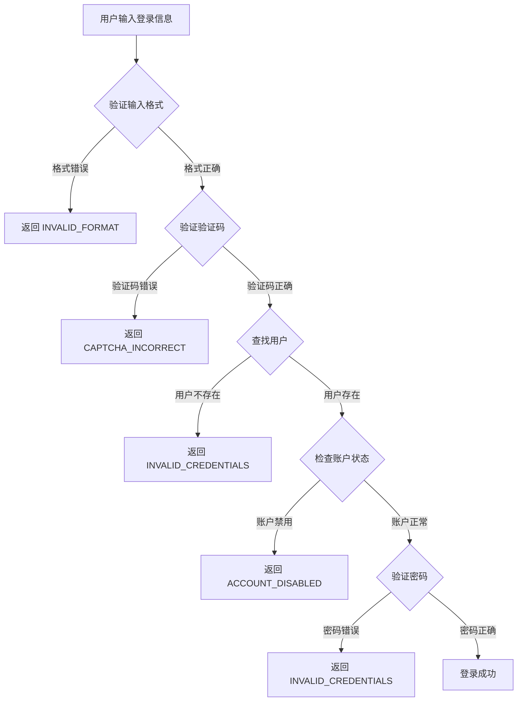

# 登录功能错误处理文档

## 📋 概述

本文档详细说明了登录功能的错误处理机制和改进内容。

## 🎯 改进目标

1. **明确的错误提示**: 让用户清楚知道登录失败的原因
2. **安全性**: 防止用户名枚举攻击
3. **用户体验**: 提供友好、可操作的错误信息
4. **可维护性**: 使用错误代码统一管理错误消息

## 🔐 安全性考虑

### 防止用户名枚举攻击

**问题**: 如果系统明确告知"用户不存在"或"密码错误",攻击者可以通过尝试不同的用户名来枚举系统中的有效用户。

**解决方案**:

- 用户不存在和密码错误统一返回 `INVALID_CREDENTIALS`
- 前端显示相同的错误消息: "用户名或密码错误,请检查后重试"
- 服务器端记录详细的错误日志用于调试

## 📊 错误代码映射表

### 后端错误代码 (`lib/auth.ts`)

| 错误代码                  | 触发条件                 | 前端显示消息                     |
| ------------------------- | ------------------------ | -------------------------------- |
| `MISSING_FIELDS`          | 用户名、密码或验证码为空 | "请填写完整的登录信息"           |
| `INVALID_FORMAT`          | 输入格式不符合验证规则   | "用户名、密码或验证码格式不正确" |
| `INVALID_CREDENTIALS`     | 用户不存在或密码错误     | "用户名或密码错误,请检查后重试"  |
| `ACCOUNT_DISABLED`        | 用户账户状态为非 active  | "该账户已被禁用,请联系管理员"    |
| `CAPTCHA_SESSION_MISSING` | 验证码会话ID缺失         | "验证码会话已过期,请刷新验证码"  |
| `CAPTCHA_VERIFY_FAILED`   | 验证码验证API调用失败    | "验证码验证失败,请重试"          |
| `CAPTCHA_INCORRECT`       | 验证码输入错误           | "验证码错误,请重新输入"          |
| `SERVER_ERROR`            | 未预期的服务器错误       | "服务器错误,请稍后重试"          |

### 前端额外错误 (`app/auth/signin/page.tsx`)

| 错误代码            | 触发条件               | 显示消息                        |
| ------------------- | ---------------------- | ------------------------------- |
| `NETWORK_ERROR`     | 网络请求失败           | "网络连接失败,请检查网络后重试" |
| `CredentialsSignin` | Next-Auth 默认凭证错误 | "用户名或密码错误,请检查后重试" |
| `AccessDenied`      | 访问被拒绝             | "访问被拒绝,权限不足"           |

## 🔄 登录流程



## 💻 代码示例

### 后端错误处理

```typescript
// lib/auth.ts
if (!user) {
  // 为了安全性,不明确告知用户不存在,统一返回凭证错误
  throw new Error('INVALID_CREDENTIALS');
}

if (user.status !== 'active') {
  throw new Error('ACCOUNT_DISABLED');
}

if (!isPasswordValid) {
  // 为了安全性,不明确告知密码错误,统一返回凭证错误
  throw new Error('INVALID_CREDENTIALS');
}
```

### 前端错误处理

```typescript
// app/auth/signin/page.tsx
const errorMessages: Record<string, string> = {
  INVALID_CREDENTIALS: '用户名或密码错误,请检查后重试',
  ACCOUNT_DISABLED: '该账户已被禁用,请联系管理员',
  CAPTCHA_INCORRECT: '验证码错误,请重新输入',
  NETWORK_ERROR: '网络连接失败,请检查网络后重试',
  SERVER_ERROR: '服务器错误,请稍后重试',
  // ...
};

if (result?.error) {
  const errorMessage = errorMessages[result.error] || errorMessages.Default;
  setFormError(errorMessage);
  toast({
    title: '登录失败',
    description: errorMessage,
    variant: 'destructive',
  });
}
```

## 🧪 测试场景

### 1. 正常登录

**步骤**:

1. 访问 http://localhost:3001/auth/signin
2. 输入正确的用户名: `admin`
3. 输入正确的密码: `admin123456`
4. 输入正确的验证码
5. 点击"登录"按钮

**预期结果**:

- ✅ 显示"登录成功!"消息
- ✅ 跳转到仪表盘页面

### 2. 用户名错误

**步骤**:

1. 输入不存在的用户名: `wronguser`
2. 输入任意密码
3. 输入正确的验证码
4. 点击"登录"按钮

**预期结果**:

- ❌ 显示"用户名或密码错误,请检查后重试"
- 🔄 验证码自动刷新

### 3. 密码错误

**步骤**:

1. 输入正确的用户名: `admin`
2. 输入错误的密码: `wrongpassword`
3. 输入正确的验证码
4. 点击"登录"按钮

**预期结果**:

- ❌ 显示"用户名或密码错误,请检查后重试"
- 🔄 验证码自动刷新

### 4. 验证码错误

**步骤**:

1. 输入正确的用户名和密码
2. 输入错误的验证码: `000000`
3. 点击"登录"按钮

**预期结果**:

- ❌ 显示"验证码错误,请重新输入"
- 🔄 验证码自动刷新

### 5. 账户被禁用

**步骤**:

1. 使用被禁用的账户登录
2. 输入正确的密码和验证码
3. 点击"登录"按钮

**预期结果**:

- ❌ 显示"该账户已被禁用,请联系管理员"

## 📝 最佳实践

### 1. 错误消息设计原则

- ✅ **明确但不过度详细**: 告诉用户出了什么问题,但不泄露敏感信息
- ✅ **可操作**: 提供用户可以采取的下一步行动
- ✅ **友好**: 使用礼貌、专业的语言
- ✅ **一致**: 相似的错误使用相似的措辞

### 2. 安全性原则

- 🔒 **不泄露用户存在性**: 用户不存在和密码错误返回相同消息
- 🔒 **限制尝试次数**: 考虑添加登录失败次数限制
- 🔒 **记录安全事件**: 服务器端记录所有登录尝试
- 🔒 **使用验证码**: 防止自动化攻击

### 3. 用户体验原则

- 🎨 **视觉反馈**: 使用颜色和图标区分成功/失败
- ⏱️ **及时反馈**: 立即显示错误消息
- 🔄 **自动恢复**: 失败后自动刷新验证码
- 💡 **帮助信息**: 提供测试账户信息

## 🔧 维护指南

### 添加新的错误类型

1. **后端** (`lib/auth.ts`):

   ```typescript
   throw new Error('NEW_ERROR_CODE');
   ```

2. **前端** (`app/auth/signin/page.tsx`):

   ```typescript
   const errorMessages: Record<string, string> = {
     // ...
     NEW_ERROR_CODE: '用户友好的错误消息',
   };
   ```

3. **更新文档**: 在本文档中添加新错误代码的说明

### 修改错误消息

只需修改前端的 `errorMessages` 对象,无需修改后端代码:

```typescript
const errorMessages: Record<string, string> = {
  INVALID_CREDENTIALS: '新的错误消息', // 修改这里
};
```

## 📚 相关文件

- `lib/auth.ts`: Next-Auth 配置和认证逻辑
- `app/auth/signin/page.tsx`: 登录页面组件
- `app/api/auth/[...nextauth]/route.ts`: Next-Auth API 路由
- `app/api/auth/captcha/route.ts`: 验证码 API

## 🎯 未来改进

- [ ] 添加登录失败次数限制
- [ ] 实现账户锁定机制
- [ ] 添加双因素认证(2FA)
- [ ] 支持多语言错误消息
- [ ] 添加登录历史记录
- [ ] 实现"记住我"功能
