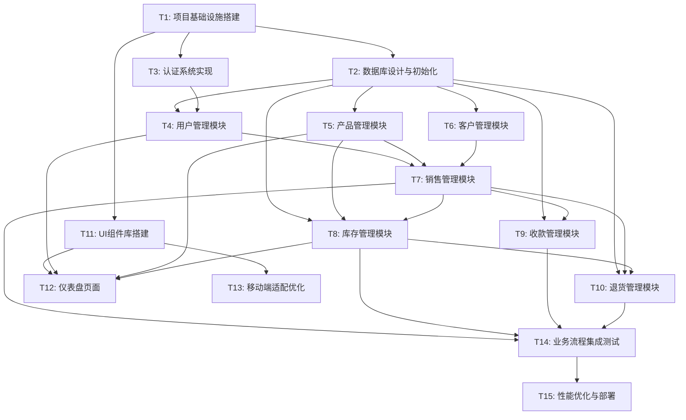

# 库存管理工具 - 原子化任务拆分文档 (TASK)

## 1. 任务拆分概述

基于DESIGN文档的架构设计，将库存管理工具开发拆分为以下原子化任务。每个任务都具有明确的输入契约、输出契约、实现约束和依赖关系。

## 2. 任务依赖关系图

## 3. 原子化任务详细定义

### T1: 项目基础设施搭建

**复杂度**: 中等 | **预估工时**: 4小时 | **优先级**: 高

#### 输入契约

- CONSENSUS文档中的技术栈要求
- DESIGN文档中的项目结构设计
- 开发环境要求

#### 输出契约

- Next.js 15.4项目初始化完成
- TypeScript 5.2配置完成
- ESLint 9 + Prettier + Husky配置完成
- Tailwind CSS v4.1.12 + shadcn/ui 2025.1.2配置完成
- 基础目录结构创建完成
- package.json依赖配置完成

#### 实现约束

- 严格按照CONSENSUS文档中的技术栈版本
- 必须使用Next.js 15.4 App Router
- 禁止使用任何未在技术栈中明确列出的库
- 代码质量工具必须配置为强制执行

#### 验收标准

- [ ] 项目可以成功启动（npm run dev）
- [ ] TypeScript编译无错误
- [ ] ESLint检查通过
- [ ] Prettier格式化正常
- [ ] Husky git hooks正常工作
- [ ] shadcn/ui组件可以正常导入使用

#### 依赖关系

- 前置依赖：无
- 后置任务：T2, T3, T11

---

### T2: 数据库设计与初始化

**复杂度**: 高 | **预估工时**: 6小时 | **优先级**: 高

#### 输入契约

- TECH_ARCHITECTURE文档中的数据库设计
- 单据字段汇总确认文档
- MySQL 8.0+环境

#### 输出契约

- Prisma schema文件完成
- 数据库迁移文件生成
- 数据库表结构创建完成
- Prisma Client类型生成完成
- 基础数据种子文件创建

#### 实现约束

- 严格按照TECH_ARCHITECTURE文档中的表结构设计
- 必须使用Prisma ORM，禁止直接SQL操作
- 支持MySQL 8.0+特性（JSON字段、全文搜索）
- 必须包含瓷砖行业特有字段（色号、生产日期等）

#### 验收标准

- [ ] Prisma schema定义完整
- [ ] 数据库迁移成功执行
- [ ] 所有表和关系正确创建
- [ ] Prisma Client类型生成无错误
- [ ] 基础测试数据可以正常插入

#### 依赖关系

- 前置依赖：T1
- 后置任务：T4, T5, T6, T7, T8, T9, T10

---

### T3: 认证系统实现

**复杂度**: 中等 | **预估工时**: 5小时 | **优先级**: 高

#### 输入契约

- DESIGN文档中的认证组件设计
- Next-Auth.js配置要求
- 用户角色权限定义

#### 输出契约

- Next-Auth.js配置完成
- 登录/登出功能实现
- 权限控制中间件实现
- 会话管理功能完成
- 角色权限验证功能完成

#### 实现约束

- 必须使用Next-Auth.js，禁止自定义认证
- 支持管理员和销售员两种角色
- 必须实现基于角色的权限控制
- 会话管理必须安全可靠

#### 验收标准

- [ ] 用户可以正常登录/登出
- [ ] 权限控制正确工作
- [ ] 不同角色访问权限正确
- [ ] 会话状态正确维护
- [ ] 安全性验证通过

#### 依赖关系

- 前置依赖：T1
- 后置任务：T4

---

### T4: 用户管理模块

**复杂度**: 中等 | **预估工时**: 4小时 | **优先级**: 高

#### 输入契约

- T2的数据库设计
- T3的认证系统
- DESIGN文档中的用户管理接口定义

#### 输出契约

- 用户CRUD API实现
- 用户列表页面实现
- 用户创建/编辑表单实现
- 角色权限分配功能实现
- 用户状态管理功能实现

#### 实现约束

- 必须使用React Hook Form + Zod进行表单处理
- 必须使用TanStack Query进行状态管理
- 必须使用shadcn/ui组件，禁止自定义UI组件
- 必须实现移动端响应式设计

#### 验收标准

- [ ] 管理员可以创建销售员账户
- [ ] 用户信息可以正常编辑
- [ ] 角色权限分配正确
- [ ] 移动端操作流畅
- [ ] 表单验证正确工作

#### 依赖关系

- 前置依赖：T2, T3
- 后置任务：T7, T12

---

### T5: 产品管理模块

**复杂度**: 高 | **预估工时**: 6小时 | **优先级**: 高

#### 输入契约

- T2的数据库设计
- DESIGN文档中的产品管理接口定义
- 瓷砖行业特有属性要求

#### 输出契约

- 产品CRUD API实现
- 产品列表页面实现（支持搜索、筛选）
- 产品创建/编辑表单实现
- 瓷砖特有属性管理（色号、规格等）
- 产品图片上传功能实现

#### 实现约束

- 必须支持瓷砖行业特有属性（色号、生产日期、每件片数等）
- 必须使用multer + sharp处理图片上传
- 必须实现按色号搜索和筛选
- 必须支持产品规格的复杂数据结构

#### 验收标准

- [ ] 产品信息可以完整管理
- [ ] 瓷砖特有属性正确处理
- [ ] 图片上传和显示正常
- [ ] 搜索和筛选功能正确
- [ ] 移动端操作友好

#### 依赖关系

- 前置依赖：T2
- 后置任务：T7, T8, T12

---

### T6: 客户管理模块

**复杂度**: 中等 | **预估工时**: 4小时 | **优先级**: 中

#### 输入契约

- T2的数据库设计
- DESIGN文档中的客户管理接口定义
- 历史价格管理要求

#### 输出契约

- 客户CRUD API实现
- 客户列表页面实现
- 客户创建/编辑表单实现
- 客户历史价格记录功能
- 客户快速搜索功能

#### 实现约束

- 必须记录客户的历史购买价格
- 必须支持客户信息的快速搜索
- 必须实现客户联系信息管理
- 必须支持移动端友好操作

#### 验收标准

- [ ] 客户信息可以完整管理
- [ ] 历史价格记录正确
- [ ] 快速搜索功能正常
- [ ] 移动端操作流畅
- [ ] 数据验证正确

#### 依赖关系

- 前置依赖：T2
- 后置任务：T7

---

### T7: 销售管理模块

**复杂度**: 高 | **预估工时**: 8小时 | **优先级**: 高

#### 输入契约

- T4的用户管理
- T5的产品管理
- T6的客户管理
- DESIGN文档中的销售管理接口定义

#### 输出契约

- 销售单CRUD API实现
- 销售单创建/编辑页面实现
- 销售单列表和详情页面实现
- 库存检查和预警功能
- 历史价格自动填充功能
- 销售单审核流程实现

#### 实现约束

- 必须实现严格的库存检查，不允许负库存销售
- 必须自动填充客户历史价格
- 必须支持销售单的完整生命周期管理
- 必须实现移动端友好的销售单创建流程

#### 验收标准

- [ ] 销售单可以正常创建和管理
- [ ] 库存检查正确工作，防止超卖
- [ ] 历史价格自动填充正常
- [ ] 审核流程正确执行
- [ ] 移动端操作体验良好

#### 依赖关系

- 前置依赖：T4, T5, T6
- 后置任务：T8, T9, T10, T14

---

### T8: 库存管理模块

**复杂度**: 高 | **预估工时**: 6小时 | **优先级**: 高

#### 输入契约

- T5的产品管理
- T7的销售管理
- DESIGN文档中的库存管理接口定义

#### 输出契约

- 入库单CRUD API实现
- 入库操作页面实现
- 库存查询和调整功能
- 库存预警系统实现
- 库存历史记录功能

#### 实现约束

- 必须支持多种入库类型（正常入库、退货入库、调整入库）
- 必须实现库存预警功能
- 必须记录所有库存变动历史
- 必须与销售模块紧密集成

#### 验收标准

- [ ] 入库操作正常执行
- [ ] 库存数量实时更新
- [ ] 库存预警正确触发
- [ ] 库存历史记录完整
- [ ] 与销售模块集成正常

#### 依赖关系

- 前置依赖：T5, T7
- 后置任务：T10, T12, T14

---

### T9: 收款管理模块

**复杂度**: 中等 | **预估工时**: 4小时 | **优先级**: 中

#### 输入契约

- T7的销售管理
- DESIGN文档中的收款管理接口定义

#### 输出契约

- 收款记录CRUD API实现
- 收款确认页面实现
- 应收账款查询功能
- 收款状态管理功能

#### 实现约束

- 必须与销售单紧密关联
- 必须支持部分收款和分期收款
- 必须提供应收账款统计
- 必须支持移动端收款确认

#### 验收标准

- [ ] 收款记录正确管理
- [ ] 收款状态实时更新
- [ ] 应收账款统计准确
- [ ] 移动端操作便捷

#### 依赖关系

- 前置依赖：T7
- 后置任务：T14

---

### T10: 退货管理模块

**复杂度**: 中等 | **预估工时**: 5小时 | **优先级**: 中

#### 输入契约

- T7的销售管理
- T8的库存管理
- DESIGN文档中的退货管理接口定义

#### 输出契约

- 退货单CRUD API实现
- 退货申请和审核页面实现
- 退货入库处理功能
- 退款金额计算功能

#### 实现约束

- 必须与原销售单关联
- 必须自动处理退货入库
- 必须计算退款金额
- 必须更新相关库存和收款状态

#### 验收标准

- [ ] 退货流程完整执行
- [ ] 库存正确回补
- [ ] 退款金额计算准确
- [ ] 相关状态正确更新

#### 依赖关系

- 前置依赖：T7, T8
- 后置任务：T14

---

### T11: UI组件库搭建

**复杂度**: 中等 | **预估工时**: 5小时 | **优先级**: 高

#### 输入契约

- T1的项目基础设施
- DESIGN文档中的UI组件体系设计
- shadcn/ui 2025.1.2组件库

#### 输出契约

- shadcn/ui基础组件配置完成
- 瓷砖行业特色组件实现
- 移动端响应式组件适配
- 组件文档和使用示例
- 组件测试用例实现

#### 实现约束

- 严格使用shadcn/ui组件，禁止重复开发
- 必须实现瓷砖行业特色组件（色号显示、规格展示等）
- 必须支持移动端触屏操作
- 必须使用Tailwind CSS进行样式定制

#### 验收标准

- [ ] 所有基础组件正常工作
- [ ] 瓷砖特色组件功能完整
- [ ] 移动端适配良好
- [ ] 组件文档完整
- [ ] 组件测试通过

#### 依赖关系

- 前置依赖：T1
- 后置任务：T12, T13

---

### T12: 仪表盘页面

**复杂度**: 中等 | **预估工时**: 4小时 | **优先级**: 中

#### 输入契约

- T4的用户管理
- T5的产品管理
- T8的库存管理
- T11的UI组件库

#### 输出契约

- 仪表盘页面实现
- 数据概览组件实现
- 库存预警显示功能
- 待办事项提醒功能
- 移动端仪表盘适配

#### 实现约束

- 必须显示关键业务指标
- 必须实现库存预警提醒
- 必须支持移动端友好显示
- 必须使用TanStack Query进行数据管理

#### 验收标准

- [ ] 仪表盘数据显示正确
- [ ] 库存预警正常工作
- [ ] 移动端显示良好
- [ ] 数据刷新正常
- [ ] 性能表现良好

#### 依赖关系

- 前置依赖：T4, T5, T8, T11
- 后置任务：T14

---

### T13: 移动端适配优化

**复杂度**: 中等 | **预估工时**: 6小时 | **优先级**: 中

#### 输入契约

- T11的UI组件库
- 所有业务模块的页面实现
- 移动端设计要求

#### 输出契约

- 移动端响应式布局优化
- 触屏操作体验优化
- 移动端导航优化
- 移动端表单优化
- 移动端性能优化

#### 实现约束

- 必须支持主流移动设备
- 必须优化触屏操作体验
- 必须确保移动端性能
- 必须使用Tailwind CSS响应式设计

#### 验收标准

- [ ] 移动端布局完美适配
- [ ] 触屏操作流畅自然
- [ ] 移动端导航便捷
- [ ] 表单输入体验良好
- [ ] 移动端性能达标

#### 依赖关系

- 前置依赖：T11, 所有业务模块
- 后置任务：T14

---

### T14: 业务流程集成测试

**复杂度**: 高 | **预估工时**: 6小时 | **优先级**: 高

#### 输入契约

- 所有业务模块实现完成
- 完整的业务流程定义
- 测试数据和测试用例

#### 输出契约

- 完整业务流程测试用例
- 集成测试自动化脚本
- 业务流程验证报告
- 性能测试报告
- 问题修复和优化建议

#### 实现约束

- 必须覆盖完整的业务流程
- 必须包含异常情况测试
- 必须验证数据一致性
- 必须测试并发场景

#### 验收标准

- [ ] 销售→审核→出库→收款流程正常
- [ ] 入库→库存更新流程正常
- [ ] 退货→退款→库存回补流程正常
- [ ] 权限控制正确工作
- [ ] 数据一致性验证通过

#### 依赖关系

- 前置依赖：T7, T8, T9, T10, T12
- 后置任务：T15

---

### T15: 性能优化与部署

**复杂度**: 中等 | **预估工时**: 5小时 | **优先级**: 中

#### 输入契约

- T14的集成测试结果
- 性能优化要求
- 宝塔面板部署环境

#### 输出契约

- 性能优化实施完成
- 生产环境部署配置
- 监控和日志配置
- 备份和恢复方案
- 部署文档和运维指南

#### 实现约束

- 必须满足性能指标要求
- 必须使用宝塔面板部署
- 必须配置监控和告警
- 必须实现自动备份

#### 验收标准

- [ ] 页面加载时间<3秒
- [ ] API响应时间<500ms
- [ ] 支持50个并发用户
- [ ] 生产环境稳定运行
- [ ] 监控和备份正常

#### 依赖关系

- 前置依赖：T14
- 后置任务：无

## 4. 任务执行策略

### 4.1 并行执行建议

- **第一阶段**：T1 → T2, T3, T11 (可并行)
- **第二阶段**：T4, T5, T6 (可并行)
- **第三阶段**：T7 → T8, T9, T10 (T8可与T9并行)
- **第四阶段**：T12, T13 (可并行)
- **第五阶段**：T14 → T15

### 4.2 关键路径

T1 → T2 → T7 → T8 → T14 → T15

### 4.3 风险控制

- 每个任务完成后立即进行验收测试
- 关键任务（T2, T7, T8）需要额外的代码审查
- 集成测试（T14）发现问题时及时回溯修复

## 5. 质量保证

### 5.1 代码质量标准

- TypeScript严格模式，禁止any类型
- ESLint检查必须通过
- 单元测试覆盖率>80%
- 代码审查必须通过

### 5.2 功能验收标准

- 所有验收标准必须100%通过
- 移动端兼容性测试通过
- 性能指标达到要求
- 安全性验证通过

## 6. 总结

本原子化任务拆分文档将库存管理工具开发分解为15个独立的原子任务，每个任务都有明确的边界、输入输出契约和验收标准。任务之间的依赖关系清晰，支持并行开发，预计总开发时间约73小时。

通过这种原子化的任务拆分，可以确保：

1. 每个任务复杂度可控，便于AI高成功率交付
2. 任务边界清晰，避免重复开发
3. 依赖关系明确，支持并行开发
4. 验收标准具体，确保质量可控
