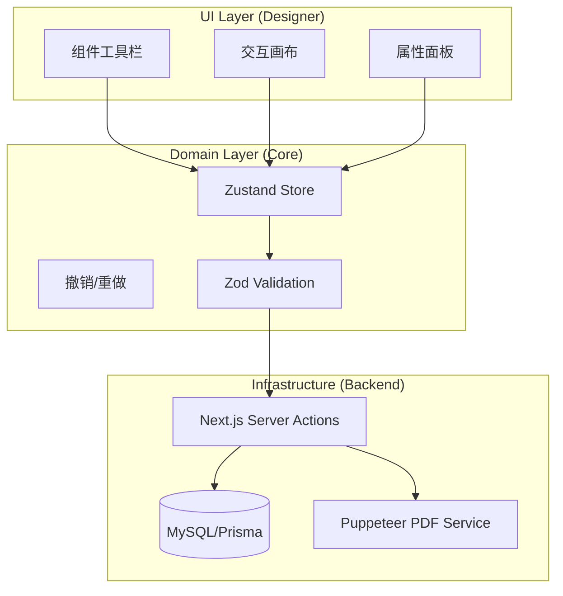

# 打印可视化拖拽编辑器开发文档 (v6 - 全视角终极版)

## 1. 项目概述

### 1.1 目标

构建一个**企业级、高可用、所见即所得 (WYSIWYG)** 的打印设计与生成系统。
该系统需结合 **Figma 级的交互体验** 与 **中国式企业报表 (B2B SaaS)** 的业务需求，支持复杂的发货单、快递单设计。

### 1.2 核心原则

- **分离原则 (Separation)**: 编辑器 (Designer) 与 渲染器 (Runtime) 严格分离，共享 Schema。
- **中国本土化 (Localization)**: 默认单位 **mm**，原生支持 **宋体/黑体**，支持 **大写金额** 与 **连续纸**。
- **全栈一致性 (Consistency)**: 前后端共享 **Zod Schema**，单一数据源。
- **高性能 (Performance)**: 针对批量打印（千单级）优化渲染链路。

---

## 2. 架构设计 (Architecture)

### 2.1 系统分层



---

## 3. UI/UX 设计规范 (Design System)

### 3.1 视觉风格

- **布局**: 左侧工具栏 (240px) + 中间无限画布 + 右侧属性面板 (280px)。
- **纸张**: 纯白悬浮卡片 (`box-shadow: 0 4px 24px rgba(0,0,0,0.08)`), 屏幕 1mm ≈ 现实 1mm。
- **交互**:
  - **智能吸附**: 拖拽时显示**粉色辅助线**，阈值 5px。
  - **变量 Tag**: 绑定变量显示为蓝色胶囊 (`{{order.no}}`)。
  - **选中态**: 蓝色边框 + 白色圆点手柄 + 悬浮操作栏。

### 3.2 针对中文用户的优化

- **单位**: 默认使用 **毫米 (mm)**。
- **字体**: 界面显示中文名称（如“宋体”而非“SimSun”）。针对针式打印机优化宋体渲染。
- **输入**: 支持拼音搜索字段名，输入 `{{` 自动触发变量补全。

---

## 4. 前端实现 (Frontend Implementation)

### 4.1 技术栈

- **核心**: `React`, `TypeScript`, `Next.js 15`
- **拖拽**: `@dnd-kit/core`
- **交互手柄**: `react-moveable` (处理 Resize/Rotate)
- **状态管理**: `zustand` (配合 `immer` 中间件)

### 4.2 数据结构 (Zod Schema)

```typescript
import { z } from 'zod';

// 基础元素
const BaseElementSchema = z.object({
  id: z.string().uuid(),
  type: z.enum(['text', 'image', 'table', 'placeholder', 'barcode']),
  position: z.object({ x: z.number(), y: z.number() }), // mm
  size: z.object({ width: z.number(), height: z.number() }), // mm
  zIndex: z.number(),
});

// 文本元素
const TextElementSchema = BaseElementSchema.extend({
  type: z.literal('text'),
  content: z.string(),
  style: z.object({
    fontFamily: z.enum(['SimSun', 'SimHei', 'Microsoft YaHei']),
    fontSize: z.number(), // pt
    fontWeight: z.enum(['normal', 'bold']),
    textAlign: z.enum(['left', 'center', 'right']),
  }),
});

// 完整模板
export const PrintTemplateSchema = z.object({
  id: z.string(),
  name: z.string(),
  pageSettings: z.object({
    width: z.number(), // mm
    height: z.number(), // mm
    padding: z.tuple([z.number(), z.number(), z.number(), z.number()]),
  }),
  elements: z.array(
    z.discriminatedUnion('type', [TextElementSchema /* ... */])
  ),
});
```

---

## 5. 后端实现 (Backend Implementation)

### 5.1 数据库 Schema (Prisma)

```prisma
model PrintTemplate {
  id          String   @id @default(uuid()) @db.Char(36)
  name        String   @db.VarChar(100)
  type        String   @map("type") // sales, purchase, etc.
  isDefault   Boolean  @default(false) @map("is_default")
  content     Json     @map("content") // Zod Schema validated JSON
  status      String   @default("active")
  createdAt   DateTime @default(now()) @map("created_at")
  updatedAt   DateTime @updatedAt @map("updated_at")
  // ... relations
}
```

### 5.2 API 交互 (Server Actions)

- `saveTemplate(data)`: **Zod 校验** -> 存入数据库。
- `generatePdf(id, data)`: 调用后端渲染服务。

### 5.3 PDF 生成服务 (Isolate Service)

- **方案**: Node.js + Puppeteer。
- **流程**: 接收 `{ template, data }` -> 渲染无 UI 的 `PrintCanvas` 组件 -> `page.pdf()` -> 返回流。
- **用途**: 自动化邮件附件、后端归档。

---

## 6. 安全与权限

- **数据校验**: 严禁存储未通过 Zod 验证的 JSON，防止结构崩坏。
- **XSS 防御**: 文本渲染强制转义，禁止 `dangerouslySetInnerHTML`。
- **SSR 防护**: PDF 生成服务设置 30s 超时与并发限制。

---

## 7. 实施路线图 (Roadmap)

| 阶段        | 任务                                                               | 涉及领域 |
| ----------- | ------------------------------------------------------------------ | -------- |
| **Phase 1** | **Core Runtime**: 定义 Schema，实现纯净的 `<PrintCanvas />` 渲染器 | 全栈     |
| **Phase 2** | **Designer UI**: 实现画布、拖拽、吸附、属性面板                    | 前端/UI  |
| **Phase 3** | **Backend Integration**: 数据库存储、Server Actions、模版管理      | 后端     |
| **Phase 4** | **Data Binding**: 实现变量解析、表格数据填充、大写金额             | 业务逻辑 |
| **Phase 5** | **Optimization**: 批量打印性能（分批渲染）、PDF服务集成            | 架构优化 |

---

## 8. 总结

本 v6 版本融合了：

1.  **UI 设计师**的高保真视觉与交互规范。
2.  **架构师**的分层设计与插件化思想。
3.  **后端工程师**的数据库落地与 PDF 服务策略。
4.  **前端专家**的中国本土化 UX 细节。

这是最终的可执行开发指南。
