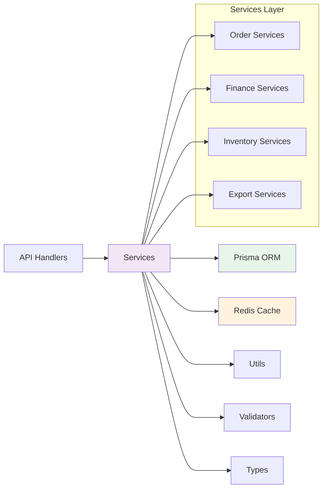

# 业务服务模块 (Business Services)

> **导航**: [根目录](../../CLAUDE.md) > lib > services
> **模块路径**: `E:\kucun\lib\services`
> **最后更新**: 2026-01-09

---

## 📋 模块概述

**业务服务模块**包含系统的核心业务逻辑实现，提供可复用的服务层，供 API 处理器和其他模块调用。

### 模块职责

- 🧮 **成本计算**: FIFO 成本计算、采购成本、利润分析
- 📊 **财务服务**: 应收应付、对账单、财务报表
- 📦 **库存服务**: 库存盘点、实时库存、库存调整
- 📄 **导出服务**: CSV/Excel 导出、流式导出
- 🚚 **物流服务**: 物流追踪、物流查询缓存
- 🔐 **认证服务**: 验证码、登录日志、IP 定位
- 📤 **通知服务**: 系统通知、消息推送
- 🖨️ **打印服务**: 打印模板、PDF 生成

---

## 🗂️ 服务分类

### 1. 库存相关服务

| 服务文件 | 职责 | 关键方法 |
|---------|------|---------|
| `fifo-cost-service.ts` | FIFO 成本计算 | `calculateFIFOCost()`, `updateInventoryCost()` |
| `fifo-outbound-service.ts` | FIFO 出库处理 | `processOutbound()`, `allocateInventory()` |
| `inventory-count-service.ts` | 库存盘点服务 | `createCount()`, `submitCount()`, `completeCount()` |
| `inventory-realtime-service.ts` | 实时库存查询 | `getRealtimeInventory()`, `checkAvailability()` |
| `inventory-count/` | 盘点子模块 | 创建、查询、统计、变更 |

### 2. 财务相关服务

| 服务文件 | 职责 | 关键方法 |
|---------|------|---------|
| `receivables-service.ts` | 应收账款服务 | `calculateReceivables()`, `getReceivablesList()` |
| `receivables-helpers.ts` | 应收辅助函数 | `calculateBalance()`, `formatAmount()` |
| `payable-query-service.ts` | 应付账款查询 | `getPayablesList()`, `getPayableDetail()` |
| `partner-ledger-service.ts` | 往来账服务 | `getPartnerLedger()`, `calculateBalance()` |
| `customer-statement-service.ts` | 客户对账单 | `generateStatement()`, `getTransactions()` |
| `finance-statistics.ts` | 财务统计 | `getFinanceOverview()`, `getStatistics()` |
| `finance-statistics-cached.ts` | 财务统计（缓存版） | 带 Redis 缓存的统计查询 |
| `finance-statistics-optimized.ts` | 财务统计（优化版） | 性能优化的统计查询 |

### 3. 报表相关服务

| 服务文件 | 职责 | 关键方法 |
|---------|------|---------|
| `profit-loss-service.ts` | 利润表服务 | `generateProfitLoss()`, `calculateProfit()` |
| `annual-report-service.ts` | 年度报表服务 | `generateAnnualReport()` |
| `monthly-report-service.ts` | 月度报表服务 | `generateMonthlyReport()` |
| `report-helpers.ts` | 报表辅助函数 | `formatReportData()`, `calculateTotals()` |

### 4. 订单相关服务

| 服务文件 | 职责 | 关键方法 |
|---------|------|---------|
| `sales-order-service.ts` | 销售订单服务 | `createOrder()`, `updateOrder()` |
| `sales-order-expense-service.ts` | 销售订单费用 | `calculateExpenses()`, `allocateExpenses()` |
| `factory-shipment-expense-service.ts` | 工厂发货费用 | `calculateShippingExpenses()` |
| `factory-shipment-profit-service.ts` | 工厂发货利润 | `calculateProfit()`, `analyzeMargin()` |
| `factory-shipment-pricing-service.ts` | 工厂发货定价 | `calculatePricing()`, `applyDiscount()` |
| `factory-shipment-item-service.ts` | 工厂发货项目 | `manageItems()`, `validateItems()` |
| `purchase-order-cost-service.ts` | 采购订单成本 | `calculatePurchaseCost()` |
| `purchase-order-payable.ts` | 采购订单应付 | `createPayable()`, `updatePayable()` |
| `purchase-expense-service.ts` | 采购费用服务 | `allocatePurchaseExpenses()` |

### 5. 销售订单管理系统 (`sales-order-management/`)

完整的销售订单管理子系统：

| 服务文件 | 职责 |
|---------|------|
| `SalesOrderManagementSystem.ts` | 主系统入口 |
| `OrderProcessingService.ts` | 订单处理服务 |
| `InventoryManagementService.ts` | 库存管理服务 |
| `ExpenseManagementService.ts` | 费用管理服务 |
| `ProfitAnalysisService.ts` | 利润分析服务 |
| `ValidationService.ts` | 验证服务 |
| `ExceptionHandlingService.ts` | 异常处理服务 |
| `ReportGenerationService.ts` | 报表生成服务 |

### 6. 导出相关服务

| 服务文件 | 职责 | 关键方法 |
|---------|------|---------|
| `export-service.ts` | 通用导出服务 | `exportToCSV()`, `exportToExcel()` |
| `csv-export-service.ts` | CSV 导出 | `generateCSV()`, `streamCSV()` |
| `streaming-csv-export-service.ts` | 流式 CSV 导出 | `streamLargeDataset()` |
| `enhanced-excel-export-service.ts` | 增强 Excel 导出 | `exportWithFormatting()` |
| `sales-order-export-service.ts` | 销售订单导出 | `exportSalesOrders()` |
| `factory-shipments-export-service.ts` | 工厂发货导出 | `exportShipments()` |
| `receivables-export-service.ts` | 应收账款导出 | `exportReceivables()` |
| `payables-export-service.ts` | 应付账款导出 | `exportPayables()` |
| `export-audit-service.ts` | 导出审计 | `logExport()`, `trackDownload()` |
| `field-selection-storage.ts` | 字段选择存储 | `saveFieldSelection()`, `loadFieldSelection()` |

### 7. 物流相关服务

| 服务文件 | 职责 | 关键方法 |
|---------|------|---------|
| `shipping-tracking-service.ts` | 物流追踪服务 | `trackShipment()`, `queryLogistics()` |
| `shipping-query-cache.ts` | 物流查询缓存 | `cacheQuery()`, `getCachedResult()` |
| `universal-ship-extractor.ts` | 通用物流提取器 | `extractShippingInfo()` |
| `factory-shipment-enrichment.ts` | 工厂发货增强 | `enrichShipmentData()` |

### 8. 打印相关服务

| 服务文件 | 职责 | 关键方法 |
|---------|------|---------|
| `print-service.ts` | 打印服务 | `generatePrintDocument()` |
| `print-template-service.ts` | 打印模板服务 | `renderTemplate()`, `applyTemplate()` |
| `puppeteer-service.ts` | Puppeteer 服务 | `generatePDF()`, `screenshot()` |

### 9. 认证与安全服务

| 服务文件 | 职责 | 关键方法 |
|---------|------|---------|
| `captcha-service.ts` | 验证码服务 | `generateCaptcha()`, `verifyCaptcha()` |
| `login-log-service.ts` | 登录日志服务 | `logLogin()`, `getLoginHistory()` |
| `ip-location.ts` | IP 定位服务 | `getLocationByIP()` |
| `rate-limiter.ts` | 速率限制器 | `checkRateLimit()`, `incrementCounter()` |

### 10. 其他服务

| 服务文件 | 职责 | 关键方法 |
|---------|------|---------|
| `order-number-generator.ts` | 订单号生成器 | `generateOrderNumber()` |
| `simple-order-number-generator.ts` | 简单订单号生成器 | `generateSimpleNumber()` |
| `category-service.ts` | 分类服务 | `getCategoryTree()`, `manageCategories()` |
| `supplier-service.ts` | 供应商服务 | `getSuppliers()`, `manageSuppliers()` |
| `notification-service.ts` | 通知服务 | `sendNotification()`, `getNotifications()` |
| `qiniu-upload.ts` | 七牛云上传 | `uploadFile()`, `getUploadToken()` |
| `error-reporting-service.ts` | 错误报告服务 | `reportError()`, `logException()` |
| `expense-service.ts` | 费用服务 | `createExpense()`, `approveExpense()` |
| `expense-idempotency.ts` | 费用幂等性 | `ensureIdempotency()` |
| `expense-payable-integration.ts` | 费用应付集成 | `integrateExpensePayable()` |
| `refund-query-service.ts` | 退款查询服务 | `getRefunds()`, `getRefundDetail()` |
| `address.ts` | 地址服务 | `parseAddress()`, `validateAddress()` |
| `address-parser.ts` | 地址解析器 | `parseAddressString()` |
| `address-client.ts` | 地址客户端 | `getAddressData()` |
| `smart-wait-strategy.ts` | 智能等待策略 | `waitForElement()`, `retryWithBackoff()` |
| `enhanced-selector-engine.ts` | 增强选择器引擎 | `selectElement()`, `findBestMatch()` |

---

## 🔗 依赖关系



---

## 🎯 使用示例

### 1. FIFO 成本计算

```typescript
import { calculateFIFOCost } from '@/lib/services/fifo-cost-service';

// 计算出库成本
const cost = await calculateFIFOCost({
  productVariantId: 'variant-123',
  quantity: 100,
  unit: 'PIECE',
});

console.log(`总成本: ${cost.totalCost}`);
console.log(`单位成本: ${cost.unitCost}`);
```

### 2. 应收账款查询

```typescript
import { getReceivablesList } from '@/lib/services/receivables-service';

// 获取应收账款列表
const receivables = await getReceivablesList({
  customerId: 'customer-123',
  startDate: '2026-01-01',
  endDate: '2026-01-31',
  status: 'UNPAID',
});
```

### 3. 库存盘点

```typescript
import { InventoryCountService } from '@/lib/services/inventory-count-service';

const countService = new InventoryCountService();

// 创建盘点单
const count = await countService.createCount({
  warehouseId: 'warehouse-1',
  countDate: new Date(),
  operator: 'user-123',
});

// 提交盘点结果
await countService.submitCount(count.id, {
  items: [
    { productVariantId: 'variant-1', actualQuantity: 100 },
    { productVariantId: 'variant-2', actualQuantity: 200 },
  ],
});
```

### 4. 导出数据

```typescript
import { exportSalesOrders } from '@/lib/services/sales-order-export-service';

// 导出销售订单
const csvData = await exportSalesOrders({
  startDate: '2026-01-01',
  endDate: '2026-01-31',
  status: 'COMPLETED',
  format: 'csv',
});
```

---

## 🔧 开发规范

### 服务设计原则

1. **单一职责**: 每个服务只负责一个业务领域
2. **可测试性**: 服务应易于单元测试，避免硬编码依赖
3. **错误处理**: 统一的错误处理和日志记录
4. **性能优化**: 合理使用缓存，避免 N+1 查询
5. **事务管理**: 涉及多表操作时使用数据库事务

### 命名约定

- **服务文件**: `{domain}-service.ts` (例如: `receivables-service.ts`)
- **服务类**: `{Domain}Service` (例如: `InventoryCountService`)
- **方法命名**: 使用动词开头 (例如: `calculateCost`, `getReceivables`)

### 错误处理

```typescript
export async function someService(params: Params) {
  try {
    // 业务逻辑
    const result = await processData(params);
    return { success: true, data: result };
  } catch (error) {
    console.error('[someService] Error:', error);
    throw new Error(`服务处理失败: ${error.message}`);
  }
}
```

### 缓存使用

```typescript
import { redis } from '@/lib/redis';

export async function getCachedData(key: string) {
  // 尝试从缓存获取
  const cached = await redis.get(key);
  if (cached) {
    return JSON.parse(cached);
  }

  // 从数据库查询
  const data = await fetchFromDatabase();

  // 写入缓存（5分钟过期）
  await redis.setex(key, 300, JSON.stringify(data));

  return data;
}
```

---

## 📚 相关文档

- [API 处理器模块](../api/handlers/CLAUDE.md)
- [数据验证模块](../validations/CLAUDE.md)
- [工具函数模块](../utils/CLAUDE.md)
- [类型定义模块](../types/CLAUDE.md)
- [缓存使用指南](../cache/CACHING_GUIDELINES.md)

---

## 🧪 测试

服务模块包含完整的单元测试：

```bash
# 运行所有服务测试
npm run test -- lib/services

# 运行特定服务测试
npm run test -- lib/services/receivables-service.test.ts

# 查看测试覆盖率
npm run test:coverage -- lib/services
```

测试文件位于 `__tests__/` 子目录中。

---

## 📝 维护说明

- **新增服务**: 创建新服务时，请遵循现有命名和结构约定
- **修改服务**: 修改现有服务时，确保更新相关测试和文档
- **性能优化**: 定期审查服务性能，优化慢查询和缓存策略
- **代码审查**: 所有服务变更需要经过代码审查

---

**最后更新**: 2026-01-09
**维护者**: Claude AI Assistant
